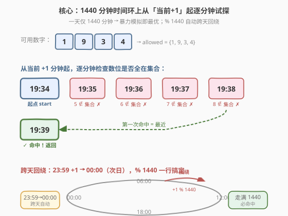
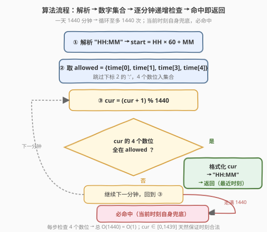
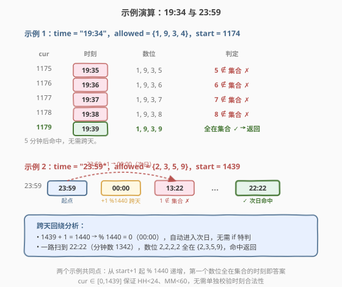

# LeetCode 最近时刻 题解

## 1. 题目概述

- **标题 / 题号**：最近时刻（#681，medium）
- **链接**：https://leetcode.cn/problems/next-closest-time/
- **难度**：中等
- **标签**：字符串、模拟、枚举、哈希集合

**题意**：给定一个形如 `"HH:MM"` 的时间，表示一天中的某个时刻（`"00:00"` 到 `"23:59"`）。你可以**复用**原时间中出现的数字任意多次，在这些数字中组合出**下一个最近时刻**。返回 `"HH:MM"` 格式的字符串。

> 💡 「复用」意味着每个数字可以重复使用——例如 `"19:34"` 的可用数字是 `{1, 9, 3, 4}`，`"33:44"`、`"11:11"` 都是合法候选（只要时刻本身合法）。

**示例 1**：

```text
输入：time = "19:34"
输出："19:39"
解释：可用数字 {1, 9, 3, 4}。19:35(5 不可用)、19:36、19:37、19:38 都不合法；
19:39 的每位 1/9/3/9 均可用，且距 19:34 最近（5 分钟后）。
```

**示例 2**：

```text
输入：time = "23:59"
输出："22:22"
解释：可用数字 {2, 3, 5, 9}。当天 23:59 之后没有任何由这些数字组成的合法时刻，
于是绕到次日，最近的合法时刻是次日 22:22。
```

**约束**：

- `time.length == 5`
- `time` 格式为 `"HH:MM"`
- 输入是合法时刻，范围 `"00:00"` 至 `"23:59"`

> ⚠️ 这是 [Plus 会员](https://leetcode.cn/problems/next-closest-time/) 专享题。题面虽小，核心在于**时间域极小（一天仅 1440 分钟）**——这决定了「逐分钟模拟」即是最优解：常数级时间、代码极简、天然处理「跨天回绕」。

## 2. 解题思路

### 2.1 暴力思路：枚举所有数字组合

把可用数字（至多 4 种）填入 `HH:MM` 的 4 个数位，得到至多 $4^4 = 256$ 种组合，过滤掉非法时刻（`HH >= 24` 或 `MM >= 60`），转为「分钟数」排序后，找比当前大的最小者；若没有则回绕到全局最小者。

时间 $O(256)$，能过但**略显繁琐**——还要单独处理跨天回绕的边界。其实有更直接的视角。

### 2.2 核心观察：一天只有 1440 分钟，逐分钟往后试



关键洞察是**时间域的规模**：一天只有 $1440$ 分钟。从「当前时刻 + 1 分钟」开始，**每分钟往前走一步**，检查该时刻的 4 个数位是否都来自可用数字集合——**第一个命中的就是答案**。

- **为什么不漏解？** 我们在 $1440$ 分钟的时间环上**完整地走一圈**，覆盖了所有可能的时刻。当前时刻本身必然合法（它的数位当然都在集合里），所以最坏情况走满一圈回到自身，**必然命中**。
- **为什么是「最近」？** 逐分钟递增，**第一次命中**的距离当前时刻最小（按时间正向计），天然就是「最近」。跨天回绕也无需特判——`(分钟数 + 1) % 1440` 自动从 `23:59` 跳到 `00:00`。

> 💡 **与「枚举组合」的对比**：枚举组合需要先排序再找「下一个」，还要单独写回绕逻辑；逐分钟模拟**用一个循环 + 取模**就把「正向最近」和「跨天回绕」一并解决——因为时间本身就是线性递增的，从当前往后走遇到的第一个合法点必是最近。这是「**问题域极小 → 暴力即最优**」的典型范例。

### 2.3 算法流程图



**完整步骤**：

1. **解析**：把 `"HH:MM"` 转成分钟数 `start = HH * 60 + MM`。
2. **取可用数字集合**：`allowed = {time[i] for i in [0,1,3,4]}`（跳过下标 2 的 `':'`）。
3. **逐分钟试探**：令 `cur = start`，循环：
   - `cur = (cur + 1) % 1440`（跨天自动回绕）
   - 把 `cur` 格式化成 `"HH:MM"`，检查 4 个数位是否**全部**在 `allowed` 中
   - 若是 → 返回该字符串
4. 最多循环 $1440$ 次必命中（当前时刻自身兜底）。

> ⚠️ **合法性校验的写法**：把 `cur` 拆成 `h1h2:m1m2` 四个字符（如 `cur=1179` → `11:79` 不可能，因为 `cur < 1440` 保证 `HH < 24`、`MM < 60`）。所以**只需检查数位是否在集合**，时刻的合法性由 `cur ∈ [0,1439]` 天然保证——这是模拟法比枚举法省心的另一处：不需要单独判 `HH<24`、`MM<60`。

### 2.4 示例演算



**示例 1**：`time = "19:34"`，`start = 19*60+34 = 1174`，`allowed = {'1','9','3','4'}`：

| cur（分钟） | 时刻 | 数位 | 是否全在集合 | 动作 |
|-------------|------|------|-------------|------|
| 1175 | 19:35 | 1,9,3,5 | 5 ∉ 集合 ✗ | 继续 |
| 1176 | 19:36 | 1,9,3,6 | 6 ∉ 集合 ✗ | 继续 |
| 1177 | 19:37 | 1,9,3,7 | 7 ∉ 集合 ✗ | 继续 |
| 1178 | 19:38 | 1,9,3,8 | 8 ∉ 集合 ✗ | 继续 |
| 1179 | 19:39 | 1,9,3,9 | 全在集合 ✓ | **返回 "19:39"** |

**示例 2**：`time = "23:59"`，`start = 23*60+59 = 1439`，`allowed = {'2','3','5','9'}`：

| cur（分钟） | 时刻 | 数位 | 是否全在集合 | 动作 |
|-------------|------|------|-------------|------|
| 1440→0 | 00:00 | 0,0,0,0 | 0 ∉ 集合 ✗ | 继续 |
| 1 | 00:01 | 0,0,0,1 | ✗ | 继续 |
| … | … | … | … | … |
| 802 | 13:22 | 1,3,2,2 | 1 ∉ 集合 ✗ | 继续 |
| … | … | … | … | … |
| 1342 | 22:22 | 2,2,2,2 | 全在集合 ✓ | **返回 "22:22"** |

> 💡 示例 2 跨越了午夜：`1439 + 1 = 1440 → %1440 = 0`（`00:00`），然后一路找到 `22:22`（次日）。模拟法用 `% 1440` 一行就完成了回绕，无需任何边界特判。

## 3. 参考代码

### C++

```cpp
// 最近时刻.cpp —— 逐分钟模拟，O(1440) = O(1)
// 编译: g++ -O2 -std=c++17 最近时刻.cpp -o nexttime
#include <string>
#include <unordered_set>
using namespace std;

class Solution {
  public:
    string nextClosestTime(string time) {
        // ① 解析分钟数
        int start = ((time[0] - '0') * 10 + (time[1] - '0')) * 60
                  + ((time[3] - '0') * 10 + (time[4] - '0'));

        // ② 可用数字集合（跳过下标 2 的 ':'）
        unordered_set<char> allowed{time[0], time[1], time[3], time[4]};

        // ③ 逐分钟往后试探，最多 1440 次必命中
        for (int cur = start, step = 0; step < 1440; ++step) {
            cur = (cur + 1) % 1440;                 // 跨天自动回绕
            int hh = cur / 60, mm = cur % 60;
            char t[6];
            t[0] = '0' + hh / 10;
            t[1] = '0' + hh % 10;
            t[2] = ':';
            t[3] = '0' + mm / 10;
            t[4] = '0' + mm % 10;
            t[5] = '\0';
            // 检查 4 个数位是否都在集合中
            if (allowed.count(t[0]) && allowed.count(t[1])
             && allowed.count(t[3]) && allowed.count(t[4])) {
                return string(t);
            }
        }
        return time; // 不会走到（当前时刻自身兜底）
    }
};
```

### Python

```python
class Solution:
    def nextClosestTime(self, time: str) -> str:
        # ① 解析分钟数
        start = int(time[:2]) * 60 + int(time[3:])

        # ② 可用数字集合（跳过下标 2 的 ':'）
        allowed = {time[0], time[1], time[3], time[4]}

        # ③ 逐分钟往后试探，最多 1440 次必命中
        cur = start
        for _ in range(1440):
            cur = (cur + 1) % 1440                  # 跨天自动回绕
            hh, mm = divmod(cur, 60)
            cand = f"{hh:02d}{mm:02d}"              # 拼成 "HHMM"
            if all(ch in allowed for ch in cand):   # 4 位都在集合中
                return f"{hh:02d}:{mm:02d}"
        return time  # 不会走到（当前时刻自身兜底）
```

> 💡 **细节**：`cand = f"{hh:02d}{mm:02d}"` 把 `HH` 和 `MM` 各按两位补零拼接成 4 字符串，再用 `all(ch in allowed ...)` 一次性检查——比逐位判断更简洁。`{hh:02d}` 的 `02d` 保证 `0` 显示为 `"00"`，数位 `'0'` 自然进入检查。

## 4. 复杂度分析

| 维度 | 复杂度 | 说明 |
|------|--------|------|
| **时间复杂度** | $O(1)$ | 一天 1440 分钟，循环至多 1440 次；每次检查 4 个数位，常数操作 |
| **空间复杂度** | $O(1)$ | 可用数字集合至多 4 个元素 |

> ⚠️ 严格说时间复杂度是 $O(1440) = O(1)$——一天的总分钟数是常数。若推广到「年月日」等更大时间域，需重新评估；但本题中暴力模拟就是最优解，无需更精巧的算法。

## 5. 扩展：枚举组合解法

不用「逐分钟试探」，改为「枚举所有合法时刻」也能解：从可用数字中任取 4 个（可重复）组成 `HH:MM`，过滤 `HH < 24 && MM < 60`，转为分钟数后排序，找比当前大的最小者；若无则回绕到全局最小者。

```python
class Solution:
    def nextClosestTime(self, time: str) -> str:
        digits = {time[0], time[1], time[3], time[4]}
        start = int(time[:2]) * 60 + int(time[3:])

        valid = []
        for a in digits:              # 十位小时
            for b in digits:          # 个位小时
                hh = int(a + b)
                if hh >= 24:
                    continue
                for c in digits:      # 十位分钟
                    for d in digits:  # 个位分钟
                        mm = int(c + d)
                        if mm >= 60:
                            continue
                        valid.append(hh * 60 + mm)

        valid.sort()
        # 找比 start 大的最小者；若无则回绕到 valid 最小者
        for v in valid:
            if v > start:
                return f"{v // 60:02d}:{v % 60:02d}"
        return f"{valid[0] // 60:02d}:{valid[0] % 60:02d}"
```

| 解法 | 时间 | 空间 | 思路 |
|------|------|------|------|
| **逐分钟模拟** | $O(1440)$ | $O(4)$ | 从当前+1 起在时间环上走，命中即返回 |
| 枚举组合 | $O(256 \log 256)$ | $O(256)$ | 4 重循环生成合法时刻，排序后找下一个 |

> 💡 **面试建议**：先讲「逐分钟模拟」——它最贴合「时间线性递增」的直觉，且 `% 1440` 一行处理跨天。若面试官追问「不用模拟呢」，再给出「枚举组合」作为对照：两者都是常数复杂度，但模拟法的代码更短、回绕更自然。

## 6. 面试要点

1. **为什么逐分钟模拟一定有解？**

   - 当前时刻本身的 4 个数位都在可用集合中（它们就是集合的来源），所以最坏情况下走满 $1440$ 步回到当前时刻必然命中。循环上限设 $1440$ 即可保证终止。

2. **跨天回绕怎么处理？**

   - `cur = (cur + 1) % 1440`。当 `cur = 1439`（`23:59`）时，`+1` 得 `1440`，取模得 `0`（`00:00`），自动进入次日。无需任何 `if` 特判——这是模拟法相比枚举法最大的省心之处。

3. **为什么不需要单独校验时刻合法性（`HH<24`、`MM<60`）？**

   - `cur ∈ [0, 1439]` 保证 `hh = cur/60 ∈ [0,23]`、`mm = cur%60 ∈ [0,59]`，时刻天然合法。只需检查 4 个数位是否在集合中。而枚举组合法必须手动过滤非法组合——这是模拟法省心的第二处。

4. **模拟法和枚举法的本质区别？**

   - **模拟法**在「时间域」上枚举（1440 个连续时刻），依赖时间线性递增的天然顺序，「第一个合法」即「最近」。
   - **枚举法**在「数字组合域」上枚举（256 个组合），需要先过滤合法、再排序、再找「下一个」并处理回绕。
   - 两者复杂度同为 $O(1)$，但模拟法把「最近」和「回绕」内化进循环，代码更短。

5. **如果可用数字只有 1 种（如 `"11:11"`）会怎样？**

   - `allowed = {'1'}`，`start = 11*60+11 = 671`。从 `672` 起逐分钟试，只有 `1111`（`11:11`）合法，走满一圈回到自身返回 `"11:11"`——即「下一个最近时刻就是明天同一时刻」，正确。

> 💡 **一句话总结**：最近时刻是「**问题域极小 → 暴力即最优**」的招牌题。一天仅 1440 分钟，从当前+1 起逐分钟递增、取模回绕，第一个数位全在集合里的时刻即为答案。`% 1440` 一行消化跨天，`cur ∈ [0,1439]` 天然保证时刻合法——无需排序、无需回绕特判，是模拟法比枚举法优雅的根源。

## 同类练习题

| # | 题目 | 与本题的关联 |
|---|------|-------------|
| 949 | [给定数字能组成的最大时间](https://leetcode.cn/problems/largest-time-for-given-digits/) | 给定 4 个数字组成**最大**合法时刻，同样是「数字→时刻」的枚举题，方向相反（最大 vs 最近） |
| 401 | [二进制手表](https://leetcode.cn/problems/binary-watch/) | 枚举所有可能的合法时刻，时间域枚举的同类 |
| 31 | [下一个排列](https://leetcode.cn/problems/next-permutation/) | 求「下一个」的思路母题，本题是「下一个合法时刻」的时间域版本 |
| 681 | [最近时刻](https://leetcode.cn/problems/next-closest-time/) | 本题本身，跨天回绕的模拟模板 |
