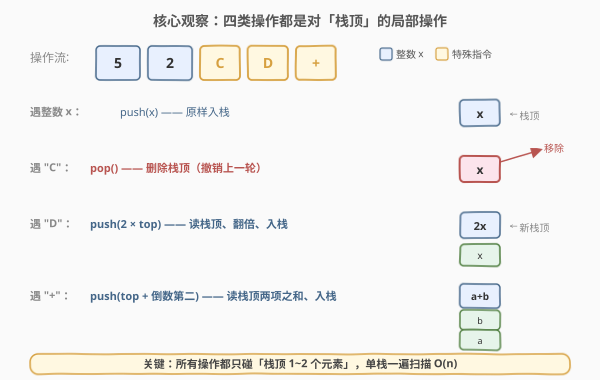
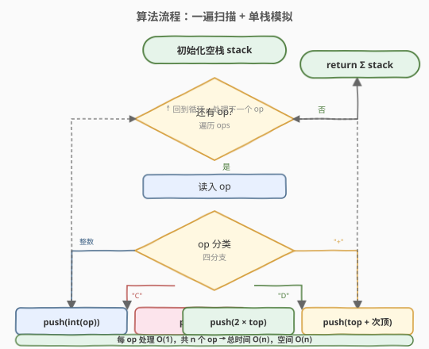

# LeetCode 棒球比赛 题解

## 1. 题目概述

- **标题 / 题号**：棒球比赛（#682，easy）
- **链接**：https://leetcode.cn/problems/baseball-game/
- **难度**：简单
- **标签**：栈、数组、模拟

**题意**：你现在是一场采用特殊赛制棒球比赛的记分员。这场比赛由若干回合组成，过去回合的得分可能会影响未来回合的得分。给定一个字符串数组 `ops`，其中 `ops[i]` 表示第 `i` 个操作，按顺序记录每回合得分，规则如下：

- **整数 x**：表示本回合获得 `x` 分，直接记入记录。
- **"+"**：表示本回合获得的分数是**前两次得分的和**。题目保证此时记录中至少有两个分数。
- **"D"**：表示本回合获得的分数是**前一次得分的两倍**。题目保证此时记录中至少有一个分数。
- **"C"**：表示**前一次得分无效**，将其从记录中移除。题目保证此时记录中至少有一个分数。

最后返回记录中**所有分数的总和**。

**示例 1**：

```text
输入：ops = ["5","2","C","D","+"]
输出：30
解释：
"5" - 记录 5，记录为 [5]
"2" - 记录 2，记录为 [5, 2]
"C" - 使前一次得分 2 无效并移除，记录为 [5]
"D" - 记录 2 × 5 = 10，记录为 [5, 10]
"+" - 记录 5 + 10 = 15，记录为 [5, 10, 15]
总和：5 + 10 + 15 = 30
```

**示例 2**：

```text
输入：ops = ["5","-2","4","C","D","9","+","+"]
输出：27
解释：
"5"  - 记录 [5]
"-2" - 记录 [5, -2]
"4"  - 记录 [5, -2, 4]
"C"  - 移除 4，记录 [5, -2]
"D"  - 记录 -2 × 2 = -4，记录 [5, -2, -4]
"9"  - 记录 [5, -2, -4, 9]
"+"  - 记录 -4 + 9 = 5，记录 [5, -2, -4, 9, 5]
"+"  - 记录 9 + 5 = 14，记录 [5, -2, -4, 9, 5, 14]
总和：5 - 2 - 4 + 9 + 5 + 14 = 27
```

**示例 3**：

```text
输入：ops = ["1"]
输出：1
```

**约束**：

- `1 <= ops.length <= 1000`
- `ops[i]` 为 `"C"`、`"D"`、`"+"`，或范围 `[-3 * 10^4, 3 * 10^4]` 内的整数
- 操作 `"+"` 时记录中至少有两个分数；操作 `"C"` 和 `"D"` 时记录中至少有一个分数
- 所有操作保证有效，整数和的结果都在 32 位 `int` 范围内

> 💡 这题的本质是「**带撤销的流水账模拟**」：每条操作都只碰最近 1~2 个分数——要么追加、要么撤销、要么基于最近分数派生。这种「只动尾部、可能回退」的语义，正是**栈**的天然场景，与 [150. 逆波兰表达式求值](../0101-0200/150_逆波兰表达式求值.md) 同属「单栈一遍扫描模拟」家族。

## 2. 解题思路

### 2.1 暴力思路：用数组 + 反复回溯

最直觉的做法：用一个数组 `rec` 维护记录，遇到每类操作时：
- 整数：`rec.push_back(x)`；
- `"C"`：`rec.pop_back()`；
- `"D"`：取 `rec.back()`，翻倍后 `push_back`；
- `"+"`：取 `rec[len-1]` 与 `rec[len-2]`，求和后 `push_back`。

最后 `accumulate(rec)` 求和。

> ⚠️ 仔细一看，这其实就是正确解法——本题数据规模小（`n ≤ 1000`），不存在性能瓶颈。所谓「暴力」与「最优」在此重合：四类操作都是 $O(1)$ 的尾部操作，总时间 $O(n)$。真正的区别只在于**用 `vector` 的 `back()` 还是封装成栈**——本质相同。下面的「核心观察」聚焦在「为什么尾部操作天然适合栈」。

### 2.2 核心观察：四类操作都是对「栈顶」的局部操作



把记录看作一个**栈**，栈顶是「最近一次得分」。四类操作的作用范围全在栈顶 1~2 个元素之内：

| 操作 | 语义 | 栈操作 | 读/写 |
|------|------|--------|-------|
| 整数 `x` | 记新分 | `push(x)` | 只写 |
| `"C"` | 撤销最近一次 | `pop()` | 只删 |
| `"D"` | 前一次的两倍 | `t = top(); push(2 * t)` | 读 1 写 1 |
| `"+"` | 前两次之和 | `b = top(); a = second(); push(a + b)` | 读 2 写 1 |

> 💡 **为什么不是「求和累加」而是「维护栈」？** 因为 `"C"` 会**撤销**已经计入的分数。若边扫边累加 `ans`，遇到 `"C"` 时还得「减回」被撤销的值——这要求记住上一个被加进去的分数，逻辑反而绕。维护栈则把「撤销」自然表达成 `pop()`，最后统一 `Σ stack` 求和，**消除「撤销」的特殊性**，所有操作统一成栈顶操作。

> ⚠️ **"前一次"指入栈后的最新栈顶，不是操作流里的前一个 op**。例如 `["5","2","C","D"]`：`"C"` 删掉 `2` 后栈顶变回 `5`，所以 `"D"` 翻倍的是 `5`（得 `10`），不是被删掉的 `2`。所有「前 N 次」都指**当前栈中的最新 N 个**，已被 `"C"` 移除的不算。

### 2.3 算法流程图



**完整步骤**：

```
1. 初始化空栈 stack
2. 逐个 op 扫描 ops：
   a. op == "C"：stack.pop()
   b. op == "D"：stack.push(2 * stack.top())
   c. op == "+"：
      - b = stack.top()          // 栈顶（最新）
      - a = stack[stack.size()-2]// 倒数第二
      - stack.push(a + b)
   d. 否则（整数）：stack.push(stoi(op))
3. 扫描结束：return Σ stack
```

每个 op 处理 $O(1)$（`vector` 的 `push_back`/`pop_back`/`back()` 均摊常数），共 $n$ 个 op，总时间 $O(n)$。

### 2.4 示例演算

以 `ops = ["5","2","C","D","+"]` 为例，逐步跟踪栈状态：

![示例演算：ops = ["5","2","C","D","+"]，求和 = 30](../images/baseball_walkthrough.svg)

| 步 | op | 动作 | 栈状态（左底→右顶） |
|----|----|------|----------------------|
| 1 | `"5"` | push(5) | `[5]` |
| 2 | `"2"` | push(2) | `[5, 2]` |
| 3 | `"C"` | pop() → 移除 2 | `[5]` |
| 4 | `"D"` | push(2×5=10) | `[5, 10]` |
| 5 | `"+"` | push(5+10=15) | `[5, 10, 15]` |

扫描结束，求和 `5 + 10 + 15 = 30` ✓。

对应示例 2 中的关键转折：`["5","-2","4","C","D","9","+","+"]`，注意第二个 `"+"` 取的是 `-4` 与 `9`（已被第一个 `"+"` 写入的 `5` 还没轮到），得 `5`；第三个 `"+"` 才取 `9` 与 `5` 得 `14`。**"前两项"始终指当前栈顶两个**，而非操作流相邻。

> 💡 **规律**：`"D"`、`"+"` 都**只读不弹**（派生新分入栈），只有 `"C"` **真删**。所以栈只增不减（除 `"C"`），读完一遍后栈中保留所有有效分数，末尾统一求和即可。

## 3. 参考代码

### C++

```cpp
class Solution {
public:
    int calPoints(vector<string>& ops) {
        vector<int> st;                       // 用 vector 当栈，便于索引倒数第二
        for (const string& op : ops) {
            if (op == "C") {
                st.pop_back();
            } else if (op == "D") {
                st.push_back(2 * st.back());
            } else if (op == "+") {
                int b = st.back();
                int a = st[st.size() - 2];
                st.push_back(a + b);
            } else {
                st.push_back(stoi(op));
            }
        }
        return accumulate(st.begin(), st.end(), 0);
    }
};
```

### Python

```python
class Solution:
    def calPoints(self, ops: List[str]) -> int:
        st = []
        for op in ops:
            if op == "C":
                st.pop()
            elif op == "D":
                st.append(2 * st[-1])
            elif op == "+":
                st.append(st[-1] + st[-2])
            else:
                st.append(int(op))
        return sum(st)
```

> ⚠️ **为什么不用 `std::stack`？** 因为 `"+"` 需要读「倒数第二」个元素，`std::stack` 不支持随机访问，只能先 `pop` 再 `push` 回去（破坏原栈）。用 `vector` 直接 `st[st.size()-2]` 更直观、不易错。Python 的 `list` 天然支持负索引 `st[-2]`，无需此顾虑。

> 💡 **C++ `accumulate` 的坑**：第三个参数 `0` 的类型决定累加类型。写 `0` 时为 `int`，题目保证结果在 `int` 范围内，安全。若中间和可能超 `int`，应写 `0LL`。本题 $n \le 1000$、每分 $\le 3 \times 10^4$，最大和 $\approx 3 \times 10^7$，远在 `int` 内，无需 `long long`。

## 4. 复杂度分析

| 维度 | 复杂度 | 说明 |
|------|--------|------|
| **时间复杂度** | $O(n)$ | 每个 op 处理一次 $O(1)$（push/pop/back 均摊常数） |
| **空间复杂度** | $O(n)$ | 最坏情况无 `"C"`，栈存 $n$ 个分数 |

> 💡 本题「暴力」与「最优」复杂度相同——四类操作本就是 $O(1)$ 尾部操作，无需进一步优化。唯一可省的是末尾求和：可以在每次 push 时同步累加 `ans`，遇到 `"C"` 时 `ans -= popped`，省掉最后的遍历。但代码更绕、易错，收益仅省一次 $O(n)$，不推荐。

## 5. 扩展：边扫边累加（O(1) 额外查询）

若需求「**任意时刻返回当前总分**」（如设计一个在线计分类），可在栈外维护一个 `total` 变量，把求和摊到每次操作中：

```python
class BaseballScoreboard:
    def __init__(self):
        self.st = []
        self.total = 0

    def apply(self, op: str) -> None:
        if op == "C":
            self.total -= self.st.pop()
        elif op == "D":
            v = 2 * self.st[-1]
            self.st.append(v)
            self.total += v
        elif op == "+":
            v = self.st[-1] + self.st[-2]
            self.st.append(v)
            self.total += v
        else:
            v = int(op)
            self.st.append(v)
            self.total += v

    def score(self) -> int:
        return self.total   # O(1) 查询
```

关键点：`"C"` 撤销时 `total -= popped`——这正是「维护栈」相对「单变量累加」的优势：栈记住了被撤销的值，能精确回退；而单变量累加无法撤销。代价是空间 $O(n)$。

| 方案 | 末尾求和 | 任意时刻查询 | 空间 |
|------|----------|--------------|------|
| 栈 + 末尾 `sum` | $O(n)$ | $O(n)$ | $O(n)$ |
| 栈 + 同步 `total` | $O(1)$ | $O(1)$ | $O(n)$ |

## 6. 面试要点

**Q1：为什么用栈而不是直接维护一个累加和变量？**
> 因为 `"C"` 操作要**撤销上一轮分数**。单变量累加无法回退（不知道上一轮加了多少），而栈把「撤销」自然表达成 `pop()`，末尾统一求和。栈的本质是「记录可回退的历史」，这正是带撤销流水账的需求。

**Q2：`"+"` 取的「前两次得分」具体指什么？**
> 指**当前栈顶的两个元素**，即入栈后最新的两个分数，不是操作流里的前两个 op。例如 `["5","2","C","D","+"]` 中 `"+"` 取 `5` 和 `10`（`"D"` 派生的新分），而非已被 `"C"` 删掉的 `2`。所有「前 N 次」都基于**当前栈状态**。

**Q3：`"D"` 和 `"+"` 会弹出栈顶吗？**
> 不会。两者都是**只读栈顶（1 或 2 个）派生新分再 push**，栈只增不减。只有 `"C"` 真正 `pop`。所以一遍扫完栈里保留所有有效分数，末尾求和即可。

**Q4：C++ 为什么用 `vector` 而非 `std::stack`？**
> `"+"` 需读「倒数第二」个元素，`std::stack` 不支持随机访问，只能先 `pop` 再 `push` 回去（破坏原栈、易错）。`vector` 的 `st[st.size()-2]` 直观安全。Python `list` 有负索引 `st[-2]`，无此问题。选择数据结构应贴合访问模式。

**Q5：本题和 [150. 逆波兰表达式求值] 有何异同？**
> 同：都用单栈一遍扫描，每条指令是 $O(1)$ 的栈顶操作。异：150 的运算符**弹两个操作数再压回结果**（栈内元素减少），682 的 `"D"`/`"+"`**只读不弹**（栈只增不减），`"C"` 才删。可把 682 看作「带撤销、只读派生」的轻量版栈模拟，比 150 更简单。

> 💡 **一句话总结**：棒球比赛是「带撤销的流水账模拟」招牌题——四类操作都只碰栈顶 1~2 个元素，用单栈一遍扫描即可。栈把「撤销」自然表达成 `pop()`，消除特殊分支；末尾统一求和，时间 $O(n)$、空间 $O(n)$。

## 同类练习题

| # | 题目 | 与本题的关联 |
|---|------|-------------|
| 150 | [逆波兰表达式求值](https://leetcode.cn/problems/evaluate-reverse-polish-notation/)（[题解](../0101-0200/150_逆波兰表达式求值.md)） | 同样单栈一遍扫描，运算符弹两个数算；本题的 `"D"`/`"+"` 只读不弹，对照理解「读 vs 弹」的边界 |
| 71 | [简化路径](https://leetcode.cn/problems/simplify-path/)（[题解](../0001-0100/71_简化路径.md)） | 用栈处理 `..` 弹栈、目录名压栈，同为「带撤销的栈模拟」 |
| 844 | [比较退格符的字符串](https://leetcode.cn/problems/backspace-string-compare/) | `#` 退格 = 本题 `"C"` 撤销，两串各用栈模拟后比较，栈版「带撤销流水账」 |
| 20 | [有效的括号](https://leetcode.cn/problems/valid-parentheses/)（[题解](../0001-0100/20_有效括号.md)） | 栈的最基础应用，匹配即消去，与本题 `"C"` 的 `pop` 同源 |
| 1047 | [删除字符串中的所有相邻重复项](https://leetcode.cn/problems/remove-all-adjacent-duplicates-in-string/) | 栈顶相同就 `pop`，同为「栈顶判定 + 可能回退」的简单栈模拟 |
