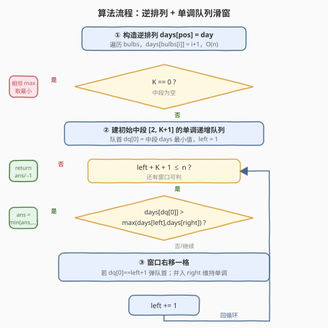
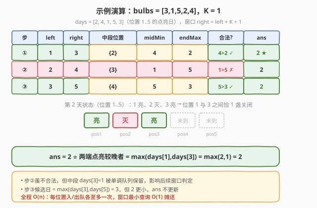

# K 个关闭的灯泡

- **题目名称**：K 个关闭的灯泡
- **链接**：[683. K 个关闭的灯泡](https://leetcode.cn/problems/k-empty-slots/)
- **难度**：困难
- **标签**：数组、滑动窗口、单调队列、逆排列

## 1. 题目概述

有 `N` 盏灯泡排成一行，编号 `1` 到 `N`。初始全部关闭。每天**恰好点亮一盏**，`N` 天后全部点亮。

给定长度为 `N` 的数组 `bulbs`，其中 `bulbs[i] = x` 表示第 `i+1` 天点亮位置 `x`（`i` 从 0 开始，`x` 从 1 开始）。再给定整数 `K`，求**最早的天数**，使得这天存在两盏**已点亮**的灯泡，且它们之间恰好有 `K` 盏**关闭**的灯泡（这 `K` 盏全未点亮）。若不存在这样的天，返回 `-1`。

**示例 1**：

```text
输入：bulbs = [1,3,2], K = 1
输出：2
解释：
第 1 天：bulbs[0]=1，点亮位置 1 → [1,0,0]
第 2 天：bulbs[1]=3，点亮位置 3 → [1,0,1]   ← 位置 1、3 亮，中间位置 2 关闭，K=1 ✓
第 3 天：bulbs[2]=2，点亮位置 2 → [1,1,1]
返回 2。
```

**示例 2**：

```text
输入：bulbs = [1,2,3], K = 1
输出：-1
解释：灯从左到右依次点亮，任意两亮灯之间不会出现「恰好 1 盏关闭」的状态。
```

**约束条件**：

- $1 \le N \le 20000$
- $1 \le \text{bulbs}[i] \le N$
- `bulbs` 是 $1..N$ 的排列
- $0 \le K \le 20000$

> 💡 **关键观察**：题目问「某天某段是否全灭」，但 `bulbs` 按**天**组织，直接模拟每天扫描所有灯对是 $O(N^2)$ 甚至更糟。把「位置 → 点亮日」建出来后，问题立刻变成一个**定长窗口 + 区间最小查询**的几何问题——这是本题从 $O(N^2)$ 降到 $O(N)$ 的转折点。

---

## 2. 解题思路

### 2.1 暴力思路

最直观的暴力：逐天模拟，每天点亮一盏后扫描所有已点亮灯对，检查其间是否恰好 `K` 盏关闭。共有 $N$ 天，每天检查灯对 $O(N^2)$，整体 $O(N^3)$；即便只检查「新点亮灯的前驱/后继」也需要维护有序集合，$O(N \log N)$（见第 5 节扩展）。

换一个视角——用**逆排列**：令 $\text{days}[x]$ 表示位置 $x$ 的点亮日。那么一对相距 $K+1$ 的位置 $(i,\, i+K+1)$，「在这天恰好合法」等价于：

$$\text{两端都已亮} \;\Longleftrightarrow\; \text{day} \ge \max(\text{days}[i],\, \text{days}[i+K+1])$$
$$\text{中段 }K\text{ 盏全灭} \;\Longleftrightarrow\; \text{day} < \min_{i < m < i+K+1} \text{days}[m]$$

两端已亮且中段全灭的**最早那天**就是 $\max(\text{days}[i],\,\text{days}[i+K+1])$，前提是它**严格小于**中段最小点亮日。于是答案为：

$$\text{ans} = \min_{\substack{i \\ \max(\text{days}[i],\text{days}[i+K+1]) \,<\, \min\text{days}[i+1..i+K]}} \max(\text{days}[i],\,\text{days}[i+K+1])$$

暴力做法：枚举每个 $i$，线性扫描中段 $K$ 个位置求最小值并比较，单次 $O(K)$，总体 $O(NK)$。$N, K \le 20000$ 时高达 $4 \times 10^8$，超时。

> ⚠️ 瓶颈在「每个窗口求中段最小」这一步。注意相邻窗口的中段只差**一进一出**两个元素——这正是**滑动窗口最小值**（单调队列）的招牌场景，可把每次查询摊还到 $O(1)$。

### 2.2 核心观察：逆排列 + 定长 K 窗口

![核心观察：逆排列 days[] + 定长 K 窗口](../images/kempty_concept.svg)

把 `bulbs`（天→位置）翻转成 `days`（位置→点亮日）后，问题归约为：

> 在 `days` 数组上滑动一个跨度为 $K+1$ 的窗口，左端点 `left`、右端点 `right = left + K + 1`，中段为 $K$ 个位置。若**中段点亮日的最小值**严格大于**两端点亮日的较大值**，则该窗口贡献一个合法候选日 $\max(\text{days}[\text{left}],\,\text{days}[\text{right}])$，答案取所有候选日的最小。

直觉上：两端**先亮**、中段**后亮**，那么在「右端亮起的那一瞬间」中段还全灭，恰好夹着 $K$ 盏关闭灯——这一瞬间就是 $\max(\text{days}[\text{left}],\,\text{days}[\text{right}])$（两端较晚亮的那天）。中段最小点亮日要晚于它，保证这瞬间中段确实全灭。

> 💡 这与 [239. 滑动窗口最大值](../0201-0300/239_滑动窗口最大值.md) 共用同一套单调队列模板，只是这里求**最小**、且窗口内容是 `days`（点亮日）而非原数组。逆排列是本题的「破题一跳」——把按天组织的事件流，重排成按位置组织的静态数组，从而暴露出定长窗口结构。

### 2.3 算法流程图



维护一个**单调递增的双端队列** `dq`，存储中段位置下标，使 `days[dq.front()]` 始终等于当前中段的点亮日最小值：

- **建初始中段** `[2, K+1]`（对应 `left=1, right=K+2`），按下标顺序入队，入队前从队尾弹出所有 `days` 值 `>=` 新元素者，保持单调递增。
- **滑动**：每轮判定后，窗口整体右移一格——若队首恰好是离开窗口的 `left+1` 则弹出队首；把新进入中段的旧右端点 `right` 按单调规则从队尾插入。
- **K=0 特判**：中段为空，最小值视为 $+\infty$，条件恒真，退化成「相邻两灯都亮即合法」，答案为 $\min_i \max(\text{days}[i], \text{days}[i+1])$。

> ⚠️ **单调队列维护的是中段，不含两端**：队首给出的是 `days[left+1 .. left+K]` 的最小值，两端 `days[left]`、`days[right]` 单独取 `max` 比较。若误把端点也压入队列，会破坏「中段全灭」的判定语义。

### 2.4 示例演算



以 `bulbs = [3,1,5,2,4]`，`K = 1` 为例。先求逆排列：`days[1]=2, days[2]=4, days[3]=1, days[4]=5, days[5]=3`（位置 1..5 的点亮日）。窗口跨度 $K+1=2$：

| 步 | left | right | 中段位置 | midMin | endMax | 合法? | ans |
|----|------|-------|----------|--------|--------|-------|-----|
| ① | 1 | 3 | {2} | 4 | 2 | 4 > 2 ✓ | 2 ★ |
| ② | 2 | 4 | {3} | 1 | 5 | 1 > 5 ✗ | 2 |
| ③ | 3 | 5 | {4} | 5 | 3 | 5 > 3 ✓ | min(2,3)=2 |

- 步①：两端位置 1（日 2）、3（日 1），中段位置 2（日 4）。中段最小 4 > 端点最大 2 → 合法，候选日 = 2。第 2 天位置 1、3 已亮、位置 2 未亮，恰 1 盏关闭。
- 步②：中段位置 3（日 1）比两端都早亮，第 4 天前位置 3 早已亮，无法形成「中段全灭」→ 不合法。
- 步③：候选日 = 3，但已有更小的 2，`ans` 不更新。

最终 `ans = 2`。

> 💡 注意步②虽不合法，但 `days[3]=1` 这个极小值会被单调队列保留（它可能成为后续窗口的中段最小），影响后续判定——这正是单调队列「队尾弹大、队首弹旧」机制的价值：每个元素入队、出队各至多一次，全程 $O(N)$。

---

## 3. 参考代码

### C++（逆排列 + 单调队列滑窗）

```cpp
class Solution {
public:
    int kEmptySlots(vector<int>& bulbs, int K) {
        int n = bulbs.size();
        vector<int> days(n + 1, 0);                 // days[pos] = 点亮日（1-indexed）
        for (int i = 0; i < n; ++i)
            days[bulbs[i]] = i + 1;

        // K == 0：中段为空，相邻两灯都亮即合法，取 max(days[i],days[i+1]) 最小
        if (K == 0) {
            if (n < 2) return -1;
            int ans = INT_MAX;
            for (int i = 1; i < n; ++i)
                ans = min(ans, max(days[i], days[i + 1]));
            return ans;
        }

        int ans = INT_MAX;
        deque<int> dq;                              // 单调递增，存位置下标，队首=中段 days 最小
        // 建初始中段 [2, K+1]（K 个位置），对应 left=1, right=K+2
        for (int j = 2; j <= K + 1 && j <= n; ++j) {
            while (!dq.empty() && days[dq.back()] >= days[j]) dq.pop_back();
            dq.push_back(j);
        }

        int left = 1;
        while (left + K + 1 <= n) {
            int right = left + K + 1;
            int midMin = days[dq.front()];          // 中段 days 最小值
            int endMax = max(days[left], days[right]);
            if (midMin > endMax)                    // 中段全比两端晚亮 → 这天中段全灭
                ans = min(ans, endMax);
            // 窗口整体右移一格：移出 left+1，并入旧 right 作为新中段元素
            if (dq.front() == left + 1) dq.pop_front();
            while (!dq.empty() && days[dq.back()] >= days[right]) dq.pop_back();
            dq.push_back(right);
            ++left;
        }
        return ans == INT_MAX ? -1 : ans;
    }
};
```

### Python（逆排列 + 单调队列滑窗）

```python
from collections import deque

class Solution:
    def kEmptySlots(self, bulbs: List[int], K: int) -> int:
        n = len(bulbs)
        days = [0] * (n + 1)                        # days[pos] = 点亮日（1-indexed）
        for day, pos in enumerate(bulbs, start=1):
            days[pos] = day

        # K == 0：中段为空，相邻两灯都亮即合法
        if K == 0:
            if n < 2:
                return -1
            return min(max(days[i], days[i + 1]) for i in range(1, n))

        ans = float('inf')
        dq = deque()                                # 单调递增，存位置下标，队首=中段 days 最小
        # 建初始中段 [2, K+1]（K 个位置）
        for j in range(2, min(K + 2, n + 1)):
            while dq and days[dq[-1]] >= days[j]:
                dq.pop()
            dq.append(j)

        left = 1
        while left + K + 1 <= n:
            right = left + K + 1
            mid_min = days[dq[0]]                   # 中段 days 最小值
            end_max = max(days[left], days[right])
            if mid_min > end_max:                   # 中段全比两端晚亮 → 这天中段全灭
                ans = min(ans, end_max)
            # 窗口整体右移一格：移出 left+1，并入旧 right 作为新中段元素
            if dq[0] == left + 1:
                dq.popleft()
            while dq and days[dq[-1]] >= days[right]:
                dq.pop()
            dq.append(right)
            left += 1

        return -1 if ans == float('inf') else ans
```

> 💡 **为何 `days` 数组开 `n+1` 且下标从 1 开始？** 因为灯泡位置编号是 $1..N$。用 1-indexed 让 `right = left + K + 1` 与位置编号直接对齐，省去 `±1` 的心智负担，边界更不易写错。

---

## 4. 复杂度分析

| 维度 | 复杂度 | 说明 |
|------|--------|------|
| 时间复杂度 | $O(N)$ | 构造 `days` 一趟 $O(N)$；滑动窗口每个位置入队、出队各至多一次，摊还 $O(1)$/轮，共 $O(N)$ 轮 |
| 空间复杂度 | $O(N)$ | `days` 数组 $O(N)$；单调队列至多存 $K$ 个下标，$O(N)$ |

> 💡 本法已达时间下界 $O(N)$——至少要看一遍每个位置的点亮日才能下结论。单调队列把「窗口最小值」查询从暴力的 $O(K)$ 摊还到 $O(1)$，是滑动窗口求极值问题的通用降阶武器。

---

## 5. 扩展：有序集合解法与变体

### 5.1 有序集合 O(N log N) 解法

不翻转成 `days`，而是**按点亮顺序**逐盏加入一个有序集合（C++ `std::set` / Python `SortedList`），每加入位置 `x` 时查其前驱 `pred` 与后继 `succ`：

- 若 `x - pred - 1 == K`（即 `pred` 与 `x` 之间恰 `K` 盏未亮），候选日为当前天。
- 若 `succ - x - 1 == K`，同理候选日为当前天。

取所有候选日的最小。正确性：新点亮的灯 `x` 只可能与**已点亮**的相邻灯形成「中间全灭」的对——因为中段任何已亮灯都会把区间切断，所以只需看 `x` 在已亮集合中的前驱/后继。复杂度 $O(N \log N)$，比单调队列多一个 $\log$，但思路更直观、更易在面试中现场写出。

```cpp
#include <set>
int kEmptySlots_set(vector<int>& bulbs, int K) {
    set<int> on;
    for (int i = 0; i < (int)bulbs.size(); ++i) {
        int x = bulbs[i];
        auto it = on.insert(x).first;
        if (it != on.begin()) {
            int pred = *prev(it);
            if (x - pred - 1 == K) return i + 1;
        }
        if (next(it) != on.end()) {
            int succ = *next(it);
            if (succ - x - 1 == K) return i + 1;
        }
    }
    return -1;
}
```

> ⚠️ 此法「遇到第一个合法候选即返回」依赖一个性质：随天推进，候选日单调递增（天本身递增），所以**第一个**找到的合法候选就是最早的那天。但要注意：同一对灯可能在多天合法吗？不会——一对灯一旦中间某盏点亮就不再合法，且「首次合法日」由两端较晚点亮者决定，按天顺序扫描时首次命中即最早。这与单调队列法「枚举所有窗口取最小」殊途同归。

### 5.2 K = 0 的语义

`K = 0` 即两盏**相邻**亮灯、中间 0 盏关闭。逆排列法中段为空，最小值视为 $+\infty$，条件恒真，答案即所有相邻对 $\max(\text{days}[i], \text{days}[i+1])$ 的最小——也就是「最早出现两盏相邻亮灯的那天」。

---

## 6. 面试要点

1. **为什么要把 `bulbs` 翻转成 `days`？**

   - `bulbs` 按「天」组织，判断「某天某段是否全灭」需回看历史，难以下手。`days[pos]` 把「位置 → 点亮日」静态化，问题立刻归约为：在 `days` 上找跨度 $K+1$ 的两位置，使中段点亮日全大于两端较大者——一个定长窗口 + 区间最小查询的几何问题。这一「逆排列」翻转是本题破题关键。

2. **合法条件为什么是 `midMin > max(days[left], days[right])`？**

   - 两端都已亮要求当天 $\ge \max(\text{days}[\text{left}],\,\text{days}[\text{right}])$；中段全灭要求当天 $<$ 中段最小点亮日。能同时满足的最早那天就是 $\max(\text{days}[\text{left}],\,\text{days}[\text{right}])$，需要它 $<$ $\text{midMin}$，即 $\text{midMin} > \max(\text{days}[\text{left}],\,\text{days}[\text{right}])$。

3. **单调队列在这里维护什么？为什么是单调递增？**

   - 维护中段 $K$ 个位置的 `days` 值，队首始终是当前中段最小。求最小值用**单调递增**队列（队首即最小）：新元素从队尾入队前，弹出所有 `>=` 它的旧元素——这些旧值既更大又更早离开窗口，永不可能再当最小，弹出无副作用。这与 [239. 滑动窗口最大值](../0201-0300/239_滑动窗口最大值.md) 的单调递减队列完全对称。

4. **窗口滑动时「并入旧 right 作为新中段」为什么对？**

   - 本轮端点是 `left`、`right = left+K+1`，中段是 `[left+1, left+K]`。下一轮 `left` 加 1，新中段是 `[left+2, left+K+1]`——恰好是旧中段去掉 `left+1`、加上旧 `right = left+K+1`。所以「移出 left+1、并入旧 right」正是中段窗口右移一格的精确描述。

5. **K = 0 为什么单独处理？**

   - `K = 0` 时中段为空，单调队列为空，`dq.front()` 会访问非法内存。此时条件「中段全灭」平凡成立（无中段），答案退化为相邻两灯 $\max$ 的最小，单独一趟扫描即可，避免空队列特判穿插在主循环里。

---

## 7. 同类练习题

- [239. 滑动窗口最大值](https://leetcode.cn/problems/sliding-window-maximum/)（[题解](../0201-0300/239_滑动窗口最大值.md)）：同一单调队列模板的母题，求窗口最大（单调递减），与本题求最小（单调递增）对称对照
- [684. 冗余连接](https://leetcode.cn/problems/redundant-connection/)（[题解](../0601-0700/684_冗余连接.md)）：同为 6 字头图/数组题，对照「逆排列翻转眼界」与「并查集动态加边」两种把朴素 $O(N^2)$ 降阶的思路
- [220. 存在重复元素 III](https://leetcode.cn/problems/contains-duplicate-iii/)（[题解](../0201-0300/220_存在重复元素III.md)）：同样在值域/下标上做定长窗口 + 近邻查询，可对照桶分桶与单调队列两种窗口极值维护法
- [719. 找出第 K 小的数对距离](https://leetcode.cn/problems/find-k-th-smallest-pair-distance/)（[题解](../0701-0800/719_找出第K小的数对距离.md)）：数对距离 + 排序后双指针计数，对照本题「位置差固定为 K+1」的定长窗口视角
- [862. 和至少为 K 的最短子数组](https://leetcode.cn/problems/shortest-subarray-with-sum-at-least-k/)：单调队列 + 前缀和求最短合法窗口，进阶体会「队列维护候选、滑窗收缩」的通用范式
