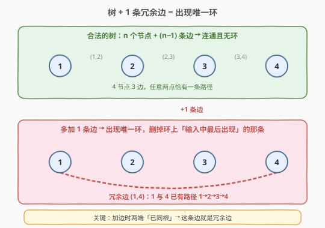
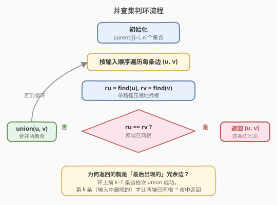
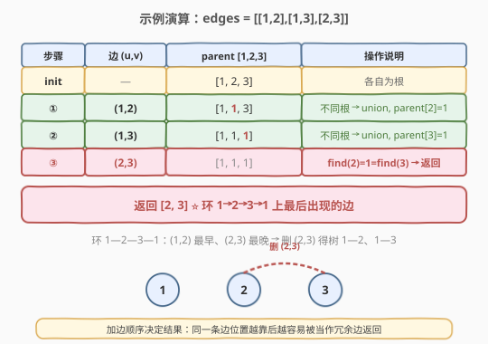

# LeetCode 冗余连接 题解

## 1. 题目概述

- **标题 / 题号**：冗余连接（#684，medium）
- **链接**：https://leetcode.cn/problems/redundant-connection/
- **难度**：中等
- **标签**：并查集、图、树

**题意**：树可以看成是一个**连通且无环**的无向图。给定一个从 1 到 `n` 标记的节点集合，以及一个边列表 `edges`（其中 `edges.length == n`，比构成一棵树恰好多出一条边）。

多出的那条边会**恰好形成一个环**。你的任务是**找到并返回这条冗余边**，使得删掉它之后，剩下的图是一棵以 1..n 为节点的合法树。如果有多个候选答案，返回**输入中最后出现**的那一条边。

**示例 1**：

```text
输入：edges = [[1,2],[1,3],[2,3]]
输出：[2,3]
解释：边 (1,2)、(1,3) 已让 1、2、3 连通，再加 (2,3) 形成环 1→2→3→1。
```

**示例 2**：

```text
输入：edges = [[1,2],[2,3],[3,4],[1,4],[1,5]]
输出：[1,4]
解释：前 4 条边让 1、2、3、4 连通成环 1→2→3→4→1，(1,4) 是该环上最后出现的边。
```

**约束**：

- `n == edges.length`
- `3 <= n <= 1000`
- `edges[i].length == 2`
- `1 <= ai < bi <= edges.length`（节点编号 1..n）
- `ai != bi`，无重复边
- 只有一个环，图整体连通

## 2. 解题思路

### 2.1 暴力思路

枚举每条边作为「待删边」，删掉后对剩下的图做一次 DFS/BFS 判断是否仍连通且无环。时间复杂度 $O(n^2)$（每删一条都要遍历一次图），空间 $O(n)$。能过但**没有学到新模板**——本题是并查集「动态加边判环」的母题。

### 2.2 核心观察：并查集判环



一棵 `n` 节点的合法树恰有 `n−1` 条边且无环。本题给出 `n` 条边，意味着**恰好多一条**，这条边必然落在某个环上。

并查集的关键直觉：

> 在无向图中**逐条加边**，每次加 `(u, v)` 前先查 `u`、`v` 是否已在同一集合。若已同根，说明两点之间早有通路，再连这条边就**闭合了一个环**——这条边就是冗余边。

这与 [547. 省份数量](../0501-0600/547_省份数量.md) 的并查集模板完全一致，区别只是：547 用 `union` 数连通分量个数，本题用「`union` 失败（已同根）」**判定环边**。

> 💡 为什么返回的恰好是「输入中最后出现」的冗余边？因为并查集按输入顺序加边，环上的前 `k−1` 条边都会成功 `union`（此时环尚未闭合），只有**第 `k` 条**（环上最晚出现的）才让两端已同根，被命中返回。非环边更不会触发，所以第一条命中的就是答案。

### 2.3 算法流程图



### 2.4 示例演算



以 `edges = [[1,2],[1,3],[2,3]]` 为例（节点编号 1..3）：

- 初始 `parent = [1, 2, 3]`（下标 1/2/3，各自为根）。
- 加 `(1,2)`：`find(1)=1`、`find(2)=2`，不同根 → `union`，`parent[2]=1`。
- 加 `(1,3)`：`find(1)=1`、`find(3)=3`，不同根 → `union`，`parent[3]=1`。
- 加 `(2,3)`：`find(2)=1`、`find(3)=1`，**已同根** → 返回 `[2,3]`。

环 `1—2—3—1` 上三条边 `(1,2)`、`(1,3)`、`(2,3)` 中，`(2,3)` 输入最晚，正是被返回的答案。

## 3. 参考代码

### C++（并查集 + 路径压缩 + 按秩合并）

```cpp
class UnionFind {
  public:
    vector<int> parent;
    vector<int> rank_;

    UnionFind(int n) {
        parent.resize(n);
        rank_.assign(n, 0);
        for (int i = 0; i < n; i++) parent[i] = i;
    }

    int find(int x) {
        if (parent[x] != x) parent[x] = find(parent[x]);   // 路径压缩
        return parent[x];
    }

    bool unite(int x, int y) {
        int rx = find(x), ry = find(y);
        if (rx == ry) return false;                         // 已同根 → 这条边冗余
        if (rank_[rx] < rank_[ry]) parent[rx] = ry;        // 按秩合并
        else if (rank_[rx] > rank_[ry]) parent[ry] = rx;
        else { parent[ry] = rx; rank_[rx]++; }
        return true;
    }
};

class Solution {
  public:
    vector<int> findRedundantConnection(vector<vector<int>>& edges) {
        int n = edges.size();                               // n 条边 → n 个节点（树 + 1）
        UnionFind uf(n + 1);                                // 节点编号 1..n，下标 0 不用
        for (auto& e : edges) {
            if (!uf.unite(e[0], e[1])) return e;            // 合并失败即为冗余边
        }
        return {};                                          // 不会走到（题目保证恰有一个环）
    }
};
```

### Python（并查集 + 路径压缩 + 按秩合并）

```python
class Solution:
    def findRedundantConnection(self, edges: List[List[int]]) -> List[int]:
        n = len(edges)
        parent = list(range(n + 1))
        rank_ = [0] * (n + 1)

        def find(x):
            while parent[x] != x:
                parent[x] = parent[parent[x]]               # 隔代压缩
                x = parent[x]
            return x

        for u, v in edges:
            ru, rv = find(u), find(v)
            if ru == rv:
                return [u, v]                               # 已同根 → 冗余边
            if rank_[ru] < rank_[rv]:
                parent[ru] = rv
            elif rank_[ru] > rank_[rv]:
                parent[rv] = ru
            else:
                parent[rv] = ru
                rank_[ru] += 1
        return []
```

## 4. 复杂度分析

| 维度 | 复杂度 | 说明 |
|------|--------|------|
| 时间复杂度 | $O(n \, \alpha(n))$ | 依次处理 $n$ 条边，每条做两次 `find` + 至多一次 `union`，单次均摊 $O(\alpha(n))$ |
| 空间复杂度 | $O(n)$ | `parent` 与 `rank` 数组各 $O(n)$ |

> 💡 $\alpha(n) \le 5$（本题 $n \le 1000$ 范围内），实际等同于 $O(n)$，一次遍历即可定位冗余边。

## 5. 扩展：有向版本与边删除顺序

1. **[685. 冗余连接 II](https://leetcode.cn/problems/redundant-connection-ii/)**：把无向图改成**有向图**（每条边是父→子），冗余边可能造成「入度为 2」或「成环」两种情况，需分类讨论后再用并查集判环，是本题的进阶版。

2. **为何「最后出现」靠输入顺序天然保证**：题目要求多解时返回输入中最晚的。并查集**按输入顺序**逐条处理，命中的第一条冗余边就是环上最晚的那条——无需额外记录候选、无需回溯，顺序遍历本身即满足要求。

3. **只判环、不删边**：若问题改成「判断无向图是否有环」，同样套用此模板——任意一条边触发「已同根」即说明存在环，返回 `true`。

## 6. 面试要点

1. **为什么并查集能用来判环？**

   - 无向图中逐条加边时，若新边 `(u, v)` 的两端已在同一集合，说明 `u` 到 `v` 早已连通，这条边会闭合一个环。并查集的 `find` 恰好能 $O(\alpha)$ 判断「是否同根」，所以判环即「`union` 是否失败」。

2. **如何保证返回的是「最后出现」的冗余边？**

   - 按输入顺序逐条 `union`，环上前 `k−1` 条边都成功合并（环未闭合），第 `k` 条（最晚的）才让两端同根被命中。非环边不会触发，所以第一条命中的就是答案，无需回溯。

3. **节点编号从 1 开始，并查集数组怎么开？**

   - 开 `n + 1` 大小，下标 `0` 不用，`1..n` 对应节点。若编号从 0 开始则开 `n` 即可。本题 `n = edges.size()`（边数 = 节点数，因为多一条边）。

4. **路径压缩和按秩合并可以只写一个吗？**

   - 可以。只写路径压缩均摊 $O(\log n)$，已足够通过本题；两者同写达到 $O(\alpha(n))$ 近似常数。面试中通常都写上，体现对并查集优化的完整理解。

5. **和 547 省份数量的并查集用法有何异同？**

   - 模板完全相同（`find` + `union` + 路径压缩 + 按秩合并）。区别在**用法**：547 统计成功 `union` 的次数得到连通分量数；684 捕获**第一次 `union` 失败**定位冗余边。一个是数合并、一个是抓冲突。

## 同类练习题

| # | 题目 | 与本题的关联 |
|---|------|-------------|
| 547 | [省份数量](https://leetcode.cn/problems/number-of-provinces/)（[题解](../0501-0600/547_省份数量.md)） | 同一并查集模板，统计连通分量个数，与本题「抓冲突」用法对照 |
| 685 | [冗余连接 II](https://leetcode.cn/problems/redundant-connection-ii/) | 有向图版本，需先处理入度为 2 的节点再判环，是本题进阶 |
| 721 | [账户合并](https://leetcode.cn/problems/accounts-merge/) | 并查集合并字符串键（邮箱），模板进阶到「哈希映射 + 并查集」 |
| 990 | [等式方程的可满足性](https://leetcode.cn/problems/satisfiability-of-equality-equations/) | 先 union 等式、再查不等式是否冲突，判环思路的变体 |
| 1319 | [连通网络的操作次数](https://leetcode.cn/problems/number-of-operations-to-make-network-connected/) | 并查集数连通分量，求最少冗余线缆数 |
