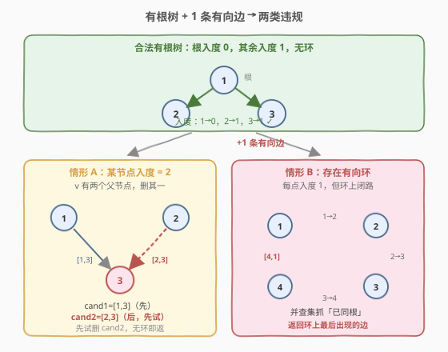
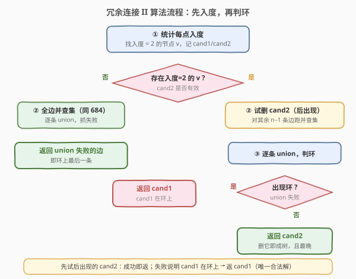
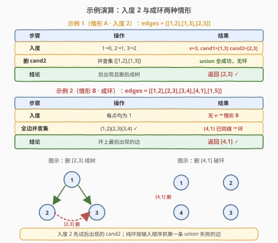

# 冗余连接 II

- **题目名称**：冗余连接 II
- **链接**：[685. 冗余连接 II](https://leetcode.cn/problems/redundant-connection-ii/)
- **难度**：困难
- **标签**：并查集、图、树、有向图

## 1. 题目概述

**有根树**是满足以下条件的**有向**图：只有一个根节点（入度为 0），其余每个节点都有且只有一个父节点（入度恰为 1），且无环。给定一棵由 `n` 个节点（编号 1..n）的合法有根树加上**一条附加有向边**构成的图 `edges`，每条边 `[u, v]` 表示 `u → v`（u 是 v 的父节点）。附加边使该图不再是合法有根树。

返回一条可删除的边，使剩余图成为 `n` 个节点的有根树。若有多个答案，返回**输入中最后出现**的那条。

**示例 1**：

```text
输入：edges = [[1,2],[1,3],[2,3]]
输出：[2,3]
解释：节点 3 有两个父节点 1、2（入度 2），冗余边是 [1,3] 或 [2,3] 之一；删 [2,3] 后成树 1→2、1→3，故返回 [2,3]。
```

**示例 2**：

```text
输入：edges = [[1,2],[2,3],[3,4],[4,1],[1,5]]
输出：[4,1]
解释：每个节点入度都为 1，但 1→2→3→4→1 成环；环上最后出现的边 [4,1] 即冗余边。
```

**约束条件**：

- `n == edges.length`
- `3 <= n <= 1000`
- `edges[i].length == 2`
- `1 <= ui, vi <= n`
- 恰好一条附加边

---

## 2. 解题思路

### 2.1 暴力思路

枚举每条边作为「待删边」，删掉后判定剩余有向图是否为合法有根树：检查入度（恰一个节点入度 0、其余入度 1）且无环。时间 $O(n^2)$，能过但没抓住有向树违规的**两类结构**。

### 2.2 核心观察：两类违规 + 并查集判环



合法有根树 = 「入度合法」+「无环」。`n` 个节点的有根树有 $n-1$ 条边；本题给出 $n$ 条边（多一条），附加边**必然**破坏「入度合法」或「无环」之一，分两类：

| 情形 | 特征 | 冗余边来源 |
|------|------|-----------|
| **情形 A：某节点入度 = 2** | 多一条边指向同一节点 v，v 有两个父节点 | v 的两条入边之一是冗余 |
| **情形 B：存在有向环** | 每个节点入度都为 1，但成环（环上父指针闭环，脱离根） | 环上「最后出现」的边是冗余 |

> ⚠️ 情形 A 与 B **可能同时出现**：v 有两个父节点，且其中一条入边恰在环上。此时冗余边必须既是「v 的入边」又「在环上」——只能删环上那条。这正是本题的难点，下文流程图会处理。

并查集的用法与 [684. 冗余连接](../0601-0700/684_冗余连接.md) 一致：把有向边**当作无向边**逐条 `union`，若新边两端已同根 → 闭合环。区别在于 685 多了「入度 2」这一前置判断。

> 💡 **为什么把有向边当无向边判环？** 当「每点入度 $\le 1$」时，无向环 $\Leftrightarrow$ 有向环。并查集只问「u、v 是否已在同一连通块」，若已同根再连一条边必形成无向环；而入度约束保证该无向环就是有向环。删 `cand2` 后剩余图每点入度 $\le 1$，故判环有效。无入度 2 节点时，$n$ 条边让每点入度恰为 1（无根），父指针必成环，判环同样有效。

### 2.3 算法流程图



核心三步：

1. **统计入度**，找是否存在入度 = 2 的节点 v。
2. **若有 v**：记录指向 v 的两条边 `cand1`（先出现）、`cand2`（后出现）。
   - **先试删 `cand2`**：对**除 cand2 外**的所有边跑并查集。
     - 若无环（所有 union 成功）→ 返回 `cand2`（后出现，满足「最后出现」）。
     - 若有环 → 返回 `cand1`（说明 cand1 在环上，cand2 是合法树边，只能删 cand1）。
3. **若无入度 2 节点**：对所有边跑并查集，返回**第一条**触发「已同根」的边（即 684 做法）。

> 💡 **为何先试 cand2 而非 cand1？** 题目要求多解时返回最后出现的。`cand1`、`cand2` 都指向 v，若删任意一条都能成树，则应返回较晚的 `cand2`。先试 `cand2`：成功即返（最优）；失败说明 `cand1` 才在环上，`cand1` 是唯一合法解（删 `cand2` 仍有环），返回 `cand1` 也满足「在所有合法解中最后」——因为此时合法解只有 `cand1`。

### 2.4 示例演算



**示例 1（情形 A，无环）**：`edges = [[1,2],[1,3],[2,3]]`
- 入度：1→0, 2→1, 3→2。v=3 入度 2，`cand1=[1,3]`、`cand2=[2,3]`。
- 试删 `cand2=[2,3]`，对 `[[1,2],[1,3]]` 跑并查集：`union(1,2)` ✓、`union(1,3)` ✓，无环 → **返回 [2,3]**。

**示例 2（情形 B，纯环）**：`edges = [[1,2],[2,3],[3,4],[4,1],[1,5]]`
- 入度：每点均为 1，无入度 2 节点 → 走情形 B。
- 全边并查集：`union(1,2)`✓、`union(2,3)`✓、`union(3,4)`✓、`union(4,1)` → `find(4)=find(1)` **已同根** → **返回 [4,1]**。

**情形 A + B（同时出现）**：`edges = [[1,2],[2,3],[3,1],[4,1]]`
- 入度：1→2（来自 3、4），2→1, 3→1。v=1 入度 2，`cand1=[3,1]`、`cand2=[4,1]`。
- 试删 `cand2=[4,1]`，对 `[[1,2],[2,3],[3,1]]` 跑并查集：`union(1,2)`✓、`union(2,3)`✓、`union(3,1)` → `find(3)=find(1)` **已同根，有环** → 返回 `cand1=[3,1]`。
- 验证：删 `[3,1]` 后得 4→1→2→3，是有根树（根 4），✓。

---

## 3. 参考代码

### C++（并查集 + 入度判定 + 分类讨论）

```cpp
class UnionFind {
  public:
    vector<int> parent;
    UnionFind(int n) {
        parent.resize(n);
        for (int i = 0; i < n; i++) parent[i] = i;
    }
    int find(int x) {
        if (parent[x] != x) parent[x] = find(parent[x]);   // 路径压缩
        return parent[x];
    }
    bool unite(int x, int y) {
        int rx = find(x), ry = find(y);
        if (rx == ry) return false;                         // 已同根 → 这条边成环
        parent[rx] = ry;
        return true;
    }
};

class Solution {
  public:
    vector<int> findRedundantDirectedConnection(vector<vector<int>>& edges) {
        int n = edges.size();
        vector<int> firstEdge(n + 1, 0);                    // firstEdge[v] = 指向 v 的那条边的索引
        int cand1 = -1, cand2 = -1;                         // 指向入度2节点 v 的两条候选边索引

        for (int i = 0; i < n; i++) {
            int u = edges[i][0], v = edges[i][1];
            if (firstEdge[v] == 0) {
                firstEdge[v] = i;                           // 首次记录指向 v 的边
            } else {
                cand1 = firstEdge[v];                       // 之前那条（先出现）
                cand2 = i;                                  // 当前这条（后出现）
                break;
            }
        }

        UnionFind uf(n + 1);
        if (cand2 == -1) {
            for (auto& e : edges) {
                if (!uf.unite(e[0], e[1])) return e;        // 无入度2 → 纯环，同 684
            }
        } else {
            for (int i = 0; i < n; i++) {
                if (i == cand2) continue;                   // 先删 cand2
                if (!uf.unite(edges[i][0], edges[i][1])) {
                    return edges[cand1];                    // 仍有环 → cand1 在环上，删 cand1
                }
            }
            return edges[cand2];                            // 删 cand2 后无环 → 返 cand2
        }
        return {};
    }
};
```

### Python（并查集 + 入度判定 + 分类讨论）

```python
class Solution:
    def findRedundantDirectedConnection(self, edges: List[List[int]]) -> List[int]:
        n = len(edges)
        first_edge = [0] * (n + 1)                          # first_edge[v] = 指向 v 的边索引
        cand1 = cand2 = -1

        for i, (u, v) in enumerate(edges):
            if first_edge[v] == 0:
                first_edge[v] = i
            else:
                cand1, cand2 = first_edge[v], i             # v 出现第二个父节点
                break

        p = list(range(n + 1))

        def find(x):
            while p[x] != x:
                p[x] = p[p[x]]                              # 隔代压缩
                x = p[x]
            return x

        def union(x, y):
            rx, ry = find(x), find(y)
            if rx == ry:
                return False
            p[rx] = ry
            return True

        if cand2 == -1:
            for u, v in edges:
                if not union(u, v):
                    return [u, v]
        else:
            for i, (u, v) in enumerate(edges):
                if i == cand2:
                    continue
                if not union(u, v):
                    return edges[cand1]
            return edges[cand2]
        return []
```

---

## 4. 复杂度分析

| 维度 | 复杂度 | 说明 |
|------|--------|------|
| 时间复杂度 | $O(n \, \alpha(n))$ | 一遍统计入度 $O(n)$ + 至多两遍并查集（删 cand2 试一遍），单次 `find` 均摊 $O(\alpha(n))$ |
| 空间复杂度 | $O(n)$ | `firstEdge` 数组与并查集 `parent` 各 $O(n)$ |

> 💡 本题最多跑两遍并查集（删 cand2 试一遍），常数仍是线性级。$\alpha(n) \le 5$，实际等同 $O(n)$。

---

## 5. 扩展：为何「先试 cand2」一定能得到「最后出现的合法解」

设指向 v 的两条边为 $e_a$（先出现）、$e_b$（后出现），冗余边必是其一。

- **若删 $e_b$ 后无环**：$e_a$ 制造了入度 2，但 $e_b$ 同样合法可删（删 $e_b$ 也成树）。两解取后 → 返 $e_b$。✓
- **若删 $e_b$ 后仍有环**：环必经过 $e_a$（$e_a$ 在环上），$e_b$ 不在环上、是连接 v 到根的合法边。删 $e_a$ 破环成树，$e_b$ 不可删。合法解唯一 $e_a$ → 返 $e_a$。✓

两种情况都满足「在所有合法解中取最后出现」。关键是**先试后出现的 $e_b$**：它要么直接是答案，要么证明 $e_a$ 才是唯一答案。

---

## 6. 面试要点

1. **684 和 685 的核心区别？**

   - 684 无向图，多一条边必成环，直接并查集抓「union 失败」即可。685 有向图，多一条边可能造成「入度 2」或「成环」或**两者并存**，需先按入度分类，再用并查集判环。

2. **为什么把有向边当无向边用并查集判环是对的？**

   - 在「每点入度 $\le 1$」的前提下，无向环 $\Leftrightarrow$ 有向环。并查集只判连通性（u、v 是否同根），同根再连必成无向环；而入度约束保证该无向环就是有向环。删 cand2 后剩余图每点入度 $\le 1$，故判环有效。

3. **情形 A + B 并存时，为什么删 cand1 而非 cand2？**

   - cand1、cand2 都指向 v。若删 cand2 仍有环，说明环经过 cand1（cand1 在环上），cand2 是 v 通向根的合法边。删 cand1 才能既破环又保留 v 的唯一父节点。

4. **题目要求「最后出现」，代码如何保证？**

   - 无入度 2 时按输入顺序并查集，第一条 union 失败的边就是环上最后一条（同 684）。有入度 2 时先试后出现的 cand2，成功即返（最优）；失败则 cand1 是唯一合法解。

5. **为什么最多跑两遍并查集？**

   - 入度 2 情形：先删 cand2 跑一遍，若判出环直接返回 cand1（无需第二遍）；若没环返回 cand2。纯环情形只跑一遍。最坏两遍，每遍 $O(n\alpha(n))$。

---

## 7. 同类练习题

- [684. 冗余连接](https://leetcode.cn/problems/redundant-connection/)（[题解](../0601-0700/684_冗余连接.md)）：无向图版本，并查集判环母题，本题的前置基础
- [547. 省份数量](https://leetcode.cn/problems/number-of-provinces/)（[题解](../0501-0600/547_省份数量.md)）：同一并查集模板，统计连通分量，与本题「抓冲突」用法对照
- [1319. 连通网络的操作次数](https://leetcode.cn/problems/number-of-operations-to-make-network-connected/)：并查集数冗余线缆与连通分量
- [990. 等式方程的可满足性](https://leetcode.cn/problems/satisfiability-of-equality-equations/)：先 union 等式再查不等式冲突，判环思路的变体
- [1559. 二维网格中探测环](https://leetcode.cn/problems/detect-cycles-in-2d-grid/)：并查集判无向环的二维变体
