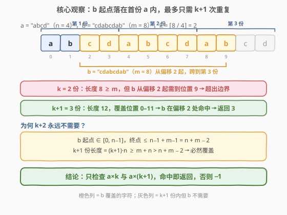
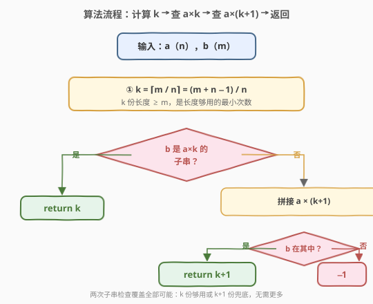
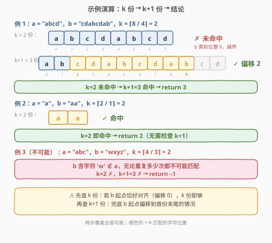

# 重复叠加字符串匹配

- **题目名称**：重复叠加字符串匹配
- **链接**：[686. 重复叠加字符串匹配](https://leetcode.cn/problems/repeated-string-match/)
- **难度**：中等
- **标签**：字符串、字符串匹配

## 1. 题目概述

给定两个字符串 `a` 和 `b`，求**最少**需要将 `a` 重复多少次，才能使 `b` 成为重复后字符串的**子串**。如果无论重复多少次都不可能，返回 $-1$。

**示例 1**：

```text
输入：a = "abcd", b = "cdabcdab"
输出：3
解释："abcd" 重复 3 次得到 "abcdabcdabcd"，其中 "cdabcdab" 是子串（从偏移 2 开始）。
      重复 2 次得到 "abcdabcd"（长度 8），b 从偏移 2 起需要到位置 9，超出边界。
```

**示例 2**：

```text
输入：a = "a", b = "aa"
输出：2
解释："a" 重复 2 次 = "aa"，恰好等于 b。
```

**示例 3**：

```text
输入：a = "a", b = "a"
输出：1
解释："a" 重复 1 次即为 "a"，包含 b。
```

**示例 4**：

```text
输入：a = "abc", b = "wxyz"
输出：-1
解释：b 含字符 'w' 不在 a 中，无论重复多少次都不可能匹配。
```

**约束条件**：

- $1 \leq \text{a.length}, \text{b.length} \leq 10^4$
- `a` 和 `b` 由小写英文字母组成

> 💡 本题问的是「最少重复几次让 `b` 成为子串」，核心在于确定**重复次数的上界**——只要知道最多检查几次就够了，无需无限重复。

---

## 2. 解题思路

### 2.1 暴力思路：逐次递增重复

最直观的做法：从 $1$ 次开始，每次多重复一份 `a`，检查 `b` 是否为子串。问题在于**何时停止**——重复太少不够长，太多又浪费。

一个粗略的上界：重复到字符串长度超过 $|b| + |a|$ 时即可停止（因为 `b` 的起点最多在第一份 `a` 的末尾，再多一份必然覆盖）。这样最多检查 $\lceil m / n \rceil + 1$ 次，每次做一次子串搜索。时间复杂度 $O(k \cdot L \cdot m)$，其中 $k = \lceil m/n \rceil$、$L$ 为重复串长度——最坏约 $O(m^2 / n)$，能过但做了大量冗余检查。

> ⚠️ 暴力法的浪费在于：它从头逐次递增，却没意识到**少于 $k$ 份时长度根本不够**，而**多于 $k+1$ 份时又必然冗余**。真正需要检查的只有 $k$ 和 $k+1$ 两个值。

### 2.2 核心观察：只需检查 k 和 k+1 次



设 $n = |a|$，$m = |b|$，$k = \lceil m / n \rceil$（让重复串长度 $\geq m$ 的最小次数）。关键观察分三步：

**① 少于 $k$ 次不可能**：$k - 1$ 份长度 $= (k-1) \cdot n < m$（由 $k$ 的定义），字符串比 `b` 还短，`b` 不可能是子串。

**② $k+1$ 次必然足够**（如果 `b` 能匹配的话）：`b` 在重复串中的**起点**一定落在某一份 `a` 内，即偏移 $\in [0, n-1]$。起点最大为 $n-1$，终点最大为 $n - 1 + m - 1 = n + m - 2$。而 $k+1$ 份长度 $= (k+1) \cdot n \geq m + n > n + m - 2$，**必然覆盖** `b` 的整个跨度。

**③ $k+2$ 次永远不需要**：由 ②，$k+1$ 份已经覆盖了 `b` 的最大可能跨度，再多一份纯属浪费。

因此只需检查两个候选值：

> 计算 $k = \lceil m / n \rceil$，先查 $a \times k$ 是否包含 `b`，再查 $a \times (k+1)$。命中即返回对应次数，均未命中返回 $-1$。

> 💡 **不可能的情况**：当 `b` 含有 `a` 中不存在的字符时，无论重复多少次都无法匹配，两次检查自然都会失败 → 返回 $-1$。无需额外预处理。

### 2.3 算法流程图



**完整步骤**：

1. **计算 $k$**：$k = \lceil m / n \rceil = (m + n - 1) / n$（整数除法实现上取整）。
2. **检查 $k$ 份**：拼接 $a \times k$，若 `b` 是其子串 → 返回 $k$。
3. **检查 $k+1$ 份**：再拼一份 $a$（共 $k+1$ 份），若 `b` 是其子串 → 返回 $k + 1$。
4. **返回 $-1$**：两次均未命中。

### 2.4 示例演算



以 `a = "abcd"`，`b = "cdabcdab"` 为例（$n = 4$，$m = 8$，$k = \lceil 8/4 \rceil = 2$）：

| 步骤 | 重复串 | 长度 | `b` 是否子串 | 原因 |
|------|--------|------|-------------|------|
| 查 $k=2$ 份 | `abcdabcd` | 8 | ✗ 未命中 | `b` 从偏移 2 起需到位置 9，越界 |
| 查 $k+1=3$ 份 | `abcdabcdabcd` | 12 | ✓ 命中 | 偏移 2 处 `cdabcdab` 完整匹配 |

$k=2$ 未命中 → $k+1=3$ 命中 → 返回 **3**。

**反例**（不可能）：`a = "abc"`，`b = "wxyz"`，$k = \lceil 4/3 \rceil = 2$。`b` 含 `'w'` 不在 `a` 中 → $k=2$ ✗，$k+1=3$ ✗ → 返回 $-1$。

---

## 3. 参考代码

### C++（拼接 + find）

```cpp
class Solution {
  public:
    int repeatedStringMatch(string a, string b) {
        int n = a.size(), m = b.size();
        int k = (m + n - 1) / n;                       // ⌈m / n⌉
        string rep;
        for (int i = 0; i < k; i++) rep += a;           // 拼出 k 份
        if (rep.find(b) != string::npos) return k;      // k 份即命中
        rep += a;                                       // 再拼一份 → k+1 份
        if (rep.find(b) != string::npos) return k + 1;  // k+1 份命中
        return -1;                                      // 不可能匹配
    }
};
```

### Python（拼接 + in）

```python
class Solution:
    def repeatedStringMatch(self, a: str, b: str) -> int:
        n, m = len(a), len(b)
        k = (m + n - 1) // n                            # ⌈m / n⌉
        if b in a * k:                                  # k 份即命中
            return k
        if b in a * (k + 1):                            # k+1 份命中
            return k + 1
        return -1                                       # 不可能匹配
```

> 💡 Python 的 `a * k` 直接生成重复串，`b in s` 底层使用 Crochemore–Perrin 两路比较算法，最坏 $O(|s| + |b|)$；C++ 的 `string::find` 标准未规定最坏复杂度，主流实现在良性输入下近线性。本题 $n, m \leq 10^4$，两种语言都轻松通过。

---

## 4. 复杂度分析

| 维度 | 复杂度 | 说明 |
|------|--------|------|
| 时间复杂度 | $O(n + m)$ ~ $O((n+m) \cdot m)$ | 拼接 $k+1$ 份 $O(n+m)$；`find`/`in` 最坏 $O((n+m) \cdot m)$（朴素匹配），Python `in` 为 $O(n+m)$ |
| 空间复杂度 | $O(n + m)$ | 重复串长度 $(k+1) \cdot n \leq m + n$ |

> 💡 重复串长度 $(k+1) \cdot n \leq (\lceil m/n \rceil + 1) \cdot n \leq m + n$，所以拼接和搜索的规模均为 $O(n + m)$。C++ 若追求严格 $O(n+m)$ 最坏保证，可用第 5 节的 KMP 版本。

---

## 5. 扩展：KMP 严格 $O(n+m)$

当数据量更大或追求最坏复杂度保证时，可以用 KMP 在**虚拟重复串**上搜索 `b`，无需显式拼接整个字符串——通过下标取模 `a[i % n]` 访问第 $i$ 个字符。

```cpp
class Solution {
  public:
    int repeatedStringMatch(string a, string b) {
        int n = a.size(), m = b.size();
        // 构建 b 的 LPS 表
        vector<int> lps(m, 0);
        for (int i = 1, j = 0; i < m; ++i) {
            while (j > 0 && b[i] != b[j]) j = lps[j - 1];
            if (b[i] == b[j]) ++j;
            lps[i] = j;
        }
        // 在虚拟 a×(k+1) 上跑 KMP
        int k = (m + n - 1) / n;
        int limit = (k + 1) * n;
        for (int i = 0, j = 0; i < limit; ++i) {
            char c = a[i % n];                         // 虚拟访问，不拼接
            while (j > 0 && c != b[j]) j = lps[j - 1];
            if (c == b[j]) ++j;
            if (j == m) {
                int start = i - m + 1;                 // b 在虚拟串中的起点
                return (start + m + n - 1) / n;        // ⌈(start + m) / n⌉
            }
        }
        return -1;
    }
};
```

```python
class Solution:
    def repeatedStringMatch(self, a: str, b: str) -> int:
        n, m = len(a), len(b)
        lps = [0] * m
        j = 0
        for i in range(1, m):
            while j > 0 and b[i] != b[j]:
                j = lps[j - 1]
            if b[i] == b[j]:
                j += 1
            lps[i] = j
        k = (m + n - 1) // n
        limit = (k + 1) * n
        j = 0
        for i in range(limit):
            c = a[i % n]
            while j > 0 and c != b[j]:
                j = lps[j - 1]
            if c == b[j]:
                j += 1
            if j == m:
                start = i - m + 1
                return (start + m + n - 1) // n
        return -1
```

> 💡 KMP 版本的核心技巧是**取模访问** `a[i % n]`，把 $O(n+m)$ 空间的重复串压缩为 $O(1)$ 额外空间（仅 LPS 表 $O(m)$）。命中后由起点 `start` 反推所需份数 $\lceil (\text{start} + m) / n \rceil$，第一次命中即给出最小值——因为更小的 `start` 对应更少的份数。LPS 表构建与匹配模板与 [28. 找出字符串中第一个匹配项的下标](../0001-0100/28_找出字符串中第一个匹配项的下标.md) 完全一致。

---

## 6. 面试要点

1. **为什么只需检查 $k$ 和 $k+1$ 两次？**

   - 少于 $k$ 份时，重复串长度 $< m$，`b` 不可能放下。$k+1$ 份时，长度 $\geq m + n$，而 `b` 起点最多在偏移 $n-1$、终点最多 $n+m-2 < m+n$，必然被覆盖。所以 $k+1$ 份是充分上界，$k+2$ 永远多余。

2. **什么时候返回 $-1$？**

   - `b` 含有 `a` 中不存在的字符时，无论重复多少次都无法匹配。两次 `find`/`in` 检查都会失败，自然返回 $-1$，无需提前预处理字符集。

3. **$k$ 份命中时为什么 $k$ 就是最小值？**

   - $k-1$ 份长度 $< m$（由 $k = \lceil m/n \rceil$ 的定义），`b` 不可能放入更短的串。所以 $k$ 份命中即为最小重复次数。

4. **KMP 取模访问版的返回值怎么算？**

   - KMP 在虚拟串（长度 $(k+1) \cdot n$）上找到 `b` 的首次出现，起点为 `start`。所需份数 $= \lceil (\text{start} + m) / n \rceil$——即覆盖 `b` 从 `start` 到 `start + m - 1` 所需的 `a` 的份数。首次出现对应最小 `start`，从而给出最小份数。

5. **拼接法和 KMP 法怎么选？**

   - 数据量 $\leq 10^4$ 时拼接法简洁直观，代码量少，是面试首选。若面试官追问最坏复杂度或数据量更大（如 $10^5$），再上 KMP 取模版，展示对字符串匹配底层结构的理解。两者思路同源——都是「确定上界 + 在上界内搜索」。

---

## 7. 同类练习题

- [28. 找出字符串中第一个匹配项的下标](https://leetcode.cn/problems/find-the-index-of-the-first-occurrence-in-a-string/)（[题解](../0001-0100/28_找出字符串中第一个匹配项的下标.md)）：KMP 与 LPS 表的母题，本题扩展方法的模板来源
- [459. 重复的子字符串](https://leetcode.cn/problems/repeated-substring-pattern/)（[题解](../0401-0500/459_重复的子字符串.md)）：字符串周期性与 LPS 表，与本题「重复」主题一脉相承
- [796. 旋转字符串](https://leetcode.cn/problems/rotate-string/)：判断 `goal` 是否为 `s` 的循环移位，等价于 `goal in s+s`，与本题拼接法同源
- [214. 最短回文串](https://leetcode.cn/problems/shortest-palindrome/)（[题解](../0201-0300/214_最短回文串.md)）：KMP LPS 表的另一妙用，求最长回文前缀
- [1392. 最长快乐前缀](https://leetcode.cn/problems/longest-happy-prefix/)：$\text{lps}[n-1]$ 即为所求，LPS 表的「开箱即用」场景
