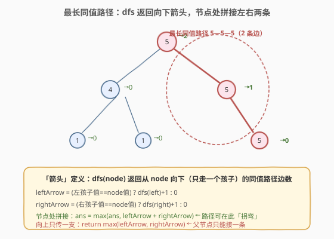
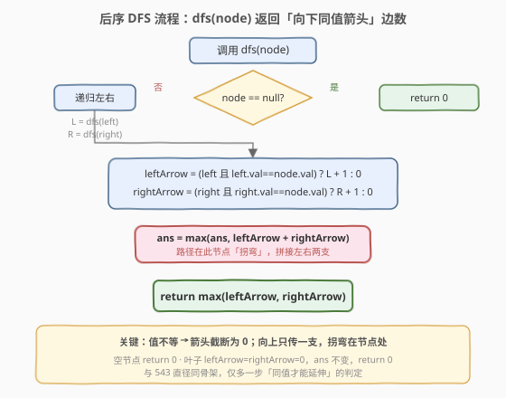
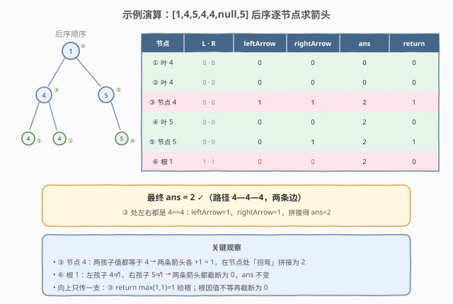

# 最长同值路径

- **题目名称**：最长同值路径
- **链接**：[687. 最长同值路径](https://leetcode.cn/problems/longest-univalue-path/)
- **难度**：中等
- **标签**：树、二叉树、深度优先搜索、后序遍历、树形 DP

## 1. 题目概述

给定一棵二叉树的根节点 `root`，返回这棵树中**最长同值路径**的长度。

> **同值路径**：路径上**每个节点的值都相同**。路径是一条节点序列，序列中相邻节点由边连接，且同一节点在序列中只出现一次。路径**可以经过也可以不经过根节点**。路径长度 = 路径上的**边数**。

**示例 1**：

```text
输入：root = [5,4,5,1,1,null,5]
输出：2

            5
           / \
         4   5
        / \   \
       1   1   5
```

最长同值路径为 `5 → 5 → 5`（根 → 右孩子 → 右叶子），共 **2 条边**。

**示例 2**：

```text
输入：root = [1,4,5,4,4,null,5]
输出：2

            1
           / \
         4   5
        / \   \
       4   4   5
```

最长同值路径为 `4 → 4 → 4`（左子树的左叶子 → 左子树根 → 左子树的右叶子），共 **2 条边**。注意路径在值为 4 的节点处「拐弯」。

**示例 3**：

```text
输入：root = []
输出：0
```

**约束条件**：

- 树中节点数目范围 `[0, 4 * 10^4]`
- `-1000 <= Node.val <= 1000`
- 树的深度不超过 `1000`

> 💡 本题是 [543. 二叉树的直径](https://leetcode.cn/problems/diameter-of-binary-tree/) 的「同值约束版」——同样是「后序 DFS + 在节点处拼接左右两支、向上只传一支」的树形 DP 模板，区别仅在于：**只有父子节点值相等时，路径才能跨边延伸**，否则箭头截断为 0。

---

## 2. 解题思路

### 2.1 暴力思路：枚举每个节点作为路径最高点

最直观的做法：遍历每个节点，把它视作同值路径的「最高点」（路径在此拐弯），分别向左右两侧延伸，只要孩子值等于当前节点值就继续走并累计边数。每个节点做一次 $O(h)$ 的双向延伸，总时间 $O(n \cdot h)$，最坏退化链状时 $O(n^2)$；空间 $O(h)$ 递归栈。能过数据较弱的用例，但**完全没利用「子树同值箭头长度可复用」的性质**——父节点向左延伸时，已经把左子树的最长同值链算了一遍，却被白白丢弃。

### 2.2 核心观察：后序传递「向下箭头」，节点处拼接拐弯



**关键洞察**：定义 `dfs(node)` 返回**从 `node` 出发、向下（只经过一个孩子方向）的同值路径的最大边数**——称为「**箭头**」（arrow）。它具有最优子结构：

> 以 `node` 为根的向下同值箭头 = $\max(\text{leftArrow}, \text{rightArrow})$，其中
> $\text{leftArrow} = \begin{cases} \text{dfs}(\text{left}) + 1, & \text{left 存在且 } \text{left.val} = \text{node.val} \\ 0, & \text{否则} \end{cases}$，$\text{rightArrow}$ 同理。

而**真正要求的最长同值路径**（可在某节点处拐弯）就是：在遍历每个节点时，把它的 `leftArrow + rightArrow` 拼起来——这恰好是一条「左下行 + 右下行」、以该节点为最高点的同值路径。取所有节点处拼接值的最大值即为答案。

> ⚠️ **两个易错点**：
> 1. **值不等就截断为 0**：`leftArrow` 不是 `dfs(left)`，而是「仅当 `left.val == node.val` 时才等于 `dfs(left)+1`，否则 0」。这是本题与 543 直径唯一的本质区别。
> 2. **向上只传一支，拐弯留在节点处**：`dfs` 返回 `max(leftArrow, rightArrow)`（父节点只能接一条往下走），而 `leftArrow + rightArrow` 只用于更新全局答案，不向上传递——否则会变成「分叉路径」，违反路径不能分叉的定义。这与 124/543 一脉相承。

### 2.3 算法流程图



**DFS 完整步骤**（函数 `dfs(node)` 返回 `int`，全局变量 `ans` 记录答案）：

1. **空节点**：返回 `0`（空子树无箭头）；
2. **递归左右**：`L = dfs(node.left)`，`R = dfs(node.right)`；
3. **计算箭头**：
   - `leftArrow = (node.left 且 node.left.val == node.val) ? L + 1 : 0`；
   - `rightArrow = (node.right 且 node.right.val == node.val) ? R + 1 : 0`；
4. **更新答案**：`ans = max(ans, leftArrow + rightArrow)`（路径在此节点拐弯）；
5. **返回**：`return max(leftArrow, rightArrow)`（向上只传一支）。

> 💡 **叶子节点**：左右孩子都为空，`leftArrow = rightArrow = 0`，`ans` 不变，返回 `0`——天然基底，无需特判。这与 [250. 统计同值子树](../0201-0300/250_统计同值子树.md) 中「叶子天然同值」的基底思想一致。

### 2.4 示例演算

以 `root = [1,4,5,4,4,null,5]`（示例 2）为例，后序遍历顺序与箭头计算过程：



| 后序访问节点 | L · R | leftArrow | rightArrow | ans 更新 | return |
|-------------|-------|-----------|------------|---------|--------|
| ① 叶 4（左下左） | 0 · 0 | 0 | 0 | 0 | 0 |
| ② 叶 4（左下右） | 0 · 0 | 0 | 0 | 0 | 0 |
| ③ 节点 4（左子） | 0 · 0 | **1** | **1** | **max(0, 1+1)=2** | 1 |
| ④ 叶 5（右下） | 0 · 0 | 0 | 0 | 2 | 0 |
| ⑤ 节点 5（右子） | 0 · 0 | 0 | 1 | 2 | 1 |
| ⑥ 根 1 | 1 · 1 | 0 | 0 | 2 | 0 |

最终 `ans = 2` ✓。关键在 **③**：节点 4 的两个孩子值都是 4，与自身相等，于是 `leftArrow = 0+1 = 1`、`rightArrow = 0+1 = 1`，拼接得 `1+1 = 2`，即 `4 → 4 → 4` 这条拐弯路径。而 **⑥** 根节点值为 1，左右孩子分别是 4 和 5，都不等于 1，两条箭头都被截断为 0，无法形成跨根的同值路径。

> 💡 **观察「向上只传一支」的必要性**：③ 返回 `max(1,1) = 1` 给根 ⑥。若返回 `1+1 = 2`，根 ⑥ 即便值不等也会拿到一个错误的「向下箭头 2」，导致更上层答案被污染——因为父节点只能接一条边继续延伸，不能同时接两条分叉。

---

## 3. 参考代码

### C++

```cpp
class Solution {
  public:
    int ans = 0;

    int longestUnivaluePath(TreeNode* root) {
        dfs(root);
        return ans;
    }

    int dfs(TreeNode* node) {
        if (!node) return 0;                       // 空节点：无箭头
        int L = dfs(node->left);                   // 后序：先递归左右
        int R = dfs(node->right);
        int leftArrow  = (node->left  && node->left->val  == node->val) ? L + 1 : 0;
        int rightArrow = (node->right && node->right->val == node->val) ? R + 1 : 0;
        ans = max(ans, leftArrow + rightArrow);    // 在此节点拐弯拼接
        return max(leftArrow, rightArrow);         // 向上只传一支
    }
};
```

### Python

```python
class Solution:
    def longestUnivaluePath(self, root: Optional[TreeNode]) -> int:
        ans = 0

        def dfs(node: Optional[TreeNode]) -> int:
            nonlocal ans
            if not node:
                return 0                        # 空节点：无箭头
            L = dfs(node.left)                   # 后序：先递归左右
            R = dfs(node.right)
            left_arrow  = (L + 1) if (node.left  and node.left.val  == node.val) else 0
            right_arrow = (R + 1) if (node.right and node.right.val == node.val) else 0
            ans = max(ans, left_arrow + right_arrow)  # 在此节点拐弯拼接
            return max(left_arrow, right_arrow)       # 向上只传一支

        dfs(root)
        return ans
```

> 💡 两版等价。把 543 直径的代码拿过来，在「由子树深度合成箭头」处加一道 `val == child.val` 判定即得本题——这就是「同值约束版」的全部增量。

---

## 4. 复杂度分析

| 维度 | 复杂度 | 说明 |
|------|--------|------|
| 时间复杂度 | $O(n)$ | 每个节点只访问一次，每次做 $O(1)$ 比较 |
| 空间复杂度 | $O(h)$ | 递归栈深度 = 树高 $h$；平衡树 $O(\log n)$，退化链状 $O(n)$ |
| 最坏情况 | $O(n)$ 空间 | 树退化为单侧链时递归深度达 $n$（受题目「深度不超过 1000」约束，实际不会爆栈） |

> ⚠️ 暴力法 $O(n \cdot h)$ 的浪费在于：从某节点向孩子延伸同值链时已遍历过子树，但结果被丢弃，父节点又要重新延伸。后序传递法把「子树最长同值向下链」压缩成一个整数（箭头长度）向上传递，父节点直接读取孩子的箭头再加 1，避免重复扫描——这与 [124. 二叉树中的最大路径和](../0101-0200/124_二叉树中的最大路径和.md)「传递子树最大贡献」是同一种树形 DP 思想。

---

## 5. 扩展：与 543/124 的模板对照

本题、543（直径）、124（最大路径和）共享同一套「**后序 DFS + 返回值传递 + 节点处拼接**」骨架，只是「延伸条件」与「聚合运算」不同：

| 题目 | dfs 返回值 | 延伸条件 | 节点处聚合 |
|------|-----------|---------|-----------|
| 543 二叉树的直径 | 子树最大深度 | 无条件延伸 | `max(ans, L + R)` |
| 124 最大路径和 | 子树最大贡献（负则截 0） | 贡献为正才延伸 | `max(ans, L + R + node.val)` |
| **687 最长同值路径** | 向下同值箭头边数 | **父子值相等才延伸** | `max(ans, leftArrow + rightArrow)` |

掌握这一模板后，[549. 二叉树中最长连续序列](https://leetcode.cn/problems/binary-tree-longest-consecutive-sequence-ii/)（连续序列可上可下）、[298. 二叉树最长连续序列](../0201-0300/298_二叉树最长连续序列.md)（父→子递增）都是同一骨架换延伸条件的变体。

---

## 6. 面试要点

1. **为什么用后序遍历？**

   > 节点的「向下同值箭头长度」依赖其子树的箭头长度——只有先递归左右拿到 `L`、`R`，才能判定 `leftArrow = (val 相等) ? L+1 : 0`。这是典型的「子问题结果决定父问题」结构，对应后序（左右根）。前序/中序在处理父节点时尚未获取子树信息，无法一次遍历完成。

2. **`dfs` 的返回值为什么不是 `leftArrow + rightArrow`？**

   > 返回值代表「**向上供父节点接续使用的单支箭头**」。父节点只能从本节点向下走一个孩子方向，因此只能接一支，必须返回 `max(leftArrow, rightArrow)`。若返回 `leftArrow + rightArrow`，等于把一条「拐弯路径」当成「直线下行路径」传给父节点，父节点接续后会形成分叉，违反路径定义，且会污染更上层的答案。`leftArrow + rightArrow` 只在**当前节点**用于更新全局 `ans`，不向上传递。

3. **本题和 543 直径的差别究竟在哪？**

   > 仅多一道「**父子值相等才能延伸**」的判定。543 中 `leftDepth = L + 1` 无条件成立；本题改为 `leftArrow = (left.val == node.val) ? L + 1 : 0`，值不等即截断为 0。骨架（后序 + 返回单支 + 节点处拼接双支更新答案）完全一致。面试中先写 543 再「加约束」过渡到 687，是展示模板迁移能力的常见路径。

4. **空节点为什么返回 0？叶子节点会怎样？**

   > 空子树不含任何边，向下同值箭头边数为 0。叶子节点左右孩子都为空，`leftArrow = rightArrow = 0`，`ans = max(ans, 0) = 0` 不变，返回 `0`——天然基底，无需特判。这与「空树高度为 0」的约定一致。

5. **如果改为「最长同值路径的节点数」怎么改？**

   > 题目问的是**边数**，节点数 = 边数 + 1（路径非空时）。最简改法：最终返回 `ans + (1 if root else 0)`；或在节点处聚合时用 `leftArrow + rightArrow + 1` 记节点数、返回 `max(leftArrow, rightArrow) + 1`，最后答案减 1。注意统一口径，避免边数/节点数混用导致 off-by-one。

> 💡 **一句话总结**：687 的灵魂是「**后序传递单支同值箭头，节点处拼接双支更新答案**」——`dfs` 返回 `max(leftArrow, rightArrow)`，值不等则箭头截断为 0。它就是 543 直径模板加了「同值才能跨边」的约束，是「树形路径最值」家族的标准成员。

---

## 7. 同类练习题

- [543. 二叉树的直径](https://leetcode.cn/problems/diameter-of-binary-tree/)（[题解](../0501-0600/543_二叉树的直径.md)）：本题的母模板，后序传递子树深度、节点处拼接直径，去掉「同值」约束即得 543
- [124. 二叉树中的最大路径和](https://leetcode.cn/problems/binary-tree-maximum-path-sum/)（[题解](../0101-0200/124_二叉树中的最大路径和.md)）：同骨架换聚合为「路径和」，贡献为负则截 0，三题共享「后序 + 返回单支 + 节点拼接」模板
- [250. 统计同值子树](https://leetcode.cn/problems/count-univalue-subtrees/)（[题解](../0201-0300/250_统计同值子树.md)）：同值判定版，后序传递布尔「子树是否同值」，与本题的「同值箭头长度」互为表里——一个数数量、一个求最长
- [298. 二叉树最长连续序列](https://leetcode.cn/problems/binary-tree-longest-consecutive-sequence/)（[题解](../0201-0300/298_二叉树最长连续序列.md)）：父→子递增才延伸，同套后序骨架换延伸条件为 `child.val == node.val + 1`
- [549. 二叉树中最长连续序列 II](https://leetcode.cn/problems/binary-tree-longest-consecutive-sequence-ii/)：连续序列可上可下，需同时维护「递增」与「递减」两支箭头，是本题「双向延伸」的进阶变体
