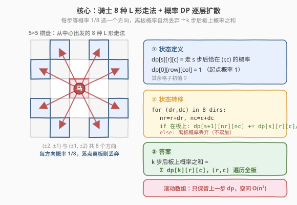
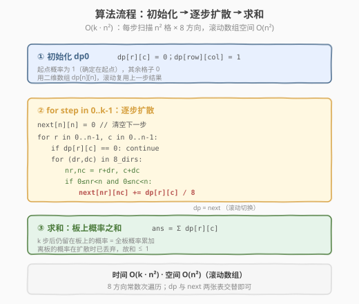
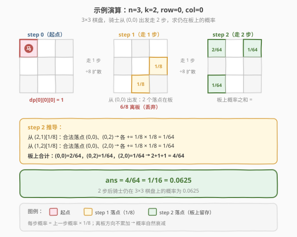

# 马在棋盘上的概率

- **题目名称**：马在棋盘上的概率
- **链接**：[688. 马在棋盘上的概率](https://leetcode.cn/problems/knight-probability-in-chessboard/)
- **难度**：中等
- **标签**：动态规划

## 1. 题目概述

已知一个 `n x n` 的国际象棋棋盘，一颗骑士（马）初始位于格子 `(row, column)`。骑士按国际象棋规则走「日」字形（L 形），每一步在 **8 个可能方向中等概率随机选择一个**（每个方向概率 $1/8$）。骑士连续走 `k` 步，一旦某一步走出棋盘则立刻停止移动（后续不再回到棋盘）。求骑士走完 `k` 步后**仍然留在棋盘上**的概率。

**示例 1**：

```text
输入：n = 3, k = 2, row = 0, column = 0
输出：0.0625
解释：两步后仍留在 3×3 棋盘上的概率为 1/16 = 0.0625。
```

**示例 2**：

```text
输入：n = 1, k = 0, row = 0, column = 0
输出：1.00000
解释：k=0 不走步，骑士必然在唯一的格子上，概率为 1。
```

**约束条件**：

- $1 \leq n \leq 25$
- $0 \leq k \leq 100$
- $0 \leq \text{row}, \text{column} \leq n - 1$

> 💡 骑士的 8 个方向为 $(\pm 2, \pm 1)$ 与 $(\pm 1, \pm 2)$。题目问的是**留板概率**，而每一步若走出棋盘则永久丢失——这天然对应一个「概率逐层扩散、离板即丢弃」的 DP 模型。

---

## 2. 解题思路

### 2.1 暴力思路：枚举所有 $8^k$ 条路径

最直观的做法：递归枚举骑士的每一步选择，共 $8^k$ 条路径。对每条路径判断是否全程留在棋盘上，统计合法路径数 $C$，则概率 $= C / 8^k$。

```text
dfs(step, r, c):
    if 走出棋盘: return 0      # 该路径离板，不计入
    if step == k: return 1     # 走完 k 步仍在板上，计入 1 条合法路径
    total = 0
    for d in 8_dirs:
        total += dfs(step+1, r+d.r, c+d.c)
    return total
ans = dfs(0, row, col) / 8^k
```

时间复杂度 $O(8^k)$。当 $k = 100$ 时 $8^{100} \approx 10^{90}$，**远远超时**。

> ⚠️ 暴力法的浪费在于：大量路径会**汇聚到同一中间状态** $(step, r, c)$，却各自重复计算。例如从 $(0,0)$ 出发走两步，$(0,0) \to (2,1) \to (0,0)$ 和 $(0,0) \to (1,2) \to (0,0)$ 都到达 $(step=2, r=0, c=0)$，后续完全相同。把「汇聚状态」的记忆化掉，指数复杂度就塌缩为多项式。

### 2.2 核心观察：概率 DP 逐层扩散



把「路径计数」换成「概率分布」：令 $\text{dp}[s][r][c]$ 表示**走 $s$ 步后骑士恰好位于 $(r, c)$ 的概率**。则：

- **初始状态**：$\text{dp}[0][\text{row}][\text{col}] = 1$（确定在起点），其余全 $0$。
- **状态转移**：对每个有概率的格子 $(r, c)$，把它携带的概率**均分 8 份**扩散到 8 个落点；落点离板的份额**直接丢弃**（不累加到任何状态），这正是「离板即停止」的体现。

$$
\text{dp}[s+1][r+\text{dr}][c+\text{dc}] \mathrel{+}= \frac{\text{dp}[s][r][c]}{8}, \quad (\text{dr},\text{dc}) \in \text{8\_dirs},\; (r+\text{dr}, c+\text{dc}) \text{ 在板上}
$$

- **答案**：$k$ 步后留在棋盘上的概率 $=$ 全板概率之和：

$$
\text{ans} = \sum_{(r,c) \in \text{board}} \text{dp}[k][r][c]
$$

> 💡 **为什么「丢弃离板概率」等价于「离板即停止」？** 题目规定走出棋盘后不再移动。在 DP 里，离板方向的 $1/8$ 概率不流入任何板上格子的下一步，等于这部分概率永久消失。最终板上概率之和 $\leq 1$，差额正是各步累计离板的概率。这与「球被吃掉就没了」是一回事——参见 [576. 出界的路径数](../0501-0600/576_出界的路径数.md) 的镜像问题（576 数出界路径数，688 算留板概率，互补）。

> ⚠️ **不能原地更新**：转移依赖的是「上一步」的整张分布。若在 $\text{dp}$ 自身上累加，会把同一步内已更新的值当作来源再次扩散，导致重复计数。必须用**两张表** `dp` 与 `next` 交替（滚动数组）。

### 2.3 算法流程图



**完整步骤**：

1. **初始化**：`dp` 为 $n \times n$ 的全 $0$ 表，`dp[row][column] = 1.0`。
2. **逐步扩散**：`for step in 0..k-1`：
   - 新建 `next` 全 $0$ 表；
   - 遍历每个 $(r, c)$，若 `dp[r][c] != 0`，则对 8 个方向计算落点 $(nr, nc)$，**落点在板上**则 `next[nr][nc] += dp[r][c] / 8`；
   - `dp = next`（滚动切换）。
3. **求和**：返回 `dp` 全板元素之和。

### 2.4 示例演算



以 `n = 3, k = 2, row = 0, column = 0` 为例：

| 步 | 板上概率分布 | 说明 |
|------|--------------|------|
| step 0 | $\text{dp}[0][0][0] = 1$ | 起点概率为 1 |
| step 1 | $\text{dp}[1][2][1] = 1/8$，$\text{dp}[1][1][2] = 1/8$ | 从 $(0,0)$ 出发 8 方向仅 2 个落点在板上，其余 6 方向离板（丢弃 $6/8$） |
| step 2 | $\text{dp}[2][0][0] = 2/64$，$\text{dp}[2][0][2] = 1/64$，$\text{dp}[2][2][0] = 1/64$ | 从 $(2,1)$ 与 $(1,2)$ 各扩散 $1/8 \times 1/8 = 1/64$ 到 2 个板上落点 |

板上概率之和 $= \dfrac{2 + 1 + 1}{64} = \dfrac{4}{64} = \dfrac{1}{16} = 0.0625$，与示例一致。

> 💡 **概率衰减的直觉**：每一步，棋盘边缘的格子只有少数落点在板上，大部分概率被「丢出界」。经过 $k$ 步，留板概率随 $k$ 增大迅速衰减。`n` 越大、起点越居中，衰减越慢。

---

## 3. 参考代码

### C++（滚动二维数组）

```cpp
// 马在棋盘上的概率.cpp —— 概率 DP + 滚动数组
// 编译: g++ -O2 -std=c++17 马在棋盘上的概率.cpp -o knight
#include <vector>
using namespace std;

class Solution {
    int dirs[8][2] = {{2,1},{2,-1},{-2,1},{-2,-1},{1,2},{1,-2},{-1,2},{-1,-2}};
  public:
    double knightProbability(int n, int k, int row, int column) {
        vector<vector<double>> dp(n, vector<double>(n, 0.0));
        dp[row][column] = 1.0;                        // ① 起点
        for (int step = 0; step < k; ++step) {        // ② 逐步扩散
            vector<vector<double>> nxt(n, vector<double>(n, 0.0));
            for (int r = 0; r < n; ++r) {
                for (int c = 0; c < n; ++c) {
                    if (dp[r][c] == 0.0) continue;    // 跳过无概率格子，剪枝
                    for (auto& d : dirs) {
                        int nr = r + d[0], nc = c + d[1];
                        if (nr >= 0 && nr < n && nc >= 0 && nc < n) {
                            nxt[nr][nc] += dp[r][c] / 8.0;   // 离板方向不累加
                        }
                    }
                }
            }
            dp = move(nxt);                           // 滚动切换
        }
        double ans = 0.0;                             // ③ 求和
        for (auto& r : dp) for (double v : r) ans += v;
        return ans;
    }
};
```

### Python

```python
class Solution:
    def knightProbability(self, n: int, k: int, row: int, column: int) -> float:
        dirs = [(2,1),(2,-1),(-2,1),(-2,-1),(1,2),(1,-2),(-1,2),(-1,-2)]
        dp = [[0.0] * n for _ in range(n)]
        dp[row][column] = 1.0                         # ① 起点
        for _ in range(k):                            # ② 逐步扩散
            nxt = [[0.0] * n for _ in range(n)]
            for r in range(n):
                for c in range(n):
                    if dp[r][c] == 0.0:
                        continue                      # 跳过无概率格子
                    for dr, dc in dirs:
                        nr, nc = r + dr, c + dc
                        if 0 <= nr < n and 0 <= nc < n:
                            nxt[nr][nc] += dp[r][c] / 8.0  # 离板方向不累加
            dp = nxt                                  # 滚动切换
        return sum(sum(r) for r in dp)                # ③ 求和
```

> 💡 **细节**：`k = 0` 时循环不执行，直接返回起点概率之和 $1.0$，与示例 2 一致。`n = 1` 时任何方向都离板，走一步后 `dp` 全 $0$，留板概率为 $0$。`if dp[r][c] == 0.0: continue` 是常数优化——前几步概率集中在少数格子，可大幅减少内层方向遍历。

---

## 4. 复杂度分析

| 维度 | 复杂度 | 说明 |
|------|--------|------|
| **时间复杂度** | $O(k \cdot n^2)$ | $k$ 步 × 每步扫 $n^2$ 格 × 每格 $8$ 方向（常数） |
| **空间复杂度** | $O(n^2)$ | 滚动数组只保留当前与下一步两张 $n \times n$ 表 |
| **最坏规模** | $k=100, n=25$ → 约 $6.25 \times 10^5$ 次方向处理 | 远低于时限，轻松通过 |

> ⚠️ 暴力 DFS 为 $O(8^k)$ 时间，$k=100$ 时完全不可行；DP 把「路径汇聚」的记忆化掉后，状态数仅 $O(k \cdot n^2)$，每状态 $O(8)$ 转移。这正是「指数 → 多项式」的典型塌缩。

---

## 5. 扩展：记忆化 DFS（自顶向下）

上面的迭代 DP 是「自底向上」按步推进。等价地，可写成**自顶向下**的记忆化 DFS：定义 $\text{dfs}(s, r, c)$ 为「从 $(r,c)$ 出发再走 $s$ 步仍留在板上的概率」，则答案即 $\text{dfs}(k, \text{row}, \text{col})$，无需最后求和。

$$
\text{dfs}(s, r, c) = \begin{cases} 1, & s = 0 \quad (\text{不再走，必在板上}) \\ \displaystyle\sum_{\substack{d \in \text{8\_dirs} \\ (r+d.r,\, c+d.c) \in \text{board}}} \frac{\text{dfs}(s-1, r+d.r, c+d.c)}{8}, & s > 0 \end{cases}
$$

```cpp
class Solution {
    int dirs[8][2] = {{2,1},{2,-1},{-2,1},{-2,-1},{1,2},{1,-2},{-1,2},{-1,-2}};
    vector<vector<vector<double>>> memo;
    int n;
  public:
    double knightProbability(int n, int k, int row, int column) {
        this->n = n;
        memo.assign(k + 1, vector<vector<double>>(n, vector<double>(n, -1.0)));
        return dfs(k, row, column);
    }
    double dfs(int s, int r, int c) {
        if (s == 0) return 1.0;                      // 不再走，必在板上
        if (memo[s][r][c] >= 0.0) return memo[s][r][c];
        double p = 0.0;
        for (auto& d : dirs) {
            int nr = r + d[0], nc = c + d[1];
            if (nr >= 0 && nr < n && nc >= 0 && nc < n) {
                p += dfs(s - 1, nr, nc) / 8.0;       // 离板方向不计入
            }
        }
        return memo[s][r][c] = p;
    }
};
```

```python
class Solution:
    def knightProbability(self, n: int, k: int, row: int, column: int) -> float:
        dirs = [(2,1),(2,-1),(-2,1),(-2,-1),(1,2),(1,-2),(-1,2),(-1,-2)]
        memo = [[[-1.0] * n for _ in range(n)] for _ in range(k + 1)]

        def dfs(s: int, r: int, c: int) -> float:
            if s == 0:
                return 1.0                           # 不再走，必在板上
            if memo[s][r][c] >= 0.0:
                return memo[s][r][c]
            p = 0.0
            for dr, dc in dirs:
                nr, nc = r + dr, c + dc
                if 0 <= nr < n and 0 <= nc < n:
                    p += dfs(s - 1, nr, nc) / 8.0    # 离板方向不计入
            memo[s][r][c] = p
            return p

        return dfs(k, row, column)
```

> 💡 **两种视角的对应**：迭代 DP 的 $\text{dp}[s][r][c]$ 是「走 $s$ 步**到达** $(r,c)$ 的概率」；记忆化 DFS 的 $\text{dfs}(s, r, c)$ 是「从 $(r,c)$ **再走** $s$ 步留板的概率」。前者由起点向前扩散，后者由终点向后回溯，状态转移互为转置。时间同为 $O(k \cdot n^2)$，但记忆化版空间为 $O(k \cdot n^2)$（需三维 memo），且递归栈深 $k$（$k \leq 100$ 安全）。

| 解法 | 时间 | 空间 | 思路 |
|------|------|------|------|
| 暴力 DFS | $O(8^k)$ | $O(k)$ | 枚举全部路径，超时 |
| **迭代 DP（滚动）** | $O(k \cdot n^2)$ | $O(n^2)$ | 自底向上逐层扩散，推荐 |
| 记忆化 DFS | $O(k \cdot n^2)$ | $O(k \cdot n^2)$ | 自顶向下回溯，思路直观 |

---

## 6. 面试要点

1. **为什么用概率 DP 而非路径计数？**

   - 路径计数要除以 $8^k$ 得概率，而 $8^{100}$ 无法用整型表示；直接用 `double` 携带概率扩散，每步除以 $8$，数值始终在 $[0, 1]$，避免大数运算。概率 DP 是本题最自然的建模。

2. **「离板即停止」如何在 DP 中体现？**

   - 转移时只把概率累加到**在板上的落点**，离板方向的 $1/8$ 份额不写入任何状态——等价于这部分概率永久消失。最终板上概率之和随步数递减，差额即累计离板概率。

3. **为什么必须用两张表（滚动数组）？**

   - 第 $s+1$ 步的分布只依赖第 $s$ 步的分布。若在 `dp` 自身上累加，同一步内已更新的格子会被当作来源再次扩散，产生重复计数。`next` 全新清零、计算完再 `dp = next` 才正确。

4. **`k = 0` 和 `n = 1` 的边界？**

   - `k = 0`：循环不执行，`dp` 仍只有起点为 $1$，求和得 $1.0$（不走步必在板上）。`n = 1`：任何骑士方向都越界，走一步后 `dp` 全 $0$，留板概率 $0$（除非 `k = 0`）。代码无需特判即可正确处理。

5. **迭代 DP 与记忆化 DFS 有何异同？**

   - 状态定义方向相反：迭代算「到达」概率，DFS 算「剩余步留板」概率，互为转置。复杂度同为 $O(k \cdot n^2)$。迭代用滚动数组空间 $O(n^2)$ 更优；DFS 思路更贴近自然递归定义，但需三维 memo、空间 $O(k \cdot n^2)$。面试中先讲迭代版，再提 DFS 作为思路对照。

> 💡 **一句话总结**：本题是「网格上多步随机游走 + 吸收边界」的概率 DP 招牌题——用 $\text{dp}[s][r][c]$ 携带概率逐层扩散，离板方向丢弃份额，$k$ 步后全板求和。它与 [576. 出界的路径数](../0501-0600/576_出界的路径数.md) 互为镜像（数出界 vs 算留板），共享同一套「网格扩散 DP」骨架。

---

## 7. 同类练习题

- [576. 出界的路径数](https://leetcode.cn/problems/out-of-boundary-moves/)（[题解](../0501-0600/576_出界的路径数.md)）：网格上走 k 步的路径计数 DP，与本题互为镜像——576 数出界路径数，688 算留板概率，转移结构完全同构
- [935. 骑士拨号](https://leetcode.cn/problems/knight-dialer/)：同样基于骑士 8 走法的 DP，但计数序列数而非算概率，巩固「骑士走法 + 逐层状态转移」模板
- [62. 不同路径](https://leetcode.cn/problems/unique-paths/)（[题解](../0001-0100/62_不同路径.md)）：网格 DP 入门，对照「每格状态由邻格转移」的基础范式
- [1197. 进击的骑士](https://leetcode.cn/problems/minimum-knight-moves/)：骑士走法的另一面——BFS 求最短步数，对照「骑士走法 + 搜索」的无权图最短路视角
