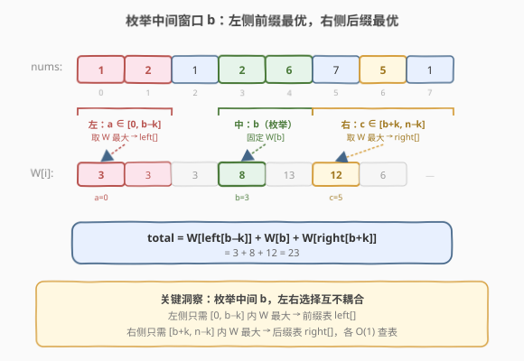
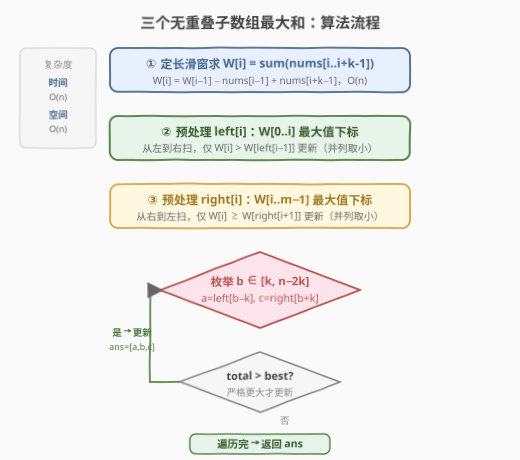
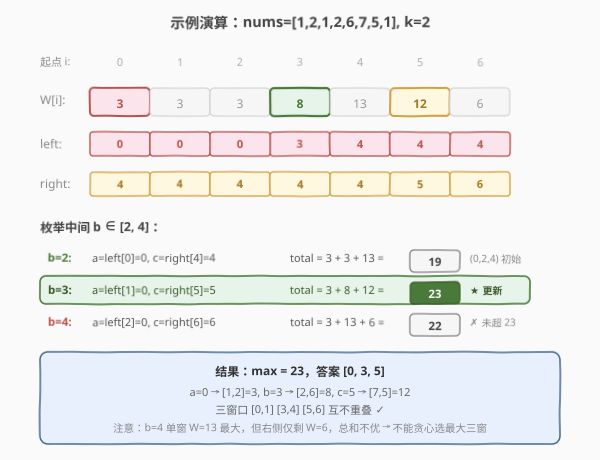

# 三个无重叠子数组的最大和

- **题目名称**：三个无重叠子数组的最大和
- **链接**：[689. 三个无重叠子数组的最大和](https://leetcode.cn/problems/maximum-sum-of-3-non-overlapping-subarrays/)
- **难度**：困难
- **标签**：数组、滑动窗口、动态规划

## 1. 题目概述

给定一个整数数组 `nums` 和一个整数 `k`，在数组中找出**三个长度为 $k$ 且互不重叠的子数组**，使它们的元素之和**最大**。返回一个长度为 3 的数组，表示这三个子数组的**起始下标**（按从左到右顺序）。若存在多组最优解，返回**字典序最小**的那一组。

**示例 1**：

```text
输入：nums = [1,2,1,2,6,7,5,1], k = 2
输出：[0,3,5]
解释：三个子数组为 [1,2]、[2,6]、[7,5]，和为 1+2 + 2+6 + 7+5 = 23，最大。
```

**示例 2**：

```text
输入：nums = [1,2,1,2,1,2,1,2,1], k = 2
输出：[0,2,4]
解释：三个子数组为 [1,2]、[1,2]、[1,2]，和为 3 + 3 + 3 = 9。
```

**约束条件**：

- $1 \leq \text{nums.length} \leq 2 \times 10^4$
- $1 \leq \text{nums[i]} < 2^{15}$
- $1 \leq k \leq \lfloor \text{nums.length} / 3 \rfloor$

> 💡 **关键约束**：三个子数组**长度都恰好为 $k$** 且**互不重叠**。这把问题从「任意选三个区间」收窄为「选三个起点 $a < b < c$，满足 $b \geq a+k$ 且 $c \geq b+k$」。固定长度意味着每个窗口的和可用定长滑窗 $O(1)$ 增量求得（承接 [643. 子数组最大平均数 I](../0601-0700/643_子数组最大平均数I.md) 的「一进一出」），三个窗口的选法则交给 DP 化的「前缀/后缀最优」预处理。

---

## 2. 解题思路

### 2.1 暴力思路：三重循环枚举起点

最直觉的做法：枚举三个起点 $a < b < c$，保证 $b \geq a+k$、$c \geq b+k$，对每组计算三个长度为 $k$ 的窗口之和，维护最大值。

```text
ans = -∞
for a in 0..n-k:
    for b in a+k..n-k:
        for c in b+k..n-k:
            total = sum(nums[a..a+k-1]) + sum(nums[b..b+k-1]) + sum(nums[c..c+k-1])
            ans = max(ans, total)
```

每个窗口求和 $O(k)$，三重循环 $O(n^3)$，总复杂度 $O(n^3 \cdot k)$。$n = 2 \times 10^4$ 时完全不可行。

> ⚠️ 暴力法的瓶颈有二：一是三重循环 $O(n^3)$，二是每次重新求窗口和 $O(k)$。破局思路分两步——先用定长滑窗把「求一个窗口和」降到 $O(1)$，再用「枚举中间窗口 + 左右最优预处理」把三重循环降到 $O(n)$。

### 2.2 核心观察：枚举中间窗口，左右各取最优

**第一步：预处理所有窗口和。** 设 $m = n - k + 1$ 为合法起点个数，定义窗口和数组 $W[i] = \sum_{j=i}^{i+k-1} \text{nums}[j]$（起点为 $i$ 的长度为 $k$ 的子数组和）。用定长滑窗可在 $O(n)$ 内求出全部 $W[i]$：

$$W[i] = W[i-1] - \text{nums}[i-1] + \text{nums}[i+k-1]$$

**第二步：固定中间窗口，左右各取最优。** 三个不重叠窗口的起点 $a < b < c$ 满足 $a+k \leq b$、$b+k \leq c$。若**枚举中间窗口起点 $b$**，则：

- 左窗口起点 $a \in [0,\, b-k]$：要使总和最大，应取该范围内 $W[a]$ 最大的那个起点；
- 右窗口起点 $c \in [b+k,\, n-k]$：同理取该范围内 $W[c]$ 最大的起点。



于是问题转化为：**对每个位置，快速查询其左侧（或右侧）某段区间内 $W$ 的最大值及其下标。** 这是经典的「前缀最大值 / 后缀最大值」预处理：

- $\text{left}[i]$：在 $W[0..i]$ 中 $W$ 值最大的起点下标（并列取更小下标，保证字典序最小）；
- $\text{right}[i]$：在 $W[i..m-1]$ 中 $W$ 值最大的起点下标（并列取更小下标）。

两者均可 $O(m)$ 一次扫描预处理得到。

> 💡 **为什么枚举中间而不是枚举左或右？** 枚举中间窗口 $b$ 时，左、右两侧各自**独立**取最优——左右选择互不影响（只要各自不与中间重叠）。这正是「枚举中间，两侧预处理」能将三重循环降到 $O(n)$ 的关键：中间一个 $O(n)$ 循环，每次 $O(1)$ 查左右最优。若枚举左窗口，则右侧还剩两个窗口要选，需再嵌套一层预处理，思路更绕。

> ⚠️ **字典序最小的处理**：题目要求多组最优解时返回字典序最小的 $(a, b, c)$。处理技巧——预处理时并列取**更小下标**；枚举 $b$ 从小到大，**仅在总和严格更大时才更新答案**。这样同等总和下，先出现的（$b$ 更小的）被保留，配合 `left`/`right` 取更小下标，自然得到字典序最小解。

### 2.3 算法流程图



**完整步骤**：

1. **求窗口和** $W[0..m-1]$：首窗 $O(k)$ 求和，随后定长滑窗增量更新，$O(n)$。
2. **预处理 `left`**：从左到右扫描，$\text{left}[i]$ 记录 $W[0..i]$ 中最大值的下标，仅当 $W[i] > W[\text{left}[i-1]]$ 才更新（并列保留更小下标）。
3. **预处理 `right`**：从右到左扫描，$\text{right}[i]$ 记录 $W[i..m-1]$ 中最大值的下标，仅当 $W[i] \geq W[\text{right}[i+1]]$ 才更新（并列保留更小下标）。
4. **枚举中间窗口** $b \in [k,\, n-2k]$：
   - $a = \text{left}[b-k]$，$c = \text{right}[b+k]$；
   - $\text{total} = W[a] + W[b] + W[c]$；
   - 若 $\text{total} > \text{best}$，更新 $\text{best}$ 与答案 $[a, b, c]$。
5. **返回** $[a, b, c]$。

> 💡 **中间窗口 $b$ 的范围**：$b$ 至少为 $k$（保证左侧能放一个起点 $\geq 0$ 的窗口，即 $b - k \geq 0$）；$b$ 至多为 $n-2k$（保证右侧能放一个终点 $\leq n-1$ 的窗口，即 $b + k \leq n - k$）。故 $b \in [k,\, n-2k]$。

### 2.4 示例演算

以 `nums = [1,2,1,2,6,7,5,1], k = 2` 为例（$n=8$，$m=7$，合法起点 $0..6$）：



**第一步：窗口和 $W$**（定长滑窗，$k=2$）：

| 起点 $i$ | 0 | 1 | 2 | 3 | 4 | 5 | 6 |
|----------|---|---|---|---|---|---|---|
| 窗口元素 | 1,2 | 2,1 | 1,2 | 2,6 | 6,7 | 7,5 | 5,1 |
| $W[i]$ | 3 | 3 | 3 | 8 | **13** | 12 | 6 |

**第二步：`left`（$W[0..i]$ 最大下标，并列取小）**：

| $i$ | 0 | 1 | 2 | 3 | 4 | 5 | 6 |
|-----|---|---|---|---|---|---|---|
| `left[i]` | 0 | 0 | 0 | 3 | **4** | 4 | 4 |

**第三步：`right`（$W[i..6]$ 最大下标，并列取小）**：

| $i$ | 0 | 1 | 2 | 3 | 4 | 5 | 6 |
|-----|---|---|---|---|---|---|---|
| `right[i]` | 4 | 4 | 4 | 4 | **4** | 5 | 6 |

**第四步：枚举中间 $b \in [2, 4]$**：

| $b$ | $a=\text{left}[b-2]$ | $W[a]$ | $W[b]$ | $c=\text{right}[b+2]$ | $W[c]$ | 总和 | 字典序 $(a,b,c)$ | 是否更新 |
|-----|----------------------|--------|--------|------------------------|--------|------|-------------------|----------|
| 2 | left[0]=0 | 3 | 3 | right[4]=4 | 13 | 19 | (0,2,4) | 初始 best |
| 3 | left[1]=0 | 3 | 8 | right[5]=5 | 12 | **23** | (0,3,5) | ✓ 严格更大 |
| 4 | left[2]=0 | 3 | 13 | right[6]=6 | 6 | 22 | (0,4,6) | ✗ |

**结果**：最大总和 $23$，答案 $[0, 3, 5]$。

验证：$a=0 \to [1,2]$（和 3），$b=3 \to [2,6]$（和 8），$c=5 \to [7,5]$（和 12），三者不重叠，总和 $3+8+12=23$ ✓。

> 💡 **观察**：中间窗口 $b=4$（$W=13$，单个窗口最大）反而总和不最优——因为右窗口只剩起点 6（$W=6$）可选，拖累了总和。这印证了「不能贪心选最大的三个窗口」——它们可能互相重叠或挤占空间，必须用 DP 统筹三者位置。

---

## 3. 参考代码

### C++

```cpp
// 三个无重叠子数组的最大和.cpp —— 定长滑窗 + 前缀/后缀最优
// 编译: g++ -O2 -std=c++17 三个无重叠子数组的最大和.cpp -o maxsum3
#include <vector>
#include <numeric>
using namespace std;

class Solution {
  public:
    vector<int> maxSumOfThreeSubarrays(vector<int>& nums, int k) {
        int n = nums.size();
        int m = n - k + 1;                       // 合法起点个数
        // ① 求窗口和 W[i] = sum(nums[i..i+k-1])
        vector<int> W(m);
        W[0] = accumulate(nums.begin(), nums.begin() + k, 0);
        for (int i = 1; i < m; ++i)
            W[i] = W[i - 1] - nums[i - 1] + nums[i + k - 1];   // 增量：一进一出

        // ② left[i] = W[0..i] 最大值下标（并列取小）
        vector<int> left(m);
        left[0] = 0;
        for (int i = 1; i < m; ++i)
            left[i] = (W[i] > W[left[i - 1]]) ? i : left[i - 1];

        // ③ right[i] = W[i..m-1] 最大值下标（并列取小）
        vector<int> right(m);
        right[m - 1] = m - 1;
        for (int i = m - 2; i >= 0; --i)
            right[i] = (W[i] >= W[right[i + 1]]) ? i : right[i + 1];

        // ④ 枚举中间窗口 b，取左右最优
        vector<int> ans(3, 0);
        int best = -1;
        for (int b = k; b <= n - 2 * k; ++b) {
            int a = left[b - k];
            int c = right[b + k];
            int total = W[a] + W[b] + W[c];
            if (total > best) {                  // 严格更大才更新 → 字典序最小
                best = total;
                ans = {a, b, c};
            }
        }
        return ans;
    }
};
```

### Python

```python
class Solution:
    def maxSumOfThreeSubarrays(self, nums: list[int], k: int) -> list[int]:
        n = len(nums)
        m = n - k + 1                          # 合法起点个数
        # ① 求窗口和 W[i] = sum(nums[i..i+k-1])
        W = [0] * m
        W[0] = sum(nums[:k])
        for i in range(1, m):
            W[i] = W[i - 1] - nums[i - 1] + nums[i + k - 1]   # 增量：一进一出

        # ② left[i] = W[0..i] 最大值下标（并列取小）
        left = [0] * m
        for i in range(1, m):
            left[i] = i if W[i] > W[left[i - 1]] else left[i - 1]

        # ③ right[i] = W[i..m-1] 最大值下标（并列取小）
        right = [0] * m
        right[m - 1] = m - 1
        for i in range(m - 2, -1, -1):
            right[i] = i if W[i] >= W[right[i + 1]] else right[i + 1]

        # ④ 枚举中间窗口 b，取左右最优
        best = -1
        ans = [0, 0, 0]
        for b in range(k, n - 2 * k + 1):
            a = left[b - k]
            c = right[b + k]
            total = W[a] + W[b] + W[c]
            if total > best:                   # 严格更大才更新 → 字典序最小
                best = total
                ans = [a, b, c]
        return ans
```

> 💡 **`left` 用严格大于 `>`、`right` 用大于等于 `>=` 的原因**：两者都从「保留更小下标」出发。`left` 从左往右扫，遇到并列值不更新即保留较小下标，故用 `>`；`right` 从右往左扫，遇到并列值要更新为更小的当前下标，故用 `>=`。方向不同，并列处理的方向相反，但效果一致——都让更小下标胜出。

---

## 4. 复杂度分析

| 维度 | 复杂度 | 说明 |
|------|--------|------|
| **时间复杂度** | $O(n)$ | 求窗口和 $O(n)$ + 预处理 `left`/`right` 各 $O(m)=O(n)$ + 枚举中间 $O(n-2k)=O(n)$，线性 |
| **空间复杂度** | $O(n)$ | $W$、`left`、`right` 三个长度 $m=n-k+1$ 的数组 |

> ⚠️ 本题 $n \leq 2 \times 10^4$，$O(n)$ 时间与 $O(n)$ 空间均宽裕。窗口和最大约 $k \cdot 2^{15} \approx 2 \times 10^4 \times 3.3 \times 10^4 \approx 6.6 \times 10^8$，三个窗口之和可达 $2 \times 10^9$ 量级，**接近 `int` 上界**（`INT_MAX ≈ 2.1 \times 10^9`）。Python 无溢出顾虑；C++ 用 `int` 在本题数据范围内安全，若题目放宽上界则应改用 `long long`。

---

## 5. 扩展：泛化为「$t$ 个不重叠子数组的最大和」

本题是 $t = 3$ 的特例。一般地，给定 $t$ 个长度为 $k$ 的不重叠子数组求最大和，可用**二维 DP**：

- 状态 $\text{dp}[i][j]$：前 $i$ 个元素中选出 $j$ 个不重叠窗口的最大和；
- 转移：$\text{dp}[i][j] = \max(\text{dp}[i-1][j],\ \text{dp}[i-k][j-1] + W[i-k])$，即位置 $i$ 处「不选」或「以 $i-k$ 为最后一窗的起点」；
- 答案回溯下标需记录决策。

复杂度 $O(n \cdot t)$。当 $t$ 为常数（如本题 $t=3$）时退化为 $O(n)$，与「枚举中间 + 前后缀最优」等价但更通用。本题 $t=3$ 固定，前后缀预处理法更直观、常数更小，是面试首选；若面试官追问「改成 $t$ 个怎么办」，则用此 DP 泛化。

---

## 6. 面试要点

1. **为什么枚举中间窗口能把三重循环降到 $O(n)$？**

   - 枚举中间 $b$ 后，左窗口起点 $a \in [0, b-k]$、右窗口起点 $c \in [b+k, n-k]$，两侧选择**互相独立**（只受中间 $b$ 约束）。
   - 因此可分别用「前缀最大」「后缀最大」预处理每段区间的最优起点，枚举 $b$ 时 $O(1)$ 查表，总 $O(n)$。关键是「枚举中间」让左右解耦——若枚举左端，右侧还剩两个耦合的窗口，无法简单预处理。

2. **如何保证返回字典序最小的下标组？**

   - 预处理时并列值保留**更小下标**：`left` 从左扫用严格 `>` 不更新（保留早出现的更小下标），`right` 从右扫用 `>=` 更新为更小下标。
   - 枚举 $b$ 从小到大，**仅在总和严格更大时更新答案**，同等总和保留先出现的（$b$ 更小）。两者叠加保证 $(a, b, c)$ 字典序最小。

3. **`left` 用 `>` 而 `right` 用 `>=`，方向为何相反？**

   - 目的都是「并列取更小下标」。`left` 从左往右扫，下标递增，遇到并列不更新即保留较小的旧值，故用 `>`；`right` 从右往左扫，下标递减，遇到并列需更新为更小的新值，故用 `>=`。扫描方向相反，并列处理方向也相反。

4. **为什么不能贪心地选 $W$ 最大的三个窗口？**

   - 最大的三个窗口可能**互相重叠**或**挤占彼此空间**。例如本题 $W$ 最大的三处是 $i=4(13), 5(12), 3(8)$，但 $4$ 与 $5$ 仅差 1（$< k=2$）会重叠。即便取不重叠的 $3,4$，右侧只剩 $6$（$W=6$）可选，总和 $8+13+6=27$？——实则 $3$ 与 $4$ 也重叠（$3+k=5 > 4$），不可同选。贪心无法统筹三者位置，必须用 DP/预处理全局优化。

5. **窗口和为什么用增量更新而非每次重新求和？**

   - 定长滑窗相邻窗口仅差首尾两元素，增量更新 `W[i] = W[i-1] - nums[i-1] + nums[i+k-1]` 每次 $O(1)$，整体 $O(n)$；重新求和每次 $O(k)$，整体 $O(nk)$。这是 [643. 子数组最大平均数 I](../0601-0700/643_子数组最大平均数I.md) 的同一技巧。

> 💡 **一句话总结**：三个无重叠子数组的最大和是「定长滑窗 + 前后缀最优」的招牌题——先用滑窗把所有窗口和降到 $O(1)$ 求出，再枚举中间窗口、左右各用预处理的最优下标 $O(1)$ 查表，把 $O(n^3)$ 暴力压成 $O(n)$。并列取更小下标 + 严格更优才更新，自然保证字典序最小。

---

## 7. 同类练习题

- [643. 子数组最大平均数 I](https://leetcode.cn/problems/maximum-average-subarray-i/)（[题解](../0601-0700/643_子数组最大平均数I.md)）：定长滑窗「一进一出」增量求和的母题，本题求窗口和 $W$ 的同一技巧
- [239. 滑动窗口最大值](https://leetcode.cn/problems/sliding-window-maximum/)（[题解](../0201-0300/239_滑动窗口最大值.md)）：定长滑窗求窗口内最大值（单调队列），对比本题求「全局最优窗口组合」的差异
- [53. 最大子数组和](https://leetcode.cn/problems/maximum-subarray-sum/)（[题解](../0001-0100/53_最大子数组和.md)）：单个子数组最大和的 Kadane DP，本题是其「定长 + 三个不重叠」的升级
- [1744. 你能在你最喜欢的那天吃到你最喜欢的糖果吗？](https://leetcode.cn/problems/can-you-eat-your-favorite-candies-on-your-favorite-day/)：前缀和预处理 + 区间查询，同为「预处理数组 + $O(1)$ 查表」的思路
- [410. 分割数组的最大值](https://leetcode.cn/problems/split-array-largest-sum/)（[题解](../0401-0500/410_分割数组的最大值.md)）：把数组分成连续段求最优，二分答案 + 贪心验证，对比本题「固定段长 + 段数固定」的 DP 解法
