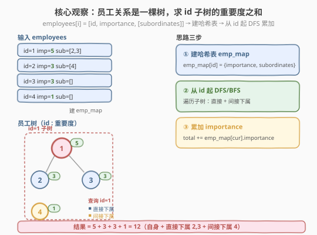
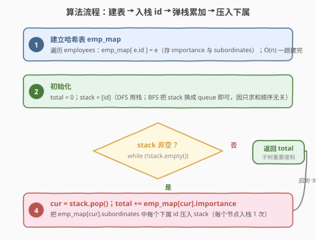
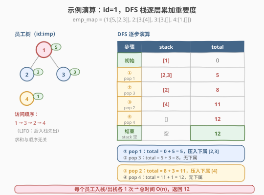

# 员工的重要性

- **题目名称**：员工的重要性
- **链接**：[690. 员工的重要性](https://leetcode.cn/problems/employee-importance/)
- **难度**：中等
- **标签**：深度优先搜索、广度优先搜索、哈希表、树

## 1. 题目概述

你有一个保存员工信息的数据结构，它包含了员工唯一的 `id`、重要度 `importance` 和直系下属的 `id` 列表 `subordinates`。

给定一个员工数组 `employees`，其中：

- `employees[i].id` 是第 `i` 个员工的 ID。
- `employees[i].importance` 是第 `i` 个员工的重要度。
- `employees[i].subordinates` 是第 `i` 名员工的直接下属的 ID 列表。

给定一个整数 `id` 表示一个员工的 ID，返回这个员工**和他所有下属（直接 + 间接）的重要度的总和**。

**示例 1**：

```text
输入：employees = [[1,5,[2,3]],[2,3,[]],[3,3,[]]], id = 1
输出：11
解释：员工 1 自身的重要度是 5，他有两个直系下属 2 和 3，且 2 和 3 的重要度均为 3。
      因此员工 1 的总重要度是 5 + 3 + 3 = 11。
```

**示例 2**：

```text
输入：employees = [[1,2,[5]],[5,-3,[]]], id = 5
输出：-3
解释：员工 5 的重要度为 -3 且没有直接下属，因此总重要度为 -3。
```

**约束条件**：

- `1 <= employees.length <= 2000`
- `1 <= employees[i].id <= 2000`
- 所有的 `employees[i].id` 互不相同
- `-100 <= employees[i].importance <= 100`
- 一名员工最多有一名直接领导，并可能有多名下属
- `employees[i].subordinates` 中的 ID 都有效

> 💡 **核心**：每个员工至多一个直接领导 → 员工关系构成一棵**树**（或森林）。题目要求「`id` 及其全部后代的重要度之和」——即**以 `id` 为根的子树求和**。本质是「建哈希表 + 一次 DFS/BFS」。



---

## 2. 解题思路

### 2.1 暴力思路

不加预处理，每轮扫描整个 `employees` 数组，找出当前已纳入集合中各员工的**直接下属**并加入集合，重复直到某轮无新增。每轮 $O(n)$，最坏要 $O(n)$ 轮（树退化成链），总时间 $O(n^2)$，对 $n = 2000$ 虽能过但**没有学到通用模板**。

问题出在「每次都要在全量数组里按 `id` 查员工」。只需**预先把 `id → Employee` 组织成哈希表**，即可把每次查员工降到 $O(1)$。

### 2.2 核心观察：建哈希表 + 一次遍历求和

一趟 $O(n)$ 扫描建立 `emp_map[id] = Employee` 后，任给一个 `id` 都能 $O(1)$ 取出它的 `importance` 与 `subordinates`。随后从查询的 `id` 出发做一次 DFS（栈）或 BFS（队列），把访问到的每个员工的 `importance` 累加进 `total` 即可——访问集合就是「`id` 及其全部后代」。

> 💡 这与 [582. 杀死进程](../0501-0600/582_杀死进程.md) 是**同一套骨架**：都是「建映射 + 从单点出发遍历子树」。区别只在遍历时的动作——582 是「收集节点 id 进答案列表」，690 是「把 `importance` 累加进总和」。**收集变求和**，本质都是「子树聚合」。

> ⚠️ **直接下属 ≠ 全部下属**：`subordinates` 只存**直接**下属。间接下属（下属的下属）必须靠递归/栈层层展开才能访问到。这正是「遍历整棵子树」而非「只看一层」的原因。

### 2.3 算法流程



1. **建哈希表**：遍历 `employees`，`emp_map[e->id] = e`。
2. **初始化**：`total = 0`，`stack = [id]`。
3. **while 栈非空**：
   - `cur = stack.pop()`
   - `total += emp_map[cur].importance`
   - 把 `emp_map[cur].subordinates` 中每个下属 `id` 压入 `stack`。
4. 栈空时返回 `total`。

> 💡 因为本题只求**和**，与访问顺序无关，DFS（栈）与 BFS（队列）任选其一结果都相同——把上面的「栈」换成「队列」就是 BFS。

### 2.4 示例演算

用一个含**间接下属**的例子（突出「层层展开」）：`employees = [[1,5,[2,3]],[2,3,[4]],[3,3,[]],[4,1,[]]]`，`id = 1`。员工 1 的下属 2 又有下属 4，所以总重要度 = $5 + 3 + 3 + 1 = 12$。



**① 建 `emp_map`**：

| id | importance | subordinates |
|----|-----------|--------------|
| 1 | 5 | [2,3] |
| 2 | 3 | [4] |
| 3 | 3 | [] |
| 4 | 1 | [] |

**② DFS 从 `id=1` 出发**（下属按给定顺序压栈，LIFO 后入先出）：

| 步骤 | 弹出 cur | total | 压入下属 | stack |
|------|---------|-------|---------|-------|
| 初始 | — | 0 | — | [1] |
| ① | 1 | 5 | [2,3] | [2,3] |
| ② | 3 | 8 | [] | [2] |
| ③ | 2 | 11 | [4] | [4] |
| ④ | 4 | 12 | [] | [] |
| 结束 | stack 空 | **12** | — | — |

访问顺序 `1 → 3 → 2 → 4`（栈的 LIFO 决定，3 比 2 先出）。间接下属 4 在第 ④ 步才被累加——这正是「遍历整棵子树」的体现。最终返回 `12`。

---

## 3. 参考代码

### 方法一：DFS + 栈（推荐，迭代实现）

### C++

```cpp
class Employee {
  public:
    int id;
    int importance;
    vector<int> subordinates;
};

class Solution {
  public:
    int getImportance(vector<Employee*> employees, int id) {
        unordered_map<int, Employee*> emp_map;
        for (Employee* e : employees) {
            emp_map[e->id] = e;                       // 建哈希表
        }
        int total = 0;
        vector<int> stk;
        stk.push_back(id);
        while (!stk.empty()) {
            int cur = stk.back(); stk.pop_back();
            Employee* e = emp_map[cur];
            total += e->importance;                   // 累加重要度
            for (int sub : e->subordinates) {
                stk.push_back(sub);                   // 压入直接下属（间接下属会层层展开）
            }
        }
        return total;
    }
};
```

### Python

```python
class Solution:
    def getImportance(self, employees: List['Employee'], id: int) -> int:
        emp_map = {e.id: e for e in employees}
        total = 0
        stack = [id]
        while stack:
            cur = stack.pop()
            e = emp_map[cur]
            total += e.importance                     # 累加重要度
            stack.extend(e.subordinates)              # 压入直接下属
        return total
```

### 方法二：DFS 递归（最简洁）

递归定义天然清晰：某员工的总重要度 = 自身重要度 + 所有下属总重要度之和。

### C++

```cpp
class Solution {
    unordered_map<int, Employee*> emp_map;

    int dfs(int id) {
        Employee* e = emp_map[id];
        int sum = e->importance;
        for (int sub : e->subordinates) {
            sum += dfs(sub);                          // 递归累加子树
        }
        return sum;
    }

  public:
    int getImportance(vector<Employee*> employees, int id) {
        for (Employee* e : employees) emp_map[e->id] = e;
        return dfs(id);
    }
};
```

### Python

```python
class Solution:
    def getImportance(self, employees: List['Employee'], id: int) -> int:
        emp_map = {e.id: e for e in employees}

        def dfs(i: int) -> int:
            e = emp_map[i]
            return e.importance + sum(dfs(sub) for sub in e.subordinates)

        return dfs(id)
```

> ⚠️ 树高最深可达 $1000$，Python 默认递归上限正是 $1000$，链状退化时递归版**可能触发 `RecursionError`**。线上提交若用递归，建议先 `sys.setrecursionlimit(3000)` 放宽上限；**更稳的写法是迭代版**（显式栈把调用栈换成堆内存，无溢出风险）。

### 方法三：BFS + 队列

把方法一的「栈」换成「队列」即为 BFS。访问集合与求和结果完全相同，仅访问顺序不同（按层），题目只求和故无影响。

### C++

```cpp
class Solution {
  public:
    int getImportance(vector<Employee*> employees, int id) {
        unordered_map<int, Employee*> emp_map;
        for (Employee* e : employees) emp_map[e->id] = e;
        int total = 0;
        queue<int> q;
        q.push(id);
        while (!q.empty()) {
            int cur = q.front(); q.pop();
            Employee* e = emp_map[cur];
            total += e->importance;
            for (int sub : e->subordinates) q.push(sub);
        }
        return total;
    }
};
```

### Python

```python
from collections import deque

class Solution:
    def getImportance(self, employees: List['Employee'], id: int) -> int:
        emp_map = {e.id: e for e in employees}
        total = 0
        q = deque([id])
        while q:
            cur = q.popleft()
            e = emp_map[cur]
            total += e.importance
            q.extend(e.subordinates)
        return total
```

---

## 4. 复杂度分析

| 维度 | 复杂度 | 说明 |
|------|--------|------|
| 时间复杂度 | $O(n)$ | 建哈希表 $O(n)$；DFS/BFS 每个员工入栈/出栈各 1 次，总操作 $O(n)$ |
| 空间复杂度 | $O(n)$ | `emp_map` 存 $n$ 个员工 $O(n)$；栈/队列最坏 $O(n)$（链状退化时深度为 $n$） |

> 💡 `employees[i].id` 取值可达 $2000$，但只有 $n \le 2000$ 个员工，且 `id` 不连续，故用哈希表（`unordered_map` / `dict`）而非值域数组存 `emp_map`，空间严格 $O(n)$。

---

## 5. 扩展：从「子树求和」看子树聚合一族

本题是「**给定一棵树，按节点查子树聚合值**」的最简形式（聚合 = 求和）。同一套「建映射 + 遍历子树」骨架可衍生多种变体：

1. **聚合操作可替换**：把 `total += importance` 换成「收集 id 进列表」即 [582. 杀死进程](../0501-0600/582_杀死进程.md)；换成「取 `max`」即 [559. N 叉树的最大深度](559_N叉树的最大深度.md)；换成「计数」即统计子树节点数。**遍历骨架不变，只换聚合动作**。

2. **改为「祖先链求和」**：若题目改成「求某员工到根路径上所有领导的重要度之和」，只需建反向表 `parent[id] = leader`，从 `id` 一路向上爬到根累加即可，$O(h)$。

3. **批量查询**：若要回答多次「员工 $x$ 的子树重要度之和」，单次查询 $O(n)$ 会退化到 $O(qn)$。可预处理每个节点的**子树和**（后序 DFS：`sub_sum[x] = imp[x] + Σ sub_sum[child]`），预处理 $O(n)$ 后单次查询 $O(1)$——这是「树形 DP / 子树和」的经典预处理思路。

4. **重要度可能为负**：本题 `importance` 取值 $[-100, 100]$，总和可能为负（见示例 2）。算法无需任何修改，累加自然处理负数；若变体要求「最大子树和」，则需类似 [53. 最大子数组和](../0001-0100/53_最大子数组和.md) 的 Kadane 思路在树上做「子树和取 max」并允许舍弃负子树。

---

## 6. 面试要点

1. **为什么用哈希表存 `emp_map` 而不是按下标？**

   - `employees[i].id` 与数组下标 `i` 没有对应关系（`id` 是任意正整数，不连续），题目给的是 `id` 而非下标。用 `unordered_map<int, Employee*>` / `dict` 建立 `id → Employee` 映射，才能 $O(1)$ 由 `id` 取到员工。直接按下标访问会找不到。

2. **「直接下属」和「间接下属」怎么区分？算法如何覆盖间接下属？**

   - `subordinates` 字段只存**直接**下属。间接下属（下属的下属）不在其中。算法靠 DFS/BFS **层层展开**——访问到一个员工后把它的直接下属入栈/入队，下一轮再访问这些下属时又把它们的下属入栈/入队……如此递推，整棵子树的所有节点都会被访问到，间接下属自然被覆盖。

3. **DFS 和 BFS 在本题有区别吗？**

   - 没有。两者都能完整遍历 `id` 的子树，访问集合相同，**求和结果完全一致**，仅访问顺序不同。题目只要求和，故任选其一。DFS 栈实现最简洁，BFS 队列实现语义上「按层」更直观。

4. **递归 DFS 在本题会有什么风险？**

   - 树高最深可达 $1000$，若树退化为链，递归深度同量级。Python 默认递归上限正是 $1000$，链状退化时**可能触发 `RecursionError`**。**迭代版**（显式栈/队列）把递归调用栈换成堆内存，无此风险，是更稳的写法；C++ 栈空间通常更大，但极深树仍有爆栈可能，迭代仍是首选。

5. **如果 `importance` 可能为负，算法要改吗？**

   - 不用改。累加 `total += importance` 天然处理负数，总和可能为负（示例 2 返回 $-3$）。只有当变体要求「最大子树和」而非「整棵子树和」时，才需要允许「舍弃负子树」的额外逻辑。

---

## 7. 同类练习题

- [582. 杀死进程](https://leetcode.cn/problems/kill-process/)（[题解](../0501-0600/582_杀死进程.md)）：同一套「建映射 + 遍历子树」骨架，把「求和」换成「收集节点 id」，对照学习最佳
- [559. N 叉树的最大深度](https://leetcode.cn/problems/maximum-depth-of-n-ary-tree/)（[题解](559_N叉树的最大深度.md)）：子树聚合的「取 max」版本，遍历骨架不变只换聚合动作
- [590. N 叉树的后序遍历](https://leetcode.cn/problems/n-ary-tree-postorder-traversal/)（[题解](590_N叉树的后序遍历.md)）：N 叉树子树遍历模板，先子后根的后序天然适合「子树聚合」
- [200. 岛屿数量](https://leetcode.cn/problems/number-of-islands/)（[题解](../0101-0200/200_岛屿数量.md)）：网格图 DFS/BFS 遍历连通块，与本题「遍历子树收集/聚合」同属「建图 + 一次遍历」骨架
- [133. 克隆图](https://leetcode.cn/problems/clone-graph/)：从起点出发 DFS/BFS 遍历图并复制所有节点，与本题「遍历子树累加」思路一致
