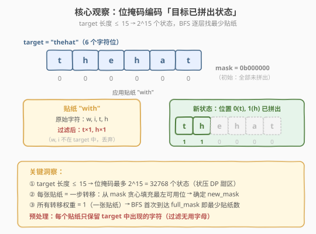
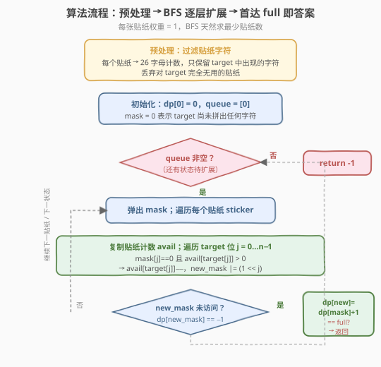
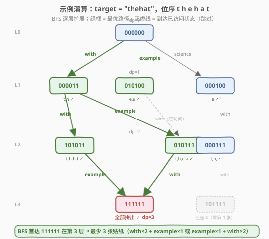

# LeetCode 贴纸拼词 题解

## 1. 题目概述

- **标题 / 题号**：贴纸拼词（#691，hard）
- **链接**：https://leetcode.cn/problems/stickers-to-spell-word/
- **难度**：困难
- **标签**：位运算、动态规划、状态压缩、广度优先搜索

**题意**：有 `n` 种不同的贴纸，每个贴纸上有一个小写英文单词。你可以从贴纸上切割单个字母并重新排列，每个贴纸可以**无限次**使用。求拼出给定字符串 `target` 所需的**最少贴纸数量**；若无法拼出则返回 `-1`。

**示例 1**：

```text
输入：stickers = ["with","example","science"], target = "thehat"
输出：3
解释：使用 2 张 "with" + 1 张 "example"。
"with"×2 提供 t×2, h×2；"example"×1 提供 e×1, a×1 → 拼出 "thehat"。
```

**示例 2**：

```text
输入：stickers = ["notice","possible"], target = "basicbasic"
输出：-1
解释：两张贴纸都没有字母 'a'，无法拼出 target。
```

**约束**：

- `1 <= n <= 50`
- `1 <= stickers[i].length <= 10`
- `1 <= target.length <= 15`
- `stickers[i]` 和 `target` 由小写英文单词组成

> ⚠️ **关键信号**：`target.length ≤ 15` 是**状压 DP（bitmask DP）**的标志性数据范围——$2^{15} = 32768$ 个状态，恰好落在「可以枚举所有子集」的甜区。与 [526. 优美的排列](../0501-0600/526_优美的排列.md) 一样，看到这种小范围 + 「逐步拼出目标」的最值问题，第一反应应是状压 DP + BFS。

## 2. 解题思路

### 2.1 暴力思路：枚举贴纸组合

从 `n` 种贴纸中选若干张（可重复），尝试拼出 `target`。最坏情况下需要穷举所有长度为 $1, 2, \ldots, k$ 的贴纸序列，组合数爆炸。$n = 50$、答案为 $k$ 时，搜索空间为 $50^k$，完全不可行。

> ⚠️ 暴力的浪费在于：没有利用「**target 的每个字符位要么已拼出、要么未拼出**」这一二值结构。实际上，我们只关心「target 的哪些位置已经被覆盖了」，而不关心贴纸的使用顺序——不同顺序只要覆盖相同位置集就等价。

### 2.2 核心观察：位掩码编码 + BFS 最短路



**关键转化**：用 `target` 的长度 `n` 位二进制整数 `mask` 作为状态——第 `j` 位为 `1` 表示 `target[j]` 已被拼出。每应用一张贴纸，就是从当前 `mask` 转移到一个新的 `mask`（填充若干未拼出的位）。

三条洞察让问题变成标准 BFS 最短路：

| 洞察 | 说明 |
|------|------|
| **状态空间小** | `n ≤ 15` → 最多 $2^{15} = 32768$ 个状态，可全部枚举 |
| **转移确定** | 给定 `mask` 和贴纸，贪心从左到右填充未拼出位 → 确定 `new_mask` |
| **边权为 1** | 每张贴纸 = 一步转移，BFS 首次到达 `full_mask` 即最少贴纸数 |

> 💡 **为什么贪心从左到右填充是正确的？** 需要同一字符的各个位置彼此等价（如 target 中两个 `t`，先填哪个不影响剩余需求）。从左到右填充产生一个**规范状态**，保证相同「剩余字符需求」只对应一个 mask，不遗漏也不重复。BFS 在规范状态上搜索等价于在「剩余字符需求」上搜索，首达即最优。

**预处理**：每个贴纸转成 26 字母计数数组，丢弃对 `target` 完全无用的贴纸（不含任何 target 字符的贴纸不可能贡献）。

### 2.3 算法流程图



**完整步骤**：

1. **预处理**：每个贴纸 → 26 字母计数；丢弃不含 `target` 任何字符的贴纸。
2. **初始化**：`dp[0] = 0`（空状态需 0 张贴纸），队列 `q = [0]`。
3. **BFS 主循环**：弹出 `mask`，遍历每张贴纸：
   - 复制贴纸计数 `avail`；
   - 遍历 `target` 位 `j = 0…n−1`：若 `mask` 第 `j` 位为 `0`（未拼出）且 `avail[target[j]] > 0`，则 `avail[target[j]]−−`，`new_mask |= (1 << j)`；
   - 若 `new_mask != mask` 且 `dp[new_mask] == -1`（未访问）：`dp[new_mask] = dp[mask] + 1`；若 `new_mask == full`，返回 `dp[new_mask]`；否则入队。
4. **队列耗尽**仍未到达 `full_mask` → 返回 `-1`。

> 💡 BFS 天然按层扩展，每层 = 多用一张贴纸。首次到达 `full_mask` 时所在层数即为最少贴纸数，无需像 Dijkstra 那样维护优先队列——因为所有边权都是 1。

### 2.4 示例演算

以 `stickers = ["with","example","science"], target = "thehat"` 为例。`target = "thehat"`，位序 `t h e h a t`（6 位），`full = 111111`。



预处理后贴纸字符计数（只看 target 中的字符）：

| 贴纸 | 有用字符 |
|------|----------|
| `"with"` | t×1, h×1 |
| `"example"` | e×2, a×1 |
| `"science"` | e×2 |

BFS 逐层扩展：

| 层 | 新状态 | 来源 | 填充位 |
|----|--------|------|--------|
| L0 | `000000` | 初始 | — |
| L1 | `000011` | +with | 0(t), 1(h) |
| L1 | `010100` | +example | 2(e), 4(a) |
| L1 | `000100` | +science | 2(e) |
| L2 | `101011` | 000011 +with | 3(h), 5(t) |
| L2 | `010111` | 000011 +example | 2(e), 4(a) |
| L2 | `000111` | 000100 +with | 0(t), 1(h) |
| **L3** | **`111111` ✓** | **101011 +example** | **2(e), 4(a)** → 全拼出 |
| L3 | `111111` ✓ | 010111 +with | 3(h), 5(t) → 全拼出 |

第 3 层首次到达 `111111`，返回 **3**。

> 💡 注意 `science` 只提供 `e`，而 `example` 也提供 `e` 且额外提供 `a`——所以 `science` 被 `example` **支配**（dominated），任何用 `science` 的方案换成 `example` 都不会更差。最优路径 `with→with→example` 或 `example→with→with` 均为 3 张，都不需要 `science`。支配剪枝详见第 5 节扩展。

## 3. 参考代码

### C++（BFS + 位掩码）

```cpp
class Solution {
  public:
    int minStickers(vector<string>& stickers, string target) {
        int n = target.size();
        int full = (1 << n) - 1;

        // 预处理：每个贴纸 → 26 字母计数，丢弃对 target 无用的贴纸
        vector<vector<int>> cnt;
        for (auto& s : stickers) {
            vector<int> c(26, 0);
            for (char ch : s) c[ch - 'a']++;
            bool useful = false;
            for (int i = 0; i < n; i++)
                if (c[target[i] - 'a'] > 0) { useful = true; break; }
            if (useful) cnt.push_back(c);
        }

        // BFS
        vector<int> dp(1 << n, -1);
        queue<int> q;
        dp[0] = 0;
        q.push(0);
        while (!q.empty()) {
            int mask = q.front();
            q.pop();
            for (auto& c : cnt) {
                vector<int> avail = c;            // 复制一份贴纸计数
                int new_mask = mask;
                for (int j = 0; j < n; j++) {
                    if ((mask >> j) & 1) continue;            // 已拼出
                    int idx = target[j] - 'a';
                    if (avail[idx] > 0) {
                        avail[idx]--;
                        new_mask |= (1 << j);                 // 标记拼出
                    }
                }
                if (new_mask != mask && dp[new_mask] == -1) {
                    dp[new_mask] = dp[mask] + 1;
                    if (new_mask == full) return dp[new_mask];
                    q.push(new_mask);
                }
            }
        }
        return -1;
    }
};
```

### Python（BFS + 位掩码）

```python
class Solution:
    def minStickers(self, stickers: List[str], target: str) -> int:
        n = len(target)
        full = (1 << n) - 1

        # 预处理：每个贴纸 → 26 字母计数，丢弃对 target 无用的贴纸
        cnts = []
        for s in stickers:
            c = [0] * 26
            for ch in s:
                c[ord(ch) - 97] += 1
            if any(c[ord(target[i]) - 97] > 0 for i in range(n)):
                cnts.append(c)

        # BFS
        from collections import deque
        dp = [-1] * (1 << n)
        dp[0] = 0
        q = deque([0])
        while q:
            mask = q.popleft()
            for c in cnts:
                avail = c[:]                         # 复制一份贴纸计数
                new_mask = mask
                for j in range(n):
                    if mask >> j & 1:
                        continue                     # 已拼出
                    idx = ord(target[j]) - 97
                    if avail[idx] > 0:
                        avail[idx] -= 1
                        new_mask |= 1 << j           # 标记拼出
                if new_mask != mask and dp[new_mask] == -1:
                    dp[new_mask] = dp[mask] + 1
                    if new_mask == full:
                        return dp[new_mask]
                    q.append(new_mask)
        return -1
```

> 💡 **关键细节**：`avail = c[:]` 复制贴纸计数，因为一张贴纸的每个字符只能用一次（但同种贴纸可无限取用，所以每次转移都从原始计数开始复制）。内层循环从左到右贪心填充，保证规范状态。

## 4. 复杂度分析

| 维度 | 复杂度 | 说明 |
|------|--------|------|
| 时间复杂度 | $O(m \cdot n \cdot 2^n)$ | 最多 $2^n$ 个状态，每个状态遍历 $m$ 张贴纸，每张贴纸遍历 $n$ 个目标位 |
| 空间复杂度 | $O(2^n + m \cdot |\Sigma|)$ | `dp` 数组 $O(2^n)$；贴纸计数 $O(m \cdot 26)$ |

$n = 15$、$m = 50$ 时约为 $50 \times 15 \times 32768 \approx 2.5 \times 10^7$，毫秒级完成。实际 BFS 只访问可达状态，远少于 $2^n$。

> ⚠️ **无解快速判断**：若 `target` 中某个字符在所有贴纸中都不出现，BFS 会耗尽队列返回 `-1`。可在预处理后加一个 $O(|target|)$ 的检查提前返回，避免无意义的搜索。

## 5. 扩展：支配剪枝 + 记忆化 DFS

### 5.1 支配剪枝（Dominance Pruning）

若贴纸 A 的每个字符计数都 $\le$ 贴纸 B 的对应计数，则 A 被 B **支配**——任何用 A 的方案换成 B 都不会更差，A 可安全删除。示例中 `science`（e×2）被 `example`（e×2, a×1）支配，可剪掉。

```python
# 支配剪枝：删除被其他贴纸严格支配的贴纸
m = len(cnts)
keep = [True] * m
for i in range(m):
    if not keep[i]:
        continue
    for j in range(m):
        if i == j or not keep[j]:
            continue
        # j 是否被 i 支配（j 的每个字符 ≤ i）
        if all(cnts[j][c] <= cnts[i][c] for c in range(26)):
            # 若互相支配（完全相同），保留下标小的
            if all(cnts[i][c] <= cnts[j][c] for c in range(26)):
                if j < i:
                    keep[i] = False
                    break
            else:
                keep[j] = False
cnts = [cnts[i] for i in range(m) if keep[i]]
```

> ⚠️ 支配剪枝是 $O(m^2 \cdot 26)$ 的预处理优化，不改变最坏复杂度，但能显著减少贴纸数 $m$，在实际用例上提速明显。

### 5.2 记忆化 DFS（自顶向下）

BFS 的等价写法——记忆化搜索。从 `mask = 0` 出发，递归尝试每张贴纸，取最小值。`@lru_cache` 自动记忆，复杂度与 BFS 相同。

```python
from functools import lru_cache

class Solution:
    def minStickers(self, stickers: List[str], target: str) -> int:
        cnts = []
        for s in stickers:
            c = [0] * 26
            for ch in s:
                c[ord(ch) - 97] += 1
            if any(c[ord(target[i]) - 97] > 0 for i in range(len(target))):
                cnts.append(c)

        n = len(target)
        full = (1 << n) - 1

        @lru_cache(None)
        def dfs(mask: int) -> int:
            if mask == full:
                return 0
            best = float('inf')
            for c in cnts:
                avail = c[:]
                new_mask = mask
                for j in range(n):
                    if mask >> j & 1:
                        continue
                    idx = ord(target[j]) - 97
                    if avail[idx] > 0:
                        avail[idx] -= 1
                        new_mask |= 1 << j
                if new_mask != mask:
                    best = min(best, 1 + dfs(new_mask))
            return best

        ans = dfs(0)
        return ans if ans != float('inf') else -1
```

> 💡 **BFS vs 记忆化 DFS**：BFS 天然求最短路、首达即返回，不需要探索所有状态；记忆化 DFS 会递归探索所有可达状态后取最小值。两者复杂度相同，BFS 通常更快（提前终止），DFS 更直观（顺着「还差什么→贴哪张贴纸」的思维写）。

## 6. 面试要点

1. **为什么 `target.length ≤ 15` 提示用状压 DP？**

   > $2^{15} = 32768$ 个状态可承受。一般 `n ≤ 20` 的「选/不选」最值/计数问题都可考虑状压 DP，这是面试中识别该套路的经验阈值。

2. **为什么用 BFS 而不是 Dijkstra？**

   > 每张贴纸 = 一步转移，所有边权为 1。BFS 在等权图上首达即最短路径，无需优先队列，$O(V + E)$ 即可。若贴纸有不同「代价」（如每张贴纸价格不同），则需升级为 Dijkstra。

3. **贪心从左到右填充为什么正确？**

   > 需要同一字符的各个位置等价（如两个 `t` 位先填哪个不影响剩余需求）。从左到右产生规范状态，保证相同剩余需求只对应一个 mask。BFS 在规范状态上搜索等价于在剩余需求上搜索，不遗漏最优。

4. **如何判断无解？**

   > 若 `target` 中某字符在所有贴纸中都不出现，该字符位永远无法置 1，BFS 耗尽队列返回 `-1`。可在预处理后加 $O(|target|)$ 检查提前返回。

5. **支配剪枝的原理和复杂度？**

   > 若贴纸 A 的每个字符计数 $\le$ 贴纸 B，则 A 被 B 支配，可删除。预处理 $O(m^2 \cdot 26)$，减少 $m$ 后加速 BFS 主循环。注意完全相同的贴纸只保留下标最小的一个。

> 💡 **一句话总结**：691 是「**状压 DP + BFS 最短路**」的范本——用 `n` 位掩码编码 target 拼出状态，每张贴纸是一步等权转移，BFS 首达 `full_mask` 即最少贴纸数。预处理过滤无用字符 + 支配剪枝进一步加速。与 526（计数型状压）对照，本题是**最值型状压**，用 BFS 取代累加。

## 同类练习题

| # | 题目 | 与本题的关联 |
|---|------|-------------|
| 526 | [优美的排列](https://leetcode.cn/problems/beautiful-arrangement/)（[题解](../0501-0600/526_优美的排列.md)） | 状压 DP 母题，`mask` 编码已放数字集合，计数型；691 是其最值型变体（BFS 取代累加） |
| 698 | [划分为 K 个相等的子集](https://leetcode.cn/problems/partition-to-k-equal-sum-subsets/)（[题解](../0601-0700/698_划分为K个相等的子集.md)） | 状压 DP + 回溯，`mask` 编码已用元素，可行性型；对照三种状压问题类型 |
| 1655 | [分配重复整数](https://leetcode.cn/problems/distribute-repeating-integers/) | 状压 DP 进阶，`mask` 编码已满足的需求子集，与 691 的「mask = 已拼出子集」同构 |
| 127 | [单词接龙](https://leetcode.cn/problems/word-ladder/)（[题解](../0101-0200/127_单词接龙.md)） | BFS 最短路经典题，状态是单词而非位掩码，但「等权图首达即最短」的核心思想一致 |
| 1799 | [N 次操作后的最大分数](https://leetcode.cn/problems/maximize-score-after-n-operations/) | 状压 DP，`mask` 编码剩余可用数字，成对取数求最大得分，状态设计思路与 691 一致 |
