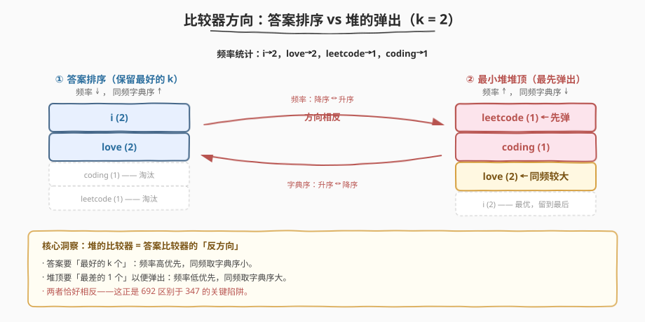
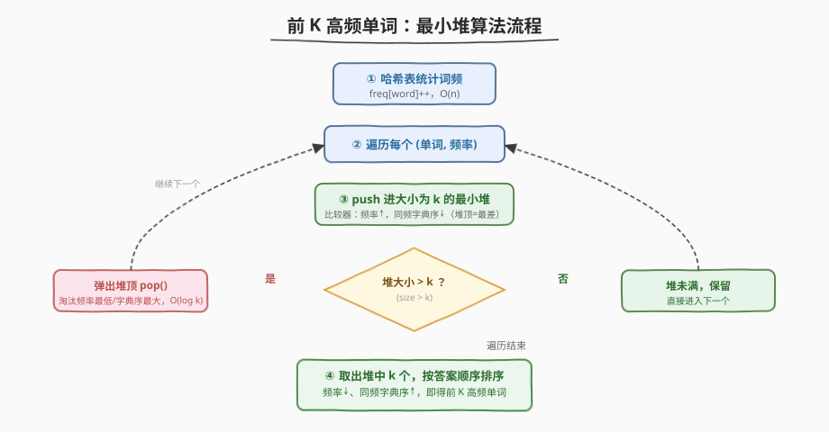
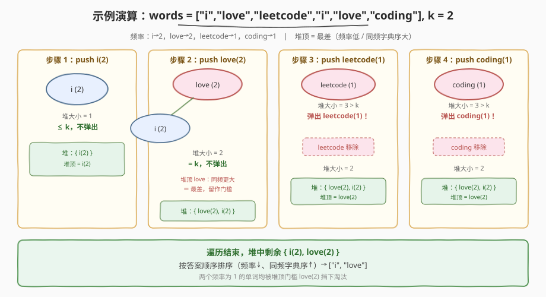

# LeetCode 前 K 个高频单词 题解

## 1. 题目概述

- **标题 / 题号**：前 K 个高频单词（#692，medium）
- **链接**：https://leetcode.cn/problems/top-k-frequent-words/
- **难度**：中等
- **标签**：堆（优先队列）、哈希表、字符串、排序

**题意**：给定一个单词列表 `words` 和一个整数 `k`，返回出现频率前 `k` 高的单词。

返回的列表按**频率从高到低**排序；**频率相同的单词按字典序升序**排列（字典序小的在前）。

**示例 1**：

```text
输入：words = ["i","love","leetcode","i","love","coding"], k = 2
输出：["i","love"]
解释："i" 和 "love" 各出现 2 次，频率最高。频率相同时 "i" 字典序小于 "love"，故 "i" 排在前。
```

**示例 2**：

```text
输入：words = ["the","day","is","sunny","the","the","the","sunny","is","is"], k = 4
输出：["the","is","sunny","day"]
解释：频率依次为 the→4, is→3, sunny→2, day→1。
```

**约束**：

- `1 <= words.length <= 500`
- `1 <= words[i].length <= 10`
- `words[i]` 由小写英文字母组成
- `k` 的取值范围是 `[1, 不同单词的个数]`
- **进阶**：能否用 $O(n \log k)$ 时间和 $O(n)$ 额外空间解决？

> 💡 这是 [347. 前 K 个高频元素](https://leetcode.cn/problems/top-k-frequent-elements/) 的姊妹题，核心仍是 **Top-K** 模板。区别在于：元素从数字变成了字符串，**频率相同时要按字典序定序**——正是这一点让比较器方向成为本题的最大陷阱。

## 2. 解题思路

### 2.1 暴力思路：全排序

用哈希表统计每个单词的频率，把所有 `(单词, 频率)` 按**频率降序、同频字典序升序**排序，取前 `k` 个。

```text
统计频率：O(n)
排序：    O(m log m)   (m 为不同单词数，最坏 m = n)
取前 k：  O(k)
```

总时间 $O(n \log n)$，空间 $O(n)$。能 AC，但**不满足进阶**要求的 $O(n \log k)$。瓶颈和 347 一样：我们只需前 `k` 个，给全体排序是浪费。

### 2.2 核心观察：大小为 k 的最小堆 + 自定义比较器



关键洞察与 347 相同：**只需保留当前最优的 k 个，不必给全体排序**，用大小为 `k` 的最小堆维护。堆顶是当前堆中**最差**的那个（"门槛"），新单词若比它更优就替换进来。

> 💡 **为什么用最小堆？** 我们要随时淘汰堆中"最差的那个"。最小堆堆顶恰好是最差值，$O(\log k)$ 弹出即可。若用最大堆，须把全部元素入堆才能确定 Top-K，退化成 $O(m \log m)$ 排序。

**本题的陷阱在比较器方向。** 先明确"最优"与"最差"的定义：

| | 含义 | 方向 |
|---|---|---|
| **最优**（要保留） | 频率高；同频字典序小 | 频率 ↓，字典序 ↑ |
| **最差**（堆顶，要弹出） | 频率低；同频字典序大 | 频率 ↑，字典序 ↓ |

也就是说，**堆的比较器与答案排序的比较器方向恰好相反**：

- 答案排序：频率降序，同频字典序升序。
- 堆（最小堆，堆顶 = 最差）：频率升序，同频字典序降序。

> ⚠️ **高频踩坑点**：在 Python 中直接用元组 `(freq, word)` 喂给 `heapq` 是**错的**！频率相同时，`heapq` 的最小堆会弹出字典序**最小**的单词——但那是我们想**保留**的更优单词，应当被弹出的反而是字典序**最大**的。字符串不能像数字那样取负号翻转，所以这里要么用 `heapq.nsmallest`（内部用大小为 k 的最大堆），要么自定义比较对象。C++ 则可以靠自定义 `cmp` 仿函数直接控制方向。

### 2.3 算法流程图



1. 用哈希表统计每个单词的频率。
2. 建立大小为 `k` 的最小堆，比较器为"频率升序，同频字典序降序"（堆顶 = 最差）。
3. 依次把 `(单词, 频率)` 入堆；堆大小 `> k` 时弹出堆顶（淘汰最差的）。
4. 遍历完毕，堆中剩余 k 个即候选；再按答案顺序（频率降序、同频字典序升序）排一次输出。

### 2.4 示例演算

以 `words = ["i","love","leetcode","i","love","coding"], k = 2` 为例：



1. 统计频率：`{i: 2, love: 2, leetcode: 1, coding: 1}`。
2. 按首次出现顺序依次入堆（堆顶 = 最差 = 频率低 / 同频字典序大）：
   - `push i(2)`：堆 `{i(2)}`，大小 1 ≤ 2，不弹。
   - `push love(2)`：堆 `{love(2, 顶), i(2)}`——同频时 love 字典序更大即更"差"，居顶。大小 2 = k，不弹。
   - `push leetcode(1)`：频率最低，居顶。大小 3 > 2，弹出 `leetcode(1)`。堆回到 `{love(2, 顶), i(2)}`。
   - `push coding(1)`：频率最低，居顶。大小 3 > 2，弹出 `coding(1)`。堆回到 `{love(2, 顶), i(2)}`。
3. 堆中剩余 `{i(2), love(2)}`，按答案顺序排序 → `["i", "love"]`。

> 💡 注意门槛 `love(2)` 一直守在堆顶：任何频率为 1 的单词都比它差，入堆即被弹出；而同为频率 2 的 `i` 字典序更小、更优，始终被保留。

## 3. 参考代码

### C++（全排序，$O(n \log n)$）

```cpp
class Solution {
  public:
    vector<string> topKFrequent(vector<string>& words, int k) {
        unordered_map<string, int> freq;
        for (auto& w : words) freq[w]++;

        vector<pair<string, int>> v(freq.begin(), freq.end());
        sort(v.begin(), v.end(), [](const auto& a, const auto& b) {
            if (a.second != b.second) return a.second > b.second; // 频率降序
            return a.first < b.first;                             // 同频字典序升序
        });

        vector<string> ans;
        for (int i = 0; i < k; i++) ans.push_back(v[i].first);
        return ans;
    }
};
```

### C++（最小堆，$O(n \log k)$）

```cpp
class Solution {
  public:
    vector<string> topKFrequent(vector<string>& words, int k) {
        unordered_map<string, int> freq;
        for (auto& w : words) freq[w]++;

        // 最小堆：堆顶 = 最差 = 频率最低 / 同频字典序最大
        // priority_queue 的 cmp 返回 true 表示 a 优先级低于 b（a 更靠下）
        auto cmp = [](const pair<string, int>& a, const pair<string, int>& b) {
            if (a.second != b.second) return a.second > b.second; // 频率高者靠下（保留）
            return a.first < b.first;                             // 字典序小者靠下（保留）
        };
        priority_queue<pair<string, int>, vector<pair<string, int>>, decltype(cmp)> pq(cmp);

        for (auto& [w, f] : freq) {
            pq.push({w, f});
            if ((int)pq.size() > k) pq.pop(); // 弹出最差的
        }

        vector<string> ans;
        while (!pq.empty()) {
            ans.push_back(pq.top().first);
            pq.pop();
        }
        // 堆弹出顺序是最差→次差，需反转为答案顺序
        sort(ans.begin(), ans.end(), [&](const string& a, const string& b) {
            if (freq[a] != freq[b]) return freq[a] > freq[b];
            return a < b;
        });
        return ans;
    }
};
```

### Python（全排序）

```python
class Solution:
    def topKFrequent(self, words: List[str], k: int) -> List[str]:
        freq = Counter(words)
        # 按频率降序、同频字典序升序排序
        sorted_words = sorted(freq.keys(), key=lambda w: (-freq[w], w))
        return sorted_words[:k]
```

### Python（`heapq.nsmallest`，$O(n \log k)$）

```python
import heapq
from collections import Counter


class Solution:
    def topKFrequent(self, words: List[str], k: int) -> List[str]:
        freq = Counter(words)
        # 用 (-freq, word) 选 k 个最小元组：
        #   -freq 最小 ⇔ 频率最高；同频时 word 字典序最小
        # nsmallest 内部维护大小为 k 的最大堆，复杂度 O(n log k)
        pairs = [(-f, w) for w, f in freq.items()]
        return [w for _, w in heapq.nsmallest(k, pairs)]
```

> ⚠️ 再次提醒：**不要**直接 `heapq.heappush(heap, (f, w))` 再控制大小——频率相同时它弹出的是字典序最小的单词，方向反了。若一定要手写大小为 k 的堆，需自定义一个 `__lt__` 取反的包装类：
>
> ```python
> class Word:
>     def __init__(self, w, f):
>         self.w, self.f = w, f
>     def __lt__(self, o):           # 最小堆：返回 True 者居顶（被弹出）
>         if self.f != o.f:
>             return self.f < o.f    # 频率低者居顶
>         return self.w > o.w        # 同频：字典序大者居顶（取反！）
> ```
>
> 面试中讲清这层"取反"比直接调 `nsmallest` 更能体现对堆原理的掌握。

## 4. 复杂度分析

| 维度 | 全排序法 | 最小堆法 | 说明 |
|------|----------|----------|------|
| 时间复杂度 | $O(n \log n)$ | $O(n \log k)$ | 堆法每次入堆/出堆 $O(\log k)$，共 $m$ 次；末尾对 k 个排序 $O(k \log k)$ |
| 空间复杂度 | $O(n)$ | $O(n)$ | 哈希表 $O(m)$；堆 $O(k)$ |

> ⚠️ 当 $k$ 较小（$k \ll n$）时，堆法 $O(n \log k)$ 远优于排序；当 $k \approx n$ 时两者接近，排序法更简单直接。本题 $n \le 500$ 较小，两种方法都能轻松 AC，但面试官追问进阶时务必给出堆法。

## 5. 扩展：为什么 347 的桶排序这里不灵了？

[347. 前 K 个高频元素](https://leetcode.cn/problems/top-k-frequent-elements/) 中，频率相同的元素答案顺序**任意**，所以可以开一个以频率为下标的桶数组，从高到低扫描即可 $O(n)$ 取完。而 692 要求**同频按字典序**，桶内同一频率的多个单词仍需排序才能定序：

- 最坏情况所有单词频率相同（都为 1），全部落入同一个桶，桶内排序退化为 $O(n \log n)$。
- 因此桶排序**无法**把 692 优化到线性，$O(n \log k)$ 的堆法才是本题的最优解。

> 💡 一句话记忆：**答案对"同频次序"无要求时用桶排序（347），有要求时用堆（692）。**

## 6. 面试要点

1. **堆的比较器为什么和排序相反？**

   - 排序要的是"最好的 k 个"按最优在前；堆顶要的是"最差的 1 个"以便弹出。最优与最差天然相反，故频率方向（降 vs 升）和字典序方向（升 vs 降）都需翻转。

2. **为什么用最小堆而不是最大堆？**

   - 要随时淘汰堆中"最差"的元素。最小堆堆顶即最差值，$O(\log k)$ 弹出即可；最大堆须把全部元素入堆才能定 Top-K，退化成 $O(n \log n)$ 排序。

3. **Python 里 `(freq, word)` 元组直接进堆为什么错？**

   - 频率相同时，元组比较按字典序升序，堆顶会是最小字典序的单词——那是要保留的更优单词，不该被弹。正确做法是用 `(-freq, word)` 配 `nsmallest`，或自定义 `__lt__` 取反的包装类。

4. **能否用桶排序做到 $O(n)$？**

   - 不能。同频单词需按字典序定序，桶内排序最坏 $O(n \log n)$。只有当"同频次序无要求"时（如 347）桶排序才有效。

5. **Top-K 模板能迁移到哪些题？**

   - [215. 第 K 个最大元素](https://leetcode.cn/problems/kth-largest-element-in-an-array/)（快速选择）、[347. 前 K 高频元素](https://leetcode.cn/problems/top-k-frequent-elements/)（堆 / 桶排序）、[295. 数据流的中位数](https://leetcode.cn/problems/find-median-from-data-stream/)（双堆）、[703. 数据流中的第 K 大元素](https://leetcode.cn/problems/kth-largest-element-in-a-stream/)（流式小顶堆）。692 在此模板上额外考察了**自定义比较器的方向控制**。

## 同类练习题

| # | 题目 | 与本题的关联 |
|---|------|-------------|
| 347 | [前 K 个高频元素](https://leetcode.cn/problems/top-k-frequent-elements/)（[题解](../0301-0400/347_前K个高频元素.md)） | Top-K 母题，本题的无字典序版本，可用桶排序 $O(n)$ |
| 215 | [数组中的第 K 个最大元素](https://leetcode.cn/problems/kth-largest-element-in-an-array/)（[题解](../0201-0300/215_数组中的第K个最大元素.md)） | 快速选择求第 K 大，Top-K 三大方法之一 |
| 295 | [数据流的中位数](https://leetcode.cn/problems/find-median-from-data-stream/)（[题解](../0201-0300/295_数据流的中位数.md)） | 大小顶堆配合，堆的进阶用法 |
| 451 | [根据字符出现频率排序](https://leetcode.cn/problems/sort-characters-by-frequency/) | 频率统计 + 排序，本题的字符级变体 |
