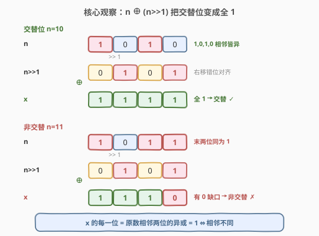
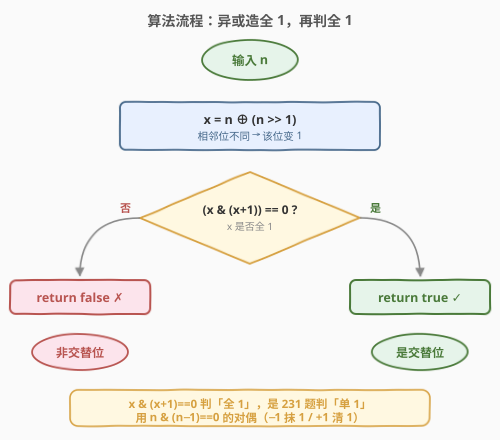
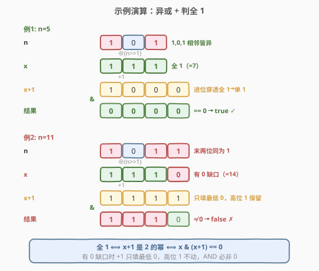

# LeetCode 交替位二进制数 题解

## 1. 题目概述

- **标题 / 题号**：交替位二进制数（#693，easy）
- **链接**：https://leetcode.cn/problems/binary-number-with-alternating-bits/
- **难度**：简单
- **标签**：位运算、数学

**题意**：给定一个正整数 `n`，判断它的二进制表示中**相邻两位是否总是不同**——即不存在两个相邻的 `1` 或相邻的 `0`（在有效位范围内）。是则返回 `true`，否则返回 `false`。

**示例 1**：

```text
输入：n = 5
输出：true
解释：5 的二进制是 101，相邻位依次为 (1,0)、(0,1)，两两不同。
```

**示例 2**：

```text
输入：n = 7
输出：false
解释：7 的二进制是 111，相邻位 (1,1) 相同。
```

**示例 3**：

```text
输入：n = 11
输出：false
解释：11 的二进制是 1011，末两位 (1,1) 相同。
```

**示例 4**：

```text
输入：n = 10
输出：true
解释：10 的二进制是 1010，相邻位两两不同。
```

**约束**：

- $1 \le n \le 2^{31} - 1$

> 💡 **进阶提示**：能否不使用循环 / 递归，用 $O(1)$ 的位运算一次判定？答案是「右移异或造全 1，再判全 1」——与 [231. 2 的幂](../0201-0300/231_2的幂.md) 的 `n & (n-1)` 技巧互为对偶：231 用减法抹掉唯一的 `1` 判「单 1」，本题用加法 `x & (x+1)` 判「全 1」。

## 2. 解题思路

### 2.1 暴力思路：逐位相邻比较

最直观的做法是逐位扫描，比较每一位与它的下一位是否相同：

```python
prev = n & 1
n >>= 1
while n:
    cur = n & 1
    if cur == prev:
        return False
    prev = cur
    n >>= 1
return True
```

时间 $O(\log n)$（扫描二进制位数，最多 31 次），空间 $O(1)$。能 AC，但**用了循环**——当 `n = 2^{30}` 时要循环 30 多次，且对每一位都做条件判断，无法满足进阶的「无循环」要求。

> 💡 转机在于：把「相邻两位是否不同」这个**逐位关系**，一次性翻译成「整个数是否全 1」——而「全 1」是可以用一次位运算判定的。两件翻译工具是**右移**和**异或**。

### 2.2 核心观察：`n ^ (n>>1)` 把交替位变成全 1



记 `x = n ^ (n >> 1)`。看 `x` 的第 `i` 位（从低位起编号）是怎么来的：

$$\text{bit}_i(x) = \text{bit}_i(n) \oplus \text{bit}_{i+1}(n)$$

因为 `n >> 1` 把 `n` 的第 `i+1` 位挪到了第 `i` 位，异或后 `x` 的第 `i` 位正是 `n` 的第 `i` 位与第 `i+1` 位（相邻两位）的异或。而**异或的真值表**恰好是「相同为 0，不同为 1」：

| $\text{bit}_i(n)$ | $\text{bit}_{i+1}(n)$ | 异或结果 | 含义 |
|-----|-----|---------|------|
| 0 | 0 | 0 | 相同 → 0 |
| 0 | 1 | 1 | 不同 → 1 |
| 1 | 0 | 1 | 不同 → 1 |
| 1 | 1 | 0 | 相同 → 0 |

> 💡 **关键转化**：「`n` 的相邻两位总是不同」$\iff$ 「`x` 的每一位都是 1」$\iff$ 「`x` 是一串连续的 `1`（形如 $11\ldots1_2 = 2^k - 1$）」。于是**判定交替位**被归约成**判定 `x` 是否全 1**。

以 `n = 10`（二进制 `1010`，交替）为例：`n >> 1 = 0101`，`x = 1010 ^ 0101 = 1111`，全 1 ✓。以 `n = 11`（二进制 `1011`，末两位相同）为例：`n >> 1 = 0101`，`x = 1011 ^ 0101 = 1110`，最低位出现 `0` 缺口 ✗——这个 `0` 正对应 `n` 中相同的末两位 `1,1`。

> 💡 **与 [371. 两整数之和](../0301-0400/371_两整数之和.md) 的呼应**：371 把异或看作「无进位和」（加法视角）；本题把异或看作「差异检测器」（比较视角）。同一个运算符，两种透镜——异或的 `1` 既可读作「这里要进位」（371），也可读作「这里两位不同」（本题）。

### 2.3 核心解法：`x & (x+1) == 0` 判全 1

现在只需判定 `x` 是否为一串连续的 `1`（即 $x = 2^k - 1$ 形式）。关键性质是：

> **`x` 全 1 $\iff$ `x + 1` 是 2 的幂 $\iff$ `(x & (x+1)) == 0`**

理解这一点要看「加 1 进位」的过程：

- **若 `x` 全 1**（如 `x = 111`）：`x + 1` 会从最低位逐位进位到底，结果变成 `1000`——一个**单 1** 的数（2 的幂）。此时 `x & (x+1) = 111 & 1000 = 0000 = 0`。
- **若 `x` 有 0 缺口**（如 `x = 1110`）：`x + 1` 只把最低位的 `0` 翻成 `1`（`1110 + 1 = 1111`），**高位那些 `1` 原封不动**。此时 `x & (x+1) = 1110 & 1111 = 1110 ≠ 0`。

> ⚠️ **对偶视角——与 231 的对称美**：[231. 2 的幂](../0201-0300/231_2的幂.md) 判定「单 1」用 `n & (n-1) == 0`：`n-1` 向低位**借位**，把唯一的 `1` 抹成 `0`、其下全 `0` 翻 `1`，AND 后归零。本题判定「全 1」用 `x & (x+1) == 0`：`x+1` 向高位**进位**，把一串 `1` 全清成 `0`、首个 `0` 翻 `1`，AND 后归零。**减法借位抹 1，加法进位清 1**——同一套「相邻整数按位与归零」的思想，方向相反、判据互补：
>
> | 判据 | 运算 | 二进制形态 | 对应题目 |
> |------|------|-----------|----------|
> | `n & (n-1) == 0` | 减 1 借位 | 单 1（2 的幂） | 231. 2 的幂 |
> | `x & (x+1) == 0` | 加 1 进位 | 全 1（$2^k - 1$） | 693. 交替位 |

### 2.4 算法流程图



算法是**两步串联**，无循环、无递归：

1. **第一步 `x = n ^ (n >> 1)`**：把「相邻位是否不同」翻译成「每一位是否为 1」。交替则 `x` 全 1，否则 `x` 出现 `0` 缺口。
2. **第二步 `(x & (x+1)) == 0`**：判定 `x` 是否全 1。全 1 则进位穿透产生单 1，AND 归零；有缺口则进位被挡，AND 非零。

两步都过 → `true`（交替）；任一步「不归零」→ `false`（非交替）。

> ⚠️ **正确性**：第一步的正确性来自异或真值表——`bit_i(x) = 1` 当且仅当 `n` 的第 `i`、`i+1` 位不同，故 `x` 全 1 当且仅当 `n` 所有相邻位都不同。第二步的正确性来自上面的进位分析——`x & (x+1) == 0` 当且仅当 `x` 形如 $2^k - 1$（全 1）。两步复合即「`n` 交替 $\iff$ `x` 全 1 $\iff$ AND 归零」。

### 2.5 示例演算

以一真一假两个输入为例，完整走一遍两步计算：



| 输入 | 二进制 | `n>>1` | `x = n⊕(n>>1)` | `x+1` | `x & (x+1)` | 结果 |
|------|--------|--------|----------------|-------|-------------|------|
| `n = 5` | `101` | `010` | `111`（全 1） | `1000` | `0000` = 0 | `true` ✓ |
| `n = 11` | `1011` | `0101` | `1110`（有缺口） | `1111` | `1110` ≠ 0 | `false` ✗ |

对 `n = 5`：`x = 111` 全 1，`+1` 后进位穿透成 `1000`（单 1），AND 归零 → 交替。对 `n = 11`：末两位 `1,1` 相同导致 `x` 最低位为 `0`（`x = 1110`），`+1` 只把那个 `0` 填成 `1`（`1111`），高位三个 `1` 保留，AND 得 `1110` 非零 → 非交替。注意 `x` 中 `0` 的位置精确标出了 `n` 中「相同相邻位」的位置——这是异或作为「差异检测器」的直观体现。

> 💡 想象 `x` 是一张「差异热力图」：每一位亮起（变 1）表示 `n` 在此处相邻两位不同。交替的 `n` 会让整张图全亮；任何一处暗掉（变 0）就暴露了一对相同相邻位。`x & (x+1) == 0` 则是一次性地问「整张图是否全亮」。

## 3. 参考代码

### C++

```cpp
class Solution {
  public:
    bool hasAlternatingBits(int n) {
        unsigned int x = (unsigned int)n ^ ((unsigned int)n >> 1);
        return (x & (x + 1)) == 0;
    }
};
```

> ⚠️ **为什么用 `unsigned int` 承载？** 题目保证 $n \ge 1$ 为正数，`n >> 1` 是逻辑右移（高位补 0），本无符号位问题。但 `x = n ^ (n >> 1)` 可能使最高位变 `1`（如 `n = 0x55555555` 时 `x = 0x7FFFFFFF`，再大些 `x` 的最高位会置 1）。对有符号 `int` 做 `x + 1` 在最高位进位时是**未定义行为**（有符号溢出 UB）。转成 `unsigned int` 后加法按无符号运算良定义（环绕语义），结果按位正确。本题 `n` 上界 $2^{31}-1$，`x` 至多 31 位，`x+1` 也不超 `unsigned` 范围，实际不会环绕，但用 `unsigned` 是规避 UB 的稳妥写法。

### Python

```python
class Solution:
    def hasAlternatingBits(self, n: int) -> bool:
        x = n ^ (n >> 1)
        return (x & (x + 1)) == 0
```

> 💡 **一行即终**。Python 整数无限精度，`n` 为正数（题目保证 $n \ge 1$），`n >> 1` 是逻辑右移，`x`、`x+1` 均无溢出 / 符号问题，无需掩码。两步位运算，无循环、无递归。

也可一行紧凑写法（语义等价）：

```python
class Solution:
    def hasAlternatingBits(self, n: int) -> bool:
        return ((n ^ (n >> 1)) & ((n ^ (n >> 1)) + 1)) == 0
```

## 4. 复杂度分析

| 维度 | 位运算法 | 暴力逐位比较 |
|------|---------|-------------|
| **时间复杂度** | $O(1)$ | $O(\log n)$ |
| **空间复杂度** | $O(1)$ | $O(1)$ |
| **无循环** | ✅ 满足进阶 | ✗ 用 while 循环 |

> ⚠️ 位运算法的时间严格是 $O(1)$：一次右移、一次异或、一次加法、一次按位与、一次等于比较，固定 5 步，与 $n$ 大小无关。对 32 位整数，每一步都是单条 CPU 指令。最坏情况下 `n = 2^{30}`，暴力法要循环约 30 次，而位运算法仍是常数步。

## 5. 扩展：判定「全 1」的多种写法与对偶关系

判定一个数 `x` 是否为一串连续的 `1`（$x = 2^k - 1$）有多种位运算写法，思路各异，且与判定「2 的幂」形成优美的对偶。

### 5.1 `x & (x+1) == 0`：进位清零法（本题最优解）

如 2.3 节所述：`x` 全 1 时 `x+1` 进位穿透产生单 1，AND 归零；有 `0` 缺口时进位被挡，AND 非零。

```python
return (x & (x + 1)) == 0
```

> 💡 这是「加 1 进位」视角，与 231 的「减 1 借位」`n & (n-1) == 0` 严格对偶。

### 5.2 `(x & (x+1)) == 0` 的等价写法 `x & (x+1) == x+1`？

不成立。`x & (x+1)` 取的是 `x` 和 `x+1` 的公共 `1` 位——当 `x` 全 1 时结果是 `0`，不是 `x+1`。判「全 1」更直观的等价写法是 **`x & (x >> 1) == 0`**？也不对——这只判「没有相邻 1」。判「全 1」最干净的还是 `x & (x+1) == 0`。

另一种思路是借助 231 的判「单 1」：`x` 全 1 $\iff$ `x+1` 是 2 的幂 $\iff$ `(x+1) & x == 0`（与 5.1 完全相同，只是交换了操作数顺序）。或者更直接地用 231 的模板判 `x+1`：

```python
return (x + 1) & x == 0      # 等价于 x & (x+1) == 0
```

### 5.3 转字符串法（朴素对照）

把 `x` 转二进制串，判是否全 `'1'`：

```python
return bin(x).count('0') == 0   # 朴素，O(log n) 且用字符串
```

复杂度 $O(\log n)$（生成字符串），不满足进阶的 $O(1)$，仅作思路对照。

### 5.4 各写法对比与对偶表

| 写法 | 视角 | 与 231 的对偶 |
|------|------|---------------|
| **`x & (x+1) == 0`** | 加 1 进位清 1 | 231: `n & (n-1) == 0` 减 1 借位抹 1 |
| `(x+1) & x == 0` | 同上（操作数交换） | 同上 |
| `bin(x).count('0') == 0` | 字符串统计 | — |

三种位运算写法复杂度均为 $O(1)$，面试首推 `x & (x+1) == 0`——它直接呈现「加法进位 vs 减法借位」的对称美，与 231 的 `n & (n-1)` 形成完整对偶。

> 💡 **更大的图景——「相邻整数按位与归零」家族**：一个数 `m` 与它的相邻整数（`m-1` 或 `m+1`）按位与为 0，当且仅当 `m` 的二进制是某种「极简形态」：
> - `m & (m-1) == 0`：`m` 是**单 1**（2 的幂）——231 题。
> - `m & (m+1) == 0`：`m` 是**全 1**（$2^k - 1$）——本题判 `x`。
>
> 一减一加，一抹一清，覆盖了二进制最特殊的两种位模式。本题先用异或把「交替」映射成「全 1」，再套用第二条判定，正好串联起这个家族的两端。

## 6. 面试要点

1. **为什么 `n ^ (n>>1)` 能检测交替位？**

   - `x = n ^ (n>>1)` 的第 `i` 位等于 `n` 的第 `i` 位与第 `i+1` 位的异或。由异或真值表，异或为 1 当且仅当这两位不同。故 `x` 全 1 当且仅当 `n` 的所有相邻位都不同，即交替。`x` 中任何一位为 0，就标出了 `n` 中一对相同的相邻位。

2. **`(x & (x+1)) == 0` 为什么能判全 1？**

   - 若 `x` 全 1（形如 $2^k-1$），`x+1` 从最低位逐位进位到底，变成单 1 的 `100...0`（2 的幂），与 `x` 没有任何公共 `1` 位，AND 为 0。
   - 若 `x` 有 `0` 缺口，`x+1` 只把最低位的 `0` 翻成 `1`，高位 `1` 原封不动，AND 后高位 `1` 全保留，结果非 0。
   - 故 AND 归零 $\iff$ `x` 全 1。

3. **本题和 231 题（2 的幂）有什么对偶关系？**

   - 231 判「单 1」用 `n & (n-1) == 0`：`n-1` **借位**把唯一 `1` 抹成 0。
   - 本题判「全 1」用 `x & (x+1) == 0`：`x+1` **进位**把一串 `1` 清成 0。
   - 减法借位抹 1，加法进位清 1——同是「相邻整数按位与归零」，方向相反。且「全 1」+1 恰变「单 1」，两种极简位模式通过 `±1` 互相转化。

4. **C++ 中为什么用 `unsigned int` 承载 `x`？**

   - `x = n ^ (n>>1)` 可能使最高位置 1。对有符号 `int`，`x+1` 在最高位进位时是**有符号溢出未定义行为**（UB）。转 `unsigned int` 后加法按无符号环绕语义良定义，按位结果正确。虽然本题数据范围内 `x` 不超 31 位、`x+1` 不超 32 位无符号范围、实际不会环绕，但用 `unsigned` 是规避 UB 的稳妥写法，与 [371](../0301-0400/371_两整数之和.md) 进位转 `unsigned` 同理。

5. **能否不用循环 / 递归解决？复杂度如何？**

   - `n ^ (n>>1)` 与 `x & (x+1)` 都是单次位运算，$O(1)$ 无循环，直接满足进阶。
   - 暴力逐位比较用 while 循环，$O(\log n)$，不满足。
   - 进阶本质是考察「能否把逐位的 $O(\log n)$ 关系判定，压缩成 $O(1)$ 的整体位运算」——右移异或负责「并行比较所有相邻位」，`x & (x+1)` 负责「整体判定全 1」。

> 💡 **一句话总结**：右移异或把「相邻位是否不同」翻译成「是否全 1」，`x & (x+1) == 0` 判定「全 1」——两步 $O(1)$ 位运算即终。与 231 的 `n & (n-1) == 0` 判「单 1」互为对偶：减法借位抹 1，加法进位清 1。

## 同类练习题

| # | 题目 | 与本题的关联 |
|---|------|-------------|
| 231 | [2 的幂](https://leetcode.cn/problems/power-of-two/)（[题解](../0201-0300/231_2的幂.md)） | 用 `n & (n-1) == 0` 判「单 1」，与本题 `x & (x+1) == 0` 判「全 1」互为对偶，同属「相邻整数按位与归零」家族 |
| 191 | [位 1 的个数](https://leetcode.cn/problems/number-of-1-bits/)（[题解](../0001-0100/191_位1的个数.md)） | `n & (n-1)` 抹最低设置位的母题，理解 231 与本题的减 / 加对偶必读 |
| 371 | [两整数之和](https://leetcode.cn/problems/sum-of-two-integers/)（[题解](../0301-0400/371_两整数之和.md)） | 异或作为「无进位和」的加法视角，与本题异或作为「差异检测器」的比较视角互补，展示异或的两种核心用法 |
| 342 | [4 的幂](https://leetcode.cn/problems/power-of-four/) | 在 231 基础上加判「唯一 1 落在偶数位」，2 的幂筛选的进阶，与本题同为「位模式判定」家族 |
| 190 | [颠倒二进制位](https://leetcode.cn/problems/reverse-bits/) | 逐位处理 32 位无符号数的基础练习，巩固「右移 / 异或」的位运算直觉 |
