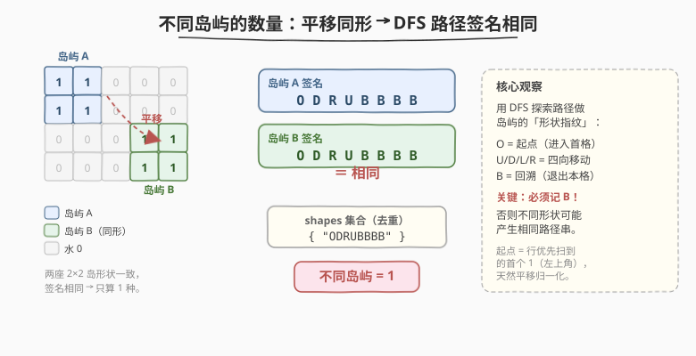
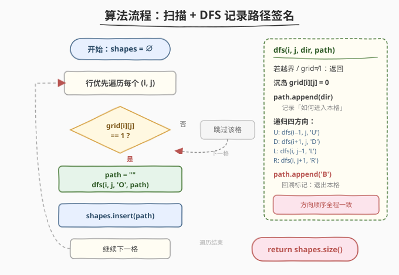
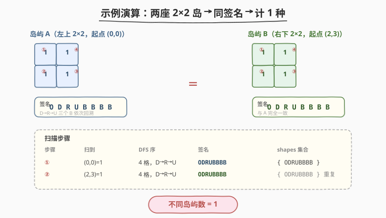

# 不同岛屿的数量

- **题目名称**：不同岛屿的数量
- **链接**：[694. 不同岛屿的数量](https://leetcode.cn/problems/number-of-distinct-islands/)
- **难度**：中等
- **标签**：深度优先搜索、广度优先搜索、并查集、哈希表、数组、矩阵

## 1. 题目概述

给你一个大小为 `m x n` 的二进制矩阵 `grid`。**岛屿** 是由一些相邻的 `1`（土地）构成的组合，这里的「相邻」要求两个 `1` 必须在**水平或竖直**四个方向上相邻。你可以假设 `grid` 的四个边缘都被 `0`（水）包围。

如果一座岛屿**可以通过平移**（不能旋转或翻转）与另一座岛屿完全重合，就认为它们是**同一座**岛屿。请你返回 `grid` 中**不同岛屿的数量**。

**示例 1**：

```text
输入：grid = [
  [1,1,0,0,0],
  [1,1,0,0,0],
  [0,0,0,1,1],
  [0,0,0,1,1]
]
输出：1
解释：左上角的 2×2 岛与右下角的 2×2 岛形状一致（仅位置不同），故只算 1 种。
```

**示例 2**：

```text
输入：grid = [
  [1,1,0,1,1],
  [1,0,0,0,0],
  [0,0,0,0,1],
  [1,1,0,1,1]
]
输出：3
解释：共有 4 座岛，其中两座为横向 2 格（同形），另两座为不同朝向的 L 形（互不同形），
      因此不同形状数为 3。
```

**约束条件**：

- `m == grid.length`
- `n == grid[i].length`
- `1 <= m, n <= 50`
- `grid[i][j]` 为 `0` 或 `1`

---

## 2. 解题思路

### 2.1 暴力思路

先用 DFS 找出所有岛屿（每个岛屿用一个格子坐标集合表示），再两两比较：把一座岛的所有坐标平移到使左上角对齐，检查平移后的集合是否完全相等。共 $k$ 座岛时比较开销 $O(k^2 \cdot s)$（$s$ 为岛屿大小），实现繁琐且常数大。

> 💡 更聪明的做法是给**每座岛屿算一个「形状指纹」**，相同形状必然产生相同指纹，丢进哈希集合去重即可——把 $O(k^2)$ 的两两比较降为 $O(k)$ 的集合插入。

### 2.2 核心观察：DFS 路径签名



关键洞察：**用 DFS 探索岛屿时记录的「移动路径」作为岛屿的形状指纹**——只要 DFS 的方向顺序全程一致，且起点取每座岛行优先扫描到的首个 `1`（即该岛的最上、最左格，天然完成平移归一化），那么两座岛能平移重合 ⟺ 它们的路径签名完全相同。

签名编码规则：

| 字符 | 含义 |
|------|------|
| `O` | 起点（进入首格） |
| `U` / `D` / `L` / `R` | 向上 / 下 / 左 / 右走到邻居 |
| `B` | **回溯**（退出当前格，递归返回） |

> ⚠️ **回溯标记 `B` 不可或缺**。它记录「一棵子树探索完毕」的结构信息；缺少 `B` 时，不同形状可能塌缩成同一串方向字符。看下面这个反例：
>
> - **岛 A**：`1` / `1 1`（L 形，竖柄在左）
> - **岛 B**：`1 1` / `1`（L 形，竖柄在左但横臂在上）—— 二者互为旋转，**不能**平移重合。
>
> 以起点（左上角）按 `U,D,L,R` 顺序 DFS：
>
> | 岛屿 | 含 `B` 的签名 | 去掉 `B` 的签名 |
> |------|--------------|----------------|
> | A | `O D R B B B` | `O D R` |
> | B | `O D B R B B` | `O D R` |
>
> 含 `B` 时二者不同（正确判为不同形）；去掉 `B` 后都变成 `ODR`（**错误**判为同形）。`B` 把"先走 D 再走 R"与"先走 D 再回来再走 R"这两种不同的探索结构区分开。

### 2.3 算法流程



1. 初始化哈希集合 `shapes = ∅`。
2. 行优先遍历每个格子 `(i, j)`：
   - 若 `grid[i][j] == 1`：新建空串 `path`，调用 `dfs(i, j, 'O', path)` 探索整座岛并生成签名，再把 `path` 插入 `shapes`。
   - 否则跳过。
3. `dfs(i, j, dir, path)`：
   - 越界或 `grid[i][j] != 1` 直接返回。
   - **沉岛** `grid[i][j] = 0`（兼做 visited）。
   - `path.append(dir)`（记录如何进入本格）。
   - 按固定顺序 `U, D, L, R` 递归四个邻居。
   - `path.append('B')`（回溯标记）。
4. 遍历结束返回 `shapes.size()`。

> 💡 与 [200. 岛屿数量](../0101-0200/200_岛屿数量.md) / [695. 岛屿的最大面积](./695_岛屿的最大面积.md) 是同一套「扫描 + DFS 沉岛」模板：200 计数连通块、695 求最大面积、694 在 DFS 时多记一条路径串作为形状指纹去重。**模板不变，只是 DFS 的"副产品"从计数/求和变成了签名收集**。

### 2.4 示例演算

以示例 1 为例，两座 2×2 岛的 DFS 访问序与签名如下：



| 步骤 | 扫到 | DFS 访问序 | 签名 | shapes 集合 |
|------|------|-----------|------|------------|
| ① | `(0,0)=1` | `(0,0)→(1,0)→(1,1)→(0,1)` 即 D→R→U | `ODRUBBBB` | `{ ODRUBBBB }` |
| ② | `(2,3)=1` | 同样 D→R→U | `ODRUBBBB` | `{ ODRUBBBB }`（重复，不入） |

两座岛形状一致、签名相同，集合只剩 1 个元素，返回 `1`。

> 三个 `B` 依次对应从 `(0,1)`、`(1,1)`、`(1,0)` 回溯，最后一个 `B` 是退出起点 `(0,0)`。

---

## 3. 参考代码

### C++

```cpp
class Solution {
    int m, n;
    int dx[4] = {-1, 1, 0, 0};  // U, D, L, R
    int dy[4] = {0, 0, -1, 1};
    char dirChar[4] = {'U', 'D', 'L', 'R'};

    void dfs(vector<vector<int>>& grid, int i, int j, char dir, string& path) {
        if (i < 0 || i >= m || j < 0 || j >= n || grid[i][j] != 1)
            return;
        grid[i][j] = 0;            // 沉岛，兼做 visited
        path.push_back(dir);       // 记录如何进入本格
        for (int d = 0; d < 4; d++)
            dfs(grid, i + dx[d], j + dy[d], dirChar[d], path);
        path.push_back('B');       // 回溯标记
    }

  public:
    int numDistinctIslands(vector<vector<int>>& grid) {
        m = grid.size();
        n = grid[0].size();
        unordered_set<string> shapes;
        for (int i = 0; i < m; i++)
            for (int j = 0; j < n; j++)
                if (grid[i][j] == 1) {
                    string path;
                    dfs(grid, i, j, 'O', path);
                    shapes.insert(path);
                }
        return shapes.size();
    }
};
```

### Python

```python
class Solution:
    def numDistinctIslands(self, grid: List[List[int]]) -> int:
        m, n = len(grid), len(grid[0])
        shapes = set()
        dirs = [(-1, 0, 'U'), (1, 0, 'D'), (0, -1, 'L'), (0, 1, 'R')]

        def dfs(i, j, dir_char, path):
            if i < 0 or i >= m or j < 0 or j >= n or grid[i][j] != 1:
                return
            grid[i][j] = 0                 # 沉岛
            path.append(dir_char)          # 记录如何进入本格
            for di, dj, d in dirs:
                dfs(i + di, j + dj, d, path)
            path.append('B')               # 回溯标记

        for i in range(m):
            for j in range(n):
                if grid[i][j] == 1:
                    path = []
                    dfs(i, j, 'O', path)
                    shapes.add(''.join(path))
        return len(shapes)
```

---

## 4. 复杂度分析

| 维度 | 复杂度 | 说明 |
|------|--------|------|
| 时间复杂度 | $O(M \times N)$ | 每个格子至多被 DFS 进入一次（沉岛后不再进入）；签名串长度等于该岛 DFS 调用次数的两倍，总和不超过 $O(M \times N)$，哈希插入均摊 $O(1)$ |
| 空间复杂度 | $O(M \times N)$ | DFS 递归栈最坏深度为整块陆地大小；`shapes` 集合存所有岛屿签名，签名总长度同样 $O(M \times N)$ |

---

## 5. 扩展：相对坐标归一化

另一种等价且更直观的签名方式是**相对坐标归一化**：

1. DFS/BFS 收集一座岛的所有格子坐标。
2. 以起点 `(r0, c0)`（行优先首个 `1`，即左上角）为基准，每个格子减去 `(r0, c0)` 得相对坐标。
3. 把所有相对坐标排序后序列化为字符串（如 `"0,0;0,1;1,0;"`）作为签名，丢进集合去重。

该方法不需要回溯标记，但要把每个格子显式存下来再排序，常数略大。路径签名法把"形状"编码进递归结构本身，更紧凑。两者本质都是**给连通块找一个平移不变的规范表示**。

> 若题目改为「旋转/翻转后也算同形」（即自由多联骨牌，free polyomino），则需要枚举 8 种刚体变换后取字典序最小者作规范形，远比本题复杂。

---

## 6. 面试要点

1. **为什么起点取行优先首个 `1` 就能保证平移归一化？**

   - 行优先扫描到的首个 `1` 是该岛**行号最小、且该行中最左**的格子，即岛的左上角。两座能平移重合的岛，其左上角在各自局部坐标系中都对应同一相对位置，因此从左上角出发的 DFS 路径必然一致。

2. **回溯标记 `B` 到底起什么作用？为什么不加会出错？**

   - `B` 标记"一棵子递归树探索完毕、控制权回到父节点"。它把"先向下探索到底再向右"与"先向下走一步就返回、再向右"这两种**不同的子树结构**区分开。去掉 `B` 后只剩方向序列，不同形状的岛可能塌缩成相同方向串（见 2.2 反例：`ODRBBB` 与 `ODBRBB` 去掉 `B` 都变 `ODR`）。

3. **方向顺序重要吗？换一种顺序会出错吗？**

   - 顺序**不影响正确性**，但必须**全程一致**。只要对每座岛都用同一套 `U,D,L,R` 顺序，能平移重合的岛必然生成相同签名。换了顺序也只是签名串整体改变，相同形状的岛依然同号、不同形状依然异号。

4. **如果输入不允许修改（不能沉岛）怎么办？**

   - 新建 `visited` 布尔矩阵代替沉岛，逻辑完全一致，空间多 $O(M \times N)$；或在 DFS 出栈时把格子改回 `1`（回溯复原），但那样同座岛内会重复进入、需靠 `visited` 判重，不如沉岛简洁。

5. **路径签名法与相对坐标法各有什么取舍？**

   - 路径签名：边走边拼串，无需存全部坐标，常数小、代码短；缺点是依赖固定 DFS 顺序与回溯标记，正确性较"隐式"。
   - 相对坐标：直观易解释、不依赖遍历顺序；缺点是要存坐标再排序，常数略大。面试中先讲路径签名展示技巧，再提相对坐标作为更易理解的替代。

---

## 7. 同类练习题

- [200. 岛屿数量](https://leetcode.cn/problems/number-of-islands/)（[题解](../0101-0200/200_岛屿数量.md)）：同模板的「计数」版本，先做 200 再做 694 最佳
- [695. 岛屿的最大面积](https://leetcode.cn/problems/max-area-of-island/)（[题解](./695_岛屿的最大面积.md)）：同模板的「求面积」版本，DFS 沉岛 + 副产品收集
- [1254. 统计封闭岛屿的数目](https://leetcode.cn/problems/number-of-closed-islands/)：连通块 + 边界判断，DFS 时多记一个"是否触界"标志
- [711. 不同岛屿的数量 II](https://leetcode.cn/problems/number-of-distinct-islands-ii/)：升级版，旋转/翻转后同形也算同岛，需枚举 8 种刚体变换取规范形
- [1905. 统计子岛屿](https://leetcode.cn/problems/count-sub-islands/)：双网格连通块包含关系，DFS 同时校验
