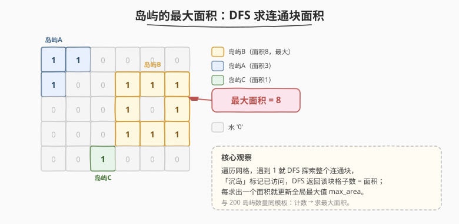
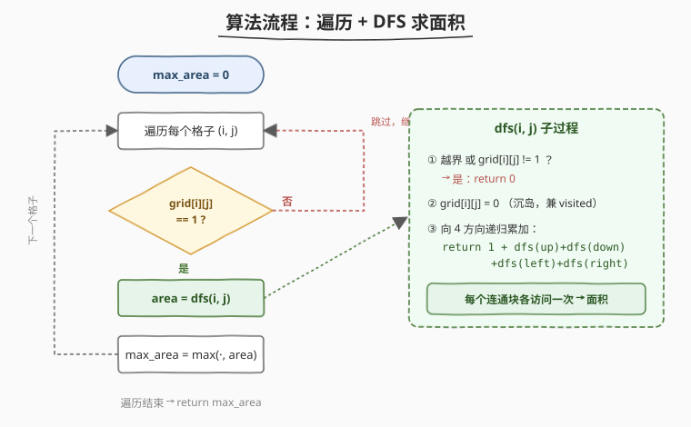

# 岛屿的最大面积

- **题目名称**：岛屿的最大面积
- **链接**：[695. 岛屿的最大面积](https://leetcode.cn/problems/max-area-of-island/)
- **难度**：中等
- **标签**：深度优先搜索、广度优先搜索、并查集、数组、矩阵

## 1. 题目概述

给你一个大小为 `m x n` 的二进制矩阵 `grid`。**岛屿** 是由一些相邻的 `1`（土地）构成的组合，这里的「相邻」要求两个 `1` 必须在**水平或竖直**四个方向上相邻。你可以假设 `grid` 的四个边缘都被 `0`（水）包围。

岛屿的面积是岛上值为 `1` 的格子的数目。计算并返回 `grid` 中最大的岛屿面积。如果没有岛屿，返回 `0`。

**示例 1**：

```text
输入：grid = [
  [0,0,1,0,0,0,0,1,0,0,0,0,0],
  [0,0,0,0,0,0,0,1,1,1,0,0,0],
  [0,1,1,0,1,0,0,0,0,0,0,0,0],
  [0,1,0,0,1,1,0,0,1,0,1,0,0],
  [0,1,0,0,1,1,0,0,1,1,1,0,0],
  [0,0,0,0,0,0,0,0,0,0,1,0,0],
  [0,0,0,0,0,0,0,1,1,1,0,0,0],
  [0,0,0,0,0,0,0,1,1,0,0,0,0]
]
输出：6
解释：答案不应该是 11，因为岛屿只能包含水平或垂直连接的 1。
```

**示例 2**：

```text
输入：grid = [[0,0,0,0,0,0,0,0]]
输出：0
```

**约束条件**：

- `m == grid.length`
- `n == grid[i].length`
- `1 <= m, n <= 50`
- `grid[i][j]` 为 `0` 或 `1`

---

## 2. 解题思路

### 2.1 暴力思路

枚举所有格子作为起点，对每个起点 BFS/DFS 统计所在连通块大小，过程中用一个 `visited` 数组避免重复。这样每个连通块会被它的**每个格子**各重复探索一次，最坏 `O((M×N)^2)`，会超时且冗余。

### 2.2 核心观察：DFS 沉岛法求面积



关键洞察：**遍历网格，遇到** `1` **就 DFS 探索整个连通块，边探索边「沉岛」（标记为** `0`**），DFS 返回的格子数即该岛面积；用全局变量维护面积最大值。**

> 💡 这与 [200. 岛屿数量](../0101-0200/200_岛屿数量.md) 是同一套模板：200 是「遇到 1 → 计数 +1 + 沉岛」，695 只是「遇到 1 → DFS 算面积 + 沉岛 + 更新 max」。**计数变求和**，本质都是「连通分量的发现与标记」。

### 2.3 算法流程



1. 初始化 `max_area = 0`。
2. 行优先遍历每个格子 `(i, j)`：
   - 若 `grid[i][j] == 1`：调用 `area = dfs(i, j)`，再 `max_area = max(max_area, area)`。
   - 否则跳过。
3. `dfs(i, j)`：越界或 `grid[i][j] != 1` 返回 `0`；否则先「沉岛」`grid[i][j] = 0`，再返回 `1 + 四方向 dfs 之和`。
4. 遍历结束返回 `max_area`。

> ⚠️ 沉岛必须**在递归四个方向之前**完成，否则同一个格子会被多个邻居重复进入，导致面积重复计算甚至无限递归。

### 2.4 示例演算

为便于观察 DFS 访问顺序，用一个 `5×6` 的网格（含三座岛屿，最大面积为 8）：


| 步骤 | 遇到 | DFS 沉岛块 | area | max_area |
|------|------|-----------|------|----------|
| ① | (0,0)=1 | 沉岛屿A（3 格） | 3 | 3 |
| ② | (1,3)=1 | 沉岛屿B（8 格） | 8 | **8** |
| ③ | (4,2)=1 | 沉岛屿C（1 格） | 1 | 8 |

扫描到 (1,3) 时，岛屿A 的格子早已被沉为 `0`，不会再进入 DFS。最终返回 `8`。

---

## 3. 参考代码

### C++

```cpp
class Solution {
    int m, n;
    int dx[4] = {0, 0, 1, -1};
    int dy[4] = {1, -1, 0, 0};

    int dfs(vector<vector<int>>& grid, int i, int j) {
        if (i < 0 || i >= m || j < 0 || j >= n || grid[i][j] != 1)
            return 0;
        grid[i][j] = 0; // 沉岛，兼做 visited
        int area = 1;
        for (int d = 0; d < 4; d++)
            area += dfs(grid, i + dx[d], j + dy[d]);
        return area;
    }

  public:
    int maxAreaOfIsland(vector<vector<int>>& grid) {
        m = grid.size();
        n = grid[0].size();
        int max_area = 0;
        for (int i = 0; i < m; i++)
            for (int j = 0; j < n; j++)
                if (grid[i][j] == 1)
                    max_area = max(max_area, dfs(grid, i, j));
        return max_area;
    }
};
```

### Python

```python
class Solution:
    def maxAreaOfIsland(self, grid: List[List[int]]) -> int:
        m, n = len(grid), len(grid[0])
        max_area = 0

        def dfs(i, j):
            if i < 0 or i >= m or j < 0 or j >= n or grid[i][j] != 1:
                return 0
            grid[i][j] = 0  # 沉岛
            return 1 + dfs(i + 1, j) + dfs(i - 1, j) + dfs(i, j + 1) + dfs(i, j - 1)

        for i in range(m):
            for j in range(n):
                if grid[i][j] == 1:
                    max_area = max(max_area, dfs(i, j))
        return max_area
```

---

## 4. 复杂度分析

| 维度 | 复杂度 | 说明 |
|------|--------|------|
| 时间复杂度 | `O(M × N)` | 每个格子至多被 DFS 进入一次（沉岛后不再进入） |
| 空间复杂度 | `O(M × N)` | DFS 递归栈最坏深度为整块陆地的大小；BFS 则为队列开销 |

---

## 5. 扩展：BFS 与不允许修改输入

- **BFS 写法**：用队列替代递归，从起点入队，每次取出一个格子累加面积并沉岛，把四方向的 `1` 入队。时间复杂度同为 `O(M×N)`，但能避免 Python 在极大网格上的递归栈溢出。
- **不可修改输入**：若题目要求保留原 `grid`，则新建一个 `visited` 布尔矩阵（空间 `O(M×N)`），用 `visited[i][j]` 代替「沉岛」标记即可，逻辑完全一致。
- **并查集**：遍历每个 `1` 格子，与左/上邻居 union，再用一个 size 数组维护每个根的连通块大小，最后取所有 `1` 格子根的 size 最大值。适合需要动态连通性查询的变体。

---

## 6. 面试要点

1. **和 200 岛屿数量的区别是什么？**

   - 200 是「数有几个连通块」（计数），695 是「求最大连通块的大小」（求和取 max）。模板一致，DFS 的返回值从「无（void 沉岛）」变成「累计面积」。

2. **为什么「沉岛」能省去 visited 数组？**

   - 把已访问的陆地改成 `0`，后续遍历与递归遇 `0` 自然跳过，原地标记省下 `O(M×N)` 额外空间。前提是允许修改输入；否则需 `visited` 矩阵。

3. **沉岛语句放在递归前还是后？为什么？**

   - 必须**在递归四方向之前**沉岛。否则当前格子仍是 `1`，邻居递归时会再次把它当作土地进入，导致面积重复统计甚至死递归。

4. **DFS 与 BFS 在这题如何取舍？**

   - 时间复杂度都是 `O(M×N)`；DFS 写法简洁但递归栈最坏 `O(M×N)`，Python 大网格可能栈溢出；BFS 用显式队列，栈深度无忧但代码略长。面试中先写 DFS 讲清思路，再提 BFS 作为健壮性补充。

5. **如果统计所有岛屿面积之和或岛屿面积排序呢？**

   - 同一套遍历+沉岛：把每次 `dfs` 返回的面积收集进列表即可求和/排序/取第 K 大。说明该模板可迁移到「连通块大小」一族问题。

---

## 7. 同类练习题

- [200. 岛屿数量](https://leetcode.cn/problems/number-of-islands/)（[题解](../0101-0200/200_岛屿数量.md)）：同模板的「计数」版本，先做 200 再做 695 最佳
- [463. 岛屿的周长](https://leetcode.cn/problems/island-perimeter/)：单岛求周长，DFS/直接遍历统计「水边界」条数
- [1254. 统计封闭岛屿的数目](https://leetcode.cn/problems/number-of-closed-islands/)：连通块 + 边界判断，先沉掉接触边界的岛再计数
- [1905. 统计子岛屿](https://leetcode.cn/problems/count-sub-islands/)：双网格连通块包含关系，DFS 同时校验
- [827. 最大人工岛](https://leetcode.cn/problems/making-a-large-island/)：把至多一个 `0` 翻成 `1` 后的最大面积，DFS 预处理各岛屿面积 + 哈希连通
