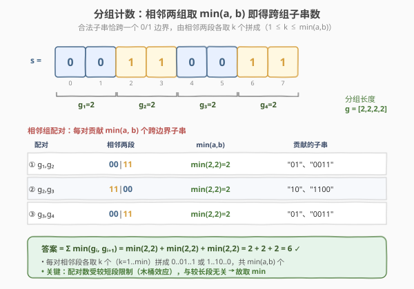
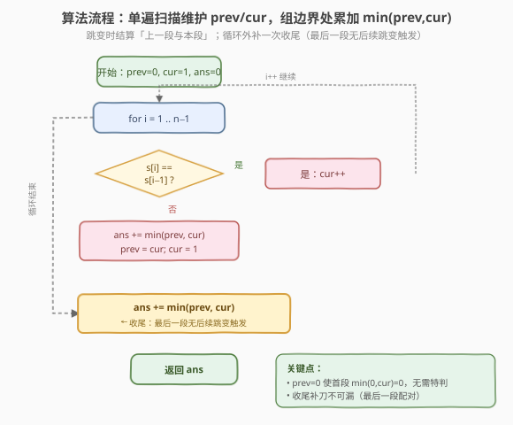
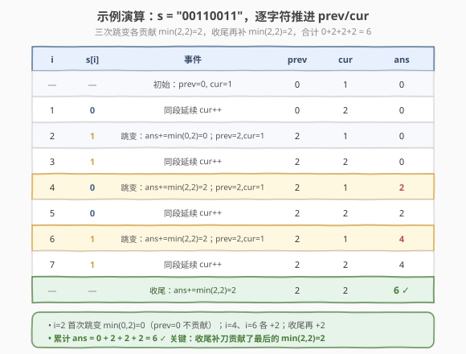

# LeetCode 计数二进制子串 题解

## 1. 题目概述

- **标题 / 题号**：计数二进制子串（#696，easy）
- **链接**：https://leetcode.cn/problems/count-binary-substrings/
- **难度**：简单
- **标签**：字符串、分组、双指针

**题意**：给定一个二进制字符串 `s`，统计并返回其中**非空**且**具有相同数量 `0` 和 `1`** 的子串个数，并且这些子串中**所有的 `0` 和所有的 `1` 都是连续分组**的（即 `0` 与 `1` 不能交错出现）。多次出现的子串按出现次数累计计数。

**示例 1**：

```text
输入：s = "00110011"
输出：6
解释：满足条件的子串共 6 个："0011"、"01"、"1100"、"10"、"0011" 和 "01"。
      注意，"00110011" 中第 3 个字符起的 "0011" 与开头的 "0011" 因起止位置不同分别计数。
```

**示例 2**：

```text
输入：s = "10101"
输出：4
解释：满足条件的子串共 4 个："10"、"01"、"10"、"01"。
```

**约束**：

- `1 <= s.length <= 10^5`
- `s[i]` 为 `'0'` 或 `'1'`

> 💡 本题的关键不在「枚举子串」，而在「**看清子串的结构**」。满足条件的子串必然形如 `0...01...1` 或 `1...10...0`，即**恰好跨越一个 `0/1` 边界**，且边界两侧取用相同数量的字符。把字符串按连续相同字符**分组**后，问题立刻坍缩成「相邻两组各贡献多少对」——这是「分组 + 相邻组取 `min`」的招牌题，时间 `O(n)`、空间 `O(1)`。

## 2. 解题思路

### 2.1 暴力思路：枚举所有子串逐个判定

双重循环枚举所有子串 `s[i..j]`，检查其中 `0` 和 `1` 数量是否相等，且 `0`、`1` 各自连续（即子串中字符**至多发生一次跳变**）。

```text
ans = 0
for i in 0..n:
    for j in i..n:
        if s[i..j] 中 0/1 数量相等 且 至多一次跳变:
            ans += 1
```

时间复杂度 `O(n³)`（`O(n²)` 个子串 × `O(n)` 判定），`n = 10^5` 时约 `10^15`，**必然超时**。

> ⚠️ 暴力法的问题在于**没有利用结构**：合法子串必然跨越某个 `0/1` 边界，且边界两侧的 `0`、`1` 各自成段。逐一枚举子串再做内部判定，完全忽视了这一几何结构。

### 2.2 核心观察：分组 + 相邻组取 min



**关键性质**：任何合法子串必然**恰好跨越一个 `0/1` 边界**。因为合法子串要求 `0`、`1` 数量相等且各自连续，所以它只能形如：

- `00...0 11...1`（前段 `0`，后段 `1`），或
- `11...1 00...0`（前段 `1`，后段 `0`）。

**第一步——分组**：把 `s` 按连续相同字符切成若干段，记录每段长度。例如 `s = "00110011"` 分组为长度数组 `[2, 2, 2, 2]`（两段 `0`、两段 `1` 交替），`s = "10101"` 分组为 `[1, 1, 1, 1, 1]`。

**第二步——相邻组配对**：合法子串只可能由**相邻的两个不同字符段**拼成。设相邻两段长度为 `a` 和 `b`（一段 `0`、一段 `1`），则可拼出的子串为：

- 取 `k` 个 `0` + `k` 个 `1`，其中 `1 <= k <= min(a, b)`。

因此每一对相邻组贡献 **`min(a, b)`** 个合法子串。答案即

$$
\text{ans} = \sum_{i=0}^{m-2} \min(\,g_i,\; g_{i+1}\,)
$$

其中 $g$ 为分组长度数组，$m$ 为组数。

> 💡 **为什么是 `min` 而不是 `max` 或 `a+b`？** 两段长度 `a`、`b`，要配成「`k` 个 `0` + `k` 个 `1`」，`k` 同时受 `a` 和 `b` 双向约束：`k <= a` 且 `k <= b`，故 `k` 的取值个数为 `min(a, b)`。这正是「木桶效应」——能配多少对，取决于较短的那段。

> ⚠️ **不能跨多个边界**：如 `0011` 合法，但 `001100` 不合法（它跨越了 `0→1` 和 `1→0` 两个边界，`0`、`1` 不再各自连续成一段）。因此只需看**相邻**两组，不必考虑相隔的组。

**以 `s = "00110011"` 为例**：分组 `[2, 2, 2, 2]`，三对相邻组：

| 相邻组 | min | 贡献的子串 |
|--------|-----|-----------|
| `(2, 2)` 00\|11 | `min(2,2)=2` | `"01"`、`"0011"` |
| `(2, 2)` 11\|00 | `min(2,2)=2` | `"10"`、`"1100"` |
| `(2, 2)` 00\|11 | `min(2,2)=2` | `"01"`、`"0011"` |

合计 `2 + 2 + 2 = 6`，与示例一致。

### 2.3 算法流程图



**空间优化**：不必真的存下整个 `g` 数组。只需用两个滚动变量：

- `cur`：**当前**正在扩展的连续段长度（已累计的字符数）。
- `prev`：**上一段**（与当前段字符不同的前一段）的长度。

扫描时：

1. `s[i] == s[i-1]`：当前段还在延续，`cur++`。
2. `s[i] != s[i-1]`：发生跳变，**上一段已经结束**——此时把 `min(prev, cur)` 累加到答案（上一段与当前刚结束的段的配对），然后 `prev = cur`、`cur = 1` 开启新段。
3. 循环结束后，**最后一段**还没参与配对，需补一次 `ans += min(prev, cur)`。

> 💡 `prev` 初始为 `0`：第一段没有「上一段」可配，`min(0, cur) = 0`，自然不贡献，无需特判。

### 2.4 示例演算

以 `s = "00110011"` 为例，逐步维护 `prev / cur / ans`：



| `i` | `s[i]` | 事件 | `prev` | `cur` | `ans` |
|-----|--------|------|--------|-------|-------|
| — | 初始 | `prev=0, cur=1` | 0 | 1 | 0 |
| 1 | `0` | 同段延续 `cur++` | 0 | 2 | 0 |
| 2 | `1` | 跳变：`ans+=min(0,2)`; `prev=2,cur=1` | 2 | 1 | 0 |
| 3 | `1` | 同段延续 `cur++` | 2 | 2 | 0 |
| 4 | `0` | 跳变：`ans+=min(2,2)=2`; `prev=2,cur=1` | 2 | 1 | 2 |
| 5 | `0` | 同段延续 `cur++` | 2 | 2 | 2 |
| 6 | `1` | 跳变：`ans+=min(2,2)=2`; `prev=2,cur=1` | 2 | 1 | 4 |
| 7 | `1` | 同段延续 `cur++` | 2 | 2 | 4 |
| — | 终止 | `ans+=min(2,2)=2`（收尾） | 2 | 2 | **6** |

最终 `ans = 6`。三次跳变各贡献 `min(2,2)=2`，加上收尾一次 `min(2,2)=2`，共 `4 × 2 / ... ` 实为 `0 + 2 + 2 + 2 = 6`（首段 `prev=0` 那次贡献 `0`）。

> 💡 **收尾不可漏**：最后一段（这里是末尾的 `"11"`，长度 2）没有后续跳变触发配对，必须在循环外补一次 `ans += min(prev, cur)`。这是本题最常见的 off-by-one 来源。

## 3. 参考代码

### C++（滚动 prev/cur，O(1) 空间）

```cpp
class Solution {
  public:
    int countBinarySubstrings(string s) {
        int ans = 0, prev = 0, cur = 1;
        for (int i = 1; i < (int)s.size(); ++i) {
            if (s[i] == s[i - 1]) {
                ++cur;                       // 当前段延续
            } else {
                ans += min(prev, cur);       // 上一段与本段配对
                prev = cur;                  // 本段晋升为上一段
                cur = 1;                     // 开启新段
            }
        }
        ans += min(prev, cur);               // 收尾：最后一段配对
        return ans;
    }
};
```

### Python

```python
class Solution:
    def countBinarySubstrings(self, s: str) -> int:
        ans = 0
        prev, cur = 0, 1
        for i in range(1, len(s)):
            if s[i] == s[i - 1]:
                cur += 1                     # 当前段延续
            else:
                ans += min(prev, cur)        # 上一段与本段配对
                prev = cur                   # 本段晋升为上一段
                cur = 1                      # 开启新段
        ans += min(prev, cur)                # 收尾：最后一段配对
        return ans
```

> ⚠️ 两个易错点：① **`prev` 初始为 `0`**，让第一段自然贡献 `0`，避免特判首段；② **循环外必须补 `ans += min(prev, cur)`**，否则会漏掉最后一段与倒数第二段的配对。

## 4. 复杂度分析

| 维度 | 复杂度 | 说明 |
|------|--------|------|
| 时间复杂度 | `O(n)` | 单遍扫描，每个字符只访问一次，`min` 为 `O(1)` |
| 空间复杂度 | `O(1)` | 仅用 `prev / cur / ans` 三个变量，不存储分组数组 |

> 💡 若用「先收集分组长度数组再求和」的写法，时间仍为 `O(n)`，空间升为 `O(m)`（`m` 为组数，最坏 `O(n)`）。滚动变量版在不牺牲可读性的前提下把空间压到 `O(1)`，是面试首选。

## 5. 扩展：增量单遍扫描（无需收尾）

上面的写法在「跳变时」一次性结算 `min(prev, cur)`，并需循环外补一刀。还有一种更紧凑的**逐字符增量**写法：每推进一位，只要「当前段长度 `cur` 不超过上一段长度 `prev`」，就以 `i` 为右端点贡献一个合法子串。

```cpp
class Solution {
  public:
    int countBinarySubstrings(string s) {
        int ans = 0, prev = 0, cur = 1;
        for (int i = 1; i < (int)s.size(); ++i) {
            if (s[i] == s[i - 1]) {
                ++cur;
            } else {
                prev = cur;
                cur = 1;
            }
            if (prev >= cur) {              // 还能从上一段借到 cur 个字符
                ++ans;                      // 以 i 结尾形成一个新子串
            }
        }
        return ans;
    }
};
```

```python
class Solution:
    def countBinarySubstrings(self, s: str) -> int:
        ans = 0
        prev, cur = 0, 1
        for i in range(1, len(s)):
            if s[i] == s[i - 1]:
                cur += 1
            else:
                prev = cur
                cur = 1
            if prev >= cur:                 # 还能从上一段借到 cur 个字符
                ans += 1                    # 以 i 结尾形成一个新子串
        return ans
```

**正确性直觉**：以位置 `i` 为右端点，向左取 `cur` 个同字符（当前段），再向左取 `cur` 个异字符（上一段），恰好拼成 `0..01..1` 或 `1..10..0`。只要上一段长度 `prev >= cur`，这 `2*cur` 个字符就都存在且连续，构成一个合法子串。每推进一位 `cur` 增 1，能借的余量减 1，一旦 `cur > prev` 就借不足而停止贡献——这恰好等价于该对相邻组贡献 `min(prev, cur)` 个。

> 💡 **两种写法的等价性**：增量版把「一对相邻组的 `min(a,b)`」摊到该组推进的每一步上——`cur = 1,2,...,min(a,b)` 时各贡献 1，共 `min(a,b)` 个；`cur > a` 后停止。与边界结算版结果一致，但省掉了循环外的收尾语句。理解边界版足以应对面试，增量版适合追求极简代码的选手。

## 6. 面试要点

1. **合法子串的结构是什么？为什么只能跨越一个 `0/1` 边界？**

   > 形如 `0..01..1` 或 `1..10..0`，即两段同字符拼接。因为题目要求 `0`、`1` 各自连续，子串内字符跳变次数只能是 1（跳变 0 次则全是同一种字符，`0`、`1` 数量不可能相等；跳变 ≥2 次则 `0`、`1` 不再各自成段）。因此合法子串恰由**相邻的两个不同字符段**拼成。

2. **为什么每对相邻组贡献 `min(a, b)` 而非 `a + b`？**

   > 两段长度 `a`、`b`，要拼成「`k` 个 `0` + `k` 个 `1`」需 `k <= a` 且 `k <= b`，`k` 的可行取值个数为 `min(a, b)`。配对数受较短段限制（木桶效应），与较长段无关。

3. **`prev` 为什么初始化为 `0`？需要特判首段吗？**

   > 不需要。第一段没有「上一段」可配，`min(0, cur) = 0`，第一次跳变时贡献 0，等价于跳过首段。用 `0` 这个「虚拟空段」统一了首段处理，避免了 if/else 特判。

4. **循环外那次 `ans += min(prev, cur)` 为什么不能漏？**

   > 跳变时结算的是「上一段与本段」的配对，但**最后一段**永远等不到下一次跳变来触发结算。若不在循环外补一次，会漏掉最后两段的配对。例如 `s = "0011"`，循环内只在 `i=2` 跳变时结算了首段（贡献 `min(0,2)=0`），真正的 `min(2,2)=2` 必须靠收尾补上。

5. **时间复杂度为什么是 `O(n)`？分组数最坏不是 `O(n)` 吗？**

   > 组数 `m` 最坏为 `n`（如 `"10101"`），但求和只对相邻组扫一遍，总工作量正比于组数 `O(m) <= O(n)`；滚动变量版更是单遍扫描字符，每个字符 `O(1)`，总计 `O(n)`。空间 `O(1)` 是因为只存 `prev / cur`，不存整个分组数组。

> 💡 **一句话总结**：计数二进制子串是「分组 + 相邻组取 `min`」的招牌题。看清「合法子串恰跨一个 `0/1` 边界」这一结构，问题就从「枚举子串」坍缩成「相邻段配对」；用 `prev / cur` 滚动即可做到 `O(n)` 时间、`O(1)` 空间，难点只剩首段初始化与收尾结算两处细节。

## 同类练习题

| # | 题目 | 与本题的关联 |
|---|------|-------------|
| 647 | [回文子串](https://leetcode.cn/problems/palindromic-substrings/)（[题解](../0601-0700/647_回文子串.md)） | 同为「子串计数」家族，本题按分组配对、647 按中心扩展，对照两种计数视角 |
| 1513 | [仅含 1 的子串数](https://leetcode.cn/problems/number-of-substrings-with-only-1s) | 同为二进制串子串计数，按 `1` 的连续段长度 `l` 求和 `l*(l+1)/2` |
| 1869 | [哪种连续子字符串更长](https://leetcode.cn/problems/longer-contiguous-segments-of-ones-than-zeros/) | 同为二进制串分组，比较 `0`、`1` 连续段长度关系 |
| 1784 | [检查二进制字符串字段](https://leetcode.cn/problems/check-if-binary-string-has-at-most-one-segment-of-ones/) | 二进制串分段判定，巩固「连续段」概念 |
| 1446 | [连续字符](https://leetcode.cn/problems/consecutive-characters/) | 连续相同字符段的最长长度，本题分组的子问题 |
