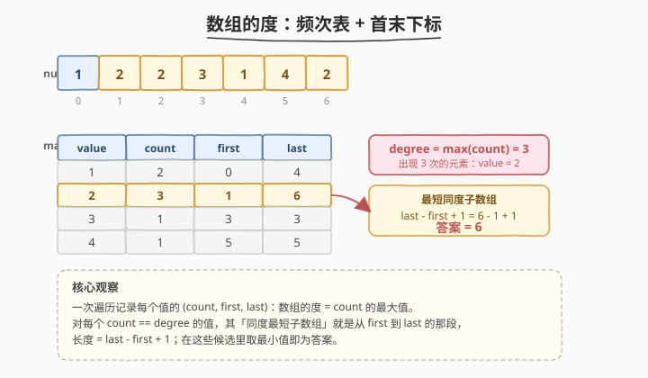
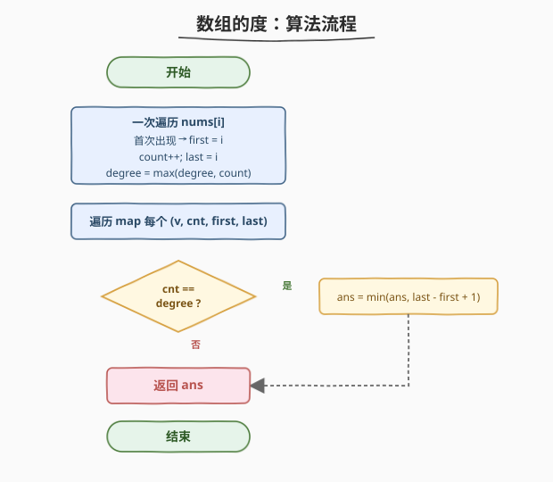
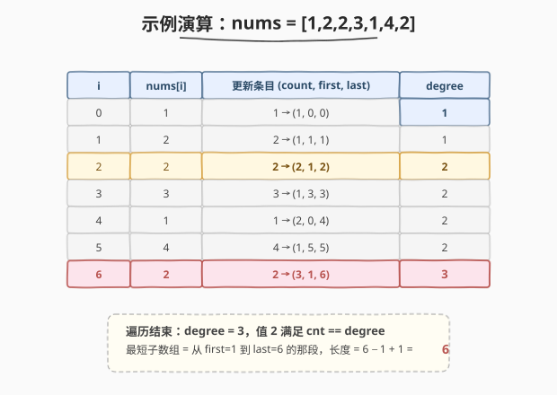

# LeetCode 数组的度 题解

## 1. 题目概述

- **标题 / 题号**：数组的度（#697，easy）
- **链接**：https://leetcode.cn/problems/degree-of-an-array/
- **难度**：简单
- **标签**：数组、哈希表

**题意**：给定一个非空且只包含非负整数的数组 `nums`，数组的**度**定义为其中任一元素出现次数的最大值。你的任务是找到 `nums` 中**最短的连续子数组**，使得该子数组的度与原数组相同，返回这个最短子数组的长度。

**示例 1**：

```text
输入：nums = [1, 2, 2, 3, 1]
输出：2
解释：数组的度是 2（元素 1 和 2 都出现 2 次）。度同为 2 的子数组有
     [1,2,2,3,1]、[1,2,2,3]、[2,2,3,1]、[1,2,2]、[2,2,3]、[2,2]，
     最短长度为 2，故返回 2。
```

**示例 2**：

```text
输入：nums = [1,2,2,3,1,4,2]
输出：6
解释：数组的度是 3（元素 2 出现 3 次）。度同为 3 的最短子数组是
     [2,2,3,1,4,2]，长度为 6。
```

**约束**：

- `nums.length` 在 `1` 到 `50,000` 之间
- `nums[i]` 是一个在 `0` 到 `49,999` 之间的整数

## 2. 解题思路

### 2.1 暴力思路

枚举所有连续子数组 `nums[i..j]`（共 `O(n^2)` 个），对每个子数组重新统计频次求度，若度等于原数组的度则更新最短长度。时间复杂度 `O(n^3)`（每个子数组统计频次 `O(n)`），`n ≤ 50000` 必然超时，且对同度子数组的判定存在大量重复计算。

### 2.2 核心观察：频次表 + 首末下标



关键洞察：**要让一个子数组拥有与原数组相同的度，它必须至少完整包含「某个达到度的元素」的全部出现位置。** 而包含某元素全部出现位置的最短子数组，正是从该元素的**首次出现下标** `first` 到**末次出现下标** `last` 的这段——再短就会漏掉至少一次出现，度便不够。

> 💡 因此只需一次遍历，用哈希表为每个值记录三元组 `(count, first, last)`：
> - **度** `degree = max(count)`；
> - 对每个 `count == degree` 的值，候选长度 `= last - first + 1`；
> - 在所有候选中取**最小值**即为答案。
>
> 本质是「频次统计」与「位置区间」两条信息合二为一，避免了对子数组的暴力枚举。

### 2.3 算法流程



1. 初始化哈希表 `mp`（值为 `(count, first, last)`）、`degree = 0`。
2. 一次遍历 `nums[i]`：
   - 若 `nums[i]` 首次出现：`mp[v] = (1, i, i)`；
   - 否则：`count += 1`，`last = i`（`first` 不变）。
   - 更新 `degree = max(degree, count)`。
3. 初始化 `ans = n`，遍历 `mp` 中每个 `(count, first, last)`：
   - 若 `count == degree`：`ans = min(ans, last - first + 1)`。
4. 返回 `ans`。

> ⚠️ `degree` 可以在第一次遍历中同步维护（每更新一个值的 `count` 就取一次 `max`），无需单独再扫一遍 `mp`；但第二趟扫描 `mp` 取最小候选长度不可省。

### 2.4 示例演算

以 `nums = [1,2,2,3,1,4,2]` 为例，逐位置看 `mp` 与 `degree` 的演化：



| 步骤 | i | nums[i] | 更新条目 | degree | 说明 |
|------|---|---------|----------|--------|------|
| ① | 0 | 1 | `1 → (1,0,0)` | 1 | 新增 |
| ② | 1 | 2 | `2 → (1,1,1)` | 1 | 新增 |
| ③ | 2 | 2 | `2 → (2,1,2)` | **2** | 度升至 2 |
| ④ | 3 | 3 | `3 → (1,3,3)` | 2 | 新增 |
| ⑤ | 4 | 1 | `1 → (2,0,4)` | 2 | last 更新 |
| ⑥ | 5 | 4 | `4 → (1,5,5)` | 2 | 新增 |
| ⑦ | 6 | 2 | `2 → (3,1,6)` | **3** | 度升至 3 |

遍历结束：`degree = 3`，仅值 `2` 满足 `count == degree`，候选长度 `= 6 − 1 + 1 = 6`，答案为 **6**。值 `1` 虽然 `count = 2`，但未达到度 `3`，不参与候选。

## 3. 参考代码

### C++

```cpp
class Solution {
  public:
    int findShortestSubArray(vector<int>& nums) {
        // mp[v] = {count, first, last}
        unordered_map<int, vector<int>> mp;
        int degree = 0;
        for (int i = 0; i < (int)nums.size(); ++i) {
            int v = nums[i];
            if (mp.count(v)) {
                mp[v][0]++;
                mp[v][2] = i;
            } else {
                mp[v] = {1, i, i};
            }
            degree = max(degree, mp[v][0]);
        }
        int ans = nums.size();
        for (auto& [v, t] : mp)
            if (t[0] == degree)
                ans = min(ans, t[2] - t[1] + 1);
        return ans;
    }
};
```

### Python

```python
class Solution:
    def findShortestSubArray(self, nums: List[int]) -> int:
        # mp[v] = [count, first, last]
        mp = {}
        degree = 0
        for i, v in enumerate(nums):
            if v in mp:
                mp[v][0] += 1
                mp[v][2] = i
            else:
                mp[v] = [1, i, i]
            degree = max(degree, mp[v][0])
        ans = len(nums)
        for cnt, first, last in mp.values():
            if cnt == degree:
                ans = min(ans, last - first + 1)
        return ans
```

## 4. 复杂度分析

| 维度 | 复杂度 | 说明 |
|------|--------|------|
| 时间复杂度 | `O(n)` | 一次遍历建表 `O(n)`，再遍历 `mp`（至多 `n` 个条目）`O(n)` |
| 空间复杂度 | `O(n)` | 哈希表最多存储 `n` 个不同值的三元组 |

## 5. 扩展：值域数组替代哈希

题约束 `nums[i] ∈ [0, 49999]`，值域范围与 `n` 同量级。若不希望用哈希表（避免哈希常数 / 最坏退化），可用三个定长数组 `count[50000]`、`first[50000]`、`last[50000]` 代替：`first` 初始化为 `-1` 表示未出现。逻辑完全一致，访问为 `O(1)` 数组下标，常数更小、无哈希开销，在极致性能场景下更稳。

> 💡 哈希解法更具通用性（不依赖值域大小），数组解法适用于「值域有界且较小」的明确约束。面试中先讲哈希版，再提值域数组作为常数优化。

## 6. 面试要点

1. **为什么最短同度子数组一定是从某元素的 first 到 last？**

   - 子数组要达到度 `degree`，必须含某个出现 `degree` 次的元素的全部出现。少含任何一次，该元素在子数组内的频次就 `< degree`，度必然 `< degree`。所以最短就是「恰好框住某个度元素的首末位置」，长度 `last - first + 1`。

2. **如果有多个元素都达到度，怎么办？**

   - 每个达到度的元素都对应一个候选区间 `[first, last]`，分别算 `last - first + 1`，取最小值。题不保证度元素唯一，示例 1 中 `1` 和 `2` 都达到度 2，候选分别是 `[0,4]→5` 和 `[1,2]→2`，取最小 `2`。

3. **`degree` 何时计算？能否只扫一遍？**

   - 建表时同步维护 `degree = max(degree, count)` 即可，无需单独遍历求 max。但「在所有 `count == degree` 条目中取最小长度」仍需第二趟遍历 `mp`，无法与建表合并——因为建表过程中 `degree` 还可能继续增大，提前算候选没有意义。

4. **哈希表 vs 值域数组如何选？**

   - 值域有界且小（本题 `≤ 50000`）时数组常数更小、无哈希退化风险；值域大或未知时用哈希表更通用。两者时空复杂度同阶 `O(n)`。

5. **这题与「频次统计」类问题的共性？**

   - 都是用一次遍历 + 哈希把「值 → 元信息」建好，再基于元信息回答问题。如 [1. 两数之和](../0001-0100/1_两数之和.md) 存「值 → 下标」、[692. 前 K 个高频单词](../0601-0700/692_前K个高频单词.md) 存「单词 → 频次」再 Top-K，套路一致：**先建表，再查询**。

## 同类练习题

| # | 题目 | 与本题的关联 |
|---|------|-------------|
| 1 | [两数之和](https://leetcode.cn/problems/two-sum/)（[题解](../0001-0100/1_两数之和.md)） | 哈希表一次遍历存「值 → 下标」，同属「先建表再查询」范式 |
| 692 | [前 K 个高频单词](https://leetcode.cn/problems/top-k-frequent-words/)（[题解](../0601-0700/692_前K个高频单词.md)） | 频次统计 + Top-K，本题的「频次表」基础再进一步排序选前 K |
| 128 | [最长连续序列](https://leetcode.cn/problems/longest-consecutive-sequence/)（[题解](../0101-0200/128_最长连续序列.md)） | 哈希集合定位起点，与本题「用哈希记录位置信息」思路相通 |
| 347 | [前 K 个高频元素](https://leetcode.cn/problems/top-k-frequent-elements/) | 频次统计 + 桶排/堆，频次类问题的另一经典变体 |
| 594 | [最长和谐子序列](https://leetcode.cn/problems/longest-harmonious-subsequence/) | 频次表找相邻值最大跨度，同样是「先统计频次再回答」 |
