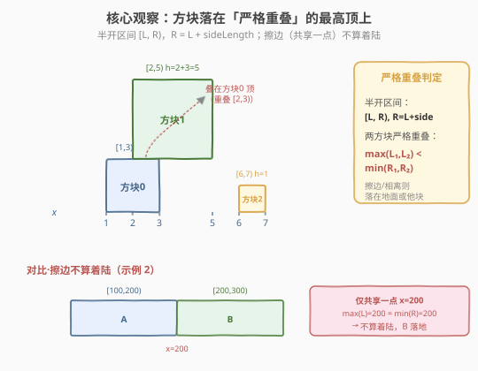
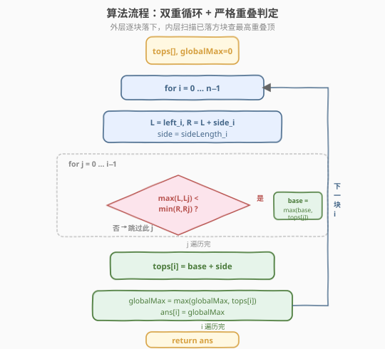
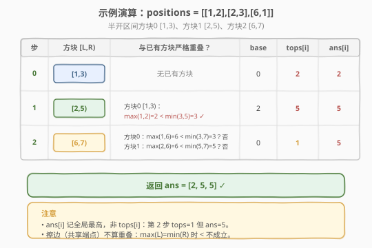
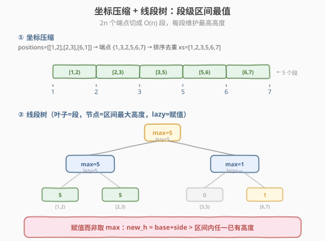

# LeetCode 掉落的方块 题解

## 1. 题目概述

- **标题 / 题号**：掉落的方块（#699，hard）
- **链接**：https://leetcode.cn/problems/falling-squares/
- **难度**：困难
- **标签**：线段树、数组、有序集合、坐标压缩

**题意**：在 x 轴上方依次掉落若干方块。第 `i` 个方块边长为 `sideLength_i`，其左侧边对齐 x 轴上坐标 `left_i`，因此它在 x 轴上的投影为区间 `[left_i, left_i + sideLength_i)`。方块沿 y 轴负方向下落，直到着陆到**另一个方块的顶边**或**x 轴**上。**仅擦过另一方块左侧边或右侧边不算着陆**。一旦着陆即固定。每个方块掉落后，记录当前所有已落稳方块的**最高堆叠高度**，返回高度数组 `ans`。

**示例 1**：

```text
输入：positions = [[1,2],[2,3],[6,1]]
输出：[2,5,5]
解释：
  方块0 [1,3) 落地，高度 2，最高 2。
  方块1 [2,5) 与方块0 在 [2,3) 严格重叠 → 落在方块0 顶上，高度 2+3=5，最高 5。
  方块2 [6,7) 与已有方块均不重叠 → 落地，高度 1，最高仍 5。
```

**示例 2**：

```text
输入：positions = [[100,100],[200,100]]
输出：[100,100]
解释：
  方块0 [100,200) 落地，高度 100。
  方块1 [200,300) 与方块0 仅共享端点 x=200，不算着陆 → 落地，高度 100，最高仍 100。
```

**约束**：

- $1 \leq \text{positions.length} \leq 1000$
- $1 \leq \text{left}_i \leq 10^8$
- $1 \leq \text{sideLength}_i \leq 10^6$

> 💡 本题关键在于把「着陆」精确建模为**区间严格重叠**：方块 `i` 落在所有与它 x 区间有**正长度交集**的已落方块中**最高**的那个的顶上。$n \leq 1000$ 时直接 $O(n^2)$ 扫描即可；坐标范围高达 $10^8$ 提示大规模数据需用**坐标压缩 + 线段树**压到 $O(n \log n)$。

## 2. 解题思路

### 2.1 暴力思路：按坐标点维护高度数组

最直白的想法：把 x 轴上每个**整数坐标点**视作一个槽，维护数组 `h[x]` = 该点当前最高高度。新方块 `[L, R)` 落下时：

1. 取 `base = max{ h[x] : L ≤ x < R }`；
2. 对所有 `L ≤ x < R` 执行 `h[x] = base + side`（方块顶面等高覆盖该段）；
3. 全局最大值即 `ans[i]`。

> ⚠️ 这种做法时间 $O(n \cdot X)$、空间 $O(X)$，其中 $X$ 是坐标范围。本题 $X$ 可达 $10^8$，**内存与时间都爆炸**。它也没有利用「真正影响答案的只有已落方块所占的那 $O(n)$ 段区间」这一稀疏性。

### 2.2 核心观察：区间严格重叠 + 已落方块顶高



两条观察把暴力压到 $O(n^2)$：

**观察一（稀疏性）**：新方块 `i` 的落点只取决于**已落方块中与它 x 区间严格重叠的那些**的顶高，与其余坐标无关。因此只需维护一个列表 `intervals`，记录每个已落方块的 `[L, R)` 与其顶高 `top`。新方块扫一遍这个列表即可。

**观察二（严格重叠判定）**：用**半开区间** `[L, R)`（`R = L + side`）描述方块投影。两方块严格重叠（有正长度交集，而非擦边）当且仅当

$$\max(L_1, L_2) < \min(R_1, R_2)$$

擦边情况（如 $R_1 = L_2$，两方块只共享一个端点）此时 $\max(L_1,L_2) = \min(R_1,R_2)$，不等式不成立 → 不算着陆，正好契合题意。

> 💡 **为什么用半开区间？** 它把「擦边不算」这条特殊规则**免费编码进标准区间重叠公式**，无需任何特判。若用闭区间 `[L, R]`，相邻方块的端点会误判为重叠，必须额外写 `R_1 != L_2` 之类边界条件，易错。这是本题最值得记的一个建模技巧。

于是算法骨架为：

1. 维护 `tops[i]` = 第 `i` 个方块的顶高，`intervals[i] = (L_i, R_i)`。
2. 对每个 `i`：
   - `base = 0`；遍历 `j < i`，若 `max(L_i, L_j) < min(R_i, R_j)`，则 `base = max(base, tops[j])`；
   - `tops[i] = base + side_i`；
   - `globalMax = max(globalMax, tops[i])`；`ans[i] = globalMax`。

> ⚠️ 注意 `ans[i]` 是**全局最高**而非 `tops[i]`。某方块可能落在偏远低处，它的顶高很小，但全局最高仍是之前某块。例如示例 1 第 3 块顶高仅 1，但 `ans[2] = 5`。

### 2.3 算法流程图



**完整步骤**：

1. **初始化** `tops[n]`、`globalMax = 0`、`ans[n]`。
2. **外层循环** `i = 0 … n-1`：计算 `L = left_i`、`R = L + side_i`、`side = side_i`。
3. **内层循环** `j = 0 … i-1`：若 `max(L, L_j) < min(R, R_j)`（严格重叠），`base = max(base, tops[j])`；否则跳过。
4. `tops[i] = base + side`。
5. `globalMax = max(globalMax, tops[i])`；`ans[i] = globalMax`。
6. 外层循环结束后返回 `ans`。

### 2.4 示例演算

以 `positions = [[1,2],[2,3],[6,1]]` 为例（半开区间：方块0 `[1,3)`、方块1 `[2,5)`、方块2 `[6,7)`）：



| 步 | 方块 `[L,R)` | 与已有方块严格重叠？ | base | tops[i] | ans[i] |
|----|-------------|---------------------|------|---------|--------|
| 0 | `[1,3)` | 无已有方块 | 0 | 0+2=**2** | **2** |
| 1 | `[2,5)` | 方块0 `[1,3)`：`max(1,2)=2 < min(3,5)=3` ✓ | 2 | 2+3=**5** | **5** |
| 2 | `[6,7)` | 方块0 `[1,3)`：`max(1,6)=6 < min(3,7)=3`？否；方块1 `[2,5)`：`max(2,6)=6 < min(5,7)=5`？否 | 0 | 0+1=**1** | **5** |

最终返回 `[2, 5, 5]` ✓。注意第 2 步方块2 顶高仅 1，但全局最高仍是方块1 的 5，故 `ans[2] = 5`。

> 💡 **对比示例 2** 的擦边情形：方块0 `[100,200)`、方块1 `[200,300)`。`max(100,200)=200`、`min(200,300)=200`，`200 < 200` 不成立 → 不重叠，方块1 落地 `tops[1]=100`，`ans[1]=100`。半开区间公式自动处理了这条规则。

## 3. 参考代码

### C++

```cpp
// 掉落的方块.cpp —— 区间严格重叠 + 扫描已落方块，O(n^2)
// 编译: g++ -O2 -std=c++17 掉落的方块.cpp -o fsq
class Solution {
  public:
    vector<int> fallingSquares(vector<vector<int>>& positions) {
        int n = positions.size();
        vector<int> tops(n);          // tops[i] = 第 i 个方块的顶高
        vector<int> ans(n);
        int globalMax = 0;
        for (int i = 0; i < n; ++i) {
            int L    = positions[i][0];
            int side = positions[i][1];
            int R    = L + side;      // 半开区间 [L, R)
            int base = 0;             // 与 i 严格重叠的已落方块中的最高顶高
            for (int j = 0; j < i; ++j) {
                int Lj = positions[j][0];
                int Rj = positions[j][0] + positions[j][1];
                if (max(L, Lj) < min(R, Rj)) {   // 严格重叠（擦边不算）
                    base = max(base, tops[j]);
                }
            }
            tops[i] = base + side;
            globalMax = max(globalMax, tops[i]);
            ans[i] = globalMax;       // 注意：记录全局最高，非 tops[i]
        }
        return ans;
    }
};
```

### Python

```python
class Solution:
    def fallingSquares(self, positions: list[list[int]]) -> list[int]:
        n = len(positions)
        tops = [0] * n                 # tops[i] = 第 i 个方块的顶高
        ans = []
        global_max = 0
        for i, (L, side) in enumerate(positions):
            R = L + side               # 半开区间 [L, R)
            base = 0
            for j in range(i):
                Lj = positions[j][0]
                Rj = Lj + positions[j][1]
                if max(L, Lj) < min(R, Rj):    # 严格重叠（擦边不算）
                    base = max(base, tops[j])
            tops[i] = base + side
            global_max = max(global_max, tops[i])
            ans.append(global_max)     # 全局最高，非 tops[i]
        return ans
```

> 💡 **三处易错点**：(1) 用半开区间 `R = L + side`，重叠判定是**严格 `<`** 而非 `≤`；(2) `base` 只取**严格重叠**方块的顶高，擦边的不算；(3) `ans[i]` 是**全局最高** `globalMax`，不是当前方块的 `tops[i]`。

## 4. 复杂度分析

| 维度 | 区间扫描 $O(n^2)$ | 坐标压缩 + 线段树 $O(n \log n)$ |
|------|------------------|--------------------------------|
| **时间复杂度** | $O(n^2)$：每个方块扫描所有已落方块 | $O(n \log n)$：每次查询/更新 $O(\log n)$ |
| **空间复杂度** | $O(n)$：仅存 `tops` 与 `intervals` | $O(n)$：线段树 $4n$ 节点 + 坐标表 |
| **推荐度** | ✅ 面试首选，$n \leq 1000$ 毫秒级通过 | 数据规模放大时的进阶解，模板化 |

> ⚠️ $n \leq 1000$ 时 $O(n^2) \approx 10^6$，完全在时限内。线段树解法的价值在于**当 $n$ 升到 $10^5$ 级别时仍可应对**，且展示了「区间赋值 + 区间最大值」这一经典线段树套路。

## 5. 扩展：坐标压缩 + 线段树（$O(n \log n)$）

当 $n$ 很大、坐标范围达 $10^8$ 时，逐对方块扫描不再可行。利用**所有方块只落在 $2n$ 个端点之间**这一稀疏性，可把坐标压缩到 $O(n)$ 个**段**，再用线段树维护每段高度。



**坐标压缩**：收集所有 `L_i` 与 `R_i`，排序去重得数组 `xs`。相邻端点构成一个**段** `[xs[k], xs[k+1])`，共 $m-1$ 段（$m$ 为去重后端点数）。同一段内任何方块的覆盖情况一致，故段是最小有意义单元。把方块 `[L, R)` 映射为段索引区间 `[idx[L], idx[R])`。

**线段树语义**：每个叶子代表一个段，存储该段当前最高高度；内部节点存子树最大值；`lazy` 存待下放的**赋值**。

- **查询** `query(l, r)`：返回段 `[l, r)` 内的最大高度 → 即 `base`。
- **更新** `update(l, r, new_h)`：把段 `[l, r)` 全部**赋值**为 `new_h`（带 `lazy` 下放）。

> 💡 **为什么是赋值而非取 max？** 新方块的顶高 `new_h = base + side`，而 `base` 是 `[L, R)` 内的最大高度，`side ≥ 1`，故 `new_h` **严格大于** `[L, R)` 内任一已有高度。因此赋值覆盖不会压低任何段，等价于「取 max 后再写回」，但实现更简单（单值 `lazy`）。

```python
class Solution:
    def fallingSquares(self, positions: list[list[int]]) -> list[int]:
        # 1. 坐标压缩
        coords = set()
        for L, side in positions:
            coords.add(L)
            coords.add(L + side)
        xs = sorted(coords)
        idx = {x: i for i, x in enumerate(xs)}
        size = len(xs) - 1                      # 段数 = 端点数 - 1
        tree = [0] * (4 * max(size, 1))
        lazy = [None] * (4 * max(size, 1))      # None 表示无待下放赋值

        def push_down(o):
            if lazy[o] is not None:
                for c in (2 * o, 2 * o + 1):
                    tree[c] = lazy[o]
                    lazy[c] = lazy[o]
                lazy[o] = None

        def query(o, l, r, ql, qr):
            if qr <= l or r <= ql:
                return 0
            if ql <= l and r <= qr:
                return tree[o]
            push_down(o)
            mid = (l + r) // 2
            return max(query(2 * o, l, mid, ql, qr),
                       query(2 * o + 1, mid, r, ql, qr))

        def update(o, l, r, ql, qr, val):
            if qr <= l or r <= ql:
                return
            if ql <= l and r <= qr:
                tree[o] = val
                lazy[o] = val                    # 赋值覆盖（new_h 严格更大）
                return
            push_down(o)
            mid = (l + r) // 2
            update(2 * o, l, mid, ql, qr, val)
            update(2 * o + 1, mid, r, ql, qr, val)
            tree[o] = max(tree[2 * o], tree[2 * o + 1])

        ans = []
        global_max = 0
        for L, side in positions:
            l, r = idx[L], idx[L + side]
            base = query(1, 0, size, l, r)       # 区间最大高度
            new_h = base + side
            update(1, 0, size, l, r, new_h)      # 区间赋值
            global_max = max(global_max, new_h)
            ans.append(global_max)
        return ans
```

> 💡 **与 $O(n^2)$ 解法的对照**：两者本质都做「查最大 → 算新高 → 写回」三步。差别仅在数据结构：$O(n^2)$ 用线性表扫描，线段树用树形分治把每步压到 $O(\log n)$。线段树的 `lazy` 赋值正是利用了「新方块的顶严格更高」这一单调性，省去了「取 max」的判断。

## 6. 面试要点

1. **「擦边不算着陆」怎么处理？为什么用半开区间？**

   > 用半开区间 `[L, R)`（`R = L + side`）描述方块投影，两方块严格重叠的判定为 `max(L₁,L₂) < min(R₁,R₂)`。擦边时 $R_1 = L_2$，此时 $\max = \min$，不等式不成立，自动判为不重叠。若用闭区间则需额外特判端点相等，易错。

2. **`ans[i]` 是当前方块的顶高吗？**

   > 不是。`ans[i]` 是第 `i` 块落下后**所有方块的全局最高**。某方块可能落在偏远低处，顶高很小，但全局最高仍是之前某块（如示例 1 第 3 块顶高 1，`ans[2]=5`）。需维护 `globalMax` 并取 `ans[i] = globalMax`。

3. **新方块为什么要查「严格重叠」的方块而非所有方块？**

   > 方块只沿 y 轴下落，只有 x 区间有正长度交集的已落方块才可能托住它。x 区间相离或仅擦边的方块在物理上不在它正下方，无法承托。故 `base` 只来自严格重叠者。

4. **$O(n^2)$ 何时不够？如何优化？**

   > $n \leq 1000$ 时 $O(n^2) \approx 10^6$ 足够。若 $n$ 升到 $10^5$，需用**坐标压缩 + 线段树**：把 $2n$ 个端点排序去重切成 $O(n)$ 段，线段树维护每段最高高度，查询与区间赋值更新均 $O(\log n)$，总体 $O(n \log n)$。

5. **线段树更新为什么用「赋值」而非「取 max」？**

   > 新方块顶高 `new_h = base + side`，`base` 是该区间内最大高度，`side ≥ 1`，故 `new_h` 严格大于区间内任一已有高度。赋值覆盖不会压低任何段，与「取 max 后写回」等价但实现更简（`lazy` 存单值即可）。

> 💡 **一句话总结**：699 的精髓在**建模**——把「着陆」转化为「半开区间严格重叠 $\max(L) < \min(R)$」，擦边规则被免费编码；$n \leq 1000$ 直接 $O(n^2)$ 扫描，大规模数据用**坐标压缩 + 线段树**（区间最大查询 + 区间赋值，利用新高严格更大省去取 max）。这套「半开区间重叠判定 + 段级线段树」可迁移到所有「矩形/方块堆叠、区间覆盖取最值」类问题。

## 同类练习题

| # | 题目 | 与本题的关联 |
|---|------|-------------|
| 57 | [插入区间](https://leetcode.cn/problems/insert-interval/)（[题解](../0001-0100/57_插入区间.md)） | 区间重叠与合并的经典，对照「重叠判定」的基础用法 |
| 218 | [天际线问题](https://leetcode.cn/problems/the-skyline-problem/) | 扫描线 + 多重集维护当前最高，同样是「区间覆盖求最值」，对照线段树与扫描线两种思路 |
| 715 | [Range 模块](https://leetcode.cn/problems/range-module/) | 区间赋值/查询的线段树模板题，巩固 `lazy` 赋值与半开区间写法 |
| 732 | [我的日程安排表 III](https://leetcode.cn/problems/my-calendar-iii/) | 区间最大重叠数，线段树「区间加 + 区间最大」，对照「区间赋值 vs 区间加」 |
| 1854 | [人口最多的年份](https://leetcode.cn/problems/maximum-population-year/) | 区间加 + 单点查最大，扫描线/差分的简化版，可作为线段树思路的入门铺垫 |
