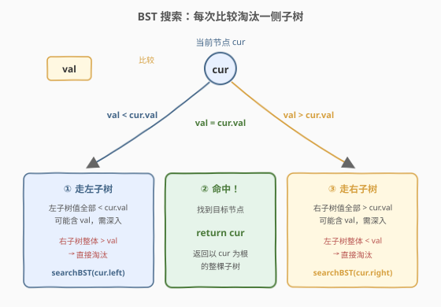
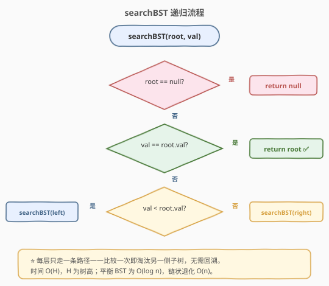
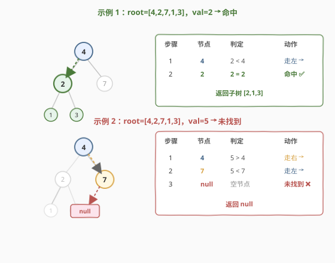

# LeetCode 二叉搜索树中的搜索 题解

## 1. 题目概述

- **标题 / 题号**：二叉搜索树中的搜索（#700，easy）
- **链接**：https://leetcode.cn/problems/search-in-a-binary-search-tree/
- **难度**：简单
- **标签**：树、二叉搜索树、递归、二分查找

**题意**：给定**二叉搜索树（BST）**的根节点 `root` 和一个整数 `val`。找到树中值为 `val` 的节点，并返回**以该节点为根的子树**。若节点不存在，返回 `null`。

> **BST 性质回顾**：对任意节点，左子树所有值 $<$ 根值 $<$ 右子树所有值；左右子树也各自是 BST。这一有序性是 BST 搜索能"比较一次淘汰一侧"的根本依据。

二叉树节点定义：

```python
class TreeNode:
    def __init__(self, val=0, left=None, right=None):
        self.val = val
        self.left = left
        self.right = right
```

**示例 1**：

```text
输入：root = [4,2,7,1,3], val = 2
输出：[2,1,3]

      4                 2
     / \               / \
    2   7    →        1   3
   / \
  1   3
值为 2 的节点找到，返回以它为根的子树 [2,1,3]。
```

**示例 2**：

```text
输入：root = [4,2,7,1,3], val = 5
输出：[]
解释：树中不含值为 5 的节点，返回 null。
```

**约束**：

- 树中节点数在 $[1, 5000]$ 范围内
- $1 \le \text{Node.val} \le 10^7$
- $1 \le \text{val} \le 10^7$
- `root` 是一棵合法的 BST

> 💡 本题是 BST 系列 CRUD 操作中最基础的 **R（Retrieve）**，也是 [450. 删除二叉搜索树中的节点](../0401-0500/450_删除二叉搜索树中的节点.md) 删除定位、[669. 修剪二叉搜索树](./669_修剪二叉搜索树.md) 区间裁剪的前置技能。掌握"比较一次淘汰一侧"的搜索范式，是理解一切 BST 高级操作的入口。

## 2. 解题思路

### 2.1 暴力思路：普通二叉树遍历

把 BST 当普通二叉树，用前序/中序/后序/层序遍历逐一访问每个节点，遇到 `node.val == val` 即返回。完全不利用 BST 的有序性。

```text
dfs(node):
  if node == null: return null
  if node.val == val: return node
  left  = dfs(node.left)    // 无脑两边都搜
  if left != null: return left
  return dfs(node.right)
```

问题是**每次比较都要考虑两个方向**，无法根据大小关系剪枝——最坏要访问全部 $n$ 个节点，时间 $O(n)$，白白浪费了 BST 的有序性。这等价于在**无序数组**里线性查找，把 BST 退化成了普通容器。

> ⚠️ 正确但低效。BST 的核心红利是"有序 → 每次比较淘汰一侧"，类似有序数组的二分查找。暴力遍历丢弃了这层红利。

### 2.2 核心观察：BST 有序性 → 比较一次淘汰一侧



BST 的有序性带来一个关键性质：对任意节点 `cur`，其值与目标 `val` 的关系只有三种，每种都能**立即判定某一侧子树整体不可能含 `val`**，从而跳过该侧：

**情况 ①：`val < cur.val`**

由 BST 性质，`cur` 的**右子树所有值** $>$ `cur.val` $>$ `val`，即整个右子树都大于 `val`，**不可能包含目标**。只需递归搜索左子树：

$$\text{search}(cur) = \text{search}(cur.\text{left})$$

**情况 ②：`val == cur.val`**

命中目标！直接返回以 `cur` 为根的子树（即返回 `cur` 节点本身，其左右孩子原样保留）。

**情况 ③：`val > cur.val`**

对称地，`cur` 的**左子树所有值** $<$ `cur.val` $<$ `val`，整个左子树都小于 `val`，**不可能包含目标**。只需递归搜索右子树：

$$\text{search}(cur) = \text{search}(cur.\text{right})$$

> 💡 **为什么能淘汰一侧？** 这是 BST 搜索的灵魂。BST 的有序性把"找一个值"从"两叉都搜"简化为"二选一深入"——与**有序数组的二分查找**完全同构：数组二分靠下标折半淘汰一半区间，BST 搜索靠值比较淘汰一半子树。二者都依赖"有序"这一前提，每一步把搜索空间缩小一半（平衡时），故得名"**树上的二分查找**"。
>
> ⚠️ **淘汰一侧的前提是 BST 合法**。若树不满足 BST 性质（如 [98. 验证二叉搜索树](../0001-0100/98_验证二叉搜索树.md) 判定的非法树），本算法不正确——左子树可能混入大值。题目保证 `root` 是合法 BST，故可放心剪枝。

### 2.3 算法流程图



**完整步骤**（递归函数 `searchBST(root, val)`）：

1. **判空**：`root == null` → 返回 `null`（搜索到空节点，说明目标不存在）。
2. **命中**：`val == root.val` → 返回 `root`（找到目标，返回以它为根的子树）。
3. **走左**：`val < root.val` → 返回 `searchBST(root.left, val)`（右子树整体偏大，淘汰）。
4. **走右**：`val > root.val` → 返回 `searchBST(root.right, val)`（左子树整体偏小，淘汰）。
5. **入口**：`return searchBST(root, val)`。

> 💡 **三个 `if` 天然互斥**：一个值不可能同时等于、小于、大于 `root.val`，顺序判定即可，无需 `else` 链。每层递归只走一条路径，绝不回溯——这是 BST 搜索区别于普通 DFS 的本质。

### 2.4 示例演算

以 `root = [4,2,7,1,3]` 为例，分别演算 `val = 2`（命中）和 `val = 5`（未找到）：



**示例 1：`val = 2`**

```text
      4                 2
     / \               / \
    2   7    →        1   3
   / \
  1   3
```

| 步骤 | 当前节点 | 判定 | 动作 |
|------|----------|------|------|
| ① | 4 | $2 < 4$ | 走左子树（右子树 7 整体 $> 2$，淘汰） |
| ② | 2 | $2 = 2$ | 命中 ✅，返回以 2 为根的子树 `[2,1,3]` |

**示例 2：`val = 5`**

| 步骤 | 当前节点 | 判定 | 动作 |
|------|----------|------|------|
| ① | 4 | $5 > 4$ | 走右子树（左子树 2 整体 $< 5$，淘汰） |
| ② | 7 | $5 < 7$ | 走左子树（右子树整体 $> 5$，淘汰） |
| ③ | `null` | 空节点 | 未找到 ❌，返回 `null` |

> 💡 **看搜索路径的形状**：示例 1 只走了 2 步，示例 2 走了 3 步到达空节点。每一步都根据大小关系选择唯一方向，路径长度等于从根到目标节点（或目标应插入位置）的深度。平衡 BST 下路径长度为 $O(\log n)$，这正是 BST 搜索高效的本源。

## 3. 参考代码

### C++

```cpp
// 二叉搜索树中的搜索.cpp —— 递归 + BST 有序性单边深入
// 编译: g++ -O2 -std=c++17 二叉搜索树中的搜索.cpp -o searchbst
struct TreeNode {
    int val;
    TreeNode *left, *right;
    TreeNode(int x = 0, TreeNode *l = nullptr, TreeNode *r = nullptr)
        : val(x), left(l), right(r) {}
};

class Solution {
public:
    TreeNode* searchBST(TreeNode* root, int val) {
        if (root == nullptr) return nullptr;                 // 空节点 → 未找到
        if (val == root->val) return root;                   // 命中，返回子树根
        if (val < root->val)                                 // 目标更小 → 走左
            return searchBST(root->left, val);
        return searchBST(root->right, val);                  // 目标更大 → 走右
    }
};
```

### Python

```python
class Solution:
    def searchBST(self, root: Optional[TreeNode], val: int) -> Optional[TreeNode]:
        if not root:
            return None                        # 空节点 → 未找到
        if val == root.val:
            return root                        # 命中，返回子树根
        if val < root.val:
            return self.searchBST(root.left, val)   # 目标更小 → 走左
        return self.searchBST(root.right, val)      # 目标更大 → 走右
```

> 💡 **递归的精髓**：每个分支直接 `return searchBST(子树, val)`——递归返回值即"子树中搜索的结果"，天然向上传递。无需维护父指针或全局变量，一行 `return` 同时完成"深入"和"结果回传"。这是树形搜索题的通用范式，与 [450. 删除二叉搜索树中的节点](../0401-0500/450_删除二叉搜索树中的节点.md) 中 `root->left = deleteNode(...)` 的"递归返回值即新子树根"同源。

## 4. 复杂度分析

| 维度 | 复杂度 | 说明 |
|------|--------|------|
| **时间** | $O(H)$ | 每层只走一条路径，比较一次淘汰一侧；路径长度 = 树高 $H$。平衡 BST 为 $O(\log n)$，链状退化为 $O(n)$ |
| **空间** | $O(H)$ | 递归栈深度 = 搜索路径长度 = 树高 $H$；平衡 $O(\log n)$，链状 $O(n)$ |

> 💡 **$H$ 的范围**：平衡 BST 时 $H = O(\log n)$，最坏（链状退化成单链）$H = O(n)$。本题 $n \le 5000$，即便链状也只有 5000 层递归，Python 默认上限 1000 可能不够——若担心栈溢出，可用第 5 节的迭代写法（空间 $O(1)$）或调高 `sys.setrecursionlimit`。C++ 无此限制。
>
> ⚠️ **与暴力遍历的对比**：暴力 DFS 时间 $O(n)$ 总要访问全部节点；BST 搜索时间 $O(H)$，平衡时 $O(\log n) \ll O(n)$。差距源于"有序性允许剪枝"——这正是 BST 数据结构存在的意义。若 BST 退化为链，搜索退化为线性，BST 优势丧失，需自平衡结构（AVL/红黑树）保底。

## 5. 扩展：迭代写法

递归本质是沿着树向下走一条路径，每层只走左或右。这个过程完全可以用循环模拟——无需栈，因为**不需要回溯**（找不到就走子树，找到就返回，绝不走回头路）：

```python
class Solution:
    def searchBST(self, root: Optional[TreeNode], val: int) -> Optional[TreeNode]:
        while root:
            if val == root.val:
                return root                # 命中
            root = root.left if val < root.val else root.right   # 单方向深入
        return None                        # 走到空，未找到
```

```cpp
class Solution {
public:
    TreeNode* searchBST(TreeNode* root, int val) {
        while (root) {
            if (val == root->val) return root;
            root = (val < root->val) ? root->left : root.right;
        }
        return nullptr;
    }
};
```

> 💡 **迭代版为何这么简洁？** BST 搜索是一条**从根到目标的单向路径**，没有分叉、没有回溯。`while` 循环每轮根据大小关系更新 `root` 指向左或右孩子，等同于"沿路径向下走一步"。空间从 $O(H)$ 降到 $O(1)$，仅用一个游标指针。这种"循环替代递归"在**无回溯的树形搜索**中通用，与二分查找的 `while (lo <= hi)` 写法形神皆似。
>
> ⚠️ 对比 [94. 中序遍历](../0001-0100/94_中序遍历.md) 的迭代版需要显式栈——因为遍历要访问所有节点、需要回溯到父节点再走另一侧；而 BST 搜索只走一条路径，无需栈。能否去栈的关键在于"是否需要回溯"。

## 6. 面试要点

1. **BST 搜索为什么是 $O(H)$ 而非 $O(n)$？**

   > BST 的有序性保证：每次比较 `val` 与 `cur.val`，能立即判定某一侧子树整体不可能含 `val` 并淘汰。因此每层只走一条路径，路径长度 = 树高 $H$。平衡 BST 时 $H = \log n$，远优于暴力遍历的 $O(n)$。但若 BST 退化为链，$H = n$，搜索退化为线性——这也是自平衡 BST（AVL/红黑树）存在的动机。

2. **BST 搜索和有序数组的二分查找有何异同？**

   > 两者都依赖"有序性"做剪枝，每步把搜索空间缩小一半（平衡时）。区别在于数据结构：数组二分靠下标 `mid = (lo+hi)/2` 折半区间，BST 搜索靠值比较选择左/右孩子。数组二分 $O(\log n)$ 有保证（数组随机访问），BST 搜索 $O(H)$ 取决于树形——平衡时 $O(\log n)$，链状 $O(n)$。

3. **递归和迭代两种写法怎么选？**

   > 递归更直观、贴近思路描述；迭代省去栈开销、空间 $O(1)$ 且无栈溢出风险。BST 搜索是一条无回溯的单向路径，迭代极简（一个 `while` + 三元运算），是少数迭代比递归还短的树题。面试可先写递归讲清思路，再主动提"可改迭代省空间"展示功底。

4. **如果树不保证是合法 BST，本算法还正确吗？**

   > 不正确。本算法的前提是"左子树全 $<$ 根 $<$ 右子树全"的传递性——若左子树混入大于 `cur.val` 的节点，`val < cur.val` 时走左可能错过目标，而目标实际在右子树。此时只能退回暴力遍历 $O(n)$。因此做 BST 题先确认题目是否保证合法性；若需自检，参考 [98. 验证二叉搜索树](../0001-0100/98_验证二叉搜索树.md)。

5. **返回的是节点还是值？题目说"返回子树"是什么意思？**

   > 返回的是**节点对象**（指针/引用），而非值。所谓"以该节点为根的子树"就是返回该节点本身——它的 `left`/`right` 指针已经挂接着整棵子树，调用方拿到节点即拿到整棵子树。LeetCode 的序列化会从返回的节点做层序遍历输出，如示例 1 返回节点 2，序列化为 `[2,1,3]`。

> 💡 **一句话总结**：BST 搜索是"**树上的二分查找**"——利用有序性，每次比较淘汰一侧子树，沿唯一路径向下深入，时间 $O(H)$、空间 $O(H)$（递归）或 $O(1)$（迭代）。三个 `if` 顺序判定，代码极简，是 BST 一切 CRUD 操作的基础。

## 同类练习题

| # | 题目 | 与本题的关联 |
|---|------|-------------|
| 450 | [删除二叉搜索树中的节点](https://leetcode.cn/problems/delete-node-in-a-bst/)（[题解](../0401-0500/450_删除二叉搜索树中的节点.md)） | 删除的第一步就是搜索定位，700 是其前置技能；删除需额外处理"两个孩子找后继"的复杂分支 |
| 669 | [修剪二叉搜索树](https://leetcode.cn/problems/trim-a-binary-search-tree/)（[题解](./669_修剪二叉搜索树.md)） | 批量"搜索 + 裁剪"，同样利用 BST 有序性整子树丢弃，对照理解单值搜索与区间裁剪的异同 |
| 98 | [验证二叉搜索树](https://leetcode.cn/problems/validate-binary-search-tree/)（[题解](../0001-0100/98_验证二叉搜索树.md)） | 验证 BST 合法性——本算法正确性的前提；非法 BST 上搜索算法失效 |
| 230 | [二叉搜索树中第 K 小的元素](https://leetcode.cn/problems/kth-smallest-element-in-a-bst/)（[题解](../0201-0300/230_二叉搜索树中第K小的元素.md)） | BST 中序遍历升序性，与搜索的"有序淘汰"同源于 BST 有序性 |
| 701 | [二叉搜索树中的插入操作](https://leetcode.cn/problems/insert-into-a-binary-search-tree/) | BST 插入，与搜索对称的 CRUD 操作——搜索找到空位即插入，是 700 的自然延伸 |
