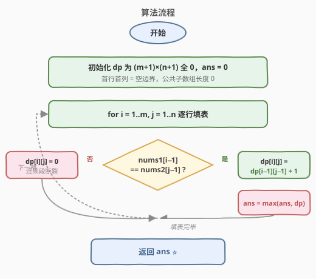
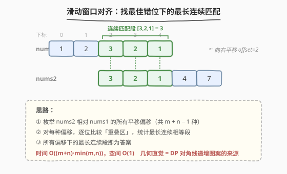

# 最长重复子数组

- **题目名称**：最长重复子数组
- **链接**：[718. 最长重复子数组](https://leetcode.cn/problems/maximum-length-of-repeated-subarray/)
- **难度**：中等
- **标签**：动态规划、二维 DP、滑动窗口、滚动哈希

## 1. 题目概述

给两个整数数组 `nums1` 和 `nums2`，返回 **两个数组中 公共的、长度最长的子数组** 的长度。

> 💡 **子数组**：由原数组中**连续**的一段元素构成。例如 `[3,2,1]` 是 `[1,2,3,2,1]` 的子数组，但 `[1,3,1]` 不是（不连续）。注意它和「子序列」不同——子序列允许跳过中间元素，子数组必须连续。

**示例 1**：

```text
输入：nums1 = [1,2,3,2,1], nums2 = [3,2,1,4,7]
输出：3
解释：长度最长的公共子数组是 [3,2,1] ，长度为 3。
```

**示例 2**：

```text
输入：nums1 = [0,0,0,0,0], nums2 = [0,0,0,0,0]
输出：5
解释：长度最长的公共子数组是 [0,0,0,0,0] ，长度为 5。
```

**约束条件**：

- `1 <= nums1.length, nums2.length <= 1000`
- `0 <= nums1[i], nums2[i] <= 100`

---

## 2. 解题思路

### 2.1 暴力思路

枚举 `nums1` 的所有子数组起点 `i`、`nums2` 的所有子数组起点 `j`，从 `(i, j)` 开始逐位比较，记录最长匹配长度。共有 $O(m \times n)$ 个起点对，每对最多比较 $\min(m, n)$ 位，总时间 $O(m \times n \times \min(m, n))$，最坏约 $10^9$ 次操作，会超时。

> ⚠️ 暴力法的核心浪费在于：**相同的匹配段被不同起点反复比较**。例如 `nums1 = [1,2,3,2,1]` 与 `nums2 = [3,2,1]` 匹配时，从 `(i=2, j=0)` 起比较了 `3,2,1` 三位；而从 `(i=3, j=1)` 起又比较了 `2,1` 两位——后者的结果其实已经包含在前者里。DP 的作用正是消除这种重复。

### 2.2 核心观察：二维 DP（以「结尾」定义状态）

![核心概念：dp[i][j] = 以 nums1[i-1]、nums2[j-1] 结尾的最长公共子数组长度](../images/repeat_subarray_concept.svg)

**关键决策**：与 [1143. 最长公共子序列](../1101-1200/1143_最长公共子序列.md) 不同，本题的状态**不能**定义为「前缀的答案」，而要定义为「**以某两位结尾**的公共子数组长度」。

**定义**：

$$dp[i][j] = \text{以 } nums1[i\text{-}1] \text{ 和 } nums2[j\text{-}1] \text{ 结尾的最长公共子数组长度}$$

**转移**：

```text
若 nums1[i-1] == nums2[j-1]：
    dp[i][j] = dp[i-1][j-1] + 1     # 两字符相同，接在上一对匹配之后，长度 +1

若 nums1[i-1] != nums2[j-1]：
    dp[i][j] = 0                     # 两字符不同，以这两位结尾的公共子数组不存在
```

**答案**：$\max_{i,j} dp[i][j]$（不是 `dp[m][n]`！）

> 💡 **为什么定义为「结尾」而非「前缀」？** 因为子数组必须**连续**。`dp[i][j]` 只在「`nums1[i-1]` 和 `nums2[j-1]` 恰好相同，且它们前一位也对齐匹配」时才能延续。一旦某位不匹配，连续性就**断裂**，必须归零重计。如果像 LCS 那样定义为「前缀的最长公共子序列」，不匹配时还能取 `max(dp[i-1][j], dp[i][j-1])` 跳过中间字符——那允许了「不连续」，就不再是子数组了。

### 2.3 子数组 vs 子序列：一字之差，转移全变

这是本题最常被考察、也最容易写错的点。把 718（子数组）和 1143（子序列）的转移放在一起对比：

| 维度 | 718 最长重复子数组 | 1143 最长公共子序列 |
|------|-------------------|---------------------|
| **连续性** | 必须**连续** | 可以**不连续**（跳过字符） |
| **状态定义** | 以 `i-1, j-1` **结尾**的长度 | `nums1[0..i-1]` 与 `nums2[0..j-1]` 前缀的答案 |
| **字符匹配** | $dp[i\text{-}1][j\text{-}1] + 1$ | $dp[i\text{-}1][j\text{-}1] + 1$ |
| **字符不匹配** | $\mathbf{0}$（连续中断，归零重计） | $\max(dp[i\text{-}1][j],\ dp[i][j\text{-}1])$（跳过一个） |
| **答案位置** | $\max_{i,j} dp[i][j]$（需全程取 max） | $dp[m][n]$（右下角即答案） |

> ⚠️ **最致命的易错点**：把 1143 的不匹配转移 `max(dp[i-1][j], dp[i][j-1])` 套用到 718 上。这会导致「断掉的连续段被错误地接续」，把子数组算成了子序列。记住口诀：**子序列不匹配取 max（可跳），子数组不匹配归零（必断）**。

### 2.4 算法流程图



**完整步骤**：

1. **初始化**：`dp` 为 $(m+1) \times (n+1)$ 矩阵，全 0（首行首列代表「空前缀」，公共子数组长度为 0）
2. **逐行填表**：`i` 从 1 到 `m`，`j` 从 1 到 `n`：
   - `nums1[i-1] == nums2[j-1]` → `dp[i][j] = dp[i-1][j-1] + 1`，并更新 `ans = max(ans, dp[i][j])`
   - `nums1[i-1] != nums2[j-1]` → `dp[i][j] = 0`（实际不写也是 0，初始化已保证）
3. **返回** `ans`

> 💡 注意填表顺序仍是从左到右、从上到下——因为 `dp[i][j]` 依赖**左上角** `dp[i-1][j-1]`，必须先算出。

### 2.5 示例演算

以 `nums1 = [1,2,3,2,1]`, `nums2 = [3,2,1,4,7]` 为例：

![示例演算：dp 填表，对角线递增，答案 dp[5][3]=3](../images/repeat_subarray_dp_table.svg)

**dp 表**（行 = nums1 字符，列 = nums2 字符，首行/首列为空边界）：

| | `""` | `3` | `2` | `1` | `4` | `7` |
|------|------|-----|-----|-----|-----|-----|
| `""` | 0 | 0 | 0 | 0 | 0 | 0 |
| `1` | 0 | 0 | 0 | **1** | 0 | 0 |
| `2` | 0 | 0 | **1** | 0 | 0 | 0 |
| `3` | 0 | **1** | 0 | 0 | 0 | 0 |
| `2` | 0 | 0 | **2** | 0 | 0 | 0 |
| `1` | 0 | 0 | 0 | **3** ⭐ | 0 | 0 |

**关键填表步骤**：

| 格子 | 字符比较 | 转移 | 值 | 说明 |
|------|----------|------|----|------|
| `dp[1][3]` | `1` == `1` | `dp[0][2]+1` | 1 | 匹配，公共段 `[1]` |
| `dp[2][2]` | `2` == `2` | `dp[1][1]+1` | 1 | 匹配，但前一位 `1≠3`，重新起 `[2]` |
| `dp[3][1]` | `3` == `3` | `dp[2][0]+1` | 1 | 匹配，公共段 `[3]` |
| `dp[4][2]` | `2` == `2` | `dp[3][1]+1` | 2 | 匹配，接在 `[3]` 后 → `[3,2]` |
| `dp[5][3]` | `1` == `1` | `dp[4][2]+1` | 3 | 匹配，接在 `[3,2]` 后 → `[3,2,1]` ✓ |

> 💡 **对角线递增**是公共子数组 DP 的标志性图案：`dp[3][1]=1 → dp[4][2]=2 → dp[5][3]=3` 沿主对角线方向递增，对应 `nums1[2..4]=[3,2,1]` 与 `nums2[0..2]=[3,2,1]` 这段连续匹配。所有非对角线上的匹配格子（如 `dp[1][3]`、`dp[2][2]`）都是孤立的 1，因为它们前一位对不上、无法延续。最终答案 `3` 出现在 `dp[5][3]`，而非右下角 `dp[5][5]=0`——这正是「答案要全程取 max」的原因。

---

## 3. 参考代码

### C++

```cpp
// 最长重复子数组.cpp —— 二维 DP
// 编译: g++ -O2 -std=c++17 最长重复子数组.cpp -o repeat
class Solution {
public:
    int findLength(vector<int>& nums1, vector<int>& nums2) {
        int m = nums1.size(), n = nums2.size();
        vector<vector<int>> dp(m + 1, vector<int>(n + 1, 0));
        int ans = 0;

        for (int i = 1; i <= m; i++) {
            for (int j = 1; j <= n; j++) {
                if (nums1[i-1] == nums2[j-1]) {
                    dp[i][j] = dp[i-1][j-1] + 1;   // 匹配：接在左上角之后
                    ans = max(ans, dp[i][j]);      // 全程维护最大值
                }
                // 不匹配时 dp[i][j] 保持 0，连续段断裂
            }
        }
        return ans;
    }
};
```

### Python

```python
class Solution:
    def findLength(self, nums1: List[int], nums2: List[int]) -> int:
        m, n = len(nums1), len(nums2)
        dp = [[0] * (n + 1) for _ in range(m + 1)]
        ans = 0

        for i in range(1, m + 1):
            for j in range(1, n + 1):
                if nums1[i-1] == nums2[j-1]:
                    dp[i][j] = dp[i-1][j-1] + 1   # 匹配：接在左上角之后
                    ans = max(ans, dp[i][j])      # 全程维护最大值
                # 不匹配时 dp[i][j] 保持 0，连续段断裂

        return ans
```

> 💡 **实现细节**：① `dp` 大小 $(m+1)\times(n+1)$，首行首列为空边界全 0，省去了 `dp[-1]` 的特判。② 不匹配时**什么都不写**即可——初始值 0 正是「连续段断裂」的语义。③ 与 1143 代码相比，唯一结构差异就是：匹配时同样 `dp[i-1][j-1]+1`，但**少了不匹配时的 `max` 分支**，且答案在循环内更新而非取 `dp[m][n]`。

---

## 4. 复杂度分析

| 维度 | 二维 DP | 滚动数组 | 滑动窗口对齐 |
|------|---------|---------|-------------|
| **时间** | $O(m \times n)$ | $O(m \times n)$ | $O((m+n) \times \min(m,n))$ |
| **空间** | $O(m \times n)$ | $O(n)$ | $O(1)$ |
| **适用场景** | 通用，最直观 | 空间优化 | 仅需长度、空间敏感 |

> ⚠️ $m, n \le 1000$ 时 $O(m \times n) \approx 10^6$，DP 完全可接受。滚动数组把空间从 $10^6$ ints 压到 $10^3$，是面试常追问的优化点。

---

## 5. 扩展：三种优化视角

### 5.1 滚动数组空间优化

`dp[i][j]` 只依赖左上角 `dp[i-1][j-1]`，可用**一维数组 + prev 变量**压缩到 $O(n)$ 空间：

```python
class Solution:
    def findLength(self, nums1: List[int], nums2: List[int]) -> int:
        m, n = len(nums1), len(nums2)
        dp = [0] * (n + 1)
        ans = 0

        for i in range(1, m + 1):
            prev = 0                                   # dp[i-1][0] = 0
            for j in range(1, n + 1):
                temp = dp[j]                           # 保存旧的 dp[i-1][j]
                if nums1[i-1] == nums2[j-1]:
                    dp[j] = prev + 1                   # dp[i-1][j-1] + 1
                    ans = max(ans, dp[j])
                else:
                    dp[j] = 0                          # ⚠️ 必须显式归零！
                prev = temp                            # 滚动 prev

        return ans
```

> ⚠️ **与 1143 滚动数组的关键区别**：1143 不匹配时 `dp[j] = max(dp[j], dp[j-1])`（复用旧值）；本题不匹配时**必须显式 `dp[j] = 0`**。因为一维数组复用的是上一行的值，而本题不匹配意味着当前行该位应为 0——若不显式清零，会残留上一行的匹配长度，导致断掉的连续段被错误接续。

### 5.2 滑动窗口对齐

把两个数组像滑动窗口一样**错位对齐**，对每种对齐方式逐位比较，找最长连续匹配 run。



对偏移量 `offset`（`nums1` 相对 `nums2` 的平移），重叠区为 $L = \min(m, n) - |offset|$，逐位比较重叠区，统计最长连续相等段。共 $m + n - 1$ 种偏移，每次 $O(\min(m,n))$，总时间 $O((m+n)\min(m,n))$，空间 $O(1)$。

```python
class Solution:
    def findLength(self, A: List[int], B: List[int]) -> int:
        m, n = len(A), len(B)
        ans = 0
        # i 是 A 的起点，j 是 B 的起点；等价于枚举所有对齐偏移
        for i in range(m):
            for j in range(n):
                k = 0
                while i + k < m and j + k < n and A[i+k] == B[j+k]:
                    k += 1
                ans = max(ans, k)
        return ans
```

> 💡 这个写法时间仍是 $O((m+n)\min(m,n))$，但空间 $O(1)$。它揭示了本题的几何直觉：**最长公共子数组 = 两个数组在某种错位对齐下的最长连续匹配段**。DP 的对角线递增图案，正是这种「对齐 + 连续匹配」在表格上的投影。

### 5.3 二分答案 + 滚动哈希（Rabin-Karp）

**进阶**：当 $m, n$ 很大（如 $10^5$）时，$O(mn)$ 会超时，可用二分 + 滚动哈希做到 $O((m+n)\log\min(m,n))$。

思路：二分公共子数组长度 $L$，用**滚动哈希**在 $O(m+n)$ 内判断「两数组是否存在长度为 $L$ 的公共子数组」。具体地，对 `nums1` 的所有长度为 $L$ 的子数组计算哈希并存入集合，再对 `nums2` 的所有长度为 $L$ 的子数组滚动计算哈希、查集合是否命中。为避免哈希冲突用双质数模数。

> 💡 滚动哈希是本题的**终极优化**，也是字符串匹配的经典武器（Rabin-Karp）。它把「比较一段子数组」从 $O(L)$ 降到 $O(1)$（哈希增量计算）。由于本题 $n \le 1000$，$O(mn)$ 已足够，滚动哈希主要作为「数据范围放大时的思路延伸」来了解，面试中能提到即可加分。

---

## 6. 面试要点

1. **`dp[i][j]` 的定义是什么？为什么不像 LCS 那样定义成「前缀的答案」？**

   > `dp[i][j]` = 以 `nums1[i-1]` 和 `nums2[j-1]` **结尾**的最长公共子数组长度。因为子数组必须连续，状态要绑定「结尾位置」才能表达「连续延续到当前位」的语义。若定义成前缀答案，不匹配时需要决定是否跳过某位——而跳过就破坏了连续性，无法再表达子数组。

2. **和 1143 最长公共子序列的转移有什么区别？为什么？**

   > 唯一区别在**不匹配时**：子序列取 `max(dp[i-1][j], dp[i][j-1])`（可跳过中间字符），子数组归 `0`（连续性断裂，必须重新计数）。根本原因是连续性约束：子序列允许「断点续传」，子数组一旦断开就得从头再来。

3. **为什么答案不是 `dp[m][n]` 而要全程取 max？**

   > 因为状态定义为「以某两位结尾」的长度，`dp[m][n]` 只表示「以最后两位结尾」的公共子数组——若最后两位不等，它就是 0，但最长匹配可能出现在数组中间。所以每产生一个匹配就要更新全局最大值。LCS 的状态是「前缀答案」，右下角自然累积了全局最优，所以取 `dp[m][n]` 即可。

4. **滚动数组优化时，不匹配为什么必须显式写 `dp[j] = 0`？**

   > 一维数组复用上一行的值。不匹配时当前行该位应为 0，但 `dp[j]` 里残留的是上一行同列的值（可能是正数）。若不清零，相当于「上一行的匹配段跨行接续到了当前行」，把连续性破坏了。1143 不用清零是因为它不匹配时本就要复用上方/左方的值。

5. **除了 DP 还有哪些解法？各自的时间复杂度？**

   > ① 滑动窗口对齐 $O((m+n)\min(m,n))$、空间 $O(1)$——几何直观，把问题看作「找最佳错位对齐下的最长连续匹配」。② 二分 + 滚动哈希 $O((m+n)\log\min(m,n))$——数据范围极大时的终极解法。DP $O(mn)$ 在 $n \le 1000$ 时最实用、最不易错，是首选。

> 💡 **一句话总结**：718 是 [1143 LCS](../1101-1200/1143_最长公共子序列.md) 的「连续版」——状态定义为「以某两位结尾的长度」，匹配时 `dp[i-1][j-1]+1`，**不匹配时归零**（而非取 max），答案全程取 max。记住「子序列不匹配取 max（可跳），子数组不匹配归零（必断）」这句口诀，就能在两类问题间准确切换。$O(mn)$ DP 是首选，滚动数组压到 $O(n)$ 空间，滑动窗口与滚动哈希是进阶视角。

---

## 7. 同类练习题

- [1143. 最长公共子序列](https://leetcode.cn/problems/longest-common-subsequence/)（[题解](../1101-1200/1143_最长公共子序列.md)）：镜像题——改求子序列（不连续），不匹配时取 `max` 而非归零，对比掌握「连续 vs 不连续」的分野
- [53. 最大子数组和](https://leetcode.cn/problems/maximum-subarray/)（[题解](../0001-0100/53_最大子数组和.md)）：同样刻画「连续段」——负贡献时重新起算的 Kadane 思想，与本题「不匹配归零」异曲同工
- [300. 最长递增子序列](https://leetcode.cn/problems/longest-increasing-subsequence/)（[题解](../0201-0300/300_最长递增子序列.md)）：一维「子序列」DP，对比理解子序列问题如何允许跳过元素
- [583. 两个字符串的删除操作](https://leetcode.cn/problems/delete-operation-for-two-strings/)：LCS 直接应用，`answer = m + n - 2×LCS`，巩固子序列 DP
- [727. 最小窗口子序列](https://leetcode.cn/problems/minimum-window-subsequence/)：子序列匹配 + 贪心窗口，子序列 DP 的进阶应用
