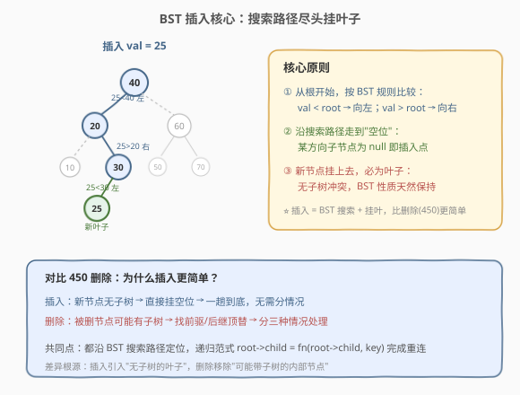
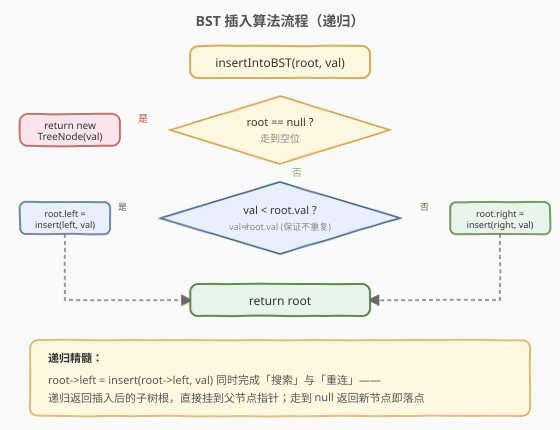
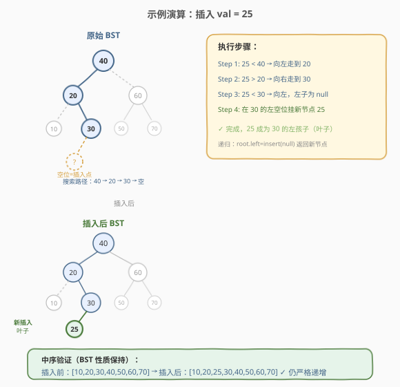

# 二叉搜索树中的插入操作

- **题目名称**：二叉搜索树中的插入操作
- **链接**：[701. 二叉搜索树中的插入操作](https://leetcode.cn/problems/insert-into-a-binary-search-tree/)
- **难度**：中等
- **标签**：树、二叉搜索树、递归

## 1. 题目概述

给定一棵**二叉搜索树（BST）**的根节点 `root` 和一个待插入的整数 `val`，将 `val` 插入树中并返回插入后的树根节点。题目保证 `val` 不在原树中已存在。

**BST 性质回顾**：对任意节点，左子树所有值 $<$ 根值 $<$ 右子树所有值；左右子树也各自是 BST。

**示例 1**：

```text
输入：root = [4,2,7,1,3], val = 5
输出：[4,2,7,1,3,5]

      4                   4
     / \                 / \
    2   7      →        2   7
   / \                 / \   \
  1   3               1   3   5
```

**示例 2**：

```text
输入：root = [40,20,60,10,30,50,70], val = 25
输出：[40,20,60,10,30,50,70,null,null,null,25,null,null,null,null]

        40                      40
       /  \                    /  \
      20    60       →        20    60
     / \   / \               / \   / \
    10 30 50 70             10 30 50 70
          /                      /
        (空)                    25
```

**约束条件**：

- 树中节点数在 $[0, 10^4]$ 范围内
- 每个节点的值互不相同
- $-10^8 \le \text{Node.val} \le 10^8$
- `root` 是合法的 BST
- `val` 保证不在原树中

> 💡 **注意**：题目说明"可能存在多种有效的插入方式"，只需返回其中任意一种即可。标准做法是把新节点作为**叶子**挂到搜索路径的尽头，这样最简单且不破坏 BST 性质。

---

## 2. 解题思路

### 2.1 暴力思路：重建法

先中序遍历收集所有节点值（升序数组），把 `val` 插入数组保持有序，再用有序数组重新构造一棵平衡 BST（参见 108 题）。正确但代价过高——每次插入都要 $O(n)$ 时间和 $O(n)$ 空间重建整棵树，完全没有利用 BST 已有的有序结构。

### 2.2 核心观察：搜索路径尽头挂叶子



BST 的插入比删除（450）简单得多：**不需要处理子树搬迁**，因为新节点可以直接作为叶子挂上去。关键观察：

1. **插入 = 搜索 + 挂叶**：从根开始，像 BST 搜索一样比较 `val` 与当前节点：`val` 小则向左走，`val` 大则向右走。
2. **走到空位即插入点**：沿搜索路径前进，直到某个方向的子节点为 `null`，这个空位就是新节点的归宿——把新节点挂上去即可。
3. **新节点一定是叶子**：因为它被挂在一个原本为空的位置，没有子树冲突，BST 性质天然保持。

> 💡 **为什么这样不破坏 BST 性质？** 搜索路径上的每个决策（左/右）都基于 BST 的有序性：若 `val < root.val`，则 `val` 必属于左子树；若 `val > root.val`，则 `val` 必属于右子树。当走到空位时，`val` 恰好落在"比路径上所有向左转折的节点都小、比所有向右转折的节点都大"的位置，作为叶子挂上去后，对每个祖先节点都满足 BST 的有序约束。

> ⚠️ **对比 450 删除**：删除要处理"被删节点有子树"的问题（找前驱/后继顶替），而插入没有这个烦恼——新节点本就无子树，挂到空位即可。这就是插入 $O(H)$ 一趟到底、而删除需要分三种情况的根本原因。

### 2.3 算法流程图



### 2.4 示例演算



以 `root = [40,20,60,10,30,50,70]`，`val = 25` 为例：

| 步骤 | 当前节点 | 比较 | 决策 | 说明 |
|------|----------|------|------|------|
| 1 | 40 | 25 < 40 | 向左走 | 进入左子树 |
| 2 | 20 | 25 > 20 | 向右走 | 进入右子树 |
| 3 | 30 | 25 < 30 | 向左走 | 左子节点为 null |
| 4 | 30 的左空位 | — | 挂新节点 25 | 25 成为 30 的左孩子 |

> 💡 **递归精髓**：`root->left = insertIntoBST(root->left, val)` 这一行同时完成"搜索"和"重连"——递归返回插入后的子树根，直接赋给父节点指针，与 450 删除的递归范式完全一致。当递归走到 `null` 时，返回新节点，自然挂接到父节点对应的左/右指针上。

---

## 3. 参考代码

### C++（递归）

```cpp
class Solution {
public:
    TreeNode* insertIntoBST(TreeNode* root, int val) {
        if (!root) return new TreeNode(val);               // 走到空位，新建节点返回
        if (val < root->val)
            root->left = insertIntoBST(root->left, val);   // 小于根，插左子树
        else
            root->right = insertIntoBST(root->right, val); // 大于根，插右子树
        return root;
    }
};
```

### Python（递归）

```python
class Solution:
    def insertIntoBST(self, root: Optional[TreeNode], val: int) -> Optional[TreeNode]:
        if not root:
            return TreeNode(val)                           # 走到空位，新建节点返回
        if val < root.val:
            root.left = self.insertIntoBST(root.left, val)
        else:
            root.right = self.insertIntoBST(root.right, val)
        return root
```

> 💡 **为什么 `else` 直接走右子树？** 题目保证 `val` 不在原树中，因此 `val == root.val` 永不发生，用 `if (val < root->val) ... else ...` 二分支即可，无需单独判等。这也意味着搜索路径是唯一确定的——每个节点只有一个方向可走。

---

## 4. 复杂度分析

| 维度 | 复杂度 | 说明 |
|------|--------|------|
| 时间复杂度 | $O(H)$ | 沿搜索路径走一趟，每层 $O(1)$ 比较；$H$ 为树高 |
| 空间复杂度 | $O(H)$ | 递归栈深度等于树高；平衡 BST 为 $O(\log n)$，链状退化为 $O(n)$ |

> 💡 $H$ 的范围：平衡 BST 时 $H = O(\log n)$，最坏（链状）$H = O(n)$。注意反复按同一方向插入（如依次插 1,2,3,...）会让树退化为链表，此时需自平衡 BST（AVL/红黑树）通过旋转维持 $O(\log n)$。

---

## 5. 扩展：迭代法与"多种合法插入"

### 5.1 迭代法（O(1) 空间）

递归能做的，迭代也能做——只需走到空位时把新节点挂上去，无需回溯修改上层：

```cpp
class Solution {
public:
    TreeNode* insertIntoBST(TreeNode* root, int val) {
        TreeNode* node = new TreeNode(val);
        if (!root) return node;                    // 空树，新节点即根
        TreeNode* cur = root;
        while (true) {
            if (val < cur->val) {
                if (cur->left) cur = cur->left;    // 左子非空，继续走
                else { cur->left = node; break; }  // 左子空，挂上
            } else {
                if (cur->right) cur = cur->right;
                else { cur->right = node; break; }
            }
        }
        return root;
    }
};
```

迭代法把空间从 $O(H)$ 降到 $O(1)$，面试中若被追问"能否不用递归"即可给出。关键在于插入点确定后无需回头——新节点挂到当前空位即可，上层指针不受影响。

### 5.2 "多种合法插入"是什么意思？

题目说"可能存在多种有效的插入方式"。标准的"叶子插入"只是一种。理论上，只要插入后仍满足 BST 性质即可。例如，可以通过**旋转**把新节点放到内部位置而非叶子——这正是 AVL/红黑树的插入策略：先按搜索路径找到位置挂上叶子，再做旋转恢复平衡，最终新节点可能停在非叶子位置。

> 💡 **面试回答**：当被问"题目说多种合法方式，你的答案是不是唯一解？"时，回答：标准叶子插入是**最简单且合法**的一种；若要求插入后保持平衡，则需配合旋转（AVL/红黑树），那是更高级的数据结构话题，本题不要求。

---

## 6. 面试要点

1. **为什么插入比删除简单？**
   - 插入的新节点没有子树，挂到空位即可，不涉及子树搬迁；删除则要处理被删节点的子树归属（找前驱/后继顶替），需分三种情况。

2. **新节点为什么一定是叶子？能插入到中间位置吗？**
   - 标准做法中新节点挂在搜索路径的空位上，天然是叶子。要插到中间位置需配合旋转（如 AVL 的 LL/RR/LR/RL 旋转），本题不要求，标准叶子插入即被接受。

3. **递归返回值如何完成"挂接"？**
   - 递归返回插入后的子树根。父节点执行 `root->left = insert(...)` 把返回值接到自己的左指针，天然完成挂接，无需单独维护父指针。`null` 时返回新节点正是挂接的落点。

4. **迭代法如何降到 $O(1)$ 空间？**
   - 用 `cur` 指针边走边比较，走到某方向为空时直接挂新节点。无需栈，因为没有回溯需求——插入点确定后无需回头修改上层节点。

5. **反复插入会让树退化吗？**
   - 会。若按升序依次插入，BST 退化为链表，查找/插入变为 $O(n)$。工程中用自平衡 BST（AVL、红黑树）通过旋转保证 $O(\log n)$；C++ 的 `std::map`/`std::set` 即红黑树实现。

---

## 7. 同类练习题

- [700. 二叉搜索树中的搜索](https://leetcode.cn/problems/search-in-a-binary-search-tree/)：BST 搜索基础，插入的前置技能（搜索路径相同，插入多一步"挂叶"）
- [450. 删除二叉搜索树中的节点](https://leetcode.cn/problems/delete-node-in-a-bst/)（[站内题解](../0401-0500/450_删除二叉搜索树中的节点.md)）：BST 删除，与插入对称的 CRUD 操作，对比理解为何删除更复杂
- [98. 验证二叉搜索树](https://leetcode.cn/problems/validate-binary-search-tree/)（[站内题解](../0001-0100/98_验证二叉搜索树.md)）：验证插入后 BST 性质是否保持
- [108. 将有序数组转换为二叉搜索树](https://leetcode.cn/problems/convert-sorted-array-to-binary-search-tree/)（[站内题解](../0101-0200/108_将有序数组转换为二叉搜索树.md)）：BST 构造，"重建法"暴力思路的基础
- [230. 二叉搜索树中第 K 小的元素](https://leetcode.cn/problems/kth-smallest-element-in-a-bst/)（[站内题解](../0201-0300/230_二叉搜索树中第K小的元素.md)）：中序遍历应用，理解 BST 有序性
