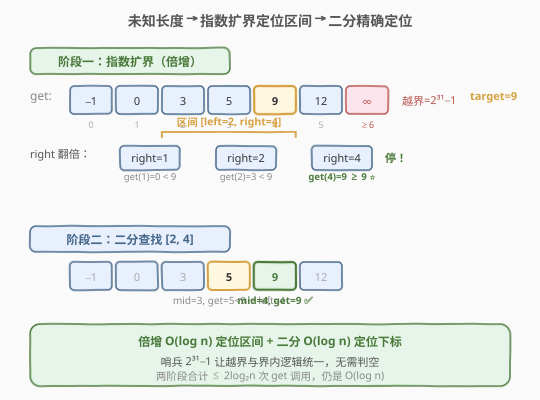
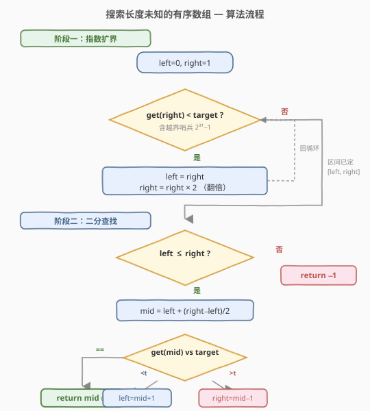
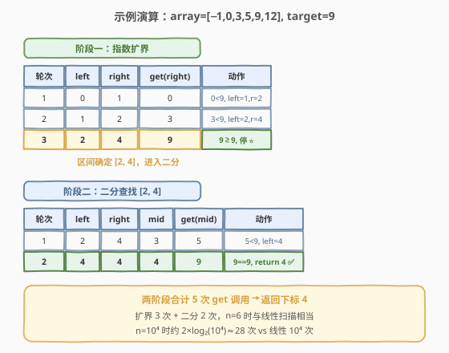

# LeetCode 搜索长度未知的有序数组 题解

## 1. 题目概述

- **标题 / 题号**：搜索长度未知的有序数组（#702，medium）
- **链接**：https://leetcode.cn/problems/search-in-a-sorted-array-of-unknown-size/
- **难度**：中等
- **标签**：数组、二分查找

**题意**：给定一个**升序排列**的整数数组，数组**长度未知**。你只能通过 `ArrayReader` 接口访问它：

- `reader.get(index)` 返回下标 `index` 处的元素值；
- 若 `index` 超出数组边界，返回 $2^{31}-1 = 2147483647$（作为哨兵）。

再给定一个目标值 `target`，请在 `O(log n)` 时间内找到 `target` 在数组中的**下标**；若不存在则返回 `-1`。数组中元素**互不相同**。

**示例 1**：

```text
输入：array = [-1,0,3,5,9,12], target = 9
输出：4
解释：9 出现在下标 4 处，返回 4。
```

**示例 2**：

```text
输入：array = [-1,0,3,5,9,12], target = 2
输出：-1
解释：2 不存在数组中（且超出长度的 get 返回 2147483647），返回 -1。
```

**约束**：

- 数组长度 `n` 未知，`1 <= n <= 10^4`
- `-10^4 < array[i] < 10^4`，元素**互不相同**
- 数组已按**升序**排列
- 越界访问 `reader.get(index)` 返回 $2^{31}-1$
- 必须满足 `O(log n)` 时间

> 💡 本题是 [704. 二分查找] 的变体——唯一区别是**不知道 `n`**。一旦确定一个「包含 `target` 的合法区间」，剩下的就和 704 完全一样。难点全在「如何用 `O(log n)` 找到这样一个区间」。

## 2. 解题思路

### 2.1 暴力思路：线性扫描

从下标 `0` 开始逐个 `reader.get(i)`，与 `target` 比较：命中返回 `i`；遇到越界哨兵（$2^{31}-1$）或首个大于 `target` 的值时停止，返回 `-1`。时间 `O(n)`、空间 `O(1)`。

> ⚠️ 线性扫描有两宗罪：一是 `O(n)` 不满足题目要求的 `O(log n)`；二是**完全无视「数组已升序」**这一关键性质。面试中给此方案通常会被追问「能否利用有序性做到对数级」。

### 2.2 核心观察：指数扩界 + 二分查找



关键直觉分两步：

**第一步：先找到一个「`target` 一定落在其中」的区间 `[left, right]`。**

既然不知道 `n`，那就**主动探测**。从 `right = 1` 起，反复检查 `reader.get(right)`：

- 若 `reader.get(right) < target`：`target` 一定在更靠右的位置，**把区间右端翻倍** `right *= 2`，继续探测；
- 若 `reader.get(right) >= target`：停止。此时 `target` 若存在，必然落在 `[left, right]` 内（`left` 是上一轮的 `right`，初始为 `0`）。

为什么翻倍？因为**翻倍能让 `right` 在 `O(log n)` 步内越过 `n`**——从 1 到 2、4、8…，最多 $\lceil \log_2 n \rceil$ 步就覆盖到数组末尾甚至越界。越界时 `reader.get(right)` 返回 $2^{31}-1$，必然 `>= target`，自然触发停止。

> 💡 **哨兵的妙用**：越界返回 $2^{31}-1$ 这一设计，让「扩界」与「越界检测」合二为一——`reader.get(right) >= target` 一条判断同时覆盖了「`right` 在界内且值够大」和「`right` 越界」两种情况，无需单独判断边界合法性。

**第二步：在 `[left, right]` 上做标准二分查找。**

区间已确定且数组升序，直接套用 [704. 二分查找] 的闭区间模板：取 `mid`，比较 `reader.get(mid)` 与 `target`，命中返回，否则收缩区间。越界的 `mid` 会返回 $2^{31}-1$（大于 `target`），自动把 `right` 收回界内，无需特殊处理。

### 2.3 算法流程图



两阶段各自维护一条循环不变量：

- **扩界阶段**不变量：`target` 若存在，一定在 `[left, right]` **右侧或内部**。每轮 `reader.get(right) < target` 时把 `left` 跳到 `right`、`right` 翻倍，保证 `left` 始终是「已确认偏小」的最后一个位置。
- **二分阶段**不变量：`target` 若存在，一定在 `[left, right]` **内部**。这与 704 完全一致——`left = mid+1` / `right = mid-1` 都严格越过已比较的 `mid`。

> ⚠️ 扩界时务必**先保存旧 `right` 到 `left` 再翻倍**，否则 `left` 会丢失「上一轮偏小的位置」这一锚点，导致 `target`（若存在）被排除在区间之外。

### 2.4 示例演算

以 `array = [-1,0,3,5,9,12], target = 9` 为例（`n = 6`，但算法不知 `n`）。



**阶段一：指数扩界**

| 轮次 | left | right | reader.get(right) | 判断 | 动作 |
|------|------|-------|-------------------|------|------|
| 1 | 0 | 1 | 0 | 0 < 9 | left=1, right=2 |
| 2 | 1 | 2 | 3 | 3 < 9 | left=2, right=4 |
| 3 | 2 | 4 | 9 | 9 ≥ 9 | **停止扩界** ⭐ |

3 轮后确定区间 `[2, 4]`，其中 `reader.get(4) = 9 >= target`，`target` 若存在必在 `[2, 4]` 内。

**阶段二：二分查找（区间 `[2, 4]`）**

| 轮次 | left | right | mid | reader.get(mid) | 判断 | 动作 |
|------|------|-------|-----|-----------------|------|------|
| 1 | 2 | 4 | 3 | 5 | 5 < 9 | left = 4 |
| 2 | 4 | 4 | 4 | 9 | 9 == 9 | **return 4** ⭐ |

两阶段合计 5 次 `get` 调用。对比线性扫描需要 5 次比较刚好到下标 4——`n` 小时差距不大；但 `n = 10^4` 时本方案约 $\log_2 10^4 \approx 14$ 次，线性扫描最坏 $10^4$ 次，优势随 `n` 增大急剧放大。

反例 `target = 20`（不存在）：扩界到 `right=8` 时 `reader.get(8)` 越界返回 $2^{31}-1 \geq 20$，停于区间 `[4, 8]`；二分中所有越界 `mid` 均返回大数、持续把 `right` 收回，最终 `left > right` 区间为空，返回 `-1`。

> 💡 注意扩界阶段 `right` 可以越过 `n`（如本例 `right=8 > n=6`）。这**不影响正确性**：二分时越界位置返回的哨兵值 $2^{31}-1$ 恒大于 `target`，会自动把搜索区间收缩回界内。

## 3. 参考代码

### C++

```cpp
/**
 * // This is the ArrayReader's API interface.
 * // You should not implement it, or speculate about its implementation
 * class ArrayReader {
 *   public:
 *     int get(int index);
 * };
 */

class Solution {
  public:
    int search(const ArrayReader& reader, int target) {
        // 阶段一：指数扩界，找到一个包含 target 的 [left, right]
        int left = 0, right = 1;
        while (reader.get(right) < target) {
            left = right;      // 记住上一轮偏小的位置
            right <<= 1;       // 右端翻倍
        }

        // 阶段二：标准二分查找（闭区间模板，承接 704）
        while (left <= right) {
            int mid = left + (right - left) / 2; // 防溢出
            int val = reader.get(mid);
            if (val == target) {
                return mid;
            } else if (val < target) {
                left = mid + 1;
            } else {
                right = mid - 1; // 越界哨兵 2^31-1 走此分支，自动收回界内
            }
        }
        return -1;
    }
};
```

### Python

```python
# """
# This is ArrayReader's API interface.
# You should not implement it, or speculate about its implementation
# """
# class ArrayReader:
#     def get(self, index: int) -> int:

class Solution:
    def search(self, reader: 'ArrayReader', target: int) -> int:
        # 阶段一：指数扩界
        left, right = 0, 1
        while reader.get(right) < target:
            left = right
            right <<= 1

        # 阶段二：标准二分查找
        while left <= right:
            mid = left + (right - left) // 2
            val = reader.get(mid)
            if val == target:
                return mid
            elif val < target:
                left = mid + 1
            else:
                right = mid - 1
        return -1
```

> ⚠️ **三个易错点**：
> 1. **扩界时先存 `left` 再翻倍**：必须 `left = right; right <<= 1`，顺序不能反。若先翻倍再赋值，`left` 会等于翻倍后的 `right`，丢掉「已确认偏小的锚点」。
> 2. **`right` 可能越界**：这是**允许且预期**的。越界位置返回 $2^{31}-1$，在二分中走 `val > target` 分支把 `right` 收回，无需额外判空。
> 3. **不要试图先求 `n`**：有读者想「先二分找到越界点确定 `n`，再二分找 `target`」——这等于做两次二分，虽仍是 $O(\log n)$，但常数翻倍且逻辑更绕。本题的优雅在于**扩界与定位合一**：扩界结束时区间已天然包含 `target`。

## 4. 复杂度分析

| 维度 | 复杂度 | 说明 |
|------|--------|------|
| 时间复杂度 | $O(\log n)$ | 扩界阶段 `right` 从 1 翻倍到 $\geq n$，最多 $\lceil \log_2 n \rceil$ 步；二分阶段在长度 $\leq 2n$ 的区间上再 $\log_2 n$ 轮；合计 $\leq 2\log_2 n + O(1)$ |
| 空间复杂度 | $O(1)$ | 仅 `left`、`right`、`mid`、`val` 四个变量 |

> 💡 **为什么扩界不会拖垮复杂度？** 翻倍是**指数增长**：$1 \to 2 \to 4 \to \dots \to 2^k \geq n$，只需 $k = \lceil \log_2 n \rceil$ 步。而扩界结束后区间长度 $\leq 2^k - 2^{k-1} = 2^{k-1} \leq n$，二分阶段同样 $\log_2 n$ 轮。两阶段叠加仍是 $O(\log n)$，常数约为 2。

## 5. 扩展：倍增思想的应用

本题「指数扩界」是**倍增（doubling / exponential search）**思想的最小示例。倍增的核心是「**用对数次操作替代线性次探测**」，在「未知规模」场景中广泛应用：

| 场景 | 倍增用法 |
|------|----------|
| 未知数组长度找目标（本题） | `right` 翻倍直到覆盖 `target` |
| 跳表（Skip List）的查找 | 从最高层起，每次尽量向右走 $2^k$ 步 |
| LCA（最近公共祖先） | 预处理 `up[v][k]` = `v` 向上跳 $2^k$ 步的祖先 |
| 后缀数组 | 倍增排序求 rank，每轮把长度翻倍 |

> 💡 倍增与二分常**配合使用**：倍增负责「快速定位一个粗范围」，二分负责「在范围内精确定位」。本题正是这一范式的最简洁体现——先倍增找区间，再二分找下标。

另一种等价写法是把扩界与二分合并为**单次二分**，但需要先确定一个「足够大」的上界（如 $2^{31}-1$ 的位长），本质仍依赖倍增确定上界，不如两阶段写法直观。

## 6. 面试要点

1. **本题与 704 二分查找的区别是什么？核心难点在哪？**

   - 区别仅在于**数组长度 `n` 未知**，无法直接 `right = n - 1`。核心难点是「如何用 `O(log n)` 找到一个包含 `target` 的合法区间」。解法是**指数扩界**：从 `right = 1` 起反复翻倍，直到 `reader.get(right) >= target`，把找区间也压到对数级。

2. **扩界时为什么用翻倍而不是 `+1` 递增？**

   - 翻倍是指数增长，从 1 到 `n` 只需 $\lceil \log_2 n \rceil$ 步；`+1` 递增是线性增长，需 $n$ 步，退化成 `O(n)` 不满足要求。翻倍的本质是「**用对数次探测替代线性次**」，这正是倍增思想。

3. **扩界阶段 `right` 越过数组长度会出错吗？**

   - 不会。越界时 `reader.get(right)` 返回哨兵 $2^{31}-1$，它必然 `>= target`（题目保证 `target < 10^4`），于是扩界自然停止。后续二分中若 `mid` 越界，同样返回哨兵走 `val > target` 分支，把 `right` 收回界内。**哨兵设计让越界与正常逻辑统一处理**，无需特判。

4. **为什么扩界时要保存 `left = right` 再翻倍？**

   - `left` 记录「上一轮已确认 `reader.get(left) < target` 的位置」，保证不变量「`target` 若存在必在 `[left, right]` 内或其右侧」成立。若不保存，翻倍后 `left` 仍是旧值，区间 `[left, 2*right]` 中 `target` 可能落在 `(right, 2*right]` 内但 `left` 太靠左，虽不影响正确性但会让二分区间偏大；更关键的是若顺序写反（`right <<= 1; left = right`）则 `left` 跳到翻倍后的位置，丢掉锚点，可能把 `target` 排除在外。

5. **能否不用倍增，先二分求出 `n` 再二分找 `target`？**

   - 可以但没必要。先二分找「第一个返回哨兵的位置」确定 `n`（$O(\log n)$），再在 `[0, n-1]` 上二分找 `target`（$O(\log n)$），合计 $O(\log n)$ 正确。但常数翻倍且逻辑割裂。本题的优雅在于**扩界结束时区间已天然包含 `target`**，一步到位进入二分，无需先求 `n`。

6. **如果 `target` 比所有元素都大（但仍远小于哨兵），算法行为如何？**

   - 扩界会一直翻倍直到 `right` 越界，`reader.get(right)` 返回哨兵 $2^{31}-1 \geq target` 才停止。随后二分在 `[left, right]` 上搜索，所有有效元素都 `< target`、所有越界位置都 `> target`，最终 `left` 不断右移越过 `n` 后遇到哨兵又收回，收敛到 `left > right` 返回 `-1`。正确且仍是 $O(\log n)$。

## 同类练习题

| # | 题目 | 与本题的关联 |
|---|------|-------------|
| 704 | [二分查找](https://leetcode.cn/problems/binary-search/) | 本题的第二阶段就是 704 的闭区间模板，掌握 704 即掌握本题后半段 |
| 278 | [第一个错误的版本](https://leetcode.cn/problems/first-bad-version/) | 单调布尔序列上的二分，体会「哨兵」与「越界」在二分中的角色 |
| 153 | [寻找旋转排序数组中的最小值](https://leetcode.cn/problems/find-minimum-in-rotated-sorted-array/) | 另一种「区间不确定性」下的二分，用与端点比较缩区间 |
| 74 | [搜索二维矩阵](https://leetcode.cn/problems/search-a-2d-matrix/) | 二维一维化二分，同样是「先定位再二分」的两段式结构 |
| 378 | [有序矩阵中第K小的元素](https://leetcode.cn/problems/kth-smallest-element-in-a-sorted-matrix/) | 二分值域 + 计数验证，体会「在未知位置上二分答案」的广义二分思想 |
