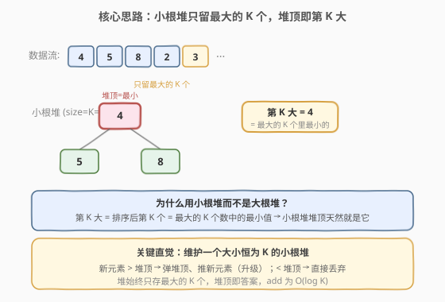
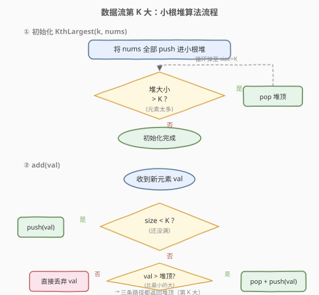
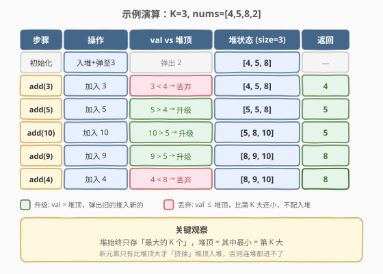

# LeetCode 数据流中的第 K 大元素 题解

## 1. 题目概述

- **标题 / 题号**：数据流中的第 K 大元素（#703，easy）
- **链接**：https://leetcode.cn/problems/kth-largest-element-in-a-stream/
- **难度**：简单
- **标签**：堆、设计、数据流

**题意**：设计一个类 `KthLargest`，用于在**数据流**中找到第 `k` 大的元素。注意是排序后的**第 `k` 大**（允许重复），不是第 `k` 个不同的元素。

实现 `KthLargest` 类：

- `KthLargest(int k, int[] nums)`：用整数 `k` 和初始数据流 `nums` 初始化对象。
- `int add(int val)`：将 `val` 加入数据流后，返回当前数据流中的第 `k` 大元素。

**示例 1**：

```text
输入：
["KthLargest", "add", "add", "add", "add", "add"]
[[3, [4, 5, 8, 2]], [3], [5], [10], [9], [4]]
输出：[null, 4, 5, 5, 8, 8]

解释：
KthLargest kth = new KthLargest(3, [4, 5, 8, 2]);
kth.add(3);   // 数据流 [4,5,8,2,3]，第 3 大 = 4
kth.add(5);   // 数据流 [4,5,8,2,3,5]，第 3 大 = 5
kth.add(10);  // 数据流 [4,5,8,2,3,5,10]，第 3 大 = 5
kth.add(9);   // 数据流 [4,5,8,2,3,5,10,9]，第 3 大 = 8
kth.add(4);   // 数据流 [4,5,8,2,3,5,10,9,4]，第 3 大 = 8
```

**约束**：

- `1 <= k <= 10^4`
- `0 <= nums.length <= 10^4`
- `-10^4 <= nums[i] <= 10^4`
- `-10^4 <= val <= 10^4`
- 最多调用 `add` 方法 `10^4` 次
- 题目保证查找第 `k` 大元素时，数据流中至少有 `k` 个元素

> 💡 这是一道**设计题**——核心不是「一次性求第 K 大」，而是「**反复插入 + 反复查询**」的高效数据结构选型。关键约束在于 `add` 会被调用上万次，每次都必须快速返回。

## 2. 解题思路

### 2.1 暴力思路：每次排序

最直觉的做法：用一个数组保存所有数据流元素，每次 `add` 时把 `val` 追加进去，然后**整体排序**，返回倒数第 `k` 个。

- 每次 `add`：排序 $O(n \log n)$，其中 $n$ 是当前数据流长度。
- 若调用 $10^4$ 次、数据流累积到 $10^4$ 长度，总时间 $O(10^4 \times 10^4 \log 10^4) \approx 1.3 \times 10^9$，**严重超时**。

> ⚠️ 暴力的核心浪费在于：每次 `add` 都把**全部历史数据**重新排序，但实际上第 K 大只取决于「最大的 K 个」，其余 $n - k$ 个元素完全无关。我们不需要维护全局有序，只需要维护一个**大小为 K 的窗口**。

### 2.2 核心观察：小根堆只留最大的 K 个



关键直觉：**第 K 大 = 最大的 K 个数中的最小值**。

- 把数据流想象成源源不断的数字，我们只关心「前 K 大」这一小撮。
- 维护一个**大小恒为 K 的小根堆**：堆中始终保存当前数据流里最大的 K 个元素。
- 小根堆的**堆顶 = 堆内最小值 = 最大的 K 个里最小的 = 第 K 大**。查询答案只需 $O(1)$ 读堆顶。

> 💡 **为什么用小根堆而不是大根堆？** 大根堆的堆顶是最大值，要找第 K 大得连弹 K 次（$O(K \log n)$）；而小根堆天然把「最小的那个大元素」顶在最上面，一步到位。这正是「**关心第 K 名而非第 1 名时，用小根堆维护前 K 个**」这一通用范式。

**`add(val)` 的两种情况**：

| 情况 | 条件 | 动作 | 直觉 |
|------|------|------|------|
| **升级** | `val > 堆顶` | 弹出堆顶、推入 `val` | 新元素够大，挤掉当前最小，跻身前 K |
| **丢弃** | `val ≤ 堆顶` | 什么都不做 | 新元素太小，连前 K 都进不了 |

> ⚠️ 「丢弃」并非真的不处理 `val`——它仍属于数据流，只是不影响前 K 大的排名。这就是堆大小恒为 K 的不变量来源。

### 2.3 算法流程图



整体分两阶段：

**① 初始化 `KthLargest(k, nums)`**：遍历 `nums`，逐个 `push` 进小根堆；每推一个就检查 `size > K`，若是则 `pop` 堆顶——这样堆始终不超过 K 个元素，最终恰好保留最大的 K 个。

**② `add(val)`**：`push(val)` 后若 `size > K` 则 `pop`，最后返回堆顶。这种「先推后弹」的写法把「升级」和「丢弃」两种情况统一为同一套操作——当 `val` 太小时它会被推入又立即弹出，结果等价于丢弃，代码更简洁且不易出错。

> 💡 循环不变量：**任意时刻，堆大小 ≤ K，且堆中元素是当前数据流最大的 K 个（不足 K 个时全在堆里）**。`add` 结束时若堆已满，堆顶就是第 K 大。

### 2.4 示例演算

以 `k = 3, nums = [4, 5, 8, 2]` 为例：



| 步骤 | 操作 | val vs 堆顶 | 堆状态 (size=3) | 返回 |
|------|------|------------|-----------------|------|
| 初始化 | 全部入堆，弹至 size=3 | 弹出 2 | `[4, 5, 8]` | — |
| `add(3)` | 加入 3 | 3 < 4 → 丢弃 | `[4, 5, 8]` | 4 |
| `add(5)` | 加入 5 | 5 > 4 → 升级 | `[5, 5, 8]` | 5 |
| `add(10)` | 加入 10 | 10 > 5 → 升级 | `[5, 8, 10]` | 5 |
| `add(9)` | 加入 9 | 9 > 5 → 升级 | `[8, 9, 10]` | 8 |
| `add(4)` | 加入 4 | 4 < 8 → 丢弃 | `[8, 9, 10]` | 8 |

逐步验证：初始化时 `nums = [4,5,8,2]` 全部入堆得 `[2,4,5,8]`，`size=4 > 3` 弹出最小值 `2`，堆变为 `[4,5,8]`，堆顶 `4` 即第 3 大。

`add(3)`：推入 `3` 后堆为 `[3,4,5,8]`，`size=4 > 3` 弹出 `3`，堆回到 `[4,5,8]`，返回 `4`。`3` 太小，推入即被弹出，等价于丢弃。

`add(5)`：推入 `5` 后堆为 `[4,5,5,8]`，弹出最小 `4`，堆变 `[5,5,8]`，返回 `5`。`5` 挤掉了旧的第 3 大 `4`。

> 💡 注意 `add(3)` 和 `add(4)` 虽然都走「丢弃」路径，但代码层面是「推入后因 `size > K` 被弹出」——效果完全等价，只是多了一次堆操作。这正是统一写法的代价（见第 5 节优化）。

## 3. 参考代码

### C++

```cpp
class KthLargest {
    priority_queue<int, vector<int>, greater<int>> pq; // 小根堆
    int k;
  public:
    KthLargest(int k, vector<int>& nums) : k(k) {
        for (int x : nums) {
            pq.push(x);
            if (pq.size() > k) pq.pop(); // 超过 K 个就弹出最小的
        }
    }

    int add(int val) {
        pq.push(val);
        if (pq.size() > k) pq.pop(); // 统一处理：推入后若超限则弹
        return pq.top();             // 堆顶即第 K 大
    }
};
```

### Python

```python
class KthLargest:
    def __init__(self, k: int, nums: List[int]):
        self.k = k
        self.heap = []
        for x in nums:
            heapq.heappush(self.heap, x)
            if len(self.heap) > k:
                heapq.heappop(self.heap)

    def add(self, val: int) -> int:
        heapq.heappush(self.heap, val)
        if len(self.heap) > k:
            heapq.heappop(self.heap)
        return self.heap[0]
```

> ⚠️ **三个易错点**：
> 1. **C++ 小根堆的声明**：`priority_queue<int, vector<int>, greater<int>>`，三个模板参数缺一不可——底层容器 `vector<int>` 和比较器 `greater<int>` 共同把默认大根堆翻转为小根堆。漏写 `greater<int>` 会变成大根堆，堆顶变成最大值，答案全错。
> 2. **Python 的 `heapq` 是最小堆**：`heap[0]` 直接就是最小值，无需取负。与 C++ 的 `greater` 写法方向一致，但不需要额外包装。
> 3. **先推后弹的顺序**：必须先 `push` 再判断 `size`，不能先判断 `val > top` 再决定推不推——否则当堆未满（`size < k`）时连比较的机会都没有。统一写法用 `push + 条件 pop` 天然覆盖「堆未满」「val 够大」「val 太小」三种情况。

## 4. 复杂度分析

| 维度 | 复杂度 | 说明 |
|------|--------|------|
| 初始化时间 | $O(n \log k)$ | 遍历 `nums` 的 $n$ 个元素，每个 `push` + 至多一次 `pop`，各 $O(\log k)$ |
| `add` 时间 | $O(\log k)$ | 一次 `push` + 至多一次 `pop`，堆大小恒为 $k$，单次操作 $O(\log k)$ |
| 空间复杂度 | $O(k)$ | 堆最多存 $k$ 个元素 |

> 💡 **为什么是 $O(\log k)$ 而非 $O(\log n)$？** 关键在于堆大小被严格限制为 $k$，与数据流总长 $n$ 无关。即使数据流累积到 $10^4$ 个元素，只要 $k = 3$，每次 `add` 仅需约 $\log_2 3 \approx 2$ 次比较。这正是「**只维护窗口而非全局**」带来的收益——把 $O(n \log n)$ 的全排序压缩到 $O(\log k)$。

## 5. 扩展：提前比较优化与 STL 替代

### 5.1 提前比较，避免无效推弹

主代码的「先推后弹」写法在 `val ≤ 堆顶` 时会做一次无效的 `push` + `pop`（推进去又立即弹出来）。可以在 `push` 前先判断，跳过这次操作：

```cpp
int add(int val) {
    if (pq.size() < k) {
        pq.push(val);               // 堆未满，直接推
    } else if (val > pq.top()) {
        pq.pop();
        pq.push(val);               // val 够大，挤掉堆顶
    }
    // val <= pq.top() 且堆已满：什么都不做
    return pq.top();
}
```

- 优势：`val ≤ 堆顶` 时省掉一次 `push` + `pop`，常数更优。
- 代价：多一个分支判断，代码稍复杂，且需处理「堆未满」的边界（`pq.top()` 在空堆上是未定义行为）。

> 💡 两种写法**渐近复杂度相同**（都是 $O(\log k)$），差异仅在常数。面试中两种都可接受——简洁派用「先推后弹」，极致派用「提前比较」。数据流中大量小元素时，提前比较能显著减少堆操作次数。

### 5.2 为什么不用排序或大根堆？

| 方案 | `add` 复杂度 | 空间 | 评价 |
|------|-------------|------|------|
| **每次全排序** | $O(n \log n)$ | $O(n)$ | 朴素暴力，频繁调用必超时 |
| **大根堆存全部** | $O(\log n)$ 推入 + $O(k \log n)$ 连弹 k 次查询 | $O(n)$ | 查询代价高，且存了无关元素 |
| **小根堆 size=K** | $O(\log k)$ | $O(k)$ | 最优：只关心前 K，查询 $O(1)$ |

大根堆的致命问题在于「**查询第 K 大需要连弹 K 次**」——堆顶只给你最大值，要第 K 大得把前 K-1 个逐一弹出再放回，既慢又容易写错。小根堆把「第 K 大」直接顶在堆顶，一步到位。

## 6. 面试要点

1. **为什么用小根堆而不是大根堆？**

   - 第 K 大 = 最大的 K 个数中的最小值。小根堆的堆顶天然就是「堆内最小值」，把堆大小限制为 K 后，堆顶直接是第 K 大，查询 $O(1)$。大根堆堆顶是最大值，找第 K 大需连弹 K 次，既慢又易错。

2. **`add` 的时间复杂度是多少？为什么与数据流总长无关？**

   - $O(\log k)$。堆大小被严格限制为 $k$，单次 `push`/`pop` 只需在 $k$ 个元素中上浮/下沉，与数据流累积了多少元素无关。即使流了 $10^4$ 个数进来，$k = 3$ 时每次 `add` 仍只需约 2 次比较。

3. **初始化时 `nums` 元素少于 `k` 怎么办？**

   - 代码天然处理：`push` 后 `size ≤ k` 时不触发 `pop`，堆里就留着全部元素。题目保证查询时数据流至少有 `k` 个元素，所以 `add` 返回时堆顶一定是第 K 大，不会出现堆未满的错误情况。

4. **「先推后弹」和「提前比较」两种写法有什么区别？**

   - 渐近复杂度相同，都是 $O(\log k)$。区别在常数：「先推后弹」在 `val ≤ 堆顶` 时多做一次无效 `push` + `pop`；「提前比较」跳过这次操作。数据流中大量小元素时提前比较更优，但代码多一个分支和空堆边界处理。面试任选其一，能说清 trade-off 即可。

5. **这道题和 295. 数据流的中位数有什么联系？**

   - 两者都是「数据流 + 堆」设计题。703 只需一个**小根堆**维护前 K 大；295 需要中位数，要用**大根堆 + 小根堆**对半分——左半大根堆存较小的一半（堆顶是这半的最大），右半小根堆存较大的一半（堆顶是这半的最小），中位数在两堆顶之间。295 是 703 的进阶版，核心思想都是「用堆维护流的某种有序窗口」。

6. **如果要找数据流中第 K 小而不是第 K 大，怎么改？**

   - 对偶变换：把小根堆换成**大根堆**，堆大小仍为 K，堆顶维护「最小的 K 个中的最大值」即第 K 小。或者等价地，对元素取负后套用第 K 大的代码——取负后第 K 小变成第 K 大。

## 同类练习题

| # | 题目 | 与本题的关联 |
|---|------|-------------|
| 215 | [数组中的第K个最大元素](https://leetcode.cn/problems/kth-largest-element-in-an-array/) | 一次性求第 K 大（快速选择 / 小根堆），703 是它的「流式」版本 |
| 295 | [数据流的中位数](https://leetcode.cn/problems/find-median-from-data-stream/) | 数据流 + 双堆（大根堆 + 小根堆对半分），703 的进阶版 |
| 347 | [前 K 个高频元素](https://leetcode.cn/problems/top-k-frequent-elements/) | 小根堆维护前 K 个高频元素，同样的「size=K 小根堆」范式 |
| 378 | [有序矩阵中第K小的元素](../0301-0400/378_有序矩阵中第K小的元素.md) | 第 K 小的变体，二分值域 + 计数 / 小顶堆 k 路归并 |
| 239 | [滑动窗口最大值](../0201-0300/239_滑动窗口最大值.md) | 流式窗口最值问题，用单调队列替代堆，对比两种「维护窗口极值」的数据结构 |
