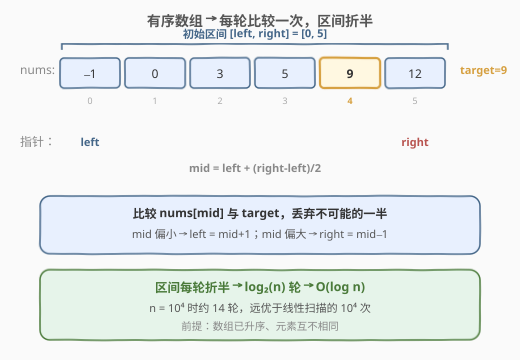
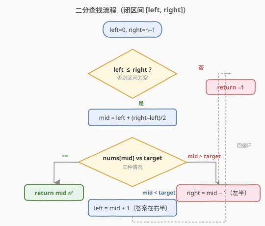
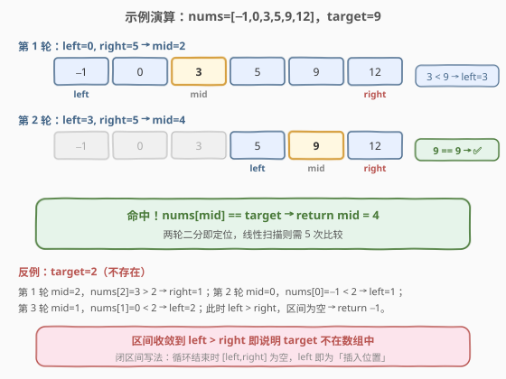

# 二分查找

- **题目名称**：二分查找
- **链接**：[704. 二分查找](https://leetcode.cn/problems/binary-search/)
- **难度**：简单
- **标签**：数组、二分查找

## 1. 题目概述

给定一个 **升序排列** 的整数数组 `nums`，和一个目标值 `target`。编写一个函数搜索 `nums` 中的 `target`，如果目标值存在则返回它的**下标**，否则返回 `-1`。

你必须编写一个具有 `O(log n)` 运行时间的算法。

**示例 1**：

```text
输入：nums = [-1,0,3,5,9,12], target = 9
输出：4
解释：9 出现在下标 4 处，返回 4。
```

**示例 2**：

```text
输入：nums = [-1,0,3,5,9,12], target = 2
输出：-1
解释：2 不存在数组中，返回 -1。
```

**约束条件**：

- `1 <= nums.length <= 10^4`
- `-10^4 < nums[i] < 10^4`
- `nums` 中的所有元素**互不相同**
- `nums` 已按**升序**排列

> 💡 这三条约束——**有序、互异、仅查是否存在**——正是最纯净的二分场景。本题是「一切二分题的母题」，把它的闭区间模板背熟，[35. 搜索插入位置]、[69. x 的平方根]、[278. 第一个错误的版本] 等都能一键迁移。

---

## 2. 解题思路

### 2.1 暴力思路：线性扫描

从头到尾遍历数组，逐个比较 `nums[i] == target`，命中则返回 `i`，遍历完仍未命中返回 `-1`。时间 `O(n)`、空间 `O(1)`。能过提交，但**完全浪费了「数组已升序」这一关键性质**，且不满足题目要求的 `O(log n)`。

> ⚠️ 题目明确要求 `O(log n)`，因此线性扫描虽对却**不符规范**；面试中若只给 `O(n)` 方案通常会被追问「能不能利用有序性做得更快」。

### 2.2 核心观察：有序 → 每轮砍掉一半



关键直觉：数组**升序**意味着任意取一个中点 `mid`，`nums[mid]` 与 `target` 的大小关系能**直接判定 target 落在左半还是右半**：

- `nums[mid] == target`：找到了，返回 `mid`。
- `nums[mid] < target`：`mid` 及其左侧都更小，**整个左半丢弃**，去右半 `[mid+1, right]` 找。
- `nums[mid] > target`：`mid` 及其右侧都更大，**整个右半丢弃**，去左半 `[left, mid-1]` 找。

每轮比较一次、区间折半，`n` 个元素最多 $\log_2 n$ 轮即收敛。这就是「二分」名字的由来——**每次把搜索空间一分为二**。

> 💡 **为什么能放心丢弃一半？** 因为有序性保证了被丢弃的那一半里**不可能**存在 `target`：`nums[mid] < target` 时，`mid` 左侧元素 `≤ nums[mid] < target`，全部小于 `target`，自然没有等于 `target` 的。

### 2.3 算法流程图



闭区间写法 `[left, right]` 的循环不变量是：**若 `target` 存在，它一定在 `[left, right]` 内**。三处收缩都严格维护这条不变量：

- `left = mid + 1`：`mid` 已确认偏小，排除 `mid` 及其左侧。
- `right = mid - 1`：`mid` 已确认偏大，排除 `mid` 及其右侧。
- 命中即 `return`：题目保证元素互异，命中的就是唯一答案。

当 `left > right` 时区间为空，说明 `target` 从未在不变量保护的范围内，返回 `-1`。

### 2.4 示例演算

以 `nums = [-1,0,3,5,9,12], target = 9` 为例，`n = 6`。



| 轮次 | left | right | mid | nums[mid] | 判断 | 动作 |
|------|------|-------|-----|-----------|------|------|
| 1 | 0 | 5 | 2 | 3 | 3 < 9 | left = 3 |
| 2 | 3 | 5 | 4 | 9 | 9 == 9 | **return 4** ⭐ |

仅两轮即定位。对比线性扫描需要比较到下标 4（共 5 次），二分的优势随 `n` 增大愈发明显：`n = 10^4` 时二分约 14 轮，线性扫描最坏 10^4 次。

反例 `target = 2`（不存在）：`mid=2`(3>2→right=1) → `mid=0`(−1<2→left=1) → `mid=1`(0<2→left=2)，此时 `left=2 > right=1`，区间为空，返回 `-1`。

> 💡 注意循环结束时 `left` 恰好停在「第一个大于 `target` 的位置」，这正是 [35. 搜索插入位置] 的答案——把 `return -1` 改成 `return left` 即可。两题本质同构。

---

## 3. 参考代码

### C++（闭区间模板）

```cpp
class Solution {
  public:
    int search(vector<int>& nums, int target) {
        int left = 0, right = nums.size() - 1;
        while (left <= right) {
            int mid = left + (right - left) / 2; // 防溢出写法
            if (nums[mid] == target) {
                return mid;
            } else if (nums[mid] < target) {
                left = mid + 1;   // 去右半找
            } else {
                right = mid - 1;  // 去左半找
            }
        }
        return -1; // 区间为空，未找到
    }
};
```

### Python

```python
class Solution:
    def search(self, nums: List[int], target: int) -> int:
        left, right = 0, len(nums) - 1
        while left <= right:
            mid = left + (right - left) // 2  # 防溢出，等价于 (left+right)//2
            if nums[mid] == target:
                return mid
            elif nums[mid] < target:
                left = mid + 1
            else:
                right = mid - 1
        return -1
```

> ⚠️ **三个易错点**：
> 1. **`mid` 用 `left + (right - left) / 2`** 而非 `(left + right) / 2`，后者在 `left + right` 接近 `INT_MAX` 时会整数溢出（C++/Java）。Python 大整数不溢出，但保持同一写法便于跨语言记忆。
> 2. **收缩要越过 `mid`**：`left = mid + 1`、`right = mid - 1`，不能写成 `left = mid` / `right = mid`，否则区间无法缩小、可能死循环。
> 3. **循环条件 `left <= right`** 与闭区间 `[left, right]` 配套；若改用左闭右开 `[left, right)`，条件要换成 `left < right` 且 `right = mid`，两套模板不要混用。

---

## 4. 复杂度分析

| 维度 | 复杂度 | 说明 |
|------|--------|------|
| 时间复杂度 | $O(\log n)$ | 每轮区间折半，最多 $\lceil \log_2 n \rceil$ 轮；$n=10^4$ 时约 14 轮 |
| 空间复杂度 | $O(1)$ | 仅用 `left`、`right`、`mid` 三个指针变量 |

> 💡 **为什么是 $O(\log n)$ 而非 $O(n)$？** 关键在于「每轮丢弃一半」。区间规模按 $n \to n/2 \to n/4 \to \dots \to 1$ 衰减，缩到 1 最多 $\log_2 n$ 步。即便 `target` 不存在，循环也只多跑一轮就因 `left > right` 退出，仍是 $O(\log n)$。

---

## 5. 扩展：左闭右开写法与 STL

### 5.1 左闭右开 `[left, right)` 模板

另一种等价写法把搜索区间定义为**左闭右开** `[left, right)`，即 `right` 是「上界之外」的位置：

```cpp
int search(vector<int>& nums, int target) {
    int left = 0, right = nums.size(); // right 初值取 n，不在区间内
    while (left < right) {             // 区间非空的条件是 left < right
        int mid = left + (right - left) / 2;
        if (nums[mid] == target) return mid;
        else if (nums[mid] < target) left = mid + 1;
        else right = mid;              // mid 已排除，右端开区间直接收到 mid
    }
    return -1;
}
```

**两种模板对比**：

| 维度 | 闭区间 `[l, r]` | 左闭右开 `[l, r)` |
|------|----------------|-------------------|
| `right` 初值 | `n - 1` | `n` |
| 循环条件 | `left <= right` | `left < right` |
| 偏大时收缩 | `right = mid - 1` | `right = mid` |
| 区间为空判据 | `left > right` | `left == right` |

> 💡 两者完全等价，**选一种背熟即可**。闭区间模板更直观（`left`、`right` 都指向合法下标），左闭右开则与 C++ STL 的 `lower_bound` / `upper_bound` 语义一致，写「找边界」类题（如 [34. 查找区间](../0001-0100/34_在排序数组中查找元素的第一个和最后一个位置.md)）更顺手。

### 5.2 STL 一行解法

C++ 可直接用 `std::binary_search` 判断存在性（返回 `bool`），但本题要返回下标，更实用的是 `lower_bound`：

```cpp
#include <algorithm>
class Solution {
  public:
    int search(vector<int>& nums, int target) {
        auto it = lower_bound(nums.begin(), nums.end(), target);
        if (it != nums.end() && *it == target) return it - nums.begin();
        return -1;
    }
};
```

Python 对应 `bisect_left`。面试中手写模板更受青睐，但知道 STL 等价写法有助于快速验证。

---

## 6. 面试要点

1. **二分查找的三个前提条件是什么？**

   - **有序**（本题升序）、**可随机访问**（数组，链表不行）、**能根据中点判定方向**（`nums[mid]` 与 `target` 的大小关系单调）。三者缺一不可，面试时先确认这三点再下笔。

2. **为什么 `mid` 用 `left + (right - left) / 2` 而不是 `(left + right) / 2`？**

   - 后者在 `left + right` 超过 `INT_MAX` 时会整数溢出（C++/Java），得到负数下标越界。差值写法保证中间结果不超过 `right`，安全。Python 不溢出但保持同一写法便于跨语言记忆。

3. **循环条件用 `left <= right` 还是 `left < right`？**

   - 取决于区间定义。闭区间 `[left, right]` 配 `left <= right`（区间为空时 `left > right` 自然退出）；左闭右开 `[left, right)` 配 `left < right`（区间为空时 `left == right`）。关键是**区间定义、收缩、终止条件三者自洽**，绝不能混用，否则要么漏判单元素、要么死循环。

4. **收缩时为什么是 `mid + 1` / `mid - 1` 而不是 `mid`？**

   - 因为 `mid` 已经比较过并确认不等于 `target`，必须从候选区间排除。若写成 `left = mid`，当区间只剩两个元素时 `mid` 恒等于 `left`，`left` 永远不动，死循环。`+1` / `-1` 保证区间每轮严格缩小。

5. **如果数组中有重复元素，本题模板还适用吗？**

   - 仍能找到 `target`，但命中位置是「任意一个」等于 `target` 的下标（取决于收缩策略）。若要找「第一个」或「最后一个」，需在命中后**继续向一侧收缩**而非立即返回，这正是 [34. 在排序数组中查找元素的第一个和最后一个位置](../0001-0100/34_在排序数组中查找元素的第一个和最后一个位置.md) 的做法。

6. **本题如何迁移到「找插入位置」(35) 和「二分答案」(69、875)？**

   - 35 只需把 `return -1` 改成 `return left`——循环结束时 `left` 就是「第一个 ≥ `target` 的位置」即插入点。69、875 这类「二分答案」则把「搜索下标」推广为「在答案值域上二分」，每次用 `O(n)` 的 `check` 函数判定 mid 是否可行，骨架仍是 `while + mid + 收缩`。

---

## 7. 同类练习题

- [35. 搜索插入位置](https://leetcode.cn/problems/search-insert-position/)：把本题 `return -1` 改成 `return left`，即 `lower_bound` 的直接应用
- [278. 第一个错误的版本](https://leetcode.cn/problems/first-bad-version/)：二分找「第一个」满足条件的位置，与找左边界同构
- [69. x 的平方根](https://leetcode.cn/problems/sqrtx/)：在答案值域上二分，找最大的「平方 ≤ x」的整数
- [34. 在排序数组中查找元素的第一个和最后一个位置](https://leetcode.cn/problems/find-first-and-last-position-of-element-in-sorted-array/)：本题进阶，命中后继续收缩找左右边界
- [162. 寻找峰值](https://leetcode.cn/problems/find-peak-element/)：二分比较中点与邻居决定方向，体会「有序性」的广义含义
