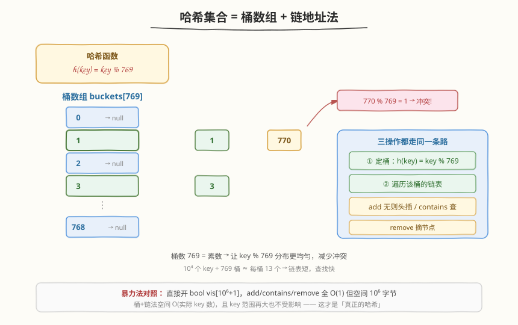
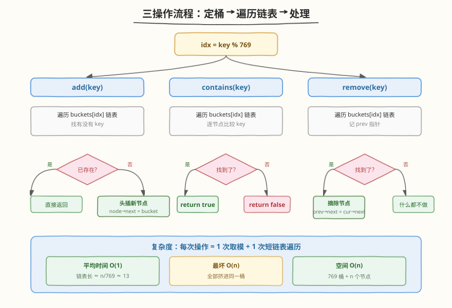
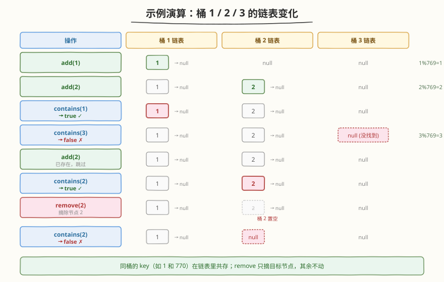

# 设计哈希集合

- **题目名称**：设计哈希集合
- **链接**：[705. 设计哈希集合](https://leetcode.cn/problems/design-hashset/)
- **难度**：简单
- **标签**：设计、哈希表、链表

## 1. 题目概述

不使用任何内建的哈希表库，设计一个哈希集合（`HashSet`）。实现 `MyHashSet` 类：

- `void add(key)`：向哈希集合中插入值 `key`。
- `bool contains(key)`：返回哈希集合中是否存在这个值 `key`。
- `void remove(key)`：将给定值 `key` 从哈希集合中删除。如果哈希集合中没有这个值，什么也不做。

**示例**：

```text
输入：
["MyHashSet", "add", "add", "contains", "contains", "add", "contains", "remove", "contains"]
[[], [1], [2], [1], [3], [2], [2], [2], [2]]
输出：
[null, null, null, true, false, null, true, null, false]

解释：
MyHashSet myHashSet = new MyHashSet();
myHashSet.add(1);      // set = [1]
myHashSet.add(2);      // set = [1, 2]
myHashSet.contains(1); // 返回 True
myHashSet.contains(3); // 返回 False，（未找到）
myHashSet.add(2);      // set = [1, 2]
myHashSet.contains(2); // 返回 True
myHashSet.remove(2);   // set = [1]
myHashSet.contains(2); // 返回 False，（已移除）
```

**约束条件**：

- $0 \le key \le 10^6$
- 最多调用 $10^4$ 次 `add`、`remove` 和 `contains`

> 💡 这是一道**手撕哈希表**的经典题。题目禁用内建哈希库，意图就是考察你对哈希集合底层结构的理解：**桶数组 + 冲突处理**。key 范围高达 $10^6$ 但实际操作数仅 $10^4$，直接开大数组会浪费空间，这正是「真正的哈希」要解决的问题。

---

## 2. 解题思路

### 2.1 暴力思路：超大布尔数组

key 范围是 $[0, 10^6]$，最暴力的办法是直接开一个 `bool vis[1000001]` 数组：

- `add(key)`：`vis[key] = true`
- `remove(key)`：`vis[key] = false`
- `contains(key)`：`return vis[key]`

三操作全是 `O(1)`，能过提交。但**空间固定 $O(10^6)$**——即便只存 1 个 key 也要吃掉 1MB 内存；若 key 范围再大（比如 $10^9$）就直接爆内存。这种「用空间换映射」的做法没有体现哈希的核心思想，面试中通常会被追问「key 范围很大怎么办」。

> ⚠️ 布尔数组法的本质是**把 key 当下标**，即「哈希函数 = 恒等映射」。它只在 key 值域小且稠密时可行。一旦值域稀疏或上界未知，就必须用真正的哈希函数把 key 压缩到有限的桶里。

### 2.2 核心观察：桶数组 + 链地址法



真正的哈希集合由两部分组成：

- **哈希函数** `h(key) = key % BASE`：把任意大的 key 压缩到一个有限的桶编号 $[0, BASE)$。这样无论 key 上界多大，桶数组大小始终是 `BASE`。
- **冲突处理（链地址法）**：不同的 key 可能映射到同一个桶（如 `1 % 769 = 1`、`770 % 769 = 1`），这种叫**哈希冲突**。解决办法是每个桶挂一条链表，所有落到该桶的 key 都存进链表里。

三个操作的统一套路：

| 步骤 | add | contains | remove |
|------|-----|----------|--------|
| ① 定桶 | `h(key)` | `h(key)` | `h(key)` |
| ② 遍历链表 | 找有没有 `key` | 找 `key` | 找 `key` 并记前驱 |
| ③ 处理 | 没找到则头插 | 找到返回 `true`，否则 `false` | 找到则摘除节点 |

> 💡 **为什么 `BASE` 选素数 769？** 素数能让 `key % BASE` 的分布更均匀——若 `BASE` 含小因子（如取 768 = $2^8 \times 3$），则 key 的小因子规律会「渗透」到桶编号里造成聚集。769 是接近 $10^4 / 13$ 的素数，让 $10^4$ 个 key 平均每桶约 13 个，链表足够短。

### 2.3 算法流程图



三个操作共享前两步（定桶 + 遍历），只在第三步分叉。关键细节：

- **add 的幂等性**：遍历链表先查重，已存在就直接返回，不重复插入——这保证集合「不重复」的语义。
- **remove 的前驱指针**：单向链表删节点需要改它前驱的 `next`，所以遍历时维护 `prev`。删除头节点（`prev` 为空）要特判，让桶指针直接指向第二个节点。
- **contains 只读**：最简单，遍历找到就 `true`，遍历完没找到就 `false`。

### 2.4 示例演算

以题目示例为例，跟踪桶 1、2、3 的链表变化（`h(key) = key % 769`，故 `1→桶1`、`2→桶2`、`3→桶3`）：



注意两个关键点：

- `add(2)` 重复插入时，遍历发现桶 2 链表已有 `2`，直接返回，链表不变——这是**幂等性**的体现。
- `remove(2)` 摘除节点后，桶 2 的链表回到 `null`，但桶 1、桶 3 不受影响——链地址法的删除是**局部操作**，不牵动其他桶。

---

## 3. 参考代码

### C++

```cpp
class MyHashSet {
    static const int BASE = 769;                 // 素数桶数
    vector<list<int>> data;                      // 每个桶一条链表

    int hash(int key) { return key % BASE; }

  public:
    MyHashSet() : data(BASE) {}

    void add(int key) {
        int h = hash(key);
        for (int v : data[h]) {                  // 先查重
            if (v == key) return;                // 已存在，幂等返回
        }
        data[h].push_back(key);                  // 头/尾插均可
    }

    void remove(int key) {
        int h = hash(key);
        for (auto it = data[h].begin(); it != data[h].end(); ++it) {
            if (*it == key) {
                data[h].erase(it);               // 摘除节点
                return;
            }
        }
    }

    bool contains(int key) {
        int h = hash(key);
        for (int v : data[h]) {
            if (v == key) return true;
        }
        return false;
    }
};
```

### Python

```python
class MyHashSet:
    def __init__(self):
        self.BASE = 769                          # 素数桶数
        self.data = [[] for _ in range(self.BASE)]

    def _hash(self, key: int) -> int:
        return key % self.BASE

    def add(self, key: int) -> None:
        h = self._hash(key)
        for k in self.data[h]:                   # 先查重
            if k == key:
                return                           # 已存在，幂等返回
        self.data[h].append(key)

    def remove(self, key: int) -> None:
        h = self._hash(key)
        for i, k in enumerate(self.data[h]):
            if k == key:
                self.data[h].pop(i)             # 摘除节点
                return

    def contains(self, key: int) -> bool:
        h = self._hash(key)
        for k in self.data[h]:
            if k == key:
                return True
        return False
```

---

## 4. 复杂度分析

| 维度 | 复杂度 | 说明 |
|------|--------|------|
| 时间复杂度（平均） | `O(1)` | 定桶 `O(1)` + 链表遍历。$n$ 个 key 均匀分散到 769 桶，平均链长 $n/769 \approx 13$，常数级 |
| 时间复杂度（最坏） | `O(n)` | 极端情况所有 key 都映射到同一桶（哈希函数退化），链表退化成长 $n$ 的链 |
| 空间复杂度 | `O(BASE + n)` | 桶数组 `O(BASE)` 固定开销 + $n$ 个节点 |

> 💡 平均 `O(1)` 的前提是**哈希函数分布均匀**。这也是选素数桶数的原因——让 `key % BASE` 尽可能打乱，避免聚集。若想严格保证最坏也是 `O(1)`，可改用**平衡树桶**（每个桶用红黑树而非链表，Java 8 的 `HashMap` 就是链表长超阈值时转红黑树）。

---

## 5. 扩展：其他冲突处理策略

链地址法不是唯一的冲突处理方案，几种主流策略对比：

| 策略 | 做法 | 优点 | 缺点 |
|------|------|------|------|
| **链地址法**（本题） | 每桶挂链表 | 实现简单、不怕装填因子超 1 | 链表节点零散，缓存不友好；最坏 `O(n)` |
| **开放寻址法** | 冲突时按规则探测下一个空槽（线性探测 / 二次探测 / 双哈希） | 全部存在数组里，缓存友好；无指针开销 | 装填因子高时性能急剧下降；删除需「懒删除」标记 |
| **再哈希** | 装填因子超阈值时换更大的桶数组 + 新哈希函数，全部 rehash | 控制 `O(1)` 均摊 | rehash 瞬间开销大（可分摊到后续操作做增量迁移） |

> ⚠️ 开放寻址法在 `remove` 时不能真把槽位清空——否则会打断探测序列，让后续 `contains` 找不到本应冲突到后面的 key。标准做法是标记为「已删除（tombstone）」，`contains` 遇到 tombstone 继续探测，`add` 遇到可复用。

---

## 6. 面试要点

1. **为什么选素数作为桶数？**

   - 素数能让 `key % BASE` 分布更均匀。若 `BASE` 含小因子，key 的小因子规律会「渗透」到桶编号里造成聚集（例如 `BASE = 100` 时，所有以 `00` 结尾的 key 都映射到桶 0）。

2. **链地址法和开放寻址法各自的适用场景？**

   - 链地址法：装填因子可超 1、实现简单、删除方便，适合 key 数波动大或不确定的场景。
   - 开放寻址法：缓存友好、无指针开销，适合 key 数可控、装填因子低（一般 < 0.7）的场景。Java `HashMap` 用链地址（链表超 8 转红黑树），Python `dict` / C++ `unordered_map` 用开放寻址。

3. **`add` 为什么要先遍历查重？**

   - 哈希集合的语义是「不重复元素」。若不查重直接插入，重复 `add` 同一 key 会在链表里产生多个相同节点，`remove` 时只能删一个，`contains` 语义也会混乱。查重保证幂等性。

4. **装填因子（load factor）是什么？什么时候要扩容？**

   - 装填因子 $\alpha = n / BASE$（元素数 ÷ 桶数）。$\alpha$ 越大链表越长、查找越慢。实践中 $\alpha > 0.75$ 通常触发**再哈希**：桶数翻倍（仍取素数）、所有 key 重新 `hash` 落桶。本题 `10^4` 个 key 配 769 桶，$\alpha \approx 13$，对简单题够用；工业级实现会动态扩容。

5. **这题和 706 设计哈希映射有什么区别？**

   - 705 存的是「值」（key 即元素本身），706 存的是「键值对」（key → value）。底层结构几乎一样：桶数组 + 链地址法，只是链表节点从存 `int key` 变成存 `(key, value)`。掌握 705 后 706 是机械迁移。

---

## 7. 同类练习题

- [706. 设计哈希映射](https://leetcode.cn/problems/design-hashmap/)：705 的孪生题，存键值对而非单值，结构完全相同，节点多一个 value 字段
- [146. LRU 缓存](../0001-0100/146_LRU缓存.md)：哈希表 + 双向链表的设计题，哈希表负责 `O(1)` 定位，链表维护访问顺序（题解已写）
- [380. O(1) 时间插入、删除和获取随机元素](https://leetcode.cn/problems/insert-delete-getrandom-o1/)：哈希表 + 动态数组的设计题，哈希表管定位、数组管随机访问，两结构协同补足
- [460. LFU 缓存](https://leetcode.cn/problems/lfu-cache/)：更复杂的设计题，频率桶 + 同频率内 LRU，哈希表贯穿其中
