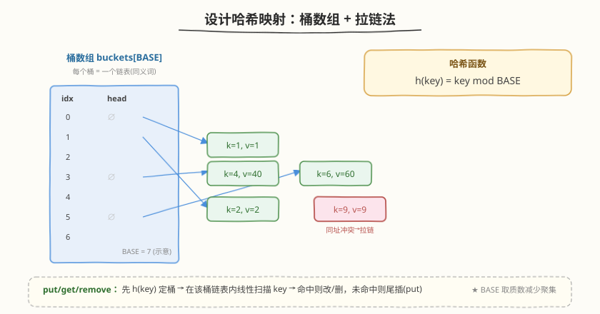
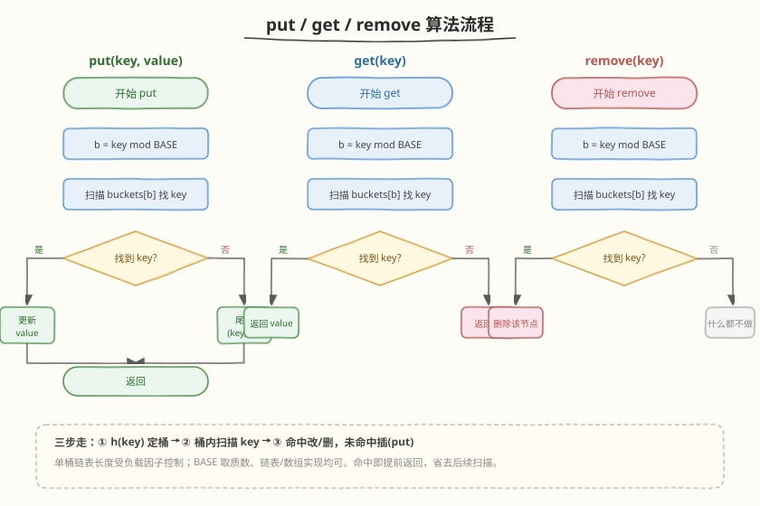
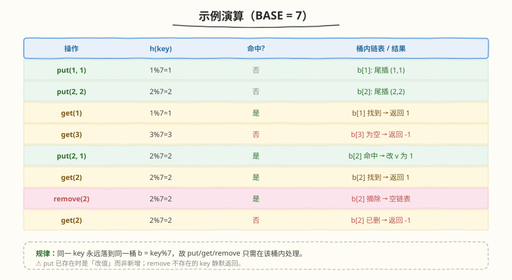

# LeetCode 设计哈希映射 题解

## 1. 题目概述

- **标题 / 题号**：设计哈希映射（#706，easy）
- **链接**：https://leetcode.cn/problems/design-hashmap/
- **难度**：简单
- **标签**：设计、哈希表、数组、链表

**题意**：不使用任何内建的哈希表/哈希集合库，自己实现一个**哈希映射**（`MyHashMap`）：

- `MyHashMap()`：初始化对象
- `void put(int key, int value)`：向哈希映射中插入 `(key, value)` 键值对。如果 `key` 已经存在，则**更新**其对应的值 `value`
- `int get(int key)`：返回特定的 `key` 所映射的 `value`；如果映射中**不包含** `key` 的映射，返回 `-1`
- `void remove(int key)`：如果映射中存在 `key` 的映射，则移除 `key` 和它所对应的 `value`

**示例 1**：

```text
输入：
MyHashMap myHashMap = new MyHashMap();
myHashMap.put(1, 1);       // myHashMap 现在为 [[1,1]]
myHashMap.put(2, 2);       // myHashMap 现在为 [[1,1], [2,2]]
myHashMap.get(1);          // 返回 1 ，myHashMap 现在为 [[1,1], [2,2]]
myHashMap.get(3);          // 返回 -1（未找到），myHashMap 现在为 [[1,1], [2,2]]
myHashMap.put(2, 1);       // myHashMap 现在为 [[1,1], [2,1]]（更新已有的值）
myHashMap.get(2);          // 返回 1 ，myHashMap 现在为 [[1,1], [2,1]]
myHashMap.remove(2);       // 删除键为 2 的数据，myHashMap 现在为 [[1,1]]
myHashMap.get(2);          // 返回 -1（未找到），myHashMap 现在为 [[1,1]]
```

**约束**：

- `0 <= key, value <= 10^6`
- 最多调用 `10^4` 次 `put`、`get` 和 `remove`

## 2. 解题思路

### 2.1 暴力思路

用一个数组（或 `vector<pair<int,int>>`）顺序存所有 `(key, value)`：`put` 时先线性扫一遍看 key 是否已存在（存在则改、不存在则尾插），`get`/`remove` 同样线性扫描。`key` 范围 `0~10^6`、最多 `10^4` 次操作，最坏存 `10^4` 个元素，单次操作 `O(n)`，总量 `10^8` 级别可过但不符合哈希表"平均 `O(1)`"的设计目标。

> ⚠️ 另一种"暴力"是开 `10^6+1` 大小的数组直接用 `key` 做下标（`value` 数组 + `visited` 标记）。空间 `O(U)`（`U` 为键域大小），键域小时可行，但键域一大就爆内存——这正是**哈希函数压缩键域**要解决的问题。

### 2.2 核心观察：桶数组 + 拉链法（链地址法）



关键洞察：**用哈希函数把 `10^6` 的键域压缩到 `BASE` 个桶**，把"同义词"（哈希到同一桶的 key）用一条链表串起来。

- **哈希函数**：`h(key) = key mod BASE`，把任意 `key` 映射到 `[0, BASE)`
- **桶数组**：`buckets[BASE]`，每个桶存放一个链表（或动态数组）
- **同义词冲突**：两个不同 key 哈希到同一桶时（如 `2` 与 `9` 都 `% 7 = 2`），在该桶的链表内并存

| 结构 | 职责 | 复杂度 |
|------|------|--------|
| 桶数组 + 哈希函数 | 把 `key` 压缩到桶下标 | `O(1)` 定桶 |
| 桶内链表 | 存同义词、扫描定位 | 平均 `O(1)`（受负载因子控制） |

> 💡 **BASE 取质数**：若 `BASE` 取合数（如 `1000`）且 key 分布有公因子规律（如都是偶数），哈希值会聚集到少数几个桶。取质数（`1009`）能打散这种规律，使分布更均匀，降低冲突率。

### 2.3 算法流程



三个操作都是同一套"三步走"：

1. **定桶**：`b = key % BASE`
2. **桶内扫描**：遍历 `buckets[b]`，逐个比较 `key` 是否相等
3. **处理命中 / 未命中**：
   - `put`：命中 → 更新 `value`；未命中 → 尾插 `(key, value)`
   - `get`：命中 → 返回 `value`；未命中 → 返回 `-1`
   - `remove`：命中 → 摘除该节点；未命中 → 静默返回（什么都不做）

### 2.4 示例演算



以 `BASE = 7` 为例，逐步执行官方示例：

| 操作 | `h(key)` | 命中? | 桶内链表 / 结果 |
|------|----------|-------|-----------------|
| `put(1, 1)` | `1%7=1` | 否 | `b[1]`: 尾插 `(1,1)` |
| `put(2, 2)` | `2%7=2` | 否 | `b[2]`: 尾插 `(2,2)` |
| `get(1)` | `1%7=1` | 是 | `b[1]` 找到 → 返回 `1` |
| `get(3)` | `3%7=3` | 否 | `b[3]` 为空 → 返回 `-1` |
| `put(2, 1)` | `2%7=2` | 是 | `b[2]` 命中 → 改 `v` 为 `1` |
| `get(2)` | `2%7=2` | 是 | `b[2]` 找到 → 返回 `1` |
| `remove(2)` | `2%7=2` | 是 | `b[2]` 摘除 → 空链表 |
| `get(2)` | `2%7=2` | 否 | `b[2]` 已删 → 返回 `-1` |

> 💡 同一 key 永远落到同一桶，故 `put` 已存在时是「改值」而非新增；`remove` 不存在的 key 静默返回。

## 3. 参考代码

### C++

```cpp
class MyHashMap {
    static const int BASE = 1009; // 质数，降低聚集
    vector<list<pair<int, int>>> buckets;

    int hash(int key) { return key % BASE; }

  public:
    MyHashMap() : buckets(BASE) {}

    void put(int key, int value) {
        int b = hash(key);
        for (auto it = buckets[b].begin(); it != buckets[b].end(); ++it) {
            if (it->first == key) { // 已存在 -> 更新
                it->second = value;
                return;
            }
        }
        buckets[b].emplace_back(key, value); // 不存在 -> 尾插
    }

    int get(int key) {
        int b = hash(key);
        for (auto& p : buckets[b]) {
            if (p.first == key) return p.second;
        }
        return -1;
    }

    void remove(int key) {
        int b = hash(key);
        for (auto it = buckets[b].begin(); it != buckets[b].end(); ++it) {
            if (it->first == key) {
                buckets[b].erase(it); // 摘除后立即返回，迭代器失效也无所谓
                return;
            }
        }
    }
};
```

### Python

```python
class MyHashMap:
    def __init__(self):
        self.BASE = 1009
        self.buckets = [[] for _ in range(self.BASE)]  # 每个桶用一个 list 存 (key, value)

    def put(self, key: int, value: int) -> None:
        b = key % self.BASE
        for i, (k, _) in enumerate(self.buckets[b]):
            if k == key:                       # 已存在 -> 原地更新
                self.buckets[b][i] = (key, value)
                return
        self.buckets[b].append((key, value))   # 不存在 -> 尾插

    def get(self, key: int) -> int:
        b = key % self.BASE
        for k, v in self.buckets[b]:
            if k == key:
                return v
        return -1

    def remove(self, key: int) -> None:
        b = key % self.BASE
        for i, (k, _) in enumerate(self.buckets[b]):
            if k == key:
                self.buckets[b].pop(i)         # 摘除后立即返回
                return
```

## 4. 复杂度分析

| 维度 | 复杂度 | 说明 |
|------|--------|------|
| 时间复杂度 | 平均 `O(1)`，最坏 `O(n)` | 定桶 `O(1)`；桶内链表长度由负载因子 $\alpha = n / \text{BASE}$ 决定。本题 `n ≤ 10^4`、`BASE = 1009`，$\alpha \approx 10$，单桶平均 `O(1)`；最坏所有 key 同址时退化为 `O(n)` |
| 空间复杂度 | `O(BASE + n)` | 桶数组 `O(BASE)` 固定开销 + `n` 个节点 |

> ⚠️ 本题 `BASE = 1009` 是工程与题面的折中：`BASE` 越大空间越费、但冲突越少；`BASE` 太小则链表偏长。保证 $\alpha$ 接近常数即可让平均时间 `O(1)`。

## 5. 扩展：开放寻址法与动态扩容

### 5.1 开放寻址法（Open Addressing）

不开链表，所有元素直接存进桶数组；冲突时按探测序列找下一个空位：

- **线性探测**：`h(key), h(key)+1, h(key)+2, ...`（模 `BASE`）。实现简单，但易产生**聚集**（clustering）
- **二次探测 / 双重哈希**：步长用 $i^2$ 或第二个哈希函数，缓解聚集

拉链法 vs 开放寻址：

| 维度 | 拉链法 | 开放寻址 |
|------|--------|----------|
| 冲突处理 | 桶外挂链表 | 桶内找下一个空位 |
| 删除 | 直接摘链表节点（简单） | 不能真删（需墓碑标记，否则打断探测链） |
| 负载因子 | 可 `> 1` | 必须 `< 1`，通常 `< 0.75` |
| 缓存友好性 | 链表指针跳转，较差 | 数组连续，较好 |

> 💡 本题 `remove` 频繁，拉链法删起来最干净（摘节点即可），故首选拉链法。

### 5.2 动态扩容（Rehash）

固定 `BASE` 在 `n` 增大时会让链表变长、平均复杂度退化。工程级哈希表会在 $\alpha$ 超过阈值（如 `0.75`）时**扩容**：开 `2×BASE`（仍取质数）的新桶数组，把所有元素**重新哈希**搬过去。均摊后单次操作仍是 `O(1)`。本题 `n ≤ 10^4` 给定上限，固定 `BASE` 即可，无需扩容。

## 6. 面试要点

1. **为什么不直接用 `key` 做数组下标？**

   - `key` 域 `0~10^6`，直接开 `10^6+1` 数组要 `O(U)` 空间。若 `U` 更大（如字符串 key、`10^9` 域）就爆内存。哈希函数的意义就是把"稀疏的大键域"压缩到"稠密的小桶数组"。

2. **拉链法和开放寻址法怎么选？本题为什么选拉链法？**

   - 本题 `remove` 操作多。开放寻址删元素不能真删（会打断探测序列），要用"墓碑"标记，实现复杂且会累积墓碑影响性能；拉链法摘链表节点即可，干净利落。且拉链法对负载因子 `> 1` 容忍度更高。

3. **为什么 `BASE` 取质数？**

   - 若 `BASE` 是合数（如 `1000 = 2³×5³`）而 key 分布有公因子规律（如都是 2 的倍数），哈希值会聚集到偶数桶，一半桶空着。质数与大多数 key 互质，分布更均匀，冲突率更低。

4. **`put` 时如何区分"更新"和"新增"？**

   - 先扫描该桶链表找 `key`：找到就是更新 `value` 后返回；扫完没找到才是新增，尾插 `(key, value)`。不能无脑尾插，否则同一 key 会存多份副本。

5. **哈希表平均 `O(1)`，最坏情况是什么？怎么避免？**

   - 最坏是所有 key 哈希到同一桶，链表长 `n`，单次 `O(n)`。恶意的"哈希碰撞攻击"可构造大量同址 key 拖垮服务。避免方法：取质数 `BASE` + 好的哈希函数 + 扩容 rehash；工程上还可用随机化哈希种子防攻击。

## 同类练习题

| # | 题目 | 与本题的关联 |
|---|------|-------------|
| 705 | [设计哈希集合](https://leetcode.cn/problems/design-hashset/) | 姊妹题，只存 key 不存 value，同一套桶 + 拉链法模板，把 `(key,value)` 换成 `key` 即可 |
| 146 | [LRU 缓存](https://leetcode.cn/problems/lru-cache/) | 哈希表 + 双向链表的进阶设计题，哈希表负责 `O(1)` 定位、链表负责维护时序，思路同源 |
| 380 | [O(1) 时间插入、删除和获取随机元素](https://leetcode.cn/problems/insert-delete-getrandom-o1/) | 哈希表 + 数组的"交换到末尾再删"技巧，另一类 `O(1)` 三件套设计 |
| 460 | [LFU 缓存](https://leetcode.cn/problems/lfu-cache/) | 频率桶 + 哈希的进阶设计，与拉链法的"桶 + 链表"结构有相通之处 |
