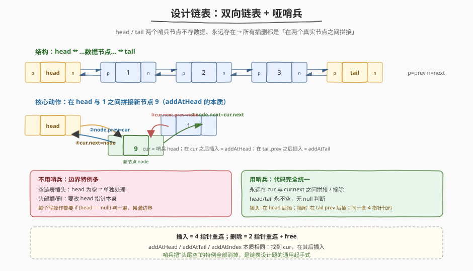
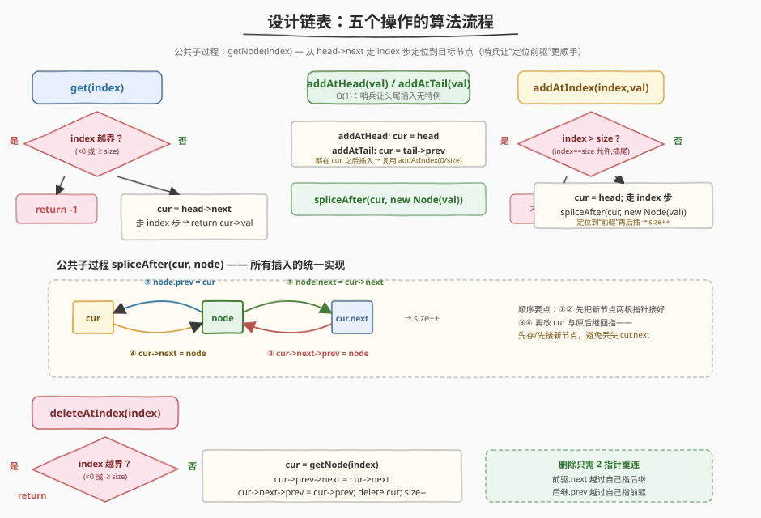
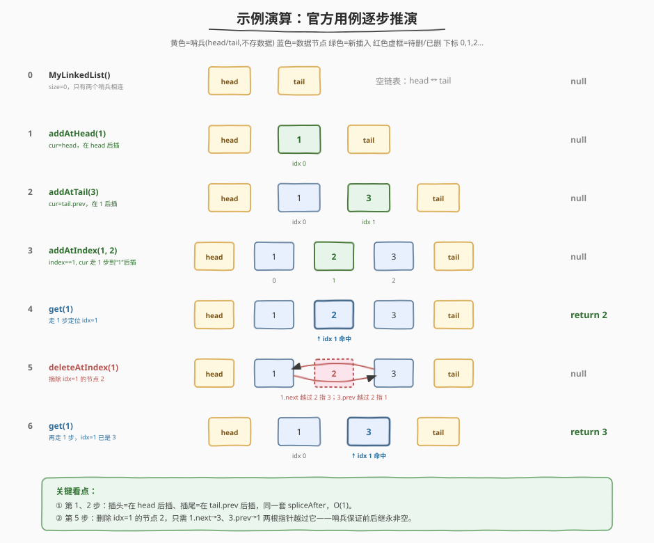

# 设计链表

- **题目名称**：设计链表
- **链接**：[707. 设计链表](https://leetcode.cn/problems/design-linked-list/)
- **难度**：中等
- **标签**：设计、链表、双向链表

## 1. 题目概述

设计并实现自己的链表（可选单链表或双向链表）。节点下标从 **0** 开始。需实现 `MyLinkedList` 类：

- `MyLinkedList()`：初始化对象
- `int get(int index)`：获取下标为 `index` 的节点值；下标无效返回 `-1`
- `void addAtHead(int val)`：将节点插到链表第一个元素之前（完成后新节点成为第一个）
- `void addAtTail(int val)`：将节点追加为链表最后一个元素
- `void addAtIndex(int index, int val)`：将节点插到下标为 `index` 的节点**之前**。`index == 长度` 时追加到末尾；`index > 长度` 时**不插入**
- `void deleteAtIndex(int index)`：下标有效则删除下标为 `index` 的节点

**示例**：

```text
输入：
  MyLinkedList();
  addAtHead(1);       // 链表：1
  addAtTail(3);       // 链表：1 -> 3
  addAtIndex(1, 2);   // 链表：1 -> 2 -> 3
  get(1);             // 返回 2
  deleteAtIndex(1);   // 链表：1 -> 3
  get(1);             // 返回 3
输出：[null, null, null, null, 2, null, 3]
```

**约束条件**：

- `0 <= index, val <= 1000`
- 请不要使用内置的 `LinkedList` 库
- 调用各方法的次数不超过 `2000`

> 💡 本题看似只是「手写链表 CRUD」，真正的考点是**边界处理**：空链表插头、删头、删尾、`index` 越界……朴素写法每个操作都要 `if (head == null)` 判一遍，极易漏。用「哑哨兵」一次性消掉所有空指针特例，是链表设计题的通用起手式。

---

## 2. 解题思路

### 2.1 暴力思路

用单链表 + 真实头指针：`addAtHead` 要改头指针本身；`addAtTail` 要遍历到末尾且尾节点 `next` 为空需特判；`deleteAtIndex` 删头节点时要改头指针、删尾节点时要处理前驱 `next` 置空；空链表时 `head == null` 几乎每个写操作都要单独处理。代码能写对，但分支多、易在「空表 / 单元素表 / 删头 / 删尾」四个边界翻车。

> ⚠️ 暴力法的问题不在效率（单链表 `addAtTail` 是 $O(n)$，其余也是 $O(n)$ 定位），而在**正确性**：没有哨兵时，每个写操作都要画 4 张边界图（空/头/尾/中段）逐一验证，心智负担大。

### 2.2 核心观察：双向链表 + 哑哨兵



关键洞察：**在真实头节点前再加一个不存数据的「头哨兵」`head`，在真实尾节点后加一个「尾哨兵」`tail`**，二者初始互连（`head.next = tail`，`tail.prev = head`）。于是：

- 链表**永远非空**（至少有两个哨兵），`head`/`tail` 指针本身**永不变动**——所有「改头指针」「头为空」的特例瞬间消失。
- 任何一个真实节点都有合法的 `prev` 和 `next`（最左数据节点的 `prev` 是 `head`，最右的 `next` 是 `tail`）——删除时 `cur.prev` / `cur.next` 永非 `null`，无需判空。
- **所有插入统一成「在某个节点 `cur` 之后拼接新节点」**：
  - `addAtHead(val)` = 在 `head` 之后插
  - `addAtTail(val)` = 在 `tail.prev` 之后插
  - `addAtIndex(index, val)` = 走到下标 `index` 的**前驱** `cur`（即从 `head` 走 `index` 步），在其后插

##### 拼接 / 摘除：唯一的两个原语

| 动作 | 指针重连 | 备注 |
|------|----------|------|
| **插入** `spliceAfter(cur, node)` | ①`node.next = cur.next` ②`node.prev = cur` ③`cur.next.prev = node` ④`cur.next = node` | 4 根指针，**先接新节点两根，再改 cur 与原后继** |
| **删除** `cur` | ①`cur.prev.next = cur.next` ②`cur.next.prev = cur.prev` ③`delete cur` | 2 根指针越过自己 |

> 💡 顺序要点：插入时**必须先执行①②把新节点两根指针接好，再执行③④改 `cur` 与原后继**。若先做④`cur.next = node`，则 `cur.next`（原后继）就被覆盖丢失，③`cur.next.prev` 会指向错误对象。口诀：**「先让孩子认双亲，再让双亲认孩子」**。

> ⚠️ 哑哨兵的代价仅是 2 个不存数据的节点 + 每个节点多一个 `prev` 指针（双向 vs 单向）。换来的是：**所有边界特例归零、`addAtHead`/`addAtTail` 都 $O(1)$、代码极短**。这是 Linux 内核 `list_head`、STL `deque` 控制块等工业级链表的标准做法。

### 2.3 算法流程



```
spliceAfter(cur, node):              // 所有插入的统一实现
    node.next = cur.next             // ①
    node.prev = cur                  // ②
    cur.next.prev = node             // ③
    cur.next = node                  // ④
    size += 1

get(index):
    if index < 0 or index >= size: return -1
    cur = head.next; 走 index 步
    return cur.val                   // O(index)

addAtHead(val):  spliceAfter(head, new Node(val))              // O(1)
addAtTail(val):  spliceAfter(tail.prev, new Node(val))         // O(1)

addAtIndex(index, val):
    if index > size: return          // index == size 允许（插尾）
    if index < 0: index = 0
    cur = head; 走 index 步          // 定位到“前驱”
    spliceAfter(cur, new Node(val))  // O(index)

deleteAtIndex(index):
    if index < 0 or index >= size: return
    cur = head.next; 走 index 步
    cur.prev.next = cur.next
    cur.next.prev = cur.prev
    delete cur; size -= 1            // O(index)
```

**关键不变量**：

- `head` / `tail` 是哨兵，**永不被删、永不为空**；真实数据节点都在 `head.next` 与 `tail.prev` 之间。
- `size` 严格等于真实数据节点数（不含哨兵）；`get`/`deleteAtIndex` 的越界判断只看 `size`，与指针无关。
- `addAtIndex` 走 `index` 步从 `head` 出发——`head` 自身是「第 0 个数据节点的前驱」，走 0 步停在 `head`，其后插即下标 0；走 `size` 步停在 `tail.prev`，其后插即追加到末尾，天然覆盖 `index == size` 的语义。

### 2.4 示例演算

以官方用例逐步推演，重点看哨兵如何让每个操作「无特例」：



| 看点 | 步骤 | 说明 |
|------|------|------|
| **空表也是合法结构** | 0 初始化 | 只有 `head ↔ tail` 两个哨兵相连，`size=0`——后续插头/插尾无需判空 |
| **插头=在 head 后插** | ① `addAtHead(1)` | `cur=head`，`spliceAfter` 把 1 接进 `head` 与 `tail` 之间，$O(1)$ |
| **插尾=在 tail.prev 后插** | ② `addAtTail(3)` | `cur=tail.prev`（即节点 1），在其后插 3——尾插无需遍历找尾 |
| **按下标插=定位前驱** | ③ `addAtIndex(1,2)` | 从 `head` 走 1 步到节点 1（即下标 1 的前驱），其后插 2，得 `1→2→3` |
| **get 越界靠 size 拦** | ④ `get(1)` | `1 < size=3` 合法，走 1 步命中节点 2，返回 2 |
| **删除只改 2 指针** | ⑤ `deleteAtIndex(1)` | 摘除节点 2：`1.next→3`、`3.prev→1`，2 被越过；前后继因哨兵永非空 |
| **删后下标平移** | ⑥ `get(1)` | 同样走 1 步，此刻下标 1 已是节点 3，返回 3 |

> 💡 对比 ⑤ 前⑤后：删除前 `1→2→3`（下标 1 是 2），删除后 `1→3`（下标 1 是 3）。被删节点之后的所有节点下标自动减 1，这是链表「物理相邻即逻辑相邻」的自然结果，无需额外维护。

---

## 3. 参考代码

### C++

```cpp
struct Node {
    int val;
    Node *prev, *next;
    Node(int v) : val(v), prev(nullptr), next(nullptr) {}
};

class MyLinkedList {
    Node *head, *tail;   // 哑哨兵，不存数据
    int size;

    // 在 cur 之后插入 node（4 指针重连）
    void spliceAfter(Node* cur, Node* node) {
        node->next = cur->next;
        node->prev = cur;
        cur->next->prev = node;
        cur->next = node;
        ++size;
    }

  public:
    MyLinkedList() : size(0) {
        head = new Node(0);
        tail = new Node(0);
        head->next = tail;
        tail->prev = head;
    }

    int get(int index) {
        if (index < 0 || index >= size) return -1;
        Node* cur = head->next;
        for (int i = 0; i < index; ++i) cur = cur->next;
        return cur->val;
    }

    void addAtHead(int val) {
        spliceAfter(head, new Node(val));
    }

    void addAtTail(int val) {
        spliceAfter(tail->prev, new Node(val));
    }

    void addAtIndex(int index, int val) {
        if (index > size) return;        // index == size 允许（插尾）
        if (index < 0) index = 0;
        Node* cur = head;
        for (int i = 0; i < index; ++i) cur = cur->next;   // 定位前驱
        spliceAfter(cur, new Node(val));
    }

    void deleteAtIndex(int index) {
        if (index < 0 || index >= size) return;
        Node* cur = head->next;
        for (int i = 0; i < index; ++i) cur = cur->next;
        cur->prev->next = cur->next;
        cur->next->prev = cur->prev;
        delete cur;
        --size;
    }
};
```

### Python

```python
class Node:
    def __init__(self, val: int = 0):
        self.val = val
        self.prev = None
        self.next = None


class MyLinkedList:
    def __init__(self):
        self.head = Node()   # 哑哨兵
        self.tail = Node()   # 哑哨兵
        self.head.next = self.tail
        self.tail.prev = self.head
        self.size = 0

    def _splice_after(self, cur: Node, node: Node) -> None:
        node.next = cur.next
        node.prev = cur
        cur.next.prev = node
        cur.next = node
        self.size += 1

    def get(self, index: int) -> int:
        if index < 0 or index >= self.size:
            return -1
        cur = self.head.next
        for _ in range(index):
            cur = cur.next
        return cur.val

    def addAtHead(self, val: int) -> None:
        self._splice_after(self.head, Node(val))

    def addAtTail(self, val: int) -> None:
        self._splice_after(self.tail.prev, Node(val))

    def addAtIndex(self, index: int, val: int) -> None:
        if index > self.size:
            return
        if index < 0:
            index = 0
        cur = self.head
        for _ in range(index):
            cur = cur.next
        self._splice_after(cur, Node(val))

    def deleteAtIndex(self, index: int) -> None:
        if index < 0 or index >= self.size:
            return
        cur = self.head.next
        for _ in range(index):
            cur = cur.next
        cur.prev.next = cur.next
        cur.next.prev = cur.prev
        self.size -= 1
```

> 💡 代码极简的根源在 `spliceAfter` 这一个子过程：`addAtHead`/`addAtTail`/`addAtIndex` 三个写操作**全部复用它**，只是「定位 `cur`」的方式不同。`deleteAtIndex` 则是它的镜像（2 指针摘除）。整个类只有「定位节点」和「重连指针」两类动作。

---

## 4. 复杂度分析

| 维度 | 复杂度 | 说明 |
|------|--------|------|
| `get` | $O(n)$ | 最坏走 `index` 步定位，`index` 可达 `size-1` |
| `addAtHead` / `addAtTail` | $O(1)$ | 哨兵让头尾插入无需遍历，4 指针重连为常数 |
| `addAtIndex` / `deleteAtIndex` | $O(n)$ | 需走 `index` 步定位前驱/目标，最坏 $O(n)$ |
| 空间复杂度 | $O(n)$ | $n$ 个数据节点 + 2 个哨兵，每个节点 2 个指针 |

> ⚠️ 单链表实现下 `addAtTail` 为 $O(n)$（需遍历找尾，除非再维护一个 `tail` 真实指针）。双向链表 + 尾哨兵让 `addAtTail` 直接拿到 `tail.prev`，$O(1)$——这是选双向链表的主要收益之一。

---

## 5. 扩展：单链表 + 头哨兵实现

若只想要单链表（省一个 `prev` 指针），用**头哨兵 + 维护真实尾指针 `tail`** 也能让头尾插入都 $O(1)$：

```cpp
struct Node { int val; Node* next; };
class MyLinkedList {
    Node *dummy, *tail;   // dummy 头哨兵；tail 指向真实尾节点（空表时指向 dummy）
    int size;
public:
    MyLinkedList() : size(0) {
        dummy = new Node(0);
        tail = dummy;          // 空表：尾指针落在哨兵上
    }
    void addAtHead(int val) {
        Node* n = new Node(val);
        n->next = dummy->next;
        dummy->next = n;
        if (tail == dummy) tail = n;   // 空表插头后要更新尾
        ++size;
    }
    void addAtTail(int val) {
        Node* n = new Node(val);
        tail->next = n;
        tail = n;
        ++size;
    }
    // addAtIndex / deleteAtIndex / get 仍需遍历定位前驱，删除尾节点时还要回退更新 tail
};
```

> 💡 单链表的代价：①`deleteAtIndex` 删尾节点时，需重新遍历找倒数第二个节点来更新 `tail`（$O(n)$）；②`deleteAtIndex` 无法 $O(1)$ 拿到前驱（双向链表可从目标节点直接读 `cur->prev`）。双向链表多一个 `prev` 指针，换来了「删除任意节点无需重新定位前驱」与「尾插/尾删常数级」。本题节点数 ≤ 2000，两者都能 AC，但双向链表代码更对称、更不易错。

---

## 6. 面试要点

1. **为什么用哑哨兵？它解决了什么问题？**

   - 不用哨兵时，空链表、插头、删头、删尾都要 `if (head == null)` 或改头指针本身，分支多、边界易错。
   - 加 `head`/`tail` 两个哨兵后，链表永远非空、头尾指针永不变动，所有插入统一成「在 `cur` 之后拼接」、所有删除统一成「两根指针越过自己」——**边界特例归零**，代码极短。代价仅 2 个不存数据的节点。

2. **`addAtHead` / `addAtTail` / `addAtIndex` 为什么能复用同一个 `spliceAfter`？**

   - 三者本质都是「在某个节点 `cur` 之后插新节点」，只是 `cur` 的定位方式不同：插头 `cur=head`、插尾 `cur=tail.prev`、按下标插 `cur=从 head 走 index 步`（即下标 `index` 的前驱）。
   - 把「定位」与「拼接」解耦后，拼接逻辑只写一遍——这是把链表 CRUD 写短写对的根本。

3. **`spliceAfter` 里四条赋值的顺序能换吗？为什么先接新节点再改 `cur`？**

   - 不能随意换。必须**先执行①②把新节点两根指针接好，再执行③④改 `cur` 与原后继**。
   - 若先做 `cur->next = node`（④），则 `cur->next`（原后继引用）被覆盖丢失，随后的 `cur->next->prev = node`（③）会错误地写成 `node->prev = node`，链表断裂。口诀：「先让孩子认双亲，再让双亲认孩子」。

4. **`addAtIndex` 的下标边界如何处理？`index == size` 和 `index > size` 为什么语义不同？**

   - `index < 0`：部分判题机会传负数，统一钳到 0（插头）。
   - `0 <= index < size`：正常按下标前插。
   - `index == size`：前驱走到 `tail.prev`，其后插即追加到末尾——题目要求允许。
   - `index > size`：中间有「空洞」，无法定位前驱，题目要求**不插入**，直接 `return`。
   - 越界判断完全靠 `size` 这个整数，与指针状态解耦，逻辑清晰。

5. **双向链表相比单链表，在本题里具体多换来什么？**

   - ①`addAtTail` 直接读 `tail.prev`，$O(1)$（单链表需遍历或额外维护真实尾指针）。
   - ②删除任意节点可由 `cur` 自身的 `prev`/`next` 两根指针完成，**无需重新定位前驱**（单链表删 `cur` 必须从头遍历找 `cur` 的前驱）。
   - 代价是每个节点多一个 `prev` 指针（8 字节 @ 64-bit）。本题节点数 ≤ 2000，这点空间可忽略，换来代码对称性与正确性，性价比极高。

---

## 7. 同类练习题

- [146. LRU 缓存](https://leetcode.cn/problems/lru-cache/)（[题解](../0101-0200/146_LRU缓存.md)）：哑哨兵 + 双向链表的经典应用，哈希定位 + $O(1)$ 摘插节点，承接本题的指针重连原语
- [641. 设计循环双端队列](https://leetcode.cn/problems/design-circular-deque/)（[题解](../0601-0700/641_设计循环双端队列.md)）：另一种「固定容量 + $O(1)$ 头尾插删」的设计题，对照环形数组 vs 双向链表两种底层选择
- [622. 设计循环队列](https://leetcode.cn/problems/design-circular-queue/)（[题解](../0601-0700/622_设计循环队列.md)）：环形数组实现的单端队列，体会「哨兵/计数消边界」与「取模绕环」两种消特例思路
- [147. 对链表进行插入排序](https://leetcode.cn/problems/insertion-sort-list/)（[题解](../0101-0200/147_对链表进行插入排序.md)）：哑节点 + 指针操作基本功，强化「改指针前先存」的肌肉记忆，本题的反向引用
- [206. 反转链表](https://leetcode.cn/problems/reverse-linked-list/)（[题解](../0201-0300/206_反转链表.md)）：指针翻转三变量原语，链表题的最底层基本功，承接本题的指针重连手法
