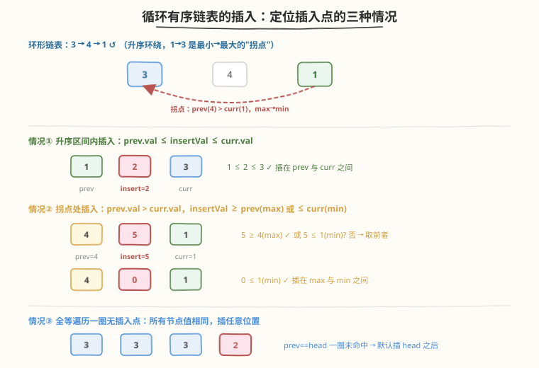
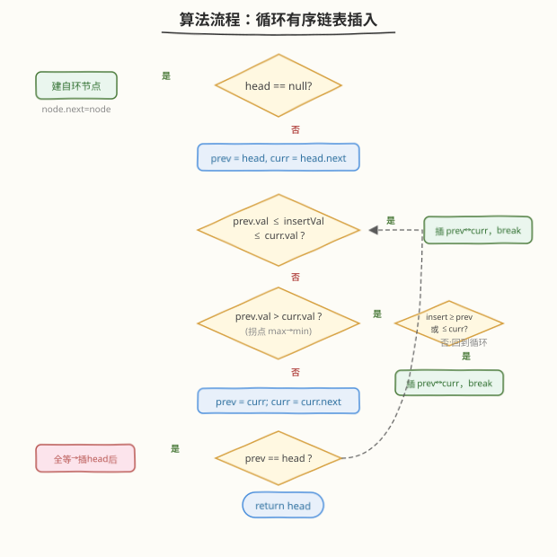
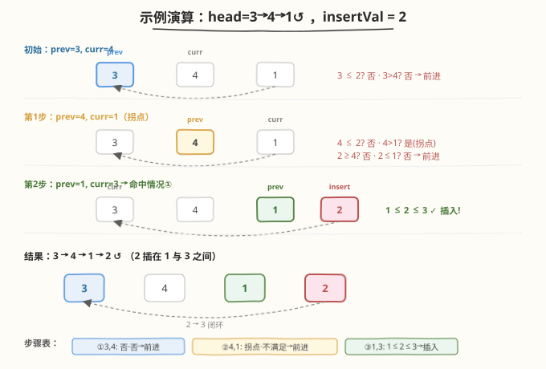

# 循环有序链表的插入

- **题目名称**：循环有序链表的插入
- **链接**：[708. 循环有序链表的插入](https://leetcode.cn/problems/insert-into-a-cyclic-sorted-list/)
- **难度**：中等
- **标签**：链表

## 1. 题目概述

给定一个**循环有序链表**中的某个节点 `head`（链表按**非降序**排列成环，但 `head` 不一定是最小值节点），以及一个待插入值 `insertVal`。请将 `insertVal` 插入链表，使插入后链表**仍保持循环有序**。返回 `head`（原给定节点）。

**示例 1**：

```text
输入：head = [3,4,1], insertVal = 2
输出：[3,4,1,2]
解释：链表 3→4→1↺ 为升序环绕（1→3 是最小→最大的拐点）。2 应插在 1 与 3 之间。
```

**示例 2**：

```text
输入：head = [], insertVal = 1
输出：[1]
解释：空链表，新建一个自环节点 1→1↺。
```

**示例 3**：

```text
输入：head = [1], insertVal = 0
输出：[1,0]
解释：单节点链表，0 插在 1 之后，得 1→0↺。
```

**约束条件**：

- `0 <= Number of Nodes <= 5 * 10^4`
- `-10^6 <= Node.val, insertVal <= 10^6`

> 💡 本题的精髓在于：环形链表没有"头尾"之分，但升序环上**存在唯一的"拐点"**——最大值节点指向最小值节点的那条边。插入新值时，要么落在某个升序区间内，要么恰好落在拐点上（比最大值还大，或比最小值还小）。识别拐点是全题的关键观察。

---

## 2. 解题思路

### 2.1 暴力思路：找到最小节点再线性插入

先遍历一圈找到最小值节点（即"真正的头"），把环从最小值处"展开"成线性有序链表，再从头扫描找到插入位置，最后重新成环。

问题：

- 需要两趟遍历（找最小 + 找插入点），且"找最小"本身就要判拐点——已经触及核心难点。
- 当所有节点值相同时没有"唯一最小"，需要额外特判。
- 代码冗长，边界多。

> ⚠️ 暴力法绕了个大弯：找最小值节点本质上就是在找拐点。既然无论如何都要识别拐点，不如**一趟遍历**直接在环上找插入位置，省去"展开-插入-重连"的多步操作。

### 2.2 核心观察：一趟遍历定位三种插入情况



**关键观察**：用 `prev` 和 `curr = prev.next` 两个指针在环上同步推进。对每一对 `(prev, curr)`，判断 `insertVal` 是否该插在它们之间。共有三种情况：

| 情况 | 判定条件 | 含义 |
|------|----------|------|
| **① 升序区间内** | `prev.val <= insertVal <= curr.val` | `insertVal` 恰好落在当前升序段中间，直接插入 |
| **② 拐点处（极值外）** | `prev.val > curr.val`（即 max→min）且 `insertVal >= prev.val` 或 `insertVal <= curr.val` | 当前边是最大→最小的拐点；新值比最大值还大或比最小值还小，都应插在拐点处 |
| **③ 全等兜底** | 遍历一圈（`prev == head`）仍未命中①② | 所有节点值相同，插入任意位置即可（默认插 `head` 之后） |

> 💡 **为什么情况②用 `prev.val > curr.val` 识别拐点？** 升序环上每条边都满足 `prev.val <= curr.val`，**唯一**打破这个单调性的边就是 max→min 的拐点（`prev.val > curr.val`）。这一条边既是"最大值的出口"也是"最小值的入口"——比最大还大的值和比最小还小的值都该接在这里，维持整体升序。

**插入操作**（三种情况通用）：`new_node.next = curr; prev.next = new_node`。

> ⚠️ **情况③不可省略**。当所有节点值相同（如 `3→3→3↺`，插入 `2`），`prev.val <= curr.val` 恒成立但 `prev.val <= 2 <= curr.val` 即 `3 <= 2` 恒不成立，情况①永不命中；又因为 `prev.val > curr.val`（`3 > 3`）也不成立，情况②也永不命中。若无兜底，会死循环。兜底用"回到 `head` 即一圈"来终止。

### 2.3 算法流程图



**完整步骤**：

1. **空链表**：`head == null` → 新建节点 `node`，`node.next = node`，返回 `node`
2. **初始化**：`prev = head`，`curr = head.next`，`to_insert = Node(insertVal)`
3. **循环遍历**（最多一圈）：
   - **情况①**：若 `prev.val <= insertVal <= curr.val` → 插入，`break`
   - **情况②**：若 `prev.val > curr.val`（拐点）且 `insertVal >= prev.val` 或 `insertVal <= curr.val` → 插入，`break`
   - **推进**：`prev = curr; curr = curr.next`
   - **情况③**：若 `prev == head`（回到起点，一圈未命中）→ 插入 `head` 之后，`break`
4. **插入**：`to_insert.next = curr; prev.next = to_insert`
5. **返回** `head`

> 💡 **循环终止保证**：无论命中哪种情况，最多遍历一圈（`n` 步）。情况③的 `prev == head` 判定是"安全网"，确保即使无①②命中也不会死循环。注意单节点链表（`head.next == head`）会在第一次推进后 `prev == head`，直接走兜底插入，逻辑自洽。

### 2.4 示例演算

以 `head = [3,4,1]`，`insertVal = 2` 为例：



| 步骤 | prev | curr | 判定 | 动作 |
|------|------|------|------|------|
| 初始 | 3 | 4 | `3 <= 2`? 否；`3 > 4`? 否 | 前进 |
| 第1步 | 4 | 1 | `4 <= 2`? 否；`4 > 1`? 是（拐点）；`2 >= 4`? 否，`2 <= 1`? 否 | 前进 |
| 第2步 | 1 | 3 | `1 <= 2 <= 3`? 是（情况①） | 插入 2 在 1↔3 之间 |

最终结果：`3 → 4 → 1 → 2 ↺`，2 恰好插在最小值 1 与下一个值 3 之间，维持升序环绕。

> 💡 注意第 1 步：虽然 `4 > 1` 识别出了拐点，但 `insertVal = 2` 既不 `>= 4`（最大）也不 `<= 1`（最小），说明 2 不属于"极值外"，应继续在升序区间内找位置——这正是情况②的精细判定在起作用。

---

## 3. 参考代码

### C++

```cpp
class Node {
public:
    int val;
    Node* next;
    Node() : val(0), next(nullptr) {}
    Node(int _val) : val(_val), next(nullptr) {}
    Node(int _val, Node* _next) : val(_val), next(_next) {}
};

class Solution {
public:
    Node* insert(Node* head, int insertVal) {
        Node* node = new Node(insertVal);
        if (head == nullptr) {
            node->next = node;
            return node;
        }

        Node *prev = head, *curr = head->next;
        bool inserted = false;
        while (true) {
            // 情况①：升序区间内
            if (prev->val <= insertVal && insertVal <= curr->val) {
                prev->next = node;
                node->next = curr;
                inserted = true;
                break;
            }
            // 情况②：拐点处（max -> min）
            if (prev->val > curr->val) {
                if (insertVal >= prev->val || insertVal <= curr->val) {
                    prev->next = node;
                    node->next = curr;
                    inserted = true;
                    break;
                }
            }
            prev = curr;
            curr = curr->next;
            // 情况③：回到起点，全等兜底
            if (prev == head) break;
        }

        if (!inserted) {
            // 全等节点：插在 head 之后
            node->next = head->next;
            head->next = node;
        }
        return head;
    }
};
```

### Python

```python
class Node:
    def __init__(self, val=None, next=None):
        self.val = val
        self.next = next

class Solution:
    def insert(self, head: 'Node', insertVal: int) -> 'Node':
        node = Node(insertVal)
        if head is None:
            node.next = node
            return node

        prev, curr = head, head.next
        inserted = False
        while True:
            # 情况①：升序区间内
            if prev.val <= insertVal <= curr.val:
                prev.next = node
                node.next = curr
                inserted = True
                break
            # 情况②：拐点处（max -> min）
            if prev.val > curr.val:
                if insertVal >= prev.val or insertVal <= curr.val:
                    prev.next = node
                    node.next = curr
                    inserted = True
                    break
            prev, curr = curr, curr.next
            # 情况③：回到起点，全等兜底
            if prev == head:
                break

        if not inserted:
            # 全等节点：插在 head 之后
            node.next = head.next
            head.next = node
        return head
```

> 💡 两版逻辑完全一致。核心是 `while True` 循环内的三段判定：先查升序区间（①），再查拐点极值（②），都不中则推进并检测是否回到起点（③）。`inserted` 标志位用于区分"正常插入"与"兜底插入"——前者已改好指针，后者需在循环外补插。注意插入语句 `prev.next = node; node.next = curr` 三种情况通用，无需重复。

---

## 4. 复杂度分析

| 维度 | 复杂度 | 说明 |
|------|--------|------|
| **时间复杂度** | `O(n)` | 最多遍历一圈 `n` 个节点；每个节点 `O(1)` 判定 |
| **空间复杂度** | `O(1)` | 仅用 `prev`、`curr`、`node` 三个指针 |

> ⚠️ 严格说新建了一个节点（`new Node(insertVal)`），但这是题目要求的输出，不计入额外空间。算法本身只用常数指针变量。

---

## 5. 扩展：为什么不在拐点处统一插入？

读者可能会想：既然拐点是 max→min 的边界，能否先找到拐点，再根据 `insertVal` 与 max/min 的关系决定插在拐点还是某个升序区间内？

**可以，但不如一趟遍历简洁**：

1. 先找拐点需要单独一趟遍历（或在本趟中记录拐点位置）。
2. 找到拐点后仍需再遍历到目标升序区间插入。
3. 全等情况拐点不存在，仍需特判。

而本解法的**一趟遍历**把"识别拐点"和"找插入点"合并——每走一步既检查是否在升序区间内（情况①），又检查是否在拐点且值在极值外（情况②）。两种判定用同一次 `prev/curr` 比较，无需预找拐点。这是"**边走边判、命中即插**"的优雅之处。

> 💡 另一个常见变体是先找到最小值节点作为"真头"，再把环当线性链表处理。但这本质上还是识别拐点（最小值的入边就是拐点），且需两趟遍历，代码更长。本解法的一趟写法是面试首选。

---

## 6. 面试要点

1. **如何识别循环链表的"拐点"？**

   - 升序环上每条边满足 `prev.val <= curr.val`，**唯一**打破单调性的是 max→min 的边，即 `prev.val > curr.val`。这一条边既是最大值的出口也是最小值的入口，是插入"极值外"新节点的唯一合法位置。

2. **情况②的两个子条件为什么用"或"？**

   - 拐点处 `prev` 是最大值、`curr` 是最小值。`insertVal >= prev.val` 表示新值比最大还大（应接在最大之后）；`insertVal <= curr.val` 表示新值比最小还小（应接在最小之前）。两者都指向**同一条边**（max→min），所以用"或"——任一满足即插入此处。

3. **情况③（全等兜底）能省略吗？**

   - **不能**。当所有节点值相同（如 `3→3→3↺`），`prev.val <= curr.val` 恒真但 `prev.val <= insertVal <= curr.val` 即 `3 <= insertVal <= 3` 仅在 `insertVal == 3` 时成立；若 `insertVal != 3`（如 `2`），情况①永不命中。同时 `prev.val > curr.val`（`3 > 3`）为假，情况②也不命中。无兜底会死循环。兜底用"回到 `head` 即一圈"终止，插入任意位置。

4. **空链表和单节点链表怎么处理？**

   - **空链表**（`head == null`）：新建节点 `node`，`node.next = node` 形成自环，返回 `node`。
   - **单节点**（`head.next == head`）：进入循环后第一次推进 `prev = curr = head`，立即触发 `prev == head` 兜底，插入 `head` 之后。无需特判，逻辑自洽。

5. **为什么返回 `head` 而不是插入的新节点？**

   - 题目要求返回原给定节点。循环链表中任意节点都可视为"入口"，返回 `head` 即可。若返回新节点，调用方难以定位原链表结构。

> 💡 **一句话总结**：循环有序链表插入是"识别拐点"的招牌题——用 `prev/curr` 一趟遍历，命中升序区间（`prev.val <= insertVal <= curr.val`）或拐点极值（`prev.val > curr.val` 且 `insertVal` 在极值外）即插入；全等则兜底插 `head` 之后。`O(n)` 时间、`O(1)` 空间。核心洞察是"`prev.val > curr.val` 唯一标识 max→min 的拐点"。

---

## 7. 同类练习题

- [61. 旋转链表](https://leetcode.cn/problems/rotate-list/)（[题解](../0001-0100/61_旋转链表.md)）：链表成环再断开的招牌题，本题的"环思维"基础
- [141. 环形链表](https://leetcode.cn/problems/linked-list-cycle/)：快慢指针判环，循环链表遍历的基础模板
- [23. 合并K个升序链表](https://leetcode.cn/problems/merge-k-sorted-lists/)：有序链表的指针操作，对比"有序"结构上的插入逻辑
- [82. 删除排序链表中的重复元素 II](https://leetcode.cn/problems/remove-duplicates-from-sorted-list-ii/)：有序链表上的 prev/curr 双指针重连，接线手法的近亲
- [707. 设计链表](https://leetcode.cn/problems/design-linked-list/)：链表节点增删的底层实现，插入操作的基础练习
