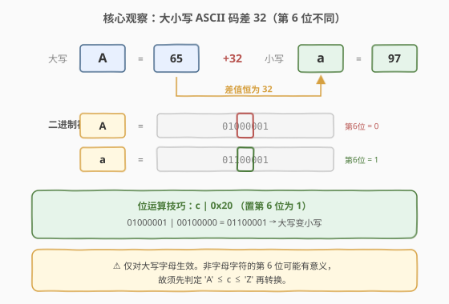
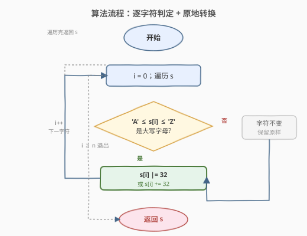
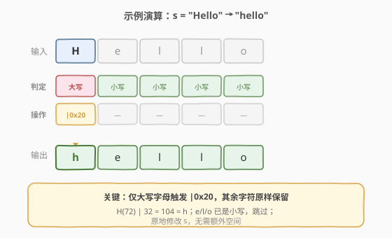

# 转换成小写字母

- **题目名称**：转换成小写字母
- **链接**：[709. 转换成小写字母](https://leetcode.cn/problems/to-lower-case/)
- **难度**：简单
- **标签**：字符串、位运算

## 1. 题目概述

给你一个字符串 `s` ，其中可能包含若干大写字母。请将该字符串中的**每个大写字母**转换成对应的小写字母，并返回新字符串。非字母字符保持不变。

**示例 1**：

```text
输入：s = "Hello"
输出："hello"
```

**示例 2**：

```text
输入：s = "here"
输出："here"
```

**示例 3**：

```text
输入：s = "LOVELY"
输出："lovely"
```

**约束条件**：

- `1 <= s.length <= 100`
- `s` 由 ASCII 字符组成

---

## 2. 解题思路

### 2.1 暴力思路

直接调用语言内置的 `tolower` / `.lower()` 库函数，一行代码即可解决。但面试场景往往要求**不使用内置函数**，转而考察对 ASCII 编码与位运算的理解。下面的核心解法即为手写实现。

### 2.2 核心观察：ASCII 编码差值与位运算



大小写字母在 ASCII 表中**连续且对齐**，关键事实：

- 大写字母 `'A'`–`'Z'` 的 ASCII 码为 $65$–$90$；
- 小写字母 `'a'`–`'z'` 的 ASCII 码为 $97$–$122$；
- 对应大小写字母的**差值恒为 $32$**（即 $2^5$，二进制 `0b00100000`），恰好是 ASCII 字母编码的第 6 位（bit 5）。

由此得到两种等价的转换方式：

1. **加法**：`c + 32`（仅当 `c` 是大写字母时执行）；
2. **位运算**：`c | 0x20`（按位或，把第 6 位置 1）。

位运算 `| 0x20` 的精妙之处：大小写字母仅第 6 位不同——大写字母第 6 位为 `0`，小写字母第 6 位为 `1`。对**字母**执行 `| 0x20` 恒把第 6 位置 1，即转为小写；对小写字母执行则不变（位已是 1）。

> ⚠️ **重要**：`| 0x20` 只对**字母**安全。非字母字符的第 6 位可能携带有意义的信息（例如 `'@'` 码 64 → `|32` 后变为 `` ` `` 码 96）。因此**必须先判定 `'A' ≤ c ≤ 'Z'`**，确认是大写字母后再转换。

**时间复杂度**：$O(n)$，遍历一次字符串；**空间复杂度**：$O(1)$（原地修改）。

### 2.3 算法流程图



外层循环按下标 `i` 递增遍历每个字符：若 `s[i]` 落在 `['A', 'Z']` 区间，则原地执行 `s[i] |= 32`（或 `s[i] += 32`）；否则保留原字符。遍历结束返回 `s`。

### 2.4 示例演算



以 `s = "Hello"` 为例逐步推演：

- `H`（ASCII 72）是大写字母 → `72 | 32 = 104 = 'h'`；
- `e`、`l`、`l`、`o` 均为小写 → 跳过，原样保留；
- 最终输出 `"hello"`。

---

## 3. 参考代码

### C++（位运算，原地修改）

```cpp
class Solution {
  public:
    string toLowerCase(string s) {
        for (char& c : s) {
            if (c >= 'A' && c <= 'Z') {
                c |= 32;
            }
        }
        return s;
    }
};
```

### Python（手写位运算）

```python
class Solution:
    def toLowerCase(self, s: str) -> str:
        res = []
        for c in s:
            if 'A' <= c <= 'Z':
                res.append(chr(ord(c) | 32))
            else:
                res.append(c)
        return ''.join(res)
```

> ⚠️ **两种写法的区别**：C++ 中 `string` 可原地修改字符（引用 `char& c`），最省空间；Python 中 `str` 不可变，需用列表拼接新串。逻辑完全一致。Python 还可直接 `return s.lower()`，但失去了手写练习的意义。

---

## 4. 复杂度分析

| 维度 | 复杂度 | 说明 |
|------|--------|------|
| 时间复杂度 | $O(n)$ | 单趟遍历字符串，每个字符 $O(1)$ 判定 + 转换 |
| 空间复杂度 | $O(1)$ | C++ 原地修改；Python 输出列表与输入等长（不计返回值则为 $O(1)$） |

---

## 5. 扩展：大小写互换与转大写

由「第 6 位决定大小写」可衍生一族位运算技巧，适用于已确认是字母的字符：

| 操作 | 位运算 | 含义 |
|------|--------|------|
| 转小写 | `c | 0x20` | 第 6 位置 1 |
| 转大写 | `c & ~0x20`（即 `c & 0xDF`） | 第 6 位清 0 |
| 大小写翻转 | `c ^ 0x20` | 第 6 位取反 |

> 💡 这三个技巧与 [191. 位 1 的个数](https://leetcode.cn/problems/number-of-1-bits/)、[371. 两整数之和](https://leetcode.cn/problems/sum-of-two-integers/) 同属「位运算处理字符/整数」家族，理解后可一行写出大小写转换三件套。

---

## 6. 面试要点

1. **为什么大写变小写要加 32？**

   - ASCII 表中大写字母 `A`–`Z`（65–90）与对应小写字母 `a`–`z`（97–122）差值恒为 32，所以大写字母加 32 即得到对应小写字母。

2. **`c | 0x20` 和 `c + 32` 有何区别？**

   - 二者对大写字母结果相同。区别在于：`| 0x20` 对**已是小写的字母**也安全（位已是 1，或后仍为 1，不变）；而 `+ 32` 对小写字母会得到错误结果（如 `'a' + 32 = 129`）。因此无论用哪种，都**必须先判定是大写字母**再执行。

3. **能否不判范围，直接对每个字符 `| 0x20`？**

   - 不安全。非字母字符的第 6 位可能有意义，`| 0x20` 会改变其值（如 `'@'`(64) → `` ` ``(96)、`'{'`(123) → `'|'`(124)）。题目保证只有字母需转换，故必须先判定 `'A' ≤ c ≤ 'Z'`。

4. **`c ^ 0x20`（异或）实现的是什么？**

   - 实现**大小写翻转**：大写变小写、小写变大写。因为第 6 位异或 1 等于取反，而大小写恰由该位区分。同样仅对字母安全。

5. **Python 中 `str` 不可变，如何做到「原地」？**

   - 做不到真正的原地修改。Python 用列表收集结果再 `''.join`，空间为 $O(n)$（输出本身就需要 $O(n)$）。若追求省空间，C++ 的 `char&` 原地改写是更贴合「$O(1)$ 额外空间」的写法。

---

## 7. 同类练习题

- [345. 反转字符串中的元音字母](https://leetcode.cn/problems/reverse-vowels-of-a-string/)：字符判定 + 双指针，配套大小写处理
- [344. 反转字符串](https://leetcode.cn/problems/reverse-string/)：原地字符操作基础，对撞双指针
- [125. 验证回文串](https://leetcode.cn/problems/valid-palindrome/)：大小写归一化 + 双指针判定回文
- [242. 有效的字母异位词](https://leetcode.cn/problems/valid-anagram/)：字符频次统计，大小写敏感性边界
- [191. 位 1 的个数](https://leetcode.cn/problems/number-of-1-bits/)：位运算家族，`n & (n-1)` 技巧
