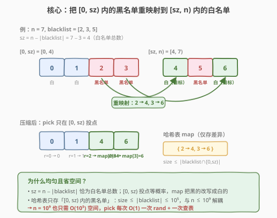
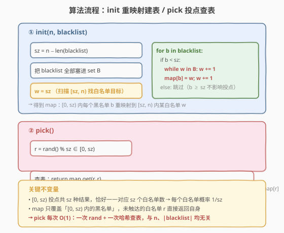

# LeetCode 黑名单中的随机数 题解

## 1. 题目概述

- **标题 / 题号**：黑名单中的随机数（#710，hard）
- **链接**：https://leetcode.cn/problems/random-pick-with-blacklist/
- **难度**：困难
- **标签**：概率与随机、哈希表、重映射

**题意**：给定一个整数 `n` 和一个**无重复**黑名单整数数组 `blacklist`。设计算法从 `[0, n - 1]` 中选取一个**未加入**黑名单的整数，使得任何在该范围内且不在黑名单中的整数都有**同等概率**被返回。

优化算法，使其最小化调用语言**内置**随机函数的次数。

实现 `Solution` 类：

- `Solution(int n, int[] blacklist)`：初始化整数 `n` 与黑名单 `blacklist`；
- `int pick()`：返回一个范围为 `[0, n - 1]` 且不在黑名单中的随机整数。

**示例 1**：

```text
输入：
["Solution", "pick", "pick", "pick", "pick", "pick", "pick", "pick"]
[[7, [2, 3, 5]], [], [], [], [], [], [], []]
输出：
[null, 0, 4, 1, 6, 1, 0, 4]
解释：
Solution solution = new Solution(7, [2, 3, 5]);
solution.pick(); // 返回 0，[0,1,4,6] 任一均可，每个概率必须为 1/4。
solution.pick(); // 返回 4
...
```

**约束**：

- $1 \leq n \leq 10^9$
- $0 \leq \text{blacklist.length} \leq \min(10^5,\ n - 1)$
- $0 \leq \text{blacklist}[i] < n$
- `blacklist` 中所有值**不同**
- `pick` 最多被调用 $2 \times 10^4$ 次

> 💡 **题目本质**：在 `[0, n)` 这片巨大的整数域中，剔除少量黑名单后做**有放回**均匀采样。难点是 $n$ 可达 $10^9$，无法开长为 $n$ 的数组显式存「白名单池」；但 $|\text{blacklist}| \leq 10^5$，被剔除的数极少。关键观察：把白名单**压缩**进一个长为 $\text{sz} = n - |\text{blacklist}|$ 的连续区间 `[0, sz)`，用一张小哈希表记录「压缩过程中黑名单位置 → 真实白名单值」的重映射即可。

## 2. 解题思路

### 2.1 暴力思路：拒绝采样 / 白名单池

最直觉的两种做法：

- **拒绝采样**：`r = rand() % n`，若 `r` 在黑名单就重抽，直到命中白名单。问题：当黑名单占比高时（如 $n = 10^9$、$|\text{blacklist}| = 10^5$ 时其实占比极低尚可；但极端 $|\text{blacklist}|$ 接近 $n-1$ 时，命中概率 $\approx 1/n$，期望拒绝 $n$ 次爆炸），且每次 `pick` 都要判黑名单，最坏调用随机函数次数不可控——与题面「最小化随机函数调用」相悖。
- **白名单池**：把所有白名单数塞进一个数组 `pool`，`pick` 时 `pool[rand() % pool.size()]`。概率严格均匀、单次一次 `rand`。问题：`pool` 大小 $= n - |\text{blacklist}|$ 可达 $10^9$，内存爆。

> ⚠️ **两种暴力的共同症结**：它们都把「$n$ 个位置」当成必须显式处理的对象。但真正需要区分的只有 $|\text{blacklist}| \leq 10^5$ 个位置——这是「稀疏差异」的典型甜区，用哈希表只记差异即可。

### 2.2 核心观察：区间重映射 + 哈希表



设白名单总数 $\text{sz} = n - |\text{blacklist}|$。把 `[0, n)` 切成两段：

- **左段 `[0, sz)`**：我们**只在这段上投点**（`r = rand() % sz`），因为它长度恰为白名单总数，等概率投点天然均匀。
- **右段 `[sz, n)`**：长度 $= |\text{blacklist}|$，作为「白名单的备用仓库」——这里有些数是白名单（不在 `blacklist`），有些是黑名单。

关键事实：左段 `[0, sz)` 里的**黑名单数**个数，必等于右段 `[sz, n)` 里的**白名单数**个数。因为：

$$
\underbrace{|\text{blacklist} \cap [0, \text{sz})|}_{\text{左段黑名单数}} + \underbrace{|\text{blacklist} \cap [\text{sz}, n)|}_{\text{右段黑名单数}} = |\text{blacklist}|
$$

$$
\underbrace{(\text{sz} - |\text{blacklist} \cap [0, \text{sz})|)}_{\text{左段白名单数}} + \underbrace{((n - \text{sz}) - |\text{blacklist} \cap [\text{sz}, n)|)}_{\text{右段白名单数}} = \text{sz}
$$

而 $n - \text{sz} = |\text{blacklist}|$，代入第二式得「左段白名单数 + 右段白名单数 = sz」。又「左段白名单数 = sz − 左段黑名单数」，所以「右段白名单数 = 左段黑名单数」。两边一一对应。

> 💡 **核心转化**：把左段 `[0, sz)` 里的每个**黑名单位置** `b`，**重映射**到右段 `[sz, n)` 里的某个**白名单值** `w`。映射表 `map: b → w` 仅覆盖左段黑名单（至多 $|\text{blacklist}| \leq 10^5$ 条）。映射后，`[0, sz)` 的每个位置都代表一个**唯一的白名单数**：
> - 位置 `r` 是白名单 → `r` 直接代表自身；
> - 位置 `r` 是黑名单 → `r` 代表被映射到的 `map[r]`。
>
> `pick()` 只需 `r = rand() % sz`，返回 `map.get(r, r)`。一次 `rand` + 一次哈希查表，$O(1)$ 完成。

### 2.3 算法流程图



**`init(n, blacklist)` 建表**：

1. `sz = n - len(blacklist)`；把 `blacklist` 全部塞进哈希集合 `B` 以 $O(1)$ 判定。
2. 设游标 `w = sz`（从右段起点开始扫，找白名单目标）。
3. 对每个 `b in blacklist`：
   - 若 `b < sz`（左段黑名单，需要重映射）：`while w in B: w += 1`（跳过右段里的黑名单），然后 `map[b] = w; w += 1`（建映射，游标前进）。
   - 若 `b >= sz`（右段黑名单，不影响左段投点）：**跳过**，不进 `map`。

**`pick()` 查表**：

1. `r = rand() % sz`；
2. `return map.get(r, r)`：`r` 在 `map` 说明它是黑名单，返回映射值；不在则 `r` 是白名单，返回自身。

> ⚠️ **为什么 `b >= sz` 的黑名单可以跳过？** 因为 `pick` 只在 `[0, sz)` 投点，永远不会直接抽到 `b >= sz` 的数。这类黑名单的唯一作用是占据右段位置，让游标 `w` 在扫描时跳过它们——这已由 `while w in B: w += 1` 处理。它们不需要进 `map`，因为 `map` 的键是「可能被 `pick` 抽中的左段位置」，而 `b >= sz` 永不在左段。

### 2.4 示例演算

以题面示例 `n = 7, blacklist = [2, 3, 5]` 为例：$\text{sz} = 7 - 3 = 4$，白名单 $= \{0, 1, 4, 6\}$（共 4 个，与 sz 相符）。

![示例演算：n=7, blacklist=[2,3,5] 的 init 与 pick 过程](../images/randpick_bl_walkthrough.svg)

**init 建表**（`B = {2, 3, 5}`，`w` 从 4 起）：

| `b` | 是否 `< sz=4` | `w` 扫描 | 建映射 | `map` 状态 |
|-----|--------------|----------|--------|-----------|
| 2 | 是 | `w=4 ∉ B` → 用 4 | `map[2] = 4`, `w=5` | `{2:4}` |
| 3 | 是 | `w=5 ∈ B` → `w=6 ∉ B` → 用 6 | `map[3] = 6`, `w=7` | `{2:4, 3:6}` |
| 5 | 否（≥ 4） | — | 跳过 | `{2:4, 3:6}` |

**pick 查表**（`r = rand() % 4 ∈ {0,1,2,3}`）：

| `r` | `map.get(r, r)` | 命中类型 | 返回值 | 概率 |
|-----|-----------------|----------|--------|------|
| 0 | 0 | 白名单（不在 map） | 0 | 1/4 |
| 1 | 1 | 白名单（不在 map） | 1 | 1/4 |
| 2 | 4 | 黑名单 → 重映射 | 4 | 1/4 |
| 3 | 6 | 黑名单 → 重映射 | 6 | 1/4 |

> 💡 **看 `b=3` 这一步**：游标 `w=5` 命中右段黑名单 `5`，必须 `w += 1` 跳到 `6`。这一步至关重要——若误把 `5` 当白名单塞给 `map[3]`，`pick` 就会返回黑名单 `5`，破坏正确性。`while w in B: w += 1` 正是保证「映射目标必为白名单」的关键护栏。最终返回值集合 $\{0,1,4,6\}$ 与白名单完全一致，每个概率 $1/4$ ✓。

## 3. 参考代码

### C++

```cpp
class Solution {
  public:
    Solution(int n, vector<int>& blacklist) {
        sz = n - (int)blacklist.size();
        unordered_set<int> B(blacklist.begin(), blacklist.end());
        int w = sz;
        for (int b : blacklist) {
            if (b < sz) {                       // 左段黑名单才需重映射
                while (B.count(w)) ++w;         // 跳过右段里的黑名单
                remap[b] = w++;                  // 建映射，游标前进
            }
        }
        srand((unsigned)time(nullptr));
    }

    int pick() {
        int r = rand() % sz;                    // [0, sz)
        auto it = remap.find(r);
        return it == remap.end() ? r : it->second;
    }

  private:
    int sz;
    unordered_map<int, int> remap;              // 仅存「左段黑名单 → 右段白名单」
};
```

### Python

```python
class Solution:
    def __init__(self, n: int, blacklist: List[int]):
        self.sz = n - len(blacklist)
        B = set(blacklist)
        self.remap = {}
        w = self.sz
        for b in blacklist:
            if b < self.sz:                     # 左段黑名单才需重映射
                while w in B:                   # 跳过右段里的黑名单
                    w += 1
                self.remap[b] = w
                w += 1

    def pick(self) -> int:
        r = random.randrange(self.sz)           # [0, sz)
        return self.remap.get(r, r)
```

> ⚠️ **三个高频踩坑点**：
> （1）**忘了 `b >= sz` 的分支跳过**。若把所有黑名单都塞进 `remap`，`pick` 时不会出错（因为 `r < sz` 永远不会等于 `b >= sz`），但 `w` 游标会被错误推进，导致映射目标偏移、甚至 `w` 越界访问。务必只对 `b < sz` 建映射。
> （2）**`while w in B` 漏写或写成 `if`**。右段 `[sz, n)` 里可能连续多个黑名单（如 `blacklist = [sz, sz+1, sz+2]`），必须用 `while` 跳过所有连续黑名单，`if` 只跳一个会漏。
> （3）**`pick` 用 `rand() % n` 而非 `rand() % sz`**。前者会直接抽到黑名单（尤其右段黑名单），后者才是压缩后的均匀投点。`sz` 是「白名单总数」而非 `n`。

## 4. 复杂度分析

| 维度 | 复杂度 | 说明 |
|------|--------|------|
| 初始化时间 | $O(|\text{blacklist}|)$ | 建 `B` 集合 $O(|B|)$；遍历 `blacklist` 各 $O(1)$ 摊还（`w` 游标单调递增，总推进次数 $\leq |B|$） |
| `pick` 时间 | $O(1)$ | 一次 `rand` + 一次哈希查表 |
| 空间复杂度 | $O(|\text{blacklist}|)$ | `B` 集合与 `remap` 表，均 $\leq 10^5$，与 $n \leq 10^9$ 无关 |

> 💡 本题 $n \leq 10^9$、$|\text{blacklist}| \leq 10^5$。若用白名单池需 $10^9$ 个 int $\approx 4\text{GB}$，远超内存限制；而重映射法仅占 $O(10^5)$ 空间（约几 MB），**空间效率提升 4 个数量级**。这是「稀疏差异 + 重映射」思想的典型胜利：**不复制全量，只记录需要改写的少数位置**。

> ⚠️ **`w` 游标的摊还分析**：`while w in B: w += 1` 看似每次 `b` 都可能多扫，但 `w` 从 `sz` 单调递增到至多 $n$，全程总推进步数 $\leq n - \text{sz} = |\text{blacklist}|$。故 init 总时间严格 $O(|\text{blacklist}|)$，非 $O(|\text{blacklist}|^2)$。

## 5. 扩展：与 519 虚拟 Fisher-Yates 的对照

710 与 [519. 随机翻转矩阵](../0501-0600/519_随机翻转矩阵.md) 同属「大域稀疏采样 + 哈希表压缩」家族，但采样模型不同：

| 维度 | 710 黑名单随机数 | 519 随机翻转矩阵 |
|------|------------------|------------------|
| **采样模型** | **有放回**均匀（每次 `pick` 独立） | **无放回**均匀（每个格子至多翻一次） |
| **黑名单来源** | 题面给定（静态） | 动态产生（已翻过的格子变成「黑名单」） |
| **哈希表语义** | `remap[b] = w`：左段黑名单 → 右段白名单（**静态**建一次） | `swapped[r] = last`：当前位置 → 末尾值（**动态**每次 `flip` 更新） |
| **`pick` / `flip` 代价** | $O(1)$：查表 | $O(1)$：查表 + 两次写 + 一次删 |
| **是否有 `reset`** | 无（白名单静态不变） | 有（`map.clear()` 即恢复初始） |
| **核心机制** | **重映射**：把投点域 `[0, sz)` 与白名单一一对应 | **虚拟 Fisher-Yates**：与末尾交换维护无放回不变量 |

> 💡 **思想同源、机制不同**：两者都把「$n$ 规模的池」虚拟化，用哈希表只存差异。区别在于：
> - 710 是**静态**重映射——黑名单固定，建一次表后反复查；
> - 519 是**动态**重映射——每次 `flip` 后池缩小，需即时维护「末尾值填补空位」。
>
> 710 的 `remap` 是「**位置改写**」（位置 `b` 改写成值 `w`），519 的 `swapped` 也是「**位置改写**」（位置 `r` 改写成末尾值）——`map.get(r, r)` 这一行在两题中语义完全一致：未改写则返回自身，改写过则返回映射值。理解了 519 的虚拟数组思想，710 是其静态、有放回的退化版。

## 6. 面试要点

1. **为什么 `[0, sz)` 投点能保证均匀？**

   - `sz = n - |\text{blacklist}|` 恰为白名单总数。`r = rand() % sz` 在 `[0, sz)` 上等概率，共 `sz` 种结果。经 `remap` 改写后，这 `sz` 种结果一一对应到 `sz` 个不同白名单数（左段白名单直接对应自身，左段黑名单对应右段白名单）。故每个白名单数被返回的概率恰为 $1/\text{sz}$，严格均匀。

2. **为什么「左段黑名单数 = 右段白名单数」？建表不会出现 `w` 找不到白名单的情况吗？**

   - 设左段黑名单数 $k_1$、右段黑名单数 $k_2$，则 $k_1 + k_2 = |\text{blacklist}|$。右段长度 $= n - \text{sz} = |\text{blacklist}|$，故右段白名单数 $= |\text{blacklist}| - k_2 = k_1$。即右段恰有 $k_1$ 个白名额容纳左段 $k_1$ 个黑名单的映射，游标 `w` 必能在右段扫到足够白名单，不会越界也不会不够。

3. **`b >= sz` 的黑名单为什么跳过？如果不跳过会怎样？**

   - `pick` 只在 `[0, sz)` 投点，永远抽不到 `b >= sz`，这类黑名单对投点无影响，无需进 `remap`。若误把它们也塞进 `remap`：一是浪费空间（`remap` 变大）；二是若误把它们的「映射值」也建出来，`w` 游标会被错误推进，导致后续 `b < sz` 的映射目标偏移。正确做法是 `if (b < sz)` 守卫，只处理左段黑名单。

4. **`while w in B: w += 1` 能否换成 `if w in B: w += 1`？**

   - 不能。右段 `[sz, n)` 可能连续多个黑名单（如 `blacklist = [sz, sz+1, sz+2, ...]`），`if` 只跳一个，会把第二个黑名单误当白名单塞给 `map[b]`。必须 `while` 跳过所有连续黑名单。代价是摊还 $O(1)$：`w` 全程单调递增，总推进步数 $\leq |\text{blacklist}|$。

5. **本题与 [519. 随机翻转矩阵](../0501-0600/519_随机翻转矩阵.md)、[528. 按权重随机选择](../0501-0600/528_按权重随机选择.md) 的关系？**

   - 三者构成「大域采样」三件套，思想互补：
     - **710**：大域 + **静态**黑名单 + **有放回**均匀 → 静态重映射，`pick` $O(1)$ 查表；
     - **519**：大域 + **动态**黑名单（已翻即黑） + **无放回**均匀 → 动态虚拟 Fisher-Yates，`flip` $O(1)$ 维护末尾交换；
     - **528**：**加权**采样（非均匀） → 前缀和 + 二分，`pick` $O(\log n)$。
   - 710 与 519 共享 `map.get(r, r)` 的「位置改写」语义；710 与 528 的区别在均匀 vs 加权（前者 $O(1)$，后者 $O(\log n)$）。

## 同类练习题

| # | 题目 | 与本题的关联 |
|---|------|-------------|
| 519 | [随机翻转矩阵](https://leetcode.cn/problems/random-flip-matrix/)（[题解](../0501-0600/519_随机翻转矩阵.md)） | **动态**虚拟 Fisher-Yates + 哈希表，无放回采样；与本题**静态**重映射形成对照，`map.get(r, r)` 思路同源 |
| 528 | [按权重随机选择](https://leetcode.cn/problems/random-pick-with-weight/)（[题解](../0501-0600/528_按权重随机选择.md)） | 前缀和 + 二分做**加权**采样，与本题**均匀**采样形成随机家族对比 |
| 398 | [随机数索引](https://leetcode.cn/problems/random-pick-index/)（[题解](../0301-0400/398_随机数索引.md)） | 蓄水池抽样 R 算法，**总量未知**的流式等概率采样，另一种 $O(1)$ 空间随机套路 |
| 470 | [用 Rand7() 实现 Rand10()](https://leetcode.cn/problems/implement-rand10-using-rand7/)（[题解](../0401-0500/470_用Rand7实现Rand10.md)） | 拒绝采样构造均匀分布，与本题「重映射压缩」对比另一种均匀源构造法 |
| 384 | [打乱数组](https://leetcode.cn/problems/shuffle-an-array/)（[题解](../0301-0400/384_打乱数组.md)） | 标准 Fisher-Yates 洗牌，理解 519「与末尾交换」机制的基础题，间接关联本题的哈希压缩思想 |
