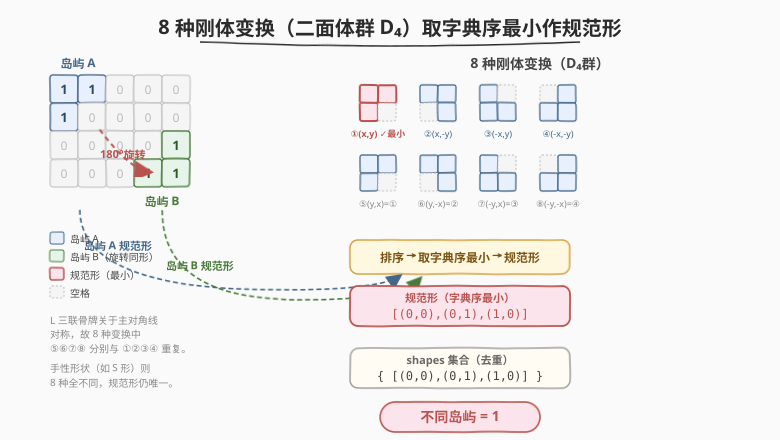
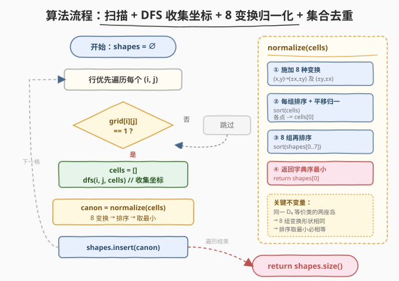
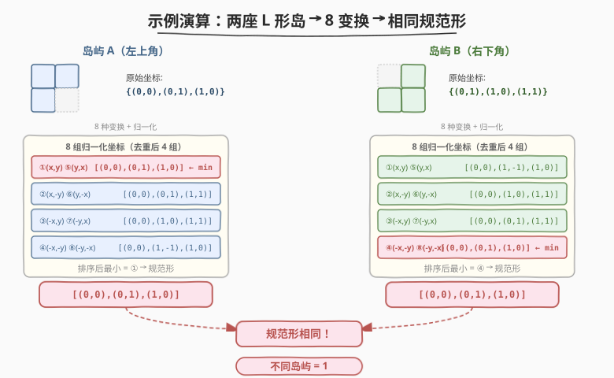

# 不同岛屿的数量 II

- **题目名称**：不同岛屿的数量 II
- **链接**：[711. 不同岛屿的数量 II](https://leetcode.cn/problems/number-of-distinct-islands-ii/)
- **难度**：困难
- **标签**：深度优先搜索、广度优先搜索、并查集、哈希表、数组、矩阵

## 1. 题目概述

给定一个非空二维数组 `grid`，由 `0`（水）和 `1`（陆地）组成。**岛屿**是由一些相邻的 `1` 构成的组合，这里的「相邻」要求两个 `1` 必须在**水平或竖直**四个方向上相邻。你可以假设 `grid` 的四个边缘都被 `0` 包围。

统计 `grid` 中**不同岛屿的数量**。两座岛屿被视为相同，当且仅当它们**形状相同**，或者经过**旋转**（90°、180°、270°）或**反射**（左右翻转 / 上下翻转）后形状相同。

**示例 1**：

```text
输入：
grid = [
  [1,1,0,0,0],
  [1,0,0,0,0],
  [0,0,0,0,1],
  [0,0,0,1,1]
]
输出：1
解释：
  左上角的岛：11 / 1.    右下角的岛：.1 / 11
  对前者做 180° 旋转得到后者，故视为同一座岛。
```

**示例 2**：

```text
输入：
grid = [
  [1,1,1,0,0],
  [1,0,0,0,1],
  [0,1,0,0,1],
  [0,1,1,1,0]
]
输出：2
解释：
  两种不同岛屿：111/1..（L 四联骨牌）和 1/1（竖向二联骨牌）。
  111/1.. 翻转后与 1/111 同形，归为一类。
```

**约束条件**：

- `m == grid.length`
- `n == grid[i].length`
- `1 <= m, n <= 50`
- `grid[i][j]` 为 `0` 或 `1`

> 💡 **题目本质**：相比 [694. 不同岛屿的数量](../0601-0700/694_不同岛屿的数量.md) 仅判平移同形，本题把等价关系扩大到**二面体群 $D_4$**——旋转（0°/90°/180°/270°）× 反射（有/无）共 $4 \times 2 = 8$ 种刚体变换。难点不在找岛屿，而在**如何为「同一等价类」的所有岛屿找一个唯一的规范表示**。

---

## 2. 解题思路

### 2.1 暴力思路：两两枚举 + 8 种变换比对

先用 DFS 找出所有岛屿（每座岛用一个坐标集合表示），再两两比较：对岛 A 施加 8 种变换，检查是否有任何一种变换后的 A 能与 B 平移重合。共 $k$ 座岛时比对开销 $O(k^2 \cdot 8 \cdot s)$（$s$ 为岛屿大小），$k$ 可达 $625$（$25\times25$ 棋盘全是 $1$ 的极端情况），常数巨大。

> 💡 更聪明的做法是给**每座岛屿算一个「形状指纹」**：同一等价类的所有岛屿必然产生相同指纹，丢进哈希集合去重——把 $O(k^2)$ 的两两比较降为 $O(k)$ 的集合插入。694 用 DFS 路径签名做平移同形的指纹；但本题的 8 种变换会破坏路径结构，路径签名不再适用，需要换一种**对旋转/反射不变的规范形**。

### 2.2 核心观察：8 种刚体变换取字典序最小作规范形



关键洞察：**平面上的任何旋转 + 反射组合都属于二面体群 $D_4$，恰有 8 个元素**。对一座岛屿的每个格子坐标 $(x, y)$，施加这 8 种变换后得到 8 个形状，它们彼此间都能通过刚体变换重合。

8 种变换（$x$=行, $y$=列）：

| 编号 | 变换 | 新坐标 | 几何含义 |
|------|------|--------|----------|
| 1 | 恒等 | $(x, y)$ | 原形 |
| 2 | 翻转 y | $(x, -y)$ | 左右镜像 |
| 3 | 翻转 x | $(-x, y)$ | 上下镜像 |
| 4 | 翻转 x,y | $(-x, -y)$ | 180° 旋转 |
| 5 | 交换 x,y | $(y, x)$ | 主对角线镜像 |
| 6 | 交换+翻转 x | $(y, -x)$ | 90° 旋转 |
| 7 | 翻转 y+交换 | $(-y, x)$ | 270° 旋转 |
| 8 | 翻转 x,y+交换 | $(-y, -x)$ | 副对角线镜像 |

> ⚠️ **为什么恰好 8 种？** 平面刚体变换由「旋转角 $\theta \in \{0°, 90°, 180°, 270°\}$」和「是否反射」两个自由度决定，共 $4 \times 2 = 8$ 种组合。这 8 种构成群 $D_4$——任意两种的复合仍在其中，且任意一种的逆也在其中。因此「能通过 $D_4$ 变换重合」是等价关系，每座岛屿的 8 个变换形状构成一个完整的等价类。

**规范形构造**：对每座岛屿——

1. 收集所有格子的坐标。
2. 施加 8 种变换，得到 8 组坐标集合。
3. 每组**排序**后，将所有坐标减去首元素（平移归一化到原点）。
4. 将 8 组归一化坐标**再排序**，取**字典序最小**者作为规范形。

> 💡 **为什么取最小就唯一？** 同一等价类的两座岛 A、B，A 的 8 个变换形状 = B 的 8 个变换形状（因为 $D_4$ 是群，变换可逆）。对同一组 8 个形状排序后取最小，必然得到同一个结果。这就像「给一堆乱序数组排序后比较」——排序消除了顺序差异，取最小消除了「选哪个代表」的歧义。

### 2.3 算法流程图



1. 初始化哈希集合 `shapes = ∅`。
2. 行优先遍历每个格子 `(i, j)`：
   - 若 `grid[i][j] == 1`：新建空列表 `cells`，调用 `dfs(i, j, cells)` 收集整座岛所有坐标。
   - 调用 `normalize(cells)` 得到规范形，插入 `shapes`。
3. `dfs(i, j, cells)`：
   - 越界或 `grid[i][j] != 1` 直接返回。
   - **沉岛** `grid[i][j] = 0`（兼做 visited）。
   - `cells.push_back({i, j})`。
   - 递归四个邻居。
4. `normalize(cells)`：
   - 对每个 `(x, y)` 生成 8 种变换坐标。
   - 每组排序 + 平移归一化（减首元素）。
   - 8 组再排序，返回最小者。
5. 遍历结束返回 `shapes.size()`。

> 💡 与 [694](../0601-0700/694_不同岛屿的数量.md) 的关系：694 用 DFS 路径签名（`ODRUB` 串）做**平移同形**的指纹，因为平移不改变路径结构；本题的 8 种变换会改变路径方向（如 `D` 变 `R`），路径签名失效。但**相对坐标归一化**的思路可以升级——694 只需 1 种变换（恒等），本题需要 8 种取最小。**模板从「1 个规范形」升级为「8 个规范形取最小」**。

### 2.4 示例演算

以示例 1 为例，两座 L 三联骨牌岛的归一化过程：



**岛屿 A**（左上角）：原始坐标 `{(0,0), (0,1), (1,0)}`，形状：

```text
11
1.
```

施加 8 种变换并归一化后：

| 变换 | 归一化坐标 |
|------|-----------|
| $(x,y)$ / $(y,x)$ | `[(0,0), (0,1), (1,0)]` ← 字典序最小 |
| $(x,-y)$ / $(y,-x)$ | `[(0,0), (0,1), (1,1)]` |
| $(-x,y)$ / $(-y,x)$ | `[(0,0), (1,0), (1,1)]` |
| $(-x,-y)$ / $(-y,-x)$ | `[(0,0), (1,-1), (1,0)]` |

**岛屿 B**（右下角）：原始坐标 `{(2,4), (3,3), (3,4)}`，形状：

```text
.1
11
```

施加 8 种变换并归一化后，得到**完全相同的 4 组归一化坐标**，字典序最小者仍为 `[(0,0), (0,1), (1,0)]`。

> 两座岛规范形相同 → 集合只存 1 个 → 返回 `1`。

> 💡 **为什么 8 种变换只产生 4 组不同坐标？** L 三联骨牌关于主对角线对称（$(y,x)$ 变换后形状不变），所以 8 种变换两两合并为 4 组。这不影响正确性——排序后取最小，4 组和 8 组的最小值相同。对**手性形状**（如 S/Z 四联骨牌），8 种变换会产生 8 组不同坐标，规范形仍然唯一。

---

## 3. 参考代码

### C++

```cpp
class Solution {
    int m, n;
    int dx[4] = {-1, 1, 0, 0};
    int dy[4] = {0, 0, -1, 1};

    void dfs(vector<vector<int>>& grid, int i, int j,
             vector<pair<int, int>>& cells) {
        if (i < 0 || i >= m || j < 0 || j >= n || grid[i][j] != 1)
            return;
        grid[i][j] = 0;                       // 沉岛，兼做 visited
        cells.push_back({i, j});
        for (int d = 0; d < 4; d++)
            dfs(grid, i + dx[d], j + dy[d], cells);
    }

    vector<pair<int, int>> normalize(vector<pair<int, int>>& cells) {
        vector<vector<pair<int, int>>> shapes(8);
        for (auto& [x, y] : cells) {
            shapes[0].push_back({x, y});      // 恒等
            shapes[1].push_back({x, -y});     // 左右镜像
            shapes[2].push_back({-x, y});     // 上下镜像
            shapes[3].push_back({-x, -y});    // 180° 旋转
            shapes[4].push_back({y, x});      // 主对角线镜像
            shapes[5].push_back({y, -x});     // 90° 旋转
            shapes[6].push_back({-y, x});     // 270° 旋转
            shapes[7].push_back({-y, -x});    // 副对角线镜像
        }
        for (auto& s : shapes) {
            sort(s.begin(), s.end());         // 组内排序
            for (int i = (int)s.size() - 1; i >= 0; i--) {
                s[i].first -= s[0].first;     // 平移归一化
                s[i].second -= s[0].second;   // 减首元素
            }
        }
        sort(shapes.begin(), shapes.end());   // 8 组排序
        return shapes[0];                     // 取字典序最小
    }

  public:
    int numDistinctIslands2(vector<vector<int>>& grid) {
        m = grid.size();
        n = grid[0].size();
        set<vector<pair<int, int>>> shapes;
        for (int i = 0; i < m; i++)
            for (int j = 0; j < n; j++)
                if (grid[i][j] == 1) {
                    vector<pair<int, int>> cells;
                    dfs(grid, i, j, cells);
                    shapes.insert(normalize(cells));
                }
        return shapes.size();
    }
};
```

### Python

```python
class Solution:
    def numDistinctIslands2(self, grid: List[List[int]]) -> int:
        m, n = len(grid), len(grid[0])

        def dfs(i, j, cells):
            if i < 0 or i >= m or j < 0 or j >= n or grid[i][j] != 1:
                return
            grid[i][j] = 0                       # 沉岛
            cells.append((i, j))
            for di, dj in [(-1, 0), (1, 0), (0, -1), (0, 1)]:
                dfs(i + di, j + dj, cells)

        def normalize(cells):
            transforms = [
                [(x, y) for x, y in cells],       # 恒等
                [(x, -y) for x, y in cells],      # 左右镜像
                [(-x, y) for x, y in cells],      # 上下镜像
                [(-x, -y) for x, y in cells],     # 180° 旋转
                [(y, x) for x, y in cells],       # 主对角线镜像
                [(y, -x) for x, y in cells],      # 90° 旋转
                [(-y, x) for x, y in cells],      # 270° 旋转
                [(-y, -x) for x, y in cells],     # 副对角线镜像
            ]
            for s in transforms:
                s.sort()                          # 组内排序
                bx, by = s[0]
                for i in range(len(s)):
                    s[i] = (s[i][0] - bx, s[i][1] - by)  # 平移归一化
            transforms.sort()                     # 8 组排序
            return tuple(transforms[0])           # 取字典序最小

        shapes = set()
        for i in range(m):
            for j in range(n):
                if grid[i][j] == 1:
                    cells = []
                    dfs(i, j, cells)
                    shapes.add(normalize(cells))
        return len(shapes)
```

> ⚠️ **三个高频踩坑点**：
> （1）**变换种类不全**。只枚举 4 种旋转而漏掉 4 种反射，会把手性形状（如 S 形与 Z 形）误判为不同岛。必须 8 种全覆盖。
> （2）**平移归一化忘记减首元素**。8 种变换后的坐标可能有负值，不减首元素则排序无意义——首元素不一定在原点。必须先排序，再用 `s[0]` 平移。
> （3）**Python 中 `cells` 是元组列表需转 `tuple` 才能进 `set`**。规范形返回 `tuple` 而非 `list`，否则 `set` 无法哈希。

---

## 4. 复杂度分析

| 维度 | 复杂度 | 说明 |
|------|--------|------|
| 时间复杂度 | $O(M \times N \cdot s \log s)$ | 每个格子至多被 DFS 进入一次（沉岛）；设岛屿大小为 $s$，`normalize` 对 $s$ 个点施加 8 种变换，每组排序 $O(s \log s)$，8 组再排序 $O(8 \log 8 \cdot s) = O(s)$，总计 $O(s \log s)$；所有岛屿的 $s$ 之和 $\leq M \times N$ |
| 空间复杂度 | $O(M \times N)$ | DFS 递归栈最坏深度为最大岛屿大小；`shapes` 集合存所有岛屿规范形，总点数 $\leq M \times N$ |

> ⚠️ **$s \log s$ 的来源**：`normalize` 中每个变换组排序 $O(s \log s)$。由于 $M, N \leq 50$，最大岛屿 $s \leq 2500$，$\log s \approx 11$，总操作约 $2500 \times 11 \times 8 \approx 2.2 \times 10^5$，常数可接受。若 $M, N$ 更大，可改用**规范化哈希**（对每组坐标直接哈希，取最小哈希值）降低常数，但实现更复杂。

---

## 5. 扩展：与 694 平移同形的对照

711 与 [694. 不同岛屿的数量](../0601-0700/694_不同岛屿的数量.md) 同属「岛屿形状去重」家族，但等价关系不同：

| 维度 | 694 不同岛屿的数量 | 711 不同岛屿的数量 II |
|------|---------------------|------------------------|
| **等价关系** | **平移**同形 | **旋转 + 反射 + 平移**同形（$D_4$ 群） |
| **变换群** | 平移群 $T$（1 种） | 二面体群 $D_4$（8 种） |
| **指纹方法** | DFS 路径签名（`ODRUB` 串） | 8 种坐标变换取字典序最小 |
| **为什么路径签名失效** | 平移不改路径方向 | 旋转/反射改变方向（`D`→`R`），路径串不同 |
| **归一化方式** | 起点取左上角（天然平移归一） | 显式施加 8 变换 + 减首元素 |
| **时间复杂度** | $O(M \times N)$ | $O(M \times N \cdot s \log s)$ |
| **几何对象** | 固定多联骨牌（fixed polyomino） | 自由多联骨牌（free polyomino） |

> 💡 **思想升级**：694 的「1 个规范形」（DFS 路径）→ 711 的「8 个规范形取最小」（坐标变换）。本质都是**给等价类找一个唯一代表元**——694 的代表元是路径串，711 的代表元是字典序最小的归一化坐标集。**群的阶数决定了要枚举多少种变换**：平移群阶 1，$D_4$ 群阶 8。

---

## 6. 面试要点

1. **为什么 8 种变换就够？**

   - 平面刚体变换 = 旋转（$0°/90°/180°/270°$）× 反射（有/无），共 $4 \times 2 = 8$ 种。这 8 种构成二面体群 $D_4$：任意两种的复合仍在群中，任意一种的逆也在群中。因此「能通过 $D_4$ 变换重合」是等价关系，8 种变换完整覆盖所有等价情况。

2. **为什么取字典序最小就能唯一代表等价类？**

   - 同一等价类的两座岛 A、B，A 的 8 个变换形状集合 = B 的 8 个变换形状集合（因为 $D_4$ 是群，变换可逆，A 的每个变换都能对应到 B 的某个变换）。对同一集合排序后取最小，必然得到同一个结果。这等价于「给一堆乱序数组排序后比较」——排序消除了选择的歧义。

3. **为什么必须先排序再减首元素？**

   - 8 种变换后的坐标可能散布在各象限（有负值），首元素（最小坐标）不一定在原点。先排序使首元素确定，再用它平移所有坐标到原点，才能保证「同一形状的同一变换」产生相同的归一化坐标集。若不排序直接减某个固定点，不同遍历顺序会得到不同结果。

4. **694 的 DFS 路径签名为什么在本题失效？**

   - 694 只判平移同形，平移不改变方向字符（`D` 还是 `D`）。但本题的旋转会把 `D`（向下）变成 `R`（向右），反射会把 `L` 变 `R`，路径串面目全非。且同一形状的不同朝向，DFS 从左上角出发的路径完全不同。因此路径签名无法对旋转/反射不变，必须改用坐标变换归一化。

5. **`normalize` 为什么要对 8 组再排序，而不是直接取第一组？**

   - 8 种变换中哪一种产生最小规范形是**因形状而异**的——L 形可能第 1 种最小，T 形可能第 3 种最小。不能固定取某一种变换。对 8 组排序后取最小，保证无论形状如何，都能选到字典序最小的那个作为代表。

6. **如果题目改成「只判旋转、不判反射」怎么做？**

   - 只需枚举 4 种旋转（变换 1/5/4/8 中的一部分），取字典序最小。变换群从 $D_4$（8 阶）缩小为循环群 $C_4$（4 阶）。这对应**单向多联骨牌**（one-sided polyomino）——允许旋转但不允许翻转。

---

## 7. 同类练习题

- [694. 不同岛屿的数量](https://leetcode.cn/problems/number-of-distinct-islands/)（[题解](../0601-0700/694_不同岛屿的数量.md)）：平移同形版，DFS 路径签名做指纹，本题的基础版
- [200. 岛屿数量](https://leetcode.cn/problems/number-of-islands/)（[题解](../0101-0200/200_岛屿数量.md)）：同模板的「计数」版本，只数连通块不判形状
- [695. 岛屿的最大面积](https://leetcode.cn/problems/max-area-of-island/)：同模板的「求面积」版本，DFS 沉岛 + 副产品收集
- [1254. 统计封闭岛屿的数目](https://leetcode.cn/problems/number-of-closed-islands/)：连通块 + 边界判断，DFS 时多记「是否触界」标志
- [1905. 统计子岛屿](https://leetcode.cn/problems/count-sub-islands/)：双网格连通块包含关系，DFS 同时校验
