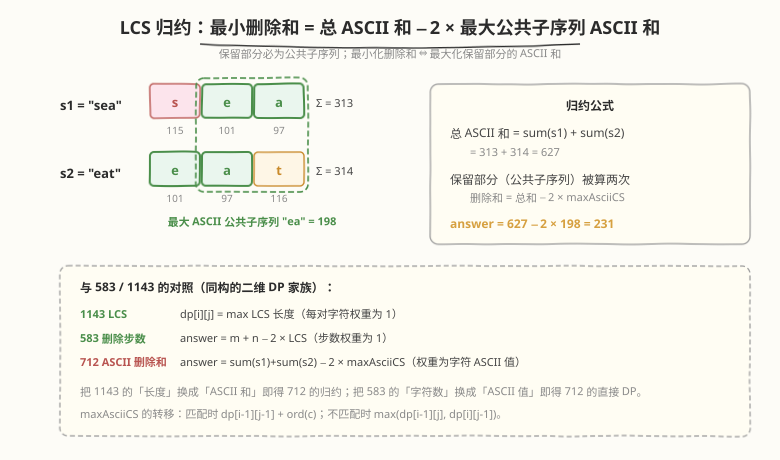

# LeetCode 两个字符串的最小ASCII删除和 题解

## 1. 题目概述

- **标题 / 题号**：两个字符串的最小ASCII删除和（#712，medium）
- **链接**：https://leetcode.cn/problems/minimum-ascii-delete-sum-for-two-strings/
- **难度**：中等
- **标签**：动态规划、二维 DP、字符串、LCS

**题意**：给定两个字符串 `s1` 和 `s2`，返回使两个字符串**相等**所需删除字符的 **ASCII 值的最小和**。每一步可以删除 `s1` 或 `s2` 中的一个字符，并把该字符的 ASCII 值累加进总和。

**示例 1**：

```text
输入：s1 = "sea", s2 = "eat"
输出：231
解释：在 "sea" 中删除 "s"（ASCII 115），在 "eat" 中删除 "t"（ASCII 116）。
      两字符串都变成 "ea"，115 + 116 = 231。
```

**示例 2**：

```text
输入：s1 = "delete", s2 = "leet"
输出：403
解释：在 "delete" 中删除 "dee"（100+101+101=302）变成 "let"，在 "leet" 中删除 "e"（101）变成 "let"。
      302 + 101 = 403。若改为都变成 "lee" 或 "eet"，得 433 或 417，均更大。
```

**约束**：

- `1 <= s1.length, s2.length <= 1000`
- `s1` 和 `s2` 由小写英文字母组成

> 💡 本题与 [583. 两个字符串的删除操作](../0501-0600/583_两个字符串的删除操作.md) 是**同构**关系：583 求「最小删除**步数**」（每个字符权重为 1），本题求「最小删除 **ASCII 和**」（每个字符权重为其 ASCII 值）。只允许删除、不允许替换/插入，因此转移结构是 `min` 两分支而非编辑距离的 `min` 三选一。

## 2. 解题思路

### 2.1 暴力思路：递归枚举

对 `s1` 和 `s2` 的每个位置：若字符相同则这对都保留、共同前进一步；若不同则必须删掉其中一个（删 `s1[i-1]` 累加 `ord(s1[i-1])`，或删 `s2[j-1]` 累加 `ord(s2[j-1])`），两分支取较小。时间 $O(2^{m+n})$，指数级超时，且大量重复子问题。

### 2.2 核心观察：二维 DP（直接求最小 ASCII 删除和）

![核心观察：dp[i][j] = 让 s1[0..i-1] 与 s2[0..j-1] 相等的最小 ASCII 删除和](../images/mas_dp_table.svg)

**定义**：`dp[i][j]` = 使 `s1[0..i-1]` 与 `s2[0..j-1]` 相等所需删除字符的**最小 ASCII 和**。

**边界**（一侧为空串，只能把另一侧全删，累加其全部 ASCII 值）：

```text
dp[0][j] = Σ ord(s2[k])  for k in 0..j-1      # s1 为空，删光 s2 前 j 个字符
dp[i][0] = Σ ord(s1[k])  for k in 0..i-1      # s2 为空，删光 s1 前 i 个字符
```

**转移**（核心）：

```text
若 s1[i-1] == s2[j-1]：
    dp[i][j] = dp[i-1][j-1]                         # 两字符相同，这对都保留，删除和不变

若 s1[i-1] != s2[j-1]：
    dp[i][j] = min(dp[i-1][j] + ord(s1[i-1]),       # 删 s1[i-1]，累加其 ASCII 值
                   dp[i][j-1] + ord(s2[j-1]))       # 删 s2[j-1]，累加其 ASCII 值
```

**两种转移的直觉**：

| 情况 | DP 来源 | 含义 |
|------|---------|------|
| **字符匹配** | `dp[i-1][j-1]` | 两字符相同，这对一起保留，删除和不变 |
| **字符不匹配** | `min(dp[i-1][j] + s1[i-1], dp[i][j-1] + s2[j-1])` | 至少删掉其中一个并累加其 ASCII 值，取较少删法 |

> 💡 **为什么不匹配时不考虑「两个都删」？** 即 `dp[i-1][j-1] + ord(s1[i-1]) + ord(s2[j-1])`。因为 `dp[i-1][j] ≤ dp[i-1][j-1] + ord(s2[j-1])`（先把 `s2[j-1]` 删掉即归约到 `dp[i-1][j-1]`），所以 `dp[i-1][j] + ord(s1[i-1]) ≤ dp[i-1][j-1] + ord(s1[i-1]) + ord(s2[j-1])`，同理另一分支。**两个都删**已被「先删一个、再删另一个」的两步路径包含，不会更优。这与 [72. 编辑距离](../0001-0100/72_编辑距离.md) 的 `min` 三选一不同——本题没有「替换」操作，与 583 完全一致，只是把权重从 1 换成 ASCII 值。

**答案**：`dp[m][n]`。

### 2.3 算法流程图

**完整步骤**：

1. **初始化**：`dp` 为 `(m+1) × (n+1)` 矩阵。第 0 行 `dp[0][j] = dp[0][j-1] + ord(s2[j-1])`、第 0 列 `dp[i][0] = dp[i-1][0] + ord(s1[i-1])`（空串边界，累加删光另一侧的 ASCII 和），`dp[0][0] = 0`
2. **逐行填表**：`i` 从 1 到 `m`，`j` 从 1 到 `n`：
   - `s1[i-1] == s2[j-1]` → `dp[i][j] = dp[i-1][j-1]`
   - `s1[i-1] != s2[j-1]` → `dp[i][j] = min(dp[i-1][j] + ord(s1[i-1]), dp[i][j-1] + ord(s2[j-1]))`
3. **返回** `dp[m][n]`

> ⚠️ **填表顺序**：必须从左到右、从上到下。`dp[i][j]` 依赖左上 (`dp[i-1][j-1]`)、正上 (`dp[i-1][j]`)、左方 (`dp[i][j-1]`)，三者都要先算出来。这是二维 DP 的典型依赖方向，与 LCS、编辑距离、583 完全一致。

### 2.4 示例演算

以 `s1 = "sea"`, `s2 = "eat"` 为例（`s=115, e=101, a=97, t=116`）：

![示例演算：sea 与 eat 的 dp 填表，答案 dp[3][3]=231](../images/mas_example_walkthrough.svg)

**dp 表**（行 = s1 字符，列 = s2 字符，首行/首列为空串边界，值为 ASCII 累加和）：

| | `""` | `e` | `a` | `t` |
|------|------|-----|-----|-----|
| `""` | 0 | 101 | 198 | 314 |
| `s` | 115 | 216 | 313 | 429 |
| `e` | 216 | **115** | 212 | 328 |
| `a` | 313 | 212 | **115** | **231** |

**关键填表步骤**：

| 格子 | 字符比较 | 转移 | 值 | 说明 |
|------|----------|------|----|------|
| `dp[0][3]` | 边界 | `101+97+116` | 314 | s1 为空，删光 s2 全部 |
| `dp[2][1]` | `e` == `e` | `dp[1][0] = 115` | 115 | 两 `e` 都保留，剩 `"s"` 与 `""` 须删 115 |
| `dp[2][2]` | `e` ≠ `a` | `min(313+101, 115+97)` | 212 | 删 `a` 更省，沿用 `dp[2][1]+97` |
| `dp[3][2]` | `a` == `a` | `dp[2][1] = 115` | 115 | 两 `a` 都保留，剩 `"se"` 与 `"e"` 须删 115 |
| `dp[3][3]` | `a` ≠ `t` | `min(328+97, 115+116)` | 231 | 删 `t` 更省，沿用 `dp[3][2]+116` ✓ |

最终 `dp[3][3] = 231`：保留公共子序列 `"ea"`，删 `s1` 的 `'s'`(115)、删 `s2` 的 `'t'`(116)，和为 231。

> 💡 **如何还原具体删除了哪些字符？** 从 `dp[m][n]` 回溯：若 `s1[i-1] == s2[j-1]` 且 `dp[i][j] == dp[i-1][j-1]`，该字符被**保留**，走到 `[i-1][j-1]`；否则走向 `dp[i-1][j] + ord(s1[i-1]) == dp[i][j]`（删 `s1[i-1]`）或 `dp[i][j-1] + ord(s2[j-1]) == dp[i][j]`（删 `s2[j-1]`）中成立的分支，记录被删字符。逆序即得删除序列。需完整二维表，滚动数组无法回溯。

## 3. 参考代码

### C++

```cpp
// 两个字符串的最小ASCII删除和.cpp —— 二维 DP 直接求最小 ASCII 删除和
// 编译: g++ -O2 -std=c++17 两个字符串的最小ASCII删除和.cpp -o mas
class Solution {
public:
    int minimumDeleteSum(string s1, string s2) {
        int m = s1.size(), n = s2.size();
        vector<vector<int>> dp(m + 1, vector<int>(n + 1, 0));

        for (int i = 1; i <= m; i++)                         // s2 为空，删光 s1
            dp[i][0] = dp[i-1][0] + s1[i-1];
        for (int j = 1; j <= n; j++)                         // s1 为空，删光 s2
            dp[0][j] = dp[0][j-1] + s2[j-1];

        for (int i = 1; i <= m; i++) {
            for (int j = 1; j <= n; j++) {
                if (s1[i-1] == s2[j-1]) {
                    dp[i][j] = dp[i-1][j-1];                 // 两字符相同，都保留
                } else {
                    dp[i][j] = min(dp[i-1][j] + s1[i-1],     // 删 s1[i-1]
                                   dp[i][j-1] + s2[j-1]);    // 删 s2[j-1]
                }
            }
        }
        return dp[m][n];
    }
};
```

### Python

```python
class Solution:
    def minimumDeleteSum(self, s1: str, s2: str) -> int:
        m, n = len(s1), len(s2)
        dp = [[0] * (n + 1) for _ in range(m + 1)]

        for i in range(1, m + 1):                            # s2 为空，删光 s1
            dp[i][0] = dp[i-1][0] + ord(s1[i-1])
        for j in range(1, n + 1):                            # s1 为空，删光 s2
            dp[0][j] = dp[0][j-1] + ord(s2[j-1])

        for i in range(1, m + 1):
            for j in range(1, n + 1):
                if s1[i-1] == s2[j-1]:
                    dp[i][j] = dp[i-1][j-1]                  # 两字符相同，都保留
                else:
                    dp[i][j] = min(dp[i-1][j] + ord(s1[i-1]),   # 删 s1[i-1]
                                   dp[i][j-1] + ord(s2[j-1]))   # 删 s2[j-1]

        return dp[m][n]
```

> 💡 **实现细节**：① `dp` 矩阵大小 `(m+1)×(n+1)`，多出来的首行首列表示空串边界。② 边界用**前缀累加**初始化（`dp[i][0] = dp[i-1][0] + ord(s1[i-1])`），而非像 583 那样直接 `= i`——因为本题每个字符权重不同。③ `s1[i-1]` 对应 `dp[i]` 行——下标偏移 1 是因为 `dp[0]` 代表空串。④ C++ 中 `char` 自动提升为 `int`，`s1[i-1]` 即其 ASCII 值，无需显式转换。

## 4. 复杂度分析

| 维度 | 二维 DP | 滚动数组 | 最大 ASCII 公共子序列归约 |
|------|---------|---------|--------------------------|
| **时间** | `O(m × n)` | `O(m × n)` | `O(m × n)` |
| **空间** | `O(m × n)` | `O(n)` | `O(n)`（滚动） |
| **能否还原删除序列** | ✓ 回溯 dp 表 | ✗ 只得和 | ✗ 只得和 |
| **思路** | 直接求最小 ASCII 删除和 | 同左，压缩空间 | 借用「最大 ASCII 公共子序列」间接求 |

> ⚠️ 时间 `O(m×n)`：双重循环遍历 `(m+1)×(n+1)` 个格子，每格 `O(1)` 转移。`m, n ≤ 1000` 时约 $10^6$ 次操作，完全可行。`dp` 值上限为 `2 × 1000 × 122 ≈ 2.4×10^5`（全删两串总 ASCII），`int` 足够。

## 5. 扩展：归约到「最大 ASCII 公共子序列」+ 滚动数组

### 5.1 归约：最小删除和 = $\text{sum}(s1) + \text{sum}(s2) - 2 \times \text{maxAsciiCS}$



**核心观察**：要让两字符串相等，最终保留下来的部分必须是两字符串的**公共子序列**。设保留部分的 ASCII 和为 $W$，则 `s1` 删去的 ASCII 和为 $\text{sum}(s1) - W$、`s2` 删去的为 $\text{sum}(s2) - W$，总删除和 $= (\text{sum}(s1) - W) + (\text{sum}(s2) - W) = \text{sum}(s1) + \text{sum}(s2) - 2W$。要让总删除和**最小**，就要让 $W$ **最大**——即 $W = \text{maxAsciiCS}(s1, s2)$，也就是**ASCII 和最大的公共子序列**。

$$\text{minimumDeleteSum} = \text{sum}(s1) + \text{sum}(s2) - 2 \times \text{maxAsciiCS}(s1, s2)$$

这恰是 [583](../0501-0600/583_两个字符串的删除操作.md) 的 `m + n - 2 × LCS` 把「长度」换成「ASCII 和」的版本。`maxAsciiCS` 的转移与 [1143. 最长公共子序列](../1101-1200/1143_最长公共子序列.md) 同构，只是匹配时累加 `ord(c)` 而非 `+1`：

```python
class Solution:
    def minimumDeleteSum(self, s1: str, s2: str) -> int:
        m, n = len(s1), len(s2)
        total = sum(ord(c) for c in s1) + sum(ord(c) for c in s2)
        # 求 maxAsciiCS（滚动数组版）
        dp = [0] * (n + 1)
        for i in range(1, m + 1):
            prev = dp[0]
            for j in range(1, n + 1):
                temp = dp[j]
                if s1[i-1] == s2[j-1]:
                    dp[j] = prev + ord(s1[i-1])     # 匹配：累加 ASCII 值
                else:
                    dp[j] = max(dp[j], dp[j-1])     # 不匹配：取较大
                prev = temp
        return total - 2 * dp[n]
```

> 💡 **为什么直接 DP 和归约等价？** 直接 DP 的 `dp[i][j]` 满足恒等式 `dp[i][j] = sum(s1[0..i-1]) + sum(s2[0..j-1]) - 2 × maxAsciiCS[i][j]`。可对 `(i,j)` 归纳验证：边界 `dp[0][j] = sum(s2[0..j-1]) = 0 + sum - 2×0` 成立；匹配时 `dp[i-1][j-1] = sum_{i-1} + sum_{j-1} - 2×cs[i-1][j-1]`，加回 `ord(s1[i-1]) + ord(s2[j-1])` 即 `sum_i + sum_j - 2×(cs[i-1][j-1] + ord(c)) = sum_i + sum_j - 2×cs[i][j]`；不匹配时 `min(上+ord(s1[i-1]), 左+ord(s2[j-1]))` 展开后亦归约到 `sum_i + sum_j - 2×max(cs[i-1][j], cs[i][j-1])`。两种视角殊途同归。

### 5.2 直接 DP 的滚动数组

`dp[i][j]` 只依赖上一行和当前行左边，可用**一维数组 + prev 变量**压缩到 `O(n)` 空间（与 583、LCS 滚动数组技巧完全一致）：

```python
class Solution:
    def minimumDeleteSum(self, s1: str, s2: str) -> int:
        m, n = len(s1), len(s2)
        dp = [0] * (n + 1)
        for j in range(1, n + 1):                            # dp[0][j] 前缀累加
            dp[j] = dp[j-1] + ord(s2[j-1])

        for i in range(1, m + 1):
            prev = dp[0]                                     # dp[i-1][0]
            dp[0] = dp[0] + ord(s1[i-1])                     # dp[i][0] 前缀累加
            for j in range(1, n + 1):
                temp = dp[j]                                 # 保存 dp[i-1][j]
                if s1[i-1] == s2[j-1]:
                    dp[j] = prev                             # dp[i-1][j-1]
                else:
                    dp[j] = min(dp[j] + ord(s1[i-1]),        # dp[i-1][j] + s1[i-1]
                                dp[j-1] + ord(s2[j-1]))       # dp[i][j-1] + s2[j-1]
                prev = temp                                  # 滚动 prev
        return dp[n]
```

> ⚠️ **滚动数组的两个易错点**：① 每行开始前要把 `dp[0]` 累加 `ord(s1[i-1])`（当前行的左边界），它原本是上一行的 `dp[i-1][0]`。② `prev` 在覆盖 `dp[j]` 前保存旧值（上一行的 `dp[j]`），下一次迭代作为 `dp[i-1][j-1]`（左上角）使用。

### 5.3 与 583 / 编辑距离的关系

本题是 [72. 编辑距离](../0001-0100/72_编辑距离.md) 的**退化版**（只删不替），且是 [583. 两个字符串的删除操作](../0501-0600/583_两个字符串的删除操作.md) 的**加权版**。三者转移结构对比：

| | 字符匹配时 | 字符不匹配时 | 权重 | 目标 |
|------|-----------|-------------|------|------|
| **1143 LCS** | `dp[i-1][j-1] + 1` | `max(dp[i-1][j], dp[i][j-1])` | 1 | 求 LCS 长度 |
| **583 删除步数** | `dp[i-1][j-1]` | `1 + min(dp[i-1][j], dp[i][j-1])` | 1 | 求最少删除步数 |
| **712 ASCII 删除和** | `dp[i-1][j-1]` | `min(dp[i-1][j]+s1[i-1], dp[i][j-1]+s2[j-1])` | ord(c) | 求最小删除 ASCII 和 |
| **72 编辑距离** | `dp[i-1][j-1]` | `1 + min(dp[i-1][j-1], dp[i-1][j], dp[i][j-1])` | 1 | 求最少操作数 |

把 583 的「每个字符权重为 1」换成「权重为 ASCII 值」，就得到 712；去掉编辑距离的「替换」分支，就得到 583/712。

## 6. 面试要点

1. **`dp[i][j]` 的定义是什么？边界为什么是前缀累加而非 `i` / `j`？**

   > `dp[i][j]` = 使 `s1[0..i-1]` 与 `s2[0..j-1]` 相等的最小 ASCII 删除和。边界 `dp[0][j] = Σ ord(s2[0..j-1])`、`dp[i][0] = Σ ord(s1[0..i-1])`：当一侧为空串，只能把另一侧的字符全删掉并累加其 ASCII 值。这与 583（边界为 `i`/`j`，权重为 1）不同——本题每个字符权重不同，须用前缀累加。

2. **不匹配时为什么是 `min(上 + s1[i-1], 左 + s2[j-1])` 而非 `min` 三选一？**

   > 本题只允许删除，不允许替换。不匹配时要么删 `s1[i-1]`（→ `dp[i-1][j] + ord(s1[i-1])`），要么删 `s2[j-1]`（→ `dp[i][j-1] + ord(s2[j-1])`），两分支取较小。「两个都删」已被两步路径包含，不更优；「替换」操作不存在。对比编辑距离的 `min` 三选一，本题少了替换分支，与 583 同构但权重不同。

3. **本题和 583 / 1143 是什么关系？**

   > 三者同属「两序列二维 DP」家族。1143 求 LCS 长度（匹配 `+1`）；583 把删除步数归约为 `m + n - 2 × LCS`（权重 1）；本题把删除 ASCII 和归约为 `sum(s1) + sum(s2) - 2 × maxAsciiCS`（权重为 ASCII 值）。把 1143 的「`+1`」换成「`+ord(c)`」即得 maxAsciiCS，进而套 583 的归约公式。

4. **直接 DP 和归约，面试时该写哪个？**

   > 都可。直接 DP 更「贴合题意」（状态直接对应删除和，边界/转移直观，能回溯删除序列）；归约更「优雅」（一行公式 + 复用 LCS 模板，体现问题转化能力）。若面试官追问「能不能用 LCS 做」，能立刻给出 `total - 2 × maxAsciiCS` 是加分项。注意归约求的是「最大 ASCII 公共子序列」，不是普通 LCS 长度。

5. **如何还原具体删除了哪些字符？**

   > 从 `dp[m][n]` 回溯：若 `s1[i-1] == s2[j-1]` 且 `dp[i][j] == dp[i-1][j-1]`，该字符被**保留**，走到 `[i-1][j-1]`；否则走向 `dp[i-1][j] + ord(s1[i-1]) == dp[i][j]`（删 `s1[i-1]`）或 `dp[i][j-1] + ord(s2[j-1]) == dp[i][j]`（删 `s2[j-1]`）中成立的分支，记录被删字符。需完整二维表，滚动数组无法回溯。

> 💡 **一句话总结**：712 是「只删不替、权重为 ASCII 值」的编辑距离退化版——`dp[i][j]` 表示两前缀变相等的最小 ASCII 删除和，匹配时继承 `dp[i-1][j-1]`，不匹配时 `min(上方+s1[i-1], 左方+s2[j-1])`。亦可归约为 `sum(s1)+sum(s2) − 2 × maxAsciiCS`。`O(m×n)` 时间，滚动数组可压到 `O(n)` 空间。与 583、1143、72 同属二维 DP 核心套路，掌握一个即可迁移一整类。

## 同类练习题

| # | 题目 | 与本题的关联 |
|---|------|-------------|
| 583 | [两个字符串的删除操作](https://leetcode.cn/problems/delete-operation-for-two-strings/)（[题解](../0501-0600/583_两个字符串的删除操作.md)） | 本题的「等权重版」，求最小删除步数，`answer = m + n - 2 × LCS` |
| 1143 | [最长公共子序列](https://leetcode.cn/problems/longest-common-subsequence/)（[题解](../1101-1200/1143_最长公共子序列.md)） | 本题归约的源头，把「最大 ASCII 和」退化为「最长长度」 |
| 72 | [编辑距离](https://leetcode.cn/problems/edit-distance/)（[题解](../0001-0100/72_编辑距离.md)） | 本题的「升级版」，多了替换操作，不匹配时 `min` 三选一 |
| 97 | [交错字符串](https://leetcode.cn/problems/interleaving-string/)（[题解](../0001-0100/97_交错字符串.md)） | 同属两序列二维 DP，状态定义与转移方向可对照 |
| 1312 | [让字符串成为回文串的最少插入次数](https://leetcode.cn/problems/minimum-insertion-steps-to-make-a-string-palindrome/) | 单字符串回文 DP，与 LCS 思想相通（求与逆序串的 LCS） |
