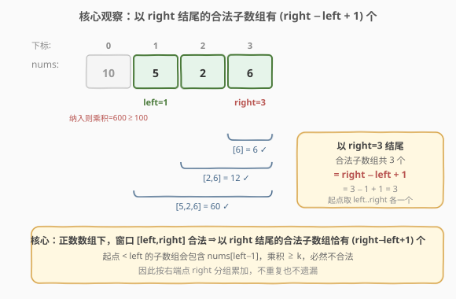
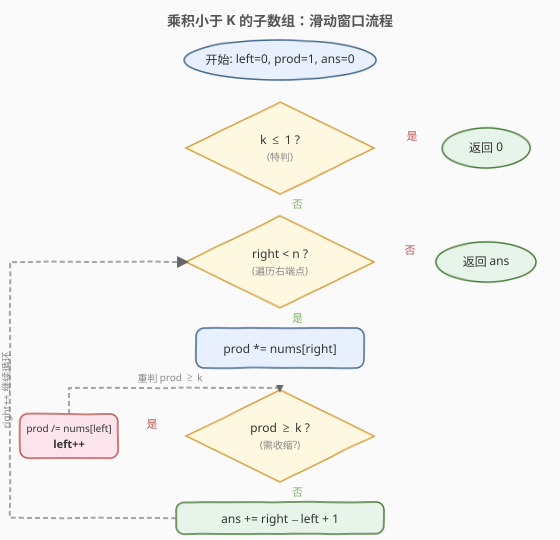

# 乘积小于K的子数组

- **题目名称**：乘积小于K的子数组
- **链接**：[713. 乘积小于 K 的子数组](https://leetcode.cn/problems/subarray-product-less-than-k/)
- **难度**：中等
- **标签**：数组、滑动窗口、双指针

## 1. 题目概述

给定一个**正整数**数组 `nums` 和一个整数 `k`，返回**乘积严格小于** `k` 的**连续子数组**的个数。

**示例 1**：

```text
输入：nums = [10,5,2,6], k = 100
输出：8
解释：8 个乘积小于 100 的子数组为：
     [10]、[5]、[2]、[6]、[10,5]、[5,2]、[2,6]、[5,2,6]。
     [10,5,2] 的乘积为 100，不满足「严格小于」，不计入。
```

**示例 2**：

```text
输入：nums = [1,2,3], k = 0
输出：0
解释：所有元素都 >= 1，任意子数组乘积都 >= 1，不可能严格小于 0。
```

**约束条件**：

- `1 <= nums.length <= 3 * 10^4`
- `1 <= nums[i] <= 1000`
- `0 <= k <= 10^6`

> 💡 注意约束中 `nums[i]` 都是**正整数**，这是滑窗可行的前提：窗口向右扩展时乘积**单调不降**，向左收缩时乘积**单调不增**，从而保证「单调性」成立。

---

## 2. 解题思路

### 2.1 暴力思路

枚举所有子数组 `[i, j]`，逐个累乘判断是否 `< k`。共有 `O(n^2)` 个子数组，每个判断 `O(n)`，总复杂度 `O(n^3)`（若边枚举边累乘可降到 `O(n^2)`），`n = 3 * 10^4` 时仍会超时。

### 2.2 核心观察：滑动窗口 + 「以 right 结尾」计数



关键直觉是维护一个**乘积严格小于** `k` 的窗口 `[left, right]`：

- `right` 不断右移，把 `nums[right]` 乘进窗口乘积 `prod`。
- 一旦 `prod >= k`，就从左侧不断收缩 `left`（`prod /= nums[left]; left++`），直到 `prod < k` 重新成立。
- 此时窗口 `[left, right]` 合法，**以 `right` 结尾的合法子数组恰好有 `right - left + 1` 个**。

> 为什么是 `right - left + 1`？因为窗口内**全是正数**，删掉最左边的若干元素只会让乘积**更小**。所以以 `right` 为右端点、起点取 `left, left+1, …, right` 的这 `right - left + 1` 个子数组**全部合法**；而起点 `< left` 的子数组会包含 `nums[left-1]`，乘积至少是整个 `[left-1, right]` 的乘积 `>= k`（否则 `left` 就不必收缩到当前位置），必然不合法。把答案**按右端点 `right` 分组**累加，既不重复也不遗漏。

### 2.3 算法流程图



整体只有一重 `for` 循环，`left`、`right` 都只增不减，`left` 的总移动次数不超过 `n`，因此总复杂度为 `O(n)`。

### 2.4 示例演算

![示例演算：nums = [10,5,2,6], k = 100](../images/spwk_example_walkthrough.svg)

上表逐步展示了 `nums = [10,5,2,6]`、`k = 100` 的完整执行过程：

- `right=0`：`prod=10`，合法，新增 `[10]`，`ans=1`。
- `right=1`：`prod=50`，合法，新增 `[5]`、`[10,5]`，`ans=3`。
- `right=2`：`prod=100` 不满足，收缩掉 `nums[0]=10` 后 `prod=10`、`left=1`，新增 `[2]`、`[5,2]`，`ans=5`。
- `right=3`：`prod=60`，合法，新增 `[6]`、`[2,6]`、`[5,2,6]`，`ans=8`。

最终答案为 `8`。

---

## 3. 参考代码

### C++

```cpp
class Solution {
  public:
    int numSubarrayProductLessThanK(vector<int>& nums, int k) {
        if (k <= 1) return 0;          // 元素都 >= 1，乘积恒 >= 1，不可能 < k
        int left = 0, prod = 1, ans = 0;
        for (int right = 0; right < (int)nums.size(); right++) {
            prod *= nums[right];
            while (prod >= k) {        // 收缩左端，恢复合法性
                prod /= nums[left];
                left++;
            }
            ans += right - left + 1;   // 以 right 结尾的合法子数组个数
        }
        return ans;
    }
};
```

### Python

```python
class Solution:
    def numSubarrayProductLessThanK(self, nums: List[int], k: int) -> int:
        if k <= 1:
            return 0
        left = 0
        prod = 1
        ans = 0
        for right, x in enumerate(nums):
            prod *= x
            while prod >= k:
                prod //= nums[left]
                left += 1
            ans += right - left + 1
        return ans
```

> ⚠️ **两个易错点**：
> 1. **`k <= 1` 必须特判**。元素 `nums[i] >= 1`，任意子数组乘积 `>= 1`；当 `k <= 1` 时答案恒为 `0`。若不特判，`k = 0` 时 `while (prod >= 0)` 永远成立，`left` 会越界。
> 2. **计数是 `right - left + 1`，不是窗口长度**。这里累加的是「以 `right` 结尾的合法子数组个数」，每次循环都加，而不是去维护一个全局最大值。

---

## 4. 复杂度分析

| 维度 | 复杂度 | 说明 |
|------|--------|------|
| 时间复杂度 | O(n) | `right` 遍历一次 `n` 步；`left` 累计最多右移 `n` 步（均摊 `O(1)`） |
| 空间复杂度 | O(1) | 仅用 `left / prod / ans` 等常数个变量 |

---

## 5. 扩展：为什么「正数」是滑窗的前提

滑窗 `O(n)` 成立的核心是窗口乘积的**单调性**：

- `right` 右扩 → 乘上一个 `>= 1` 的数 → `prod` 不降；
- `left` 右缩 → 除掉一个 `>= 1` 的数 → `prod` 不增。

一旦数组含 `0` 或负数，单调性被破坏，滑窗就不再适用：

- 含 `0`：乘到 `0` 后 `prod` 突变为 `0`，但越过 `0` 之后的乘积又会跳变，窗口合法性不再随端点单调变化。
- 含负数：乘一个负数会让大乘积变小、小乘积变大，无法用「收缩左端一定使乘积变小」来修正窗口。

此时通常改用**前缀积 + 哈希**或**分治**等思路。本题约束保证 `nums[i] >= 1`，所以滑窗是最优解。

---

## 6. 面试要点

1. **为什么本题能用滑动窗口，而「和为 K 的子数组」（560）不能？**

   - 本题要求乘积**严格小于** `k`（一个**上界**），且元素全为正数，乘积随窗口扩展单调不降，满足滑窗的单调性。560 要求和**恰好等于** `k`（精确值），`right` 扩展时和在变但不一定朝目标单调逼近，无法用双指针收缩，只能用**前缀和 + 哈希**。

2. **`ans += right - left + 1` 这个计数为什么不会重复或遗漏？**

   - 按**右端点 `right`** 分组计数：每轮只统计「以当前 `right` 结尾」的合法子数组，不同 `right` 的组互不相交（右端点不同），所以不重复；每个合法子数组都有唯一的右端点，所以不遗漏。

3. **如果不特判 `k <= 1` 会怎样？**

   - `k = 0` 时 `while (prod >= 0)` 恒真，`left` 一路右移直到越界访问 `nums[left]`（未定义行为 / 下标越界）。`k = 1` 时元素 `>= 1` 使乘积恒 `>= 1`，同样会越界。特判直接返回 `0` 即可。

4. **`left` 的总移动次数真的是 `O(n)` 吗？会不会退化成 `O(n^2)`？**

   - 不会。`left` 只增不减，全程最多从 `0` 移到 `n-1`，总移动次数不超过 `n`。虽然写在 `while` 里，但均摊到每个 `right` 是 `O(1)`，这是「双指针/滑窗」的标准均摊分析。

5. **如果题目改成「乘积等于 K 的子数组个数」怎么做？**

   - 严格等于属于精确值问题，滑窗不适用。由于元素为正整数，可用「乘积严格小于 `K+1` 的个数」减去「乘积严格小于 `K` 的个数」（即 `atMost(K) - atMost(K-1)`），复用本题的滑窗函数，仍是 `O(n)`。这正是「**恰好 = 至多上界差分**」的经典转化。

---

## 7. 同类练习题

- [209. 长度最小的子数组](https://leetcode.cn/problems/minimum-size-subarray-sum/)（[题解](../0201-0300/209_长度最小的子数组.md)）：同为正数滑窗，求「最短长度」而非「计数」
- [904. 水果成篮](https://leetcode.cn/problems/fruit-into-baskets/)：滑窗计数，「至多两种」的窗口合法性维护
- [930. 和相同的二元子数组](https://leetcode.cn/problems/binary-subarrays-with-sum/)：计数子数组，可用「至多上界差分」转化
- [1004. 最大连续 1 的个数 III](https://leetcode.cn/problems/max-consecutive-ones-iii/)：滑窗 + 条件容忍（翻转至多 K 个 0）
- [1248. 统计「优美子数组」](https://leetcode.cn/problems/count-number-of-nice-subarrays/)：计数子数组，与本题计数套路一致
