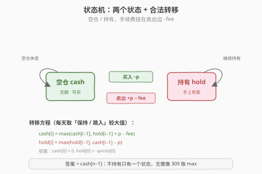
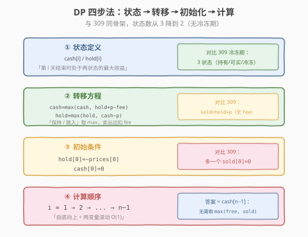
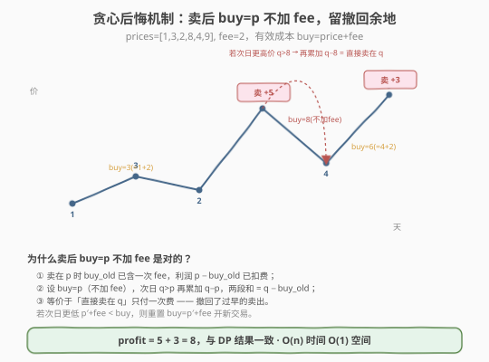

# 买卖股票的最佳时机含手续费

- **题目名称**：买卖股票的最佳时机含手续费
- **链接**：[714. 买卖股票的最佳时机含手续费](https://leetcode.cn/problems/best-time-to-buy-and-sell-stock-with-transaction-fee/)
- **难度**：中等
- **标签**：动态规划、贪心、状态机

## 1. 题目概述

给定一个整数数组 `prices`，其中 `prices[i]` 表示第 `i` 天的股票价格；再给定一个整数 `fee`，表示**每完成一笔交易需要支付的手续费**。你可以完成**尽可能多的交易**（多次买卖），但任意时刻**最多持有一股**股票，且每次卖出时（或买入时，两种约定等价）需扣减一次 `fee`。求能获得的最大利润。

**示例 1**：

```text
输入：prices = [1,3,2,8,4,9], fee = 2
输出：8
解释：第 0 天买入（1），第 3 天卖出（8）→ 收益 8-1-2 = 5；
     第 4 天买入（4），第 5 天卖出（9）→ 收益 9-4-2 = 3。
     总收益 = 5 + 3 = 8。
```

**示例 2**：

```text
输入：prices = [1,3,7,5,10,3], fee = 3
输出：6
解释：第 0 天买入（1），第 4 天卖出（10）→ 收益 10-1-3 = 6。
```

**约束条件**：

- `1 <= prices.length <= 5 * 10^4`
- `1 <= prices[i] < 5 * 10^4`
- `0 <= fee < 5 * 10^4`

> 💡 这是「股票系列」里**最干净的「两状态机」**题——没有冷冻期，只有手续费。和 [309. 含冷冻期](../0301-0400/309_买卖股票的最佳时机含冷冻期.md) 的三状态机相比，本题少了 `sold` 状态，结构更简；但多了一条**巧妙的贪心解法**（含「撤回卖出」的后悔机制），值得单独成篇。**一道题学两个模板**：状态机 DP 通解 + 贪心思维。

---

## 2. 解题思路

### 2.1 暴力思路：DFS 枚举每天操作

每天有两个选择：买入（前提未持仓）、卖出（前提持仓）、或休息。用 DFS 枚举所有合法序列，每次卖出扣 `fee`：

```text
dfs(i, holding):
    if i == n: return 0
    best = dfs(i+1, holding)                      # 休息
    if holding:
        best = max(best, prices[i] - fee + dfs(i+1, false))  # 卖出扣手续费
    else:
        best = max(best, -prices[i] + dfs(i+1, true))        # 买入
    return best
```

状态空间 `O(n × 2)`，记忆化后是 `O(n)`，但 `n = 5×10^4` 时递归栈深、常数大，且状态定义没有提炼成「命名状态」，转移易写错。

> ⚠️ 暴力法的真正价值不在于超时（记忆化可解），而在于**点出「持有 / 不持有」是唯一需要记录的历史**——手续费不影响未来决策（每次卖出都扣固定 `fee`，不依赖历史），所以无需像冷冻期那样额外开状态。把这两个合法处境提炼成 `hold` 与 `cash`，就是两状态机的起点。

### 2.2 核心观察：两状态机

把任一交易日结束时所处的「处境」归为**两个互斥状态**：

| 状态 | 含义 | 明天能做什么 |
|------|------|------------|
| **`cash`（空仓）** | 手上无股票 | 买入 / 继续空仓 |
| **`hold`（持有）** | 手上有股票 | 卖出（扣 `fee`）/ 继续持有 |

> 关键洞察：手续费是**交易边上的固定损耗**，不影响「明天能做什么」，所以**不需要新增状态**——和 309 的冷冻期不同。手续费的唯一落点是**卖出边减 `fee`**（或买入边减 `fee`，二者等价），把这一条加进转移方程即可。

状态之间的合法转移（带收益变化）：



- `cash → hold`：买入，收益 `-prices[i]`
- `hold → cash`：卖出，收益 `+prices[i] - fee`（卖出扣手续费）
- `cash → cash`、`hold → hold`：原地休息

注意：**没有 `cash → cash` 之外的跨状态捷径**——空仓想持仓必须买（`cash - prices[i]`），持仓想空仓必须卖（`hold + prices[i] - fee`）。手续费只挂在卖出边，这是「卖出扣费」约定的体现；若题目约定「买入扣费」，则把 `-fee` 挪到买入边即可，结果相同。

### 2.3 算法流程图



**四步法**（与 309 同骨架，状态数从 3 降到 2）：

1. **状态定义**：`cash[i]` / `hold[i]` 分别表示第 `i` 天结束时处于「空仓 / 持有」的最大收益。
2. **转移方程**（每个状态取「保持」与「跳入」两者较大值）：

   $$\text{cash}[i] = \max(\text{cash}[i-1],\ \text{hold}[i-1] + \text{prices}[i] - \text{fee})$$

   $$\text{hold}[i] = \max(\text{hold}[i-1],\ \text{cash}[i-1] - \text{prices}[i])$$

3. **初始条件**：第 0 天只能「买入」或「空仓」——`hold[0] = -prices[0]`、`cash[0] = 0`。
4. **计算顺序**：`i = 1 → n-1` 自底向上；两个变量滚动即 `O(1)` 空间。

> 💡 **答案是 `cash`**：末日还持有股票显然不优（持仓未变现）。所以答案就是 $\text{cash}[n-1]$，无需像 309 那样取 `max(free, sold)`——因为本题「不持有」只有一个状态。

### 2.4 示例演算

以 `prices = [1,3,2,8,4,9]`、`fee = 2` 为例：

![示例演算：两个状态数组递推到 cash[5]=8](../images/stock_fee_walkthrough.svg)

| i | prices[i] | 操作 | hold[i] | cash[i] | 说明 |
|---|-----------|------|---------|---------|------|
| 0 | 1 | 买入 | **-1** | 0 | 初值：买入花 1；空仓 0 |
| 1 | 3 | 休息 | -1 | 0 | cash=max(0, -1+3-2)=0（卖了也没赚）；hold 不动 |
| 2 | 2 | 休息 | -1 | 0 | 卖出收益 -1+2-2=-1 < 0，仍空仓 |
| 3 | 8 | 卖出 | -1 | **5** | cash=max(0, -1+8-2)=5（卖在 8，扣费后净赚 5） |
| 4 | 4 | 买入 | **1** | 5 | hold=max(-1, 5-4)=1（用利润在低点重建仓位） |
| 5 | 9 | 卖出 | 1 | **8** | cash=max(5, 1+9-2)=8（卖在 9，再赚 3） |

最终 `cash[5] = 8`，对应操作序列：**买@1 → 卖@8 → 买@4 → 卖@9**，收益 `(8-1-2) + (9-4-2) = 5 + 3 = 8`。

> 💡 看第 4 天：`hold` 从 `-1` 跳到 `1`，是因为 `cash[3]=5`（前面那笔交易的利润）减去 `prices[4]=4`——**用前面的利润在低点重新建仓**。这正是多次交易复利的关键，状态机把「先用利润再投入」自然编码进 `cash - prices[i]`，和 309 完全一致。

---

## 3. 参考代码

### C++

```cpp
// 买卖股票的最佳时机含手续费.cpp —— 两状态机 DP + 两变量滚动
// 编译: g++ -O2 -std=c++17 买卖股票的最佳时机含手续费.cpp -o fee
#include <vector>
#include <algorithm>
using namespace std;

// 版本 1：两状态数组（O(n) 空间，便于理解）
class Solution {
  public:
    int maxProfit(vector<int>& prices, int fee) {
        int n = prices.size();
        vector<int> cash(n), hold(n);
        cash[0] = 0;
        hold[0] = -prices[0];
        for (int i = 1; i < n; ++i) {
            cash[i] = max(cash[i - 1], hold[i - 1] + prices[i] - fee); // 保持空仓 / 卖出扣费
            hold[i] = max(hold[i - 1], cash[i - 1] - prices[i]);       // 保持持有 / 买入建仓
        }
        return cash[n - 1];
    }
};

// 版本 2：两变量滚动（O(1) 空间，推荐）
class Solution2 {
  public:
    int maxProfit(vector<int>& prices, int fee) {
        int cash = 0;                 // 空仓
        int hold = -prices[0];        // 持有
        for (int i = 1; i < (int)prices.size(); ++i) {
            int prev_cash = cash, prev_hold = hold;
            cash = max(prev_cash, prev_hold + prices[i] - fee); // 卖出扣费
            hold = max(prev_hold, prev_cash - prices[i]);       // 买入建仓
        }
        return cash;
    }
};
```

### Python

```python
class Solution:
    def maxProfit(self, prices: list[int], fee: int) -> int:
        cash, hold = 0, -prices[0]    # 空仓 / 持有
        for p in prices[1:]:
            # 同时赋值：右侧用旧值计算，避免引入临时变量
            cash, hold = (
                max(cash, hold + p - fee),   # 保持空仓 / 卖出扣费
                max(hold, cash - p),         # 保持持有 / 买入建仓
            )
        return cash
```

> ⚠️ Python 的元组同时赋值 `a, b = expr1, expr2` 中，**右侧两个表达式都使用旧值**，天然等价于 C++ 里先存 `prev_*` 再更新，无需临时变量。但若写成两行顺序赋值就会出错——`cash` 更新后再算 `hold = max(hold, cash - p)` 就用了新值。这是状态机 DP 最常见的踩坑点（与 309 完全相同）。

---

## 4. 复杂度分析

| 维度 | 复杂度 | 说明 |
|------|--------|------|
| **时间复杂度** | `O(n)` | 单层循环，每天 2 次状态计算 |
| **空间复杂度（数组版）** | `O(n)` | 两个长度为 `n` 的数组 |
| **空间复杂度（滚动版）** | `O(1)` | 只用 `cash / hold` 两个变量 |

---

## 5. 扩展：贪心解法（「撤回卖出」的后悔机制）

除了状态机 DP，本题还有一个**巧妙的贪心解法**——只需一次遍历、一个变量，思想源于「把手续费算进买入成本，并用『撤回』修正过早的卖出」。

### 5.1 核心思想

把每次买入的**有效成本**记为 `buy = prices[i] + fee`（买入价 + 手续费）。遍历时：

- 若 `prices[i] + fee < buy`：找到更低的买入点，更新 `buy`。
- 若 `prices[i] > buy`：当前价能获利，**先卖掉**累加利润 `profit += prices[i] - buy`，然后把 `buy` 更新为 `prices[i]`（**不加 `fee`**）。

> 关键魔法在「卖完后 `buy = prices[i]` 而非 `prices[i] + fee`」：这相当于**保留了一个『撤回上次卖出』的特权**。如果明天有更高的价 `prices[i+1]`，会再触发 `prices[i+1] > buy`，累加 `prices[i+1] - prices[i]`——两次卖出的利润之和，正好等于「直接卖在 `prices[i+1]`」的利润，**手续费只付了一次**。若明天是更低价，则 `prices[i+1] + fee < buy` 会重置 `buy`，开始一笔全新的交易。

### 5.2 贪心示意图



### 5.3 贪心代码

```python
class Solution:
    def maxProfit(self, prices: list[int], fee: int) -> int:
        buy = prices[0] + fee      # 有效买入成本（含手续费）
        profit = 0
        for p in prices[1:]:
            if p + fee < buy:        # 更低的买入点
                buy = p + fee
            elif p > buy:            # 当前能获利，先卖
                profit += p - buy
                buy = p              # 关键：不加 fee，留撤回余地
        return profit
```

以 `prices = [1,3,2,8,4,9]`、`fee = 2` 为例追踪贪心：

| i | p | buy（有效成本） | 动作 | profit |
|---|---|----------------|------|--------|
| 0 | 1 | 3 (=1+2) | 初值 | 0 |
| 1 | 3 | 3 | 无（3>3 不成立） | 0 |
| 2 | 2 | 3 | 无（2+2=4 不 < 3） | 0 |
| 3 | 8 | 8 | 卖：profit+=8-3=5，buy=8 | 5 |
| 4 | 4 | 6 (=4+2) | 更低买入点，重置 buy | 5 |
| 5 | 9 | 9 | 卖：profit+=9-6=3，buy=9 | **8** |

结果 `8`，与 DP 一致。注意第 3 天卖出后 `buy=8`（不加 `fee`）；若第 4 天是更高价（如 10），会触发 `10 > 8` 再累加 `2`，等于「直接卖在 10」而只付一次手续费——这就是撤回机制。

> ⚠️ 贪心比 DP 更快更省空间，但**仅适用于「无限次交易 + 固定手续费」**。一旦加上冷冻期（309）或交易次数限制（188/123），「撤回卖出」就不再合法（撤回可能违反冷冻期或次数上限），必须回到状态机 DP。**面试时先讲 DP（通用、可迁移），再用贪心作为加分项展示思维深度**。

---

## 6. 面试要点

1. **手续费应该挂在买入边还是卖出边？有区别吗？**

   - 两种约定**完全等价**。挂在卖出边：`cash = max(cash, hold + p - fee)`；挂在买入边：`hold = max(hold, cash - p - fee)`。因为每笔交易必有且仅有一次买和一次卖，`fee` 加在哪一边，对「一笔完整交易」的净收益无影响，只是状态变量在中间天上的数值分布不同。
   - 面试时按题目原话约定即可；若题目没明说，**默认卖出扣费**更符合直觉（卖出时才「结算」）。

2. **为什么本题只需两个状态，而 309 要三个？**

   - 状态数量取决于「**影响未来决策的历史信息**」。手续费是固定常数，扣在哪次交易都不改变未来选项，所以无需新状态；而 309 的冷冻期意味着「刚卖出」这个历史会让「明天不能买」——必须拆出 `sold` 状态与 `free` 区分。
   - 一句话：**每个影响未来决策的约束，对应一个状态维度**。手续费不影响未来决策，故不加维度；冷冻期影响，故加维度。

3. **贪心解法里 `buy = p`（卖后不加 `fee`）为什么是对的？**

   - 这是「**撤回卖出**」特权：卖在 `p` 后把 `buy` 设为 `p`（不加 `fee`），若次日有更高价 `q`，会再触发 `q > p` 累加 `q - p`。两段利润 `(p - buy_old) + (q - p) = q - buy_old`，等价于「直接卖在 `q`、只付一次手续费」——因为 `buy_old` 里已经含了那一次 `fee`。
   - 若次日是更低价，则 `p_new + fee < buy` 会重置 `buy`，开新交易。**不重置 `fee` 会多扣手续费导致漏算利润**，这是贪心写法最常见的 bug。

4. **如何把空间优化到 `O(1)`？**

   - 两个状态都只依赖前一天的同名状态，无更远依赖。用 `cash / hold` 两个变量滚动，每轮用「旧值」算「新值」。C++ 先存 `prev_*`；Python 用元组同时赋值 `a, b = ...`（右侧整体求值后再绑定）。
   - 这是「无后效性」的直接体现——未来只依赖最近一天的历史。

5. **贪心和 DP 怎么选？面试该讲哪个？**

   - **先讲 DP**：通用、可迁移到 309/188/123，且状态定义清晰不易错，是「保底正解」。再讲贪心作为**思维加分项**，展现对「撤回机制」的洞察。
   - 贪心 `O(n)` 时间 + `O(1)` 空间，常数比 DP 更小，但适用面窄（仅无限次 + 固定费）。若面试官追问「能不能更省」，就引出贪心；若追问「加冷冻期怎么办」，就回到 DP。

> 💡 **一句话总结**：含手续费是「两状态机 DP」的模板——把每天的处境压缩成「空仓 / 持有」两状态，手续费挂在卖出边。它的进阶是一套带「撤回卖出」的贪心，揭示了「把固定损耗算进成本、用不加损耗的更新保留后悔权」的通用技巧。掌握它，你就拿到了整个股票系列（122/123/188/309）和「固定成本交易类」问题的钥匙。

---

## 7. 同类练习题

- [122. 买卖股票的最佳时机 II](https://leetcode.cn/problems/best-time-to-buy-and-sell-stock-ii/)：本题 `fee=0` 的特例，贪心累加所有上升段
- [309. 买卖股票的最佳时机含冷冻期](https://leetcode.cn/problems/best-time-to-buy-and-sell-stock-with-cooldown/)（[题解](../0301-0400/309_买卖股票的最佳时机含冷冻期.md)）：加冷冻期升到三状态机，骨架相同状态更多
- [188. 买卖股票的最佳时机 IV](https://leetcode.cn/problems/best-time-to-buy-and-sell-stock-iv/)（[题解](../0101-0200/188_买卖股票的最佳时机IV.md)）：加「交易次数」维度，状态机通用版
- [121. 买卖股票的最佳时机](https://leetcode.cn/problems/best-time-to-buy-and-sell-stock/)（[题解](../0101-0200/121_买卖股票的最佳时机.md)）：至多一次交易，一次遍历维护最低价
