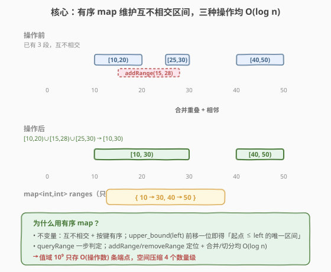
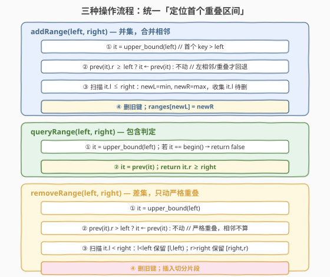
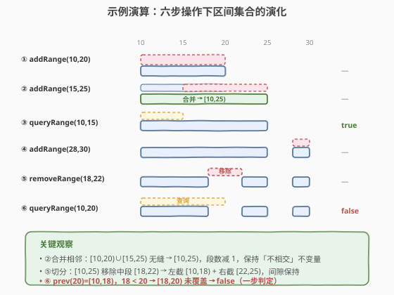

# LeetCode Range 模块 题解

## 1. 题目概述

- **标题 / 题号**：Range 模块（#715，hard）
- **链接**：https://leetcode.cn/problems/range-module/
- **难度**：困难
- **标签**：设计、有序集合、区间合并

**题意**：Range 模块用于追踪数轴上一系列**半开区间** `[left, right)` 内的所有实数，支持三种操作：

- `addRange(left, right)`：追踪 `[left, right)`。若与已追踪区间部分重叠，则补上未追踪的部分（**并集**语义）。
- `queryRange(left, right)`：若 `[left, right)` 内**每一个**实数都已被追踪则返回 `true`，否则 `false`（**包含判定**）。
- `removeRange(left, right)`：取消追踪 `[left, right)` 内当前所有被追踪的数（**差集**语义）。

**示例 1**：

```text
输入：
["RangeModule", "addRange", "removeRange", "queryRange", "queryRange", "queryRange"]
[[], [10, 20], [14, 16], [10, 14], [13, 15], [16, 17]]
输出：
[null, null, null, true, false, true]
解释：
RangeModule rangeModule = new RangeModule();
rangeModule.addRange(10, 20);
rangeModule.removeRange(14, 16);
rangeModule.queryRange(10, 14);   // true （[10,14) 仍被追踪）
rangeModule.queryRange(13, 15);   // false（[14,16) 被移除，13..15 没全覆盖）
rangeModule.queryRange(16, 17);   // true （[16,17) 仍被追踪）
```

**约束**：

- $1 \leq \text{left} < \text{right} \leq 10^9$
- `addRange`、`queryRange`、`removeRange` 的总调用次数最多 $10^4$ 次

> 💡 **题目本质**：维护一个「实数被追踪集合」$S \subseteq [1, 10^9)$，支持**并集 / 差集 / 包含判定**三种动态操作。由于值域高达 $10^9$ 而操作仅 $10^4$ 次，被追踪集合在任一时刻至多由 $O(10^4)$ 段连续区间构成——这是典型的「**大值域稀疏区间**」甜区：用一棵**有序映射**（`std::map` / `SortedDict`）只存「区间端点」，把 $10^9$ 值域压缩成 $O(10^4)$ 条记录。

## 2. 解题思路

### 2.1 暴力思路：区间数组 + 线性扫描

最直觉的做法是把被追踪集合存成一个**区间数组** `vector<pair<int,int>>`，保持按起点排序、互不相交：

- `addRange`：线性扫描找到所有与 `[left, right)` 相交的区间，合并后替换——$O(n)$。
- `queryRange`：二分找起点 $\leq \text{left}$ 的区间，看其终点是否 $\geq \text{right}$——$O(\log n)$。
- `removeRange`：线性扫描相交区间，切分后替换——$O(n)$。

其中 $n$ 为当前区间数，最坏 $O(10^4)$。单次 $O(n)$ 在 $10^4$ 量级尚可接受，但每次 `addRange`/`removeRange` 的「定位 + 删除 + 插入」都需要搬动数组元素，常数大且不够优雅。

> ⚠️ **瓶颈**：数组的中部插入/删除是 $O(n)$ 的。区间端点天然有序，应改用**有序关联容器**（红黑树），把定位、插入、删除都降到 $O(\log n)$。

### 2.2 核心观察：有序 map 维护不相交区间



用一个有序映射 `ranges: map<int,int>`，键为区间**起点** `l`，值为区间**终点** `r`，表示 `[l, r)`。维护两条**不变量**：

1. **互不相交**：任意相邻两段 $[l_i, r_i)$ 与 $[l_{i+1}, r_{i+1})$ 满足 $r_i < l_{i+1}$（有间隙，不重叠）。
2. **键有序**：按 `l` 升序，红黑树天然保证。

> 💡 **为什么「不相交」能让 queryRange 一步完成？** 半开区间 $[l, r)$ 与 $[left, right)$ 的**包含关系**判定：$[l, r) \supseteq [left, right) \iff l \leq \text{left} \wedge r \geq \text{right}$。在「不相交」前提下，起点 $\leq \text{left}$ 的区间**至多一个**（最后一个键 $\leq \text{left}$ 的条目），只需 `upper_bound(left)` 前移一位，检查其 `r >= right` 即可——$O(\log n)$。

三种操作的关键技巧统一为「**定位首个重叠区间**」：

设要处理 $[\text{left}, \text{right})$。先 `it = ranges.upper_bound(left)`（首个键 $> \text{left}$ 的条目），再看 `prev(it)`（最后一个键 $\leq \text{left}$ 的条目）：

- 对 `addRange`：若 `prev(it).r >= left`（含相邻 $r = \text{left}$），说明它与目标**左相邻/重叠**，从 `prev(it)` 开始合并；否则从 `it` 开始。
- 对 `removeRange`：若 `prev(it).r > left`（**严格**大于，相邻 $r = \text{left}$ 不算重叠），从 `prev(it)` 开始切分；否则从 `it` 开始。
- 对 `queryRange`：直接看 `prev(it).r >= right`。

> ⚠️ **addRange 用 $\geq$、removeRange 用 $>$ 的差异**：`addRange` 是**并集**，相邻段 $[5,10)$ 与 $[10,15)$ 合并成 $[5,15)$ 仍是合法追踪集，合并可减少段数、保持「不相交」不变量；`removeRange` 是**差集**，从 $[10,15)$ 中移除 $[5,10)$ 不影响它（本就不相交），若误把「相邻」当「重叠」会多此一举。**并集合并相邻、差集只动严格重叠**——这是保证不变量不被破坏的关键。

### 2.3 算法流程图



**`addRange(left, right)`**：

1. `it = upper_bound(left)`；若 `it != begin() && prev(it).r >= left`，`it = prev(it)`。
2. `newL = left, newR = right`；从 `it` 起，只要 `it.l <= right`：`newL = min(newL, it.l)`，`newR = max(newR, it.r)`，收集 `it.l` 待删，`++it`。
3. 删除所有收集的旧键，插入 `ranges[newL] = newR`。

**`queryRange(left, right)`**：

1. `it = upper_bound(left)`；若 `it == begin()` 返回 `false`。
2. `it = prev(it)`；返回 `it.r >= right`。

**`removeRange(left, right)`**：

1. `it = upper_bound(left)`；若 `it != begin() && prev(it).r > left`，`it = prev(it)`。
2. 从 `it` 起，只要 `it.l < right`：若 `it.l < left` 保留 `[it.l, left)`；若 `it.r > right` 保留 `[right, it.r)`；收集 `it.l` 待删，`++it`。
3. 删除旧键，插入切分后保留的片段。

> 💡 **迭代时先收集后修改**：遍历 `ranges` 收集待删键与新片段，循环结束后再统一 `erase` / `insert`。边遍历边删除会使迭代器失效（C++）或破坏索引（Python 快照），统一收尾是最稳妥的写法。

### 2.4 示例演算

以一条操作序列演示三种操作对区间集合的演化：



| 步骤 | 操作 | 区间集合变化 | 返回 |
|------|------|--------------|------|
| ① | `addRange(10, 20)` | `{}` → `{10:20}` | — |
| ② | `addRange(15, 25)` | `[10,20) ∪ [15,25)` 重叠 → 合并 `{10:25}` | — |
| ③ | `queryRange(10, 15)` | `prev(15)` = `[10,25)`，`25 ≥ 15` | `true` |
| ④ | `addRange(28, 30)` | 不相邻 → `{10:25, 28:30}` | — |
| ⑤ | `removeRange(18, 22)` | `[10,25)` 切分为 `[10,18)` ∪ `[22,25)` → `{10:18, 22:25, 28:30}` | — |
| ⑥ | `queryRange(10, 20)` | `prev(20)` = `[10,18)`，`18 ≥ 20`? 否（`[18,20)` 已移除） | `false` |

> 💡 **看第 ⑤ 步切分**：`[10,25)` 与移除区 `[18,22)` 严格重叠，两端各留一截——`[10,18)`（`l=10 < 18`）与 `[22,25)`（`r=25 > 22`）。注意第 ⑥ 步 `queryRange(10,20)`：最后一个键 $\leq 20$ 的条目是 `[10,18)`，其终点 `18 < 20`，故 `[18,20)` 未被覆盖 → 返回 `false`。这正是「不相交 + upper_bound 前移一位」一步判定的威力。

## 3. 参考代码

### C++

```cpp
class RangeModule {
  public:
    RangeModule() {}

    void addRange(int left, int right) {
        auto it = ranges.upper_bound(left);        // 首个 key > left
        if (it != ranges.begin()) {
            auto p = prev(it);
            if (p->second >= left) it = p;          // 左相邻/重叠，从这里开始合并
        }
        int newL = left, newR = right;
        vector<int> del;
        for (; it != ranges.end() && it->first <= right; ++it) {
            newL = min(newL, it->first);
            newR = max(newR, it->second);
            del.push_back(it->first);
        }
        for (int k : del) ranges.erase(k);
        ranges[newL] = newR;
    }

    bool queryRange(int left, int right) {
        auto it = ranges.upper_bound(left);
        if (it == ranges.begin()) return false;
        it = prev(it);                              // 最后一个 key <= left
        return it->second >= right;
    }

    void removeRange(int left, int right) {
        auto it = ranges.upper_bound(left);
        if (it != ranges.begin()) {
            auto p = prev(it);
            if (p->second > left) it = p;           // 严格重叠（相邻不算）
        }
        vector<pair<int,int>> add;
        vector<int> del;
        for (; it != ranges.end() && it->first < right; ++it) {
            if (it->first < left)  add.emplace_back(it->first, left);    // 保留左截
            if (it->second > right) add.emplace_back(right, it->second); // 保留右截
            del.push_back(it->first);
        }
        for (int k : del) ranges.erase(k);
        for (auto& p : add) ranges[p.first] = p.second;
    }

  private:
    map<int, int> ranges;                           // {起点 l: 终点 r}，互不相交、按键有序
};
```

### Python

```python
from sortedcontainers import SortedDict


class RangeModule:
    def __init__(self):
        self.ranges = SortedDict()                  # {l: r}，互不相交、按键有序

    def addRange(self, left: int, right: int) -> None:
        it = self.ranges.bisect_right(left)         # 首个 key > left 的下标
        if it > 0 and self.ranges.peekitem(it - 1)[1] >= left:
            it -= 1                                  # 左相邻/重叠，从它开始合并
        newL, newR = left, right
        to_del = []
        for i in range(it, len(self.ranges)):
            l, r = self.ranges.peekitem(i)
            if l > right:
                break
            newL = min(newL, l)
            newR = max(newR, r)
            to_del.append(l)
        for k in to_del:
            self.ranges.pop(k)
        self.ranges[newL] = newR

    def queryRange(self, left: int, right: int) -> bool:
        it = self.ranges.bisect_right(left)
        if it == 0:
            return False
        return self.ranges.peekitem(it - 1)[1] >= right

    def removeRange(self, left: int, right: int) -> None:
        it = self.ranges.bisect_right(left)
        if it > 0 and self.ranges.peekitem(it - 1)[1] > left:
            it -= 1                                  # 严格重叠（相邻不算）
        to_add = []
        to_del = []
        for i in range(it, len(self.ranges)):
            l, r = self.ranges.peekitem(i)
            if l >= right:
                break
            if l < left:
                to_add.append((l, left))            # 保留左截
            if r > right:
                to_add.append((right, r))           # 保留右截
            to_del.append(l)
        for k in to_del:
            self.ranges.pop(k)
        for l, r in to_add:
            self.ranges[l] = r
```

> ⚠️ **三个高频踩坑点**：
> （1）**`addRange` 用 `>=` 而 `removeRange` 用 `>`**。并集要合并相邻段以防 `queryRange` 跨段误判（如 `[5,10)` 与 `[10,15)` 不合并则 `queryRange(5,15)` 找到 `[5,10)` 而 `10 < 15` 误判 `false`）；差集只动严格重叠段，相邻段本就不相交无需处理。
> （2）**遍历时边删边前进**。C++ 中 `erase` 会使被删迭代器失效，必须先收集键、循环外统一删除；Python 用 `peekitem(i)` 配合下标循环时，务必先收集待删键、循环结束后再 `pop`，否则删除会打乱后续下标。
> （3）**`queryRange` 忘了 `it == begin()` 边界**。若无任何键 $\leq \text{left}$，`prev(it)` 未定义（C++ UB / Python 下溢），必须先判空返回 `false`。

## 4. 复杂度分析

| 维度 | 复杂度 | 说明 |
|------|--------|------|
| `addRange` 时间 | $O(k \log n)$ 摊还 $O(\log n)$ | 定位 $O(\log n)$；删除 $k$ 个旧段、插入 1 段各 $O(\log n)$，$k$ 为被合并段数。每段最多被删一次，全程摊还 $O(\log n)$ 每次 |
| `queryRange` 时间 | $O(\log n)$ | 一次 `upper_bound` + 一次比较 |
| `removeRange` 时间 | $O(k \log n)$ 摊还 $O(\log n)$ | 同 `addRange`，切分后插入至多 2 段 |
| 空间复杂度 | $O(n)$ | $n$ 为当前区间数，$n \leq O(\text{操作次数}) = O(10^4)$，与值域 $10^9$ 无关 |

> 💡 本题值域 $10^9$、操作 $10^4$。若用值域数组需 $10^9$ 个标记位 $\approx 125\text{MB}$ 且无法动态扩展；有序 map 仅存 $O(10^4)$ 条端点记录（约几百 KB），**空间压缩 4 个数量级**。这是「稀疏区间 + 有序映射」对「大值域」的经典胜利：**不铺满值域，只记端点**。

> ⚠️ **摊还分析细节**：`addRange` 一次合并 $k$ 段看似 $O(k)$，但每段被合并后即消失，需经若干次 `addRange` 才能重新长出。把「段数」视为势能：合并 $k$ 段释放 $k$ 势能、插入 1 段增加 1 势能，故单次实际代价 $O(\log n)$（定位 + 删/插）。整个序列 $O(Q \log Q)$，$Q$ 为操作总数。

## 5. 扩展：动态线段树解法

除有序 map 外，**动态开点线段树**（值域 $[1, 10^9)$，懒标记 `cover` 表示整段被追踪）也是经典解法：

- 节点维护区间 $[l, r)$ 是否**整段**被追踪（`cover` 布尔）。
- `addRange`：区间更新 `cover = true`。
- `removeRange`：区间更新 `cover = false`，并下传懒标记。
- `queryRange`：区间查询——若所有覆盖 `[left,right)` 的节点 `cover == true` 才返回 `true`。

| 维度 | 有序 map | 动态线段树 |
|------|----------|------------|
| 单次操作 | $O(k \log n)$ 摊还 $O(\log n)$ | $O(\log V)$，$V = 10^9$（约 30 层） |
| 空间 | $O(n)$，$n \leq 10^4$ | $O(Q \log V)$，约 $10^4 \times 30$ 节点 |
| 实现复杂度 | 中（区间合并边界多） | 高（动态开点 + 懒标记下传，`remove` 下传易错） |
| 适合场景 | 区间增删查询、操作稀疏 | 频繁整段查询、需区间聚合 |

> 💡 **何时选线段树？** 若题目再要求「查询被追踪实数**总数**」之类的**区间聚合**（如区间长度和），线段树节点可附带 `sum`，而有序 map 需另行维护前缀和。本题只需包含判定，有序 map 更轻量。线段树解法可参考 [732. 我的日程安排表 III](https://leetcode.cn/problems/my-calendar-iii/)。

## 6. 面试要点

1. **为什么用半开区间 `[left, right)`？**

   - 半开区间满足 $|[a, b)| = b - a$，且相邻段 $[a, b)$ 与 $[b, c)$ **无交并无缝**，合并/切分时边界判定干净（`r >= left` 即相邻可并）。闭区间 $[a, b]$ 与 $[b, c]$ 在 $b$ 处共享端点，处理「移除单点」会引入琐碎特例。LeetCode 区间题几乎统一用半开约定。

2. **`addRange` 合并相邻段（`>=`）是必须的吗？**

   - 不是「正确性必须」，但「强烈推荐」。不合并相邻也能维持正确追踪集（并集语义不变），但 `queryRange` 依赖「起点 $\leq \text{left}$ 的区间至多一个」一步判定——若存在相邻段 $[5,10)$ 与 $[10,15)$，`queryRange(5,15)` 会找到 `[5,10)` 而 `10 < 15` 误判 `false`。合并相邻保持段数最小，也让 `queryRange` 的单区间判定成立。

3. **`removeRange` 切分时为什么不会产生相邻段？**

   - 原区间互不相交且有间隙。切分某段 $[l,r)$ 移除中段 $[left,right)$ 后剩 $[l,left)$ 与 $[right,r)$，二者之间恒有 $[left,right)$ 间隙；与其它原段的间隙也保持不变。故结果集合仍满足「不相交有间隙」不变量，`queryRange` 依旧成立。

4. **C++ 中 `prev(it)` 在 `it == begin()` 时会出什么问题？**

   - `prev(begin())` 是**未定义行为**（解引用越界迭代器）。故每个操作开头必须 `if (it != ranges.begin())` 守卫，仅当存在键 $\leq \text{left}$ 时才回退查看 `prev(it)`。Python 用下标 `it - 1` 在 `it == 0` 时会下溢，同理需判空。

5. **与 [57. 插入区间](../0001-0100/57_插入区间.md)、[56. 合并区间](../0001-0100/56_合并区间.md) 的关系？**

   - 三者都做「区间并集」操作，但场景不同：
     - **56** 是**一次性静态**合并给定的若干区间（排序后线性扫描）；
     - **57** 是**一次性**把一个新区间插入有序无交区间集合（单趟扫描 + 三阶段）；
     - **715** 是**动态在线**，操作交错且含 `removeRange`/`queryRange`，必须用有序结构把每次操作降到 $O(\log n)$。57 的三阶段插入思路正是 715 `addRange` 的静态前身。

## 同类练习题

| # | 题目 | 与本题的关联 |
|---|------|-------------|
| 57 | [插入区间](https://leetcode.cn/problems/insert-interval/)（[题解](../0001-0100/57_插入区间.md)） | 静态版 `addRange`——把一个新区间插入有序无交区间集合，三阶段扫描合并，715 的单操作前身 |
| 56 | [合并区间](https://leetcode.cn/problems/merge-intervals/)（[题解](../0001-0100/56_合并区间.md)） | 一次性合并若干重叠区间，排序 + 线性扫描，区间并集的基础模板 |
| 352 | [将数据流变为多个不相交区间](https://leetcode.cn/problems/data-stream-as-disjoint-intervals/) | 动态插入数值后查询不相交区间列表，与本题同属「有序 map 维护不相交区间」家族，只做并集无差集 |
| 732 | [我的日程安排表 III](https://leetcode.cn/problems/my-calendar-iii/) | 动态区间加法 + 查询最大重叠层数，线段树/差分扫描线解法，与本题「动态区间维护」对照另一种数据结构选择 |
| 981 | [基于时间的键值存储](https://leetcode.cn/problems/time-based-key-value-store/)（[题解](../0901-1000/981_基于时间的键值存储.md)） | 有序映射 + `upper_bound` 二分定位，与本题「按键有序 + 上界前移一位」同源，时间戳版 |
