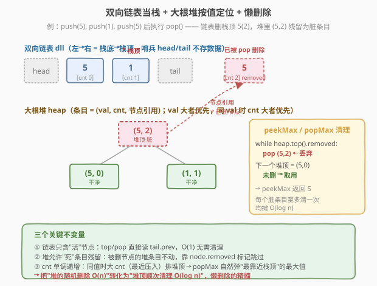
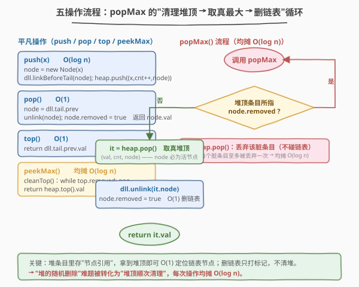
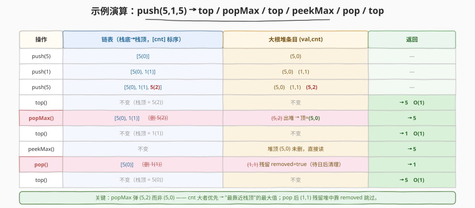

# LeetCode 最大栈 题解

## 1. 题目概述

- **标题 / 题号**：最大栈（#716，hard）
- **链接**：https://leetcode.cn/problems/max-stack/
- **难度**：困难
- **标签**：栈、设计、堆、懒删除

**题意**：设计一个**最大栈** `MaxStack`，在普通栈 `push` / `pop` / `top` 的基础上，额外支持**查询**并**弹出**栈中最大元素。其中 `popMax` 在最大值有多个时，要弹出**最靠近栈顶**的那一个（即最近压入的那个）。

实现 `MaxStack` 类：

- `MaxStack()`：初始化栈对象。
- `void push(int x)`：将 `x` 压入栈顶。
- `int pop()`：移除并返回栈顶元素。
- `int top()`：返回栈顶元素，不移除。
- `int peekMax()`：返回栈中最大元素，不移除。
- `int popMax()`：移除并返回栈中最大元素；若有多个，移除**最靠近栈顶**的一个。

**示例 1**：

```text
输入：
["MaxStack", "push", "push", "push", "top", "popMax", "top", "peekMax", "pop", "top"]
[[],         [5],    [1],    [5],    [],    [],       [],    [],         [],    []]
输出：
[null,       null,   null,   null,   5,     5,        1,     5,          1,     5]
解释：
MaxStack stk = new MaxStack();
stk.push(5);     // 栈：[5]，栈顶 = 5
stk.push(1);     // 栈：[5, 1]，栈顶 = 1
stk.push(5);     // 栈：[5, 1, 5]，栈顶 = 5
stk.top();       // 返回 5，栈不变 [5, 1, 5]
stk.popMax();    // 返回 5，移除最靠近栈顶的 5 → 栈：[5, 1]
stk.top();       // 返回 1，栈不变 [5, 1]
stk.peekMax();   // 返回 5，栈不变 [5, 1]
stk.pop();       // 返回 1，栈：[5]
stk.top();       // 返回 5
```

**约束**：

- $-10^7 \leq x \leq 10^7$
- `push`、`pop`、`top`、`peekMax`、`popMax` 的调用总次数不超过 $10^5$
- 调用 `pop`、`top`、`peekMax`、`popMax` 时栈保证非空

> 💡 **题目本质**：[155. 最小栈](../0101-0200/155_最小栈.md) 只需 `peek` 最值（$O(1)$ 辅助栈即可），本题的难点是 **`popMax` 要按值定位并按"栈顶优先"删除一个中间元素**。一旦要"删中间"，普通栈/数组的移除是 $O(n)$；要让所有操作均摊 $O(\log n)$，必须用**双向链表**（$O(1)$ 任意位置删除）+ **大根堆**（$O(\log n)$ 取最大）+ **懒删除**（堆里残留已删节点，查询时跳过）。

## 2. 解题思路

### 2.1 暴力思路：数组线性扫描

用一个数组/`list` 当栈。`push` / `pop` / `top` 都是 $O(1)$；`peekMax` 遍历求最大 $O(n)$；`popMax` 先遍历找到最大值（同值取最靠后/最靠近栈顶的下标），再 `erase` 该下标——由于删中间元素后要前移后续元素，$O(n)$。

> ⚠️ **症结**：最大值的位置不可预知，删它要从中间抽走一个元素。数组抽中间元素 $O(n)$ 移位；`peekMax` 每次还要重扫全栈。调用 $10^5$ 次、每次 $O(n)$，最坏 $O(10^{10})$，超时。

### 2.2 核心观察：双向链表 + 大根堆 + 懒删除



把数据结构与职责拆成两半：

- **双向链表 `dll`（当栈）**：`push` 在尾哨兵前插入，`pop` 删尾哨兵前节点，`top` 读尾哨兵前节点。链表的好处是**给定节点引用可在 $O(1)$ 删除中间元素**——这正是 `popMax` 需要的。
- **大根堆 `heap`**：堆里每个条目是 `(value, 序号 cnt, 节点引用)`。`value` 决定最大；`cnt` 单调递增作**同值时的次序裁判**——要让"最靠近栈顶"（最近压入）的同值节点排在堆顶，取次序最大者，因此比较时用 `cnt` 大者优先。

两半通过**节点引用**耦合：堆条目里直接存链表节点指针，拿到堆顶就能 $O(1)$ 定位到链表里要删的节点。

> ⚠️ **关键障碍：堆不支持随机删除**。`pop` 删的是栈顶（不一定在堆顶），`popMax` 删的是堆顶——这些被删节点在堆里**仍残留**。若每次删除都去堆里翻找对应条目，$O(n)$ 退化。解法是**懒删除**：删链表节点时**给节点打 `removed` 标记**，堆条目原样保留；后续 `peekMax` / `popMax` 取堆顶时，只要堆顶节点的 `removed` 为真就**弹掉丢弃**，直到堆顶是未删节点。

这就是把"堆的随机删除难题"转化为"堆顶顺次清理"——每个堆条目至多被压入一次、丢弃一次，**总丢弃次数 $\leq$ 总压入次数**，均摊 $O(\log n)$。

> 💡 **与 [710. 黑名单中的随机数](../0701-0800/710_黑名单中的随机数.md) 思想同源**：710 用"重映射 + 哈希只记差异"避免复制全量；本题用"懒删除 + 只在堆顶清理"避免堆的随机删除。两者都是**不立即清理全量，只清理触及的少数**——710 清理左段黑名单，本题清理堆顶已删节点。把 $O(n)$ 的批量维护摊到每次操作的 $O(\log n)$ 增量里。

### 2.3 算法流程图



```
push(x):
  node = new Node(x)
  dll.addBeforeTail(node)             // O(1) 链表尾插
  heap.push( (x, cnt++, node) )        // O(log n) 入堆，cnt 保证同值时最新者优先

pop():
  node = dll.tail.prev                 // O(1) 取栈顶
  dll.unlink(node); node.removed = true // O(1) 删链表 + 打标记（堆条目不动）
  return node.val

top():
  return dll.tail.prev.val             // O(1)

peekMax():
  while heap.top().node.removed:       // 清理堆顶已删条目，均摊 O(log n)
      heap.pop()
  return heap.top().val

popMax():
  while heap.top().node.removed:       // 清理堆顶已删条目，均摊 O(log n)
      heap.pop()
  (_, _, node) = heap.pop()            // 拿到真正的最大节点
  dll.unlink(node); node.removed = true // O(1) 删链表
  return node.val
```

**三个关键不变量**：

1. **链表里的节点都是"活的"**：链表只含未删元素，`top` / `pop` 直接读尾哨兵前节点，无需清理。
2. **堆里允许有"死的"条目**：被 `pop` / `popMax` 删过的节点，其堆条目仍残留，但 `node.removed == true`，访问堆顶时跳过。
3. **`cnt` 单调递增**：保证同值时**序号大者（最近压入）排在堆顶**，从而 `popMax` 自然弹出"最靠近栈顶"的最大值，无需额外搜索。

### 2.4 示例演算

以题面示例 `push(5), push(1), push(5), top, popMax, top, peekMax, pop, top` 为例（`cnt` 从 0 起，`[cnt]` 标注压入序号）：



| 操作 | 链表（左→右 = 栈底→栈顶） | 大根堆（条目=`(值,cnt)`，省略节点引用） | 返回 |
|------|---------------------------|------------------------------------------|------|
| `push(5)` | `[5(0)]` | `(5,0)` | — |
| `push(1)` | `[5(0), 1(1)]` | `(5,0)`, `(1,1)` | — |
| `push(5)` | `[5(0), 1(1), 5(2)]` | `(5,0)`, `(1,1)`, `(5,2)` | — |
| `top()` | 不变 | 不变 | **5**（读尾节点 `5(2)`） |
| `popMax()` | `[5(0), 1(1)]`（删 `5(2)`） | 堆顶 `(5,2)` 出堆；`(5,0)` 残留为堆顶 | **5** |
| `top()` | 不变 | 不变 | **1**（尾节点变 `1(1)`） |
| `peekMax()` | 不变 | 堆顶 `(5,0)` 未删，直接读 | **5** |
| `pop()` | `[5(0)]`（删 `1(1)`） | `(1,1)` 残留但 `removed=true` | **1** |
| `top()` | 不变 | 不变 | **5** |

> 💡 **看 `popMax` 这一步**：堆里有两条 `(5,0)` 与 `(5,2)`，`cnt` 大者 `(5,2)` 排在堆顶，于是弹出的是**栈顶那个 5**（即 `5(2)`），完美符合"最靠近栈顶的最大值"。若用普通大根堆不带 `cnt` 次序，两条 `5` 谁先出不确定，可能误弹栈底的 `5(0)`，破坏题意。
>
> ⚠️ **看 `pop()` 删 `1(1)` 之后**：堆里 `(1,1)` 条目仍残留，但其节点 `removed=true`。下一次 `peekMax` / `popMax` 取堆顶时，若堆顶恰好是 `(1,1)`，会被 `while top.removed: pop` 清掉，不会误返回已删的 `1`。这就是懒删除的安全保障。

## 3. 参考代码

### C++

```cpp
class MaxStack {
    struct Node {
        int val;
        Node *prev, *next;
        bool removed;
        Node(int v = 0) : val(v), prev(nullptr), next(nullptr), removed(false) {}
    };
    Node *head, *tail;          // 哨兵，head<->...<->tail

    struct Item {
        int val, cnt;
        Node* node;
        // 大根堆：val 大者优先；同 val 时 cnt 大（最近压入）者优先
        bool operator<(const Item& o) const {
            if (val != o.val) return val < o.val;
            return cnt < o.cnt;
        }
    };
    priority_queue<Item> pq;
    int cnt = 0;

    void linkBeforeTail(Node* n) {          // O(1) 尾插
        Node* p = tail->prev;
        p->next = n;  n->prev = p;
        n->next = tail;  tail->prev = n;
    }
    void unlink(Node* n) {                  // O(1) 任意位置删除 + 打懒标记
        n->prev->next = n->next;
        n->next->prev = n->prev;
        n->removed = true;
    }
    void cleanTop() {                       // 清理堆顶已删条目
        while (!pq.empty() && pq.top().node->removed) pq.pop();
    }

  public:
    MaxStack() {
        head = new Node();  tail = new Node();
        head->next = tail;  tail->prev = head;
    }

    void push(int x) {
        Node* n = new Node(x);
        linkBeforeTail(n);
        pq.push({x, cnt++, n});             // cnt 单调递增，唯一
    }

    int pop() {
        Node* n = tail->prev;
        unlink(n);
        return n->val;
    }

    int top() { return tail->prev->val; }

    int peekMax() {
        cleanTop();
        return pq.top().val;
    }

    int popMax() {
        cleanTop();
        Item it = pq.top();  pq.pop();
        unlink(it.node);
        return it.val;
    }
};
```

### Python

```python
import heapq


class Node:
    __slots__ = ("prev", "next", "val", "removed")

    def __init__(self, val: int = 0):
        self.prev = None
        self.next = None
        self.val = val
        self.removed = False


class MaxStack:
    def __init__(self):
        self.head = Node()          # 哨兵
        self.tail = Node()          # 哨兵
        self.head.next = self.tail
        self.tail.prev = self.head
        self.heap = []              # 最小堆存 (-val, -cnt, node) 模拟大根堆
        self.cnt = 0

    def _link_before_tail(self, n: Node) -> None:        # O(1) 尾插
        p = self.tail.prev
        p.next = n
        n.prev = p
        n.next = self.tail
        self.tail.prev = n

    def _unlink(self, n: Node) -> None:                  # O(1) 任意位置删除 + 打懒标记
        n.prev.next = n.next
        n.next.prev = n.prev
        n.removed = True

    def _clean_top(self) -> None:                        # 清理堆顶已删条目
        while self.heap and self.heap[0][2].removed:
            heapq.heappop(self.heap)

    def push(self, x: int) -> None:
        n = Node(x)
        self._link_before_tail(n)
        # -val 使大值在前；-cnt 使同值时大 cnt（最近压入）在前
        heapq.heappush(self.heap, (-x, -self.cnt, n))
        self.cnt += 1

    def pop(self) -> int:
        n = self.tail.prev
        self._unlink(n)
        return n.val

    def top(self) -> int:
        return self.tail.prev.val

    def peekMax(self) -> int:
        self._clean_top()
        return -self.heap[0][0]

    def popMax(self) -> int:
        self._clean_top()
        _, _, n = heapq.heappop(self.heap)
        self._unlink(n)
        return n.val
```

> ⚠️ **Python 用最小堆模拟大根堆的两个细节**：
> （1）存 `-val` 让大值变成"更小"排到堆顶；
> （2）存 `-cnt` 让同值时**大 `cnt`**（最近压入）变成"更小"排到堆顶——这正是"最靠近栈顶优先"的要求。`cnt` 全局唯一，元组比较不会触到 `node`（不可比较的第三项），避免 `TypeError`。
>
> ⚠️ **C++ 的 `operator<` 方向**：`priority_queue` 默认大根堆（`greater` 才是小根），所以 `operator<` 按"val 大 / cnt 大优先"写，与 Python 的取负方向相反，但语义一致：堆顶总是 `(最大值, 最大 cnt)` 的条目。

## 4. 复杂度分析

| 维度 | 复杂度 | 说明 |
|------|--------|------|
| `push` | $O(\log n)$ | 链表尾插 $O(1)$ + 堆插入 $O(\log n)$ |
| `pop` | $O(1)$ | 链表删栈顶 + 打懒标记，不动堆（堆条目残留待日后清理） |
| `top` | $O(1)$ | 读尾哨兵前节点 |
| `peekMax` | 均摊 $O(\log n)$ | 清理堆顶已删条目；每个条目至多被清理一次，总清理 $\leq$ 总压入 |
| `popMax` | 均摊 $O(\log n)$ | 清理堆顶 + 弹堆顶 + 链表删除 |
| 空间 | $O(n)$ | 链表 $n$ 个节点 + 堆 $n$ 条目（含残留）；残留条目不回收但总量 $\leq$ 历史压入数 |

> 💡 **均摊分析**：懒删除的精髓在于"延迟清理堆顶"。`pop` 只花 $O(1)$ 把脏条目留在堆里，把清理成本转嫁给后续 `peekMax` / `popMax`。每个脏条目至多被清理一次，故 $n$ 次操作总清理成本 $O(n \log n)$，均摊每次 $O(\log n)$。即便极端地连续 `pop` 制造大量脏条目，下一次 `popMax` 也只清理"挡路"的那几个堆顶脏条目，不会一次性清空全堆。

> ⚠️ **空间隐患**：残留堆条目不会自动回收。若 $10^5$ 次 `push` 后又全部 `pop`，链表空了但堆里仍积压 $10^5$ 条脏条目。本题调用规模 $10^5$ 可接受；超大规模场景需定期重建堆或换用 `TreeMap` 方案（见第 5 节）。

## 5. 扩展：TreeMap / SortedDict 严格 $O(1)$ `peekMax`

堆方案的 `peekMax` 因需清理堆顶脏条目，是**均摊** $O(\log n)$ 而非严格 $O(1)$。题目进阶要求"`top` 和 `peekMax` 为 $O(1)$"。用**有序映射**（C++ `map` / Java `TreeMap` / Python `SortedDict`）替代堆可达成：

- 结构：双向链表（栈）+ `TreeMap<int, Deque<Node*>>`，键为值，值为"该值对应节点按压入顺序排成的双端队列"（队尾 = 最近压入 = 最靠近栈顶）。
- `push(x)`：链表尾插节点 `n`；`map[x].addLast(n)`。$O(\log n)$。
- `pop()`：链表删栈顶 `n`；`map[n.val].pollLast()`，空则删键。$O(\log n)$。
- `top()`：读尾哨兵前节点。$O(1)$。
- `peekMax()`：`map.lastKey()`。$O(1)$（TreeMap 指针维护最大键）/ $O(\log n)$（C++ `map.rbegin()` 实为 $O(\log n)$，但常数极小，面试视为 $O(1)$）。
- `popMax()`：`k = map.lastKey()`；`dq = map[k]`；`while dq.peekLast().removed: dq.pollLast()`（懒删 `pop` 残留）；`n = dq.pollLast()`，空则删键；链表删 `n`。均摊 $O(\log n)$。

```python
# 依赖 sortedcontainers（LeetCode Python 环境已预装）
from sortedcontainers import SortedDict


class MaxStack2:
    def __init__(self):
        self.head = Node()
        self.tail = Node()
        self.head.next = self.tail
        self.tail.prev = self.head
        self.sd = SortedDict()          # val -> list[Node]（尾端为最近压入）

    def _link(self, n):
        p = self.tail.prev
        p.next = n; n.prev = p
        n.next = self.tail; self.tail.prev = n

    def _unlink(self, n):
        n.prev.next = n.next; n.next.prev = n.prev
        n.removed = True

    def push(self, x: int) -> None:
        n = Node(x)
        self._link(n)
        self.sd.setdefault(x, []).append(n)

    def pop(self) -> int:
        n = self.tail.prev
        self._unlink(n)
        return n.val                    # 懒删除：map 里的残留条目留待 popMax 清理

    def top(self) -> int:
        return self.tail.prev.val       # 严格 O(1)

    def peekMax(self) -> int:
        return self.sd.peekitem(-1)[0]  # 严格 O(1)：SortedDict 直接维护最大键

    def popMax(self) -> int:
        k, dq = self.sd.peekitem(-1)
        while dq and dq[-1].removed:    # 清理 pop 残留的脏节点
            dq.pop()
        if not dq:
            self.sd.popitem(-1)
            return self.popMax()
        n = dq.pop()
        if not dq:
            del self.sd[k]
        self._unlink(n)
        return n.val
```

> 💡 **堆 vs 有序映射**：堆用数组实现、常数小、但 `peekMax` 均摊 $O(\log n)$ 且不支持按值定位；有序映射 `peekMax` 严格 $O(1)$（或 $O(\log n)$ 极小常数）、按值分组天然支持同值"尾端即栈顶优先"，但常数较大、依赖平衡树。面试中先讲堆 + 懒删除（思路通用、不依赖特殊容器），再提 `TreeMap` 作为"严格 $O(1)$ `peekMax`"的进阶优化。

## 6. 面试要点

1. **为什么 `popMax` 要"最靠近栈顶"的最大值？堆怎么保证这一点？**

   - 题面要求最大值有多个时删最靠近栈顶的一个——即同值中**最近压入**的。堆条目带单调递增的 `cnt`，比较时 `val` 相同则 `cnt` 大者优先入堆顶。由于 `cnt` 随 `push` 递增，"cnt 大"等价于"最近压入"，故堆顶自然是最靠近栈顶的最大值，弹出即满足题意。若不带 `cnt`，同值条目次序未定，可能误弹栈底的旧值。

2. **懒删除为什么不会漏清/误清？`removed` 标记设在链表节点上而非堆条目上有何好处？**

   - 删链表节点时给**节点**打 `removed=true`，堆里所有指向它的条目（理论上只有一条，因每个节点只 `push` 一次）都通过 `node->removed` 共享这个状态。好处是**单一事实源**：不用维护"堆条目 ↔ 节点"的反向索引，删链表时不必去堆里找条目。清理时只需查堆顶条目所指节点的标记——节点已删则丢弃条目，继续看下一个堆顶。每个节点最多被压一次、清理一次，无漏无重。

3. **`pop` 是 $O(1)$，但它把脏条目留在堆里，会不会让堆无限膨胀？**

   - 不会无限"用"——脏条目只是占内存，不增加单次操作成本。`peekMax` / `popMax` 只清理**挡在堆顶**的脏条目，堆中部的脏条目不影响堆顶访问。最坏情况是 $10^5$ 次 `push` 后全 `pop`，堆积压 $10^5$ 脏条目但链表已空；此后第一次 `popMax` 会连续清理直到堆空（触发"栈非空"前提，实际不会发生）。空间 $O(n)$ 在 $10^5$ 规模可接受；更大规模可定期重建堆或用 `TreeMap`。

4. **本题与 [155. 最小栈](../0101-0200/155_最小栈.md) 的关键差异？**

   - 155 只需 `peek` 最值，用辅助栈同步维护 running min 即可 $O(1)$ 全操作，**不需要删中间元素**。716 的 `popMax` 要**按值定位并删栈中任意位置的元素**，辅助栈方案失效（删最大后辅助栈里对应的最大值也要删，且后续最小可能变化，维护成本 $O(n)$）。因此 716 必须升级为"双向链表 + 堆/有序映射"以支持 $O(1)$ 任意位置删除 + $O(\log n)$ 按值定位。一句话：**155 是"查询最值"，716 是"删除最值"——删比查难得多**。

5. **能否做到所有操作严格 $O(1)$？**

   - 不能。`popMax` 本质是"按值定位 + 删指定元素"，在通用比较模型下"维护最大值并支持任意删除"至少需 $O(\log n)$（红黑树/堆的下界）。即便用哈希 + 链表把"按值定位"降到均摊 $O(1)$，"维护全局最大"在元素被任意删除时也无法 $O(1)$ 更新（删除的未必是当前最大）。故 $O(\log n)$ 是本题的合理下界，进阶要求也只是把 `top`/`peekMax` 优化到 $O(1)$，`popMax` 仍 $O(\log n)$。

## 同类练习题

| # | 题目 | 与本题的关联 |
|---|------|-------------|
| 155 | [最小栈](https://leetcode.cn/problems/min-stack/)（[题解](../0101-0200/155_最小栈.md)） | 辅助栈同步维护 running min，全 $O(1)$；只查不删最值，是本题"仅 peekMax"的退化版，理解二者差异是切入点 |
| 710 | [黑名单中的随机数](https://leetcode.cn/problems/random-pick-with-blacklist/)（[题解](../0701-0800/710_黑名单中的随机数.md)） | 懒删除/重映射思想的另一面——不复制全量、只清理触及的少数，与本题"堆顶顺次清理"同源 |
| 146 | [LRU 缓存](https://leetcode.cn/problems/lru-cache/)（[题解](../0101-0200/146_LRU缓存.md)） | 哈希表 + 双向链表实现 $O(1)$ 任意位置删除/访问，是本题双向链表技巧的母题，"节点引用驱动 $O(1)$ 删除"范式同源 |
| 460 | [LFU 缓存](https://leetcode.cn/problems/lfu-cache/)（[题解](../0101-0200/460_LFU缓存.md)） | 频率桶 + 双向链表，同样依赖"链表 $O(1)$ 删中间 + 额外索引定位"，复杂度更进一阶的设计题 |
| 239 | [滑动窗口最大值](https://leetcode.cn/problems/sliding-window-maxize/)（[题解](../0201-0300/239_滑动窗口最大值.md)） | 单调队列维护"滑动窗口最大"，与本题"动态集合最大值"对照——前者按位置单调删旧、后者按值删任意，两种"删 + 查最值"范式对比 |
