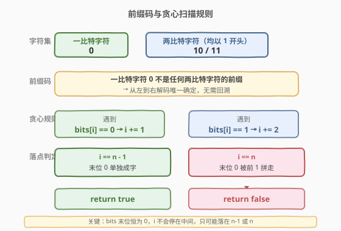
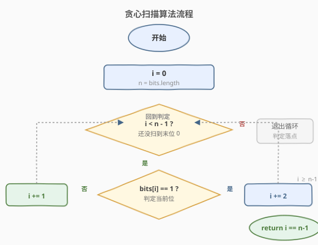

# 1比特与2比特字符

- **题目名称**：1比特与2比特字符
- **链接**：[717. 1 比特与 2 比特字符](https://leetcode.cn/problems/1-bit-and-2-bit-characters/)
- **难度**：简单
- **标签**：数组、贪心、模拟

## 1. 题目概述

有两种特殊字符。第一种字符可以用**一比特** `0` 来表示。第二种字符可以用**两比特**（`10` 或 `11`）来表示。

给定一个**以 `0` 结尾**的二进制数组 `bits`，如果最后一个字符**必须**是一比特字符，就返回 `true`；否则返回 `false`。

> 💡 「必须」二字是关键：题目保证从左到右的解码方式是**唯一**的（见 2.2 的前缀码论证），所以只需判断这种唯一解码下，最后一个 `0` 是单独成字还是被前面的 `1` 「吃掉」组成 `10`。

**示例 1**：

```text
输入：bits = [1,0,0]
输出：true
解释：唯一的解码方式是 两比特字符 [1,0] + 一比特字符 [0]。
     最后一个字符是一比特字符，返回 true。
```

**示例 2**：

```text
输入：bits = [1,1,1,0]
输出：false
解释：唯一的解码方式是 两比特字符 [1,1] + 两比特字符 [1,0]。
     最后一个字符是两比特字符，返回 false。
```

**约束条件**：

- $1 \le \text{bits.length} \le 1000$
- `bits[i]` 为 `0` 或 `1`
- `bits` 一定以 `0` 结尾

---

## 2. 解题思路

### 2.1 暴力思路

枚举每一段切分方式，尝试所有可能的「一比特 / 两比特」组合，看末尾 `0` 是否单独成字。共有指数级种解码方案，`n = 1000` 时完全不可行。

事实上，本题的解码方案**唯一**，根本不需要枚举——见下文。

### 2.2 核心观察：前缀码 + 正向贪心扫描



关键事实是这套编码是一个**前缀码**（prefix code）：

- **一比特字符**只有 `0`；
- **两比特字符**以 `1` 开头（`10` 或 `11`）。

因此**没有任何一比特字符是某个两比特字符的前缀**——遇到 `1` 必然开启一个两比特字符，遇到 `0` 必然是一个一比特字符。从左到右扫描，每一步的解码选择**唯一确定**，没有任何回溯或分支。

由此得到最直接的贪心规则：

| 当前位 `bits[i]` | 解码动作 | 下一步 `i` 的增量 |
|-----------------|----------|-------------------|
| `1` | 必为两比特字符的起始（`10` 或 `11`） | `i += 2` |
| `0` | 必为一比特字符 | `i += 1` |

扫描结束后，指针 `i` 的落点决定答案：

- 若 `i == n - 1`：最后一个 `0` **单独**被识别为一比特字符 → 返回 `true`；
- 若 `i == n`：最后一个 `0` 被**倒数第二位 `1` 拼走**组成 `10`，指针越过末尾 → 返回 `false`。

> 💡 由于 `bits` 恒以 `0` 结尾，`i` 不会落到 `n - 2` 等中间位置——贪心扫描要么停在最后一个 `0` 上（`i == n - 1`），要么越过它（`i == n`），二者必居其一。

### 2.3 算法流程图



流程只有一个 `while` 循环，`i` 每轮至少 `+1`，至多 `+2`，所以循环体执行不超过 $n$ 次，整体复杂度 $O(n)$。

### 2.4 示例演算

![示例演算：[1,0,0] 与 [1,1,1,0]](../images/onebit_twobit_example_walkthrough.svg)

以两个示例逐步推演：

**示例 1 `bits = [1,0,0]`（n=3）**：

| 步 | `i` | `bits[i]` | 动作 | 解码片段 |
|----|------|-----------|------|----------|
| 1  | 0    | `1`       | 两比特，`i += 2` | `[1,0]` |
| 2  | 2    | `0`       | 一比特，`i += 1` | `[0]` |
| 结束 | `i == 3 == n`？— 否，`i == 2 == n - 1` | | | 返回 **true** |

> 注意：步骤 1 把 `bits[0..1] = [1,0]` 当作两比特字符吃掉，剩下 `bits[2] = 0` 单独成字。`i` 最终停在 `n - 1 = 2`，判定为一比特字符。

**示例 2 `bits = [1,1,1,0]`（n=4）**：

| 步 | `i` | `bits[i]` | 动作 | 解码片段 |
|----|------|-----------|------|----------|
| 1  | 0    | `1`       | 两比特，`i += 2` | `[1,1]` |
| 2  | 2    | `1`       | 两比特，`i += 2` | `[1,0]` |
| 结束 | `i == 4 == n` | | | 返回 **false** |

> 步骤 2 把末尾的 `[1,0]` 当作两比特字符整体吃掉，指针越过末尾 `i == n`，说明最后的 `0` 没有单独成字。

---

## 3. 参考代码

### C++（正向贪心扫描）

```cpp
class Solution {
  public:
    bool isOneBitCharacter(vector<int>& bits) {
        int n = bits.size();
        int i = 0;
        while (i < n - 1) {          // 只扫描到 n-2，留下末尾的 0 单独判定
            if (bits[i] == 1) {
                i += 2;              // 1 开头必为两比特字符
            } else {
                i += 1;              // 0 必为一比特字符
            }
        }
        return i == n - 1;           // 落在末位 0 上即为 true
    }
};
```

### Python（正向贪心扫描）

```python
class Solution:
    def isOneBitCharacter(self, bits: List[int]) -> bool:
        n = len(bits)
        i = 0
        while i < n - 1:
            i += 2 if bits[i] == 1 else 1
        return i == n - 1
```

> ⚠️ **易错点**：循环条件是 `i < n - 1` 而非 `i < n`。因为我们要刻意**停在末尾 `0` 之前**，由 `i == n - 1` 判定它是否被孤立。若写成 `i < n`，当 `i` 落在 `n - 1`（末位 `0`）时循环还会再执行一次 `i += 1`，导致 `i == n`，永远返回 `false`，与正确答案相悖。

---

## 4. 复杂度分析

| 维度 | 复杂度 | 说明 |
|------|--------|------|
| 时间复杂度 | $O(n)$ | `i` 每轮至少 `+1`，至多 `+2`，循环体执行不超过 $n$ 次 |
| 空间复杂度 | $O(1)$ | 仅用常数个变量 `i`、`n` |

---

## 5. 扩展：反向奇偶性判定 $O(n)$ / $O(1)$ 的更优写法

正向扫描需要 `while` 循环，但还有更精炼的「**末段连续 1 的奇偶性**」观察。

考虑 `bits` 末尾的 `0`，往前数**连续的 `1`**（即紧贴末位 `0` 之前的 `1` 串长度）记为 $k$：

- 这些连续的 `1` 互相配对成 `11`、`11`……
- 若 $k$ 为**偶数**：所有 `1` 两两配对成两比特字符 `11`，**末位 `0` 没人拼**，单独成一比特字符 → 返回 `true`；
- 若 $k$ 为**奇数**：配对后多出一个 `1`，它必须向后拉走末位 `0` 组成 `10` → 末位 `0` 被吃 → 返回 `false`。

> 💡 为什么只看「末段连续 1」就够？因为再往前的 `0` 已经把更早的 `1` 隔断成独立的「段」——前段中所有 `1` 都已被各自段尾的 `0` 配对消化（形成 `10` 或停在 `0` 上），**不会跨过那个 `0` 来抢末位的 `0`**。能抢末位 `0` 的，只有紧贴它的那串连续 `1` 中的最末一个。

**参考代码（Python）**：

```python
class Solution:
    def isOneBitCharacter(self, bits: List[int]) -> bool:
        n = len(bits)
        k = 0
        i = n - 2                      # 从倒数第二位开始往前数 1
        while i >= 0 and bits[i] == 1:
            k += 1
            i -= 1
        return k % 2 == 0              # 偶数个 1 → 末位 0 单独成字
```

两种方法复杂度都是 $O(n)$ / $O(1)$，正向扫描更直观、易讲清「前缀码唯一解码」的本质；反向奇偶性更短小、面试中可作为「有没有更巧的写法」的加分项。

---

## 6. 面试要点

1. **为什么本题的解码方案是唯一的？**

   - 因为这套编码是**前缀码**：一比特字符只有 `0`，两比特字符都以 `1` 开头。没有一比特字符是两比特字符的前缀，所以从左到右扫描时每一步选择唯一：遇 `1` 必开两比特、遇 `0` 必为一比特。无需回溯，无歧义。

2. **为什么循环条件写 `i < n - 1` 而不是 `i < n`？**

   - 我们要让指针**停在末位 `0` 之前**，由 `i == n - 1` 判定末位 `0` 是否被孤立。若用 `i < n`，当 `i` 落在末位 `0` 上时循环还会执行一次 `i += 1`，导致 `i == n`，把「单字符」误判为「被吃」。

3. **反向奇偶性判定为什么只看末段连续 1？**

   - 末位 `0` 之前的 `0` 把数组切成若干「1 串 + 0」的段。前段中的 `1` 已被各自段尾的 `0` 消化，不会跨段抢末位 `0`。只有紧贴末位 `0` 的那串连续 `1` 中的最末一个，才有机会把末位 `0` 拉走组成 `10`，所以只数这串 `1` 的奇偶性即可。

4. **如果 `bits` 不以 `0` 结尾会怎样？**

   - 题目保证末位是 `0`，是为了让答案有定义（末位为 `1` 时它必属于某个两比特字符 `[?,1]`，无法谈论「是否单独成字」）。若去掉该约束，需要重新定义题意，例如改成「最后一个字符是否为一比特字符」——但此时 `1` 结尾的输入答案恒为 `false`，可直接特判。

5. **这道题和哈夫曼编码 / 前缀码有什么关系？**

   - 同源。前缀码（如哈夫曼编码）的核心性质就是「无前缀关系 → 唯一可解码」。本题的 `0` / `10` / `11` 是一种最简单的前缀码，正向贪心扫描正是前缀码译码器的标准做法。理解本题后可顺势学习哈夫曼树构造与译码。

---

## 7. 同类练习题

- [89. 格雷编码](https://leetcode.cn/problems/gray-code/)（[题解](../0001-0100/89_格雷编码.md)）：二进制编码构造题，镜像反射公式 $G(i) = i \oplus (i \gg 1)$
- [168. Excel 表列名称](https://leetcode.cn/problems/excel-sheet-column-title/)（[题解](../0101-0200/168_Excel表列名称.md)）：1-indexed 进制转换译码，先减 1 再取余
- [171. Excel 表列序号](https://leetcode.cn/problems/excel-sheet-column-number/)（[题解](../0101-0200/171_Excel表列序号.md)）：上题的合成方向，Horner 累乘加
- [191. 位 1 的个数](https://leetcode.cn/problems/number-of-1-bits/)（[题解](../0101-0200/191_位1的个数.md)）：位运算家族，`n & (n-1)` 消最低位 1
- [400. 第 N 位数字](https://leetcode.cn/problems/nth-digit/)（[题解](../0301-0400/400_第N位数字.md)）：按位数分层定位的译码题，逐层减去锁定层数
