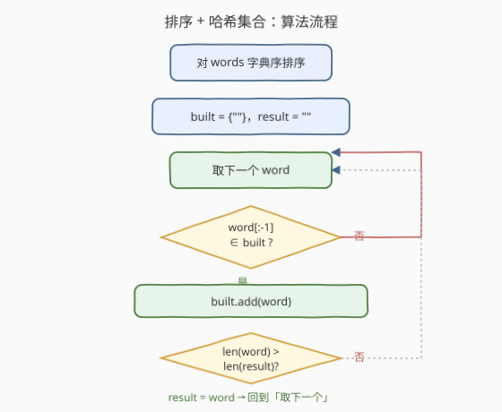
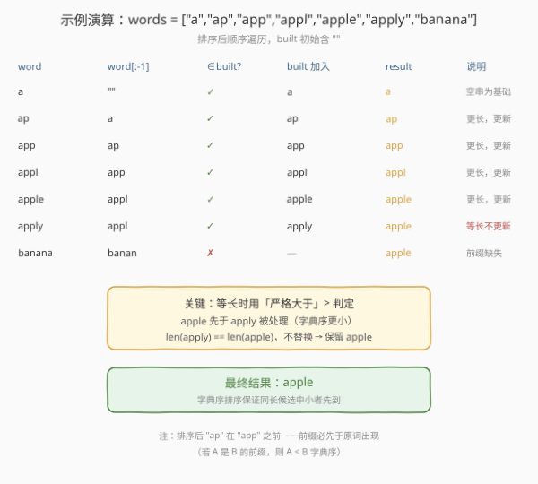
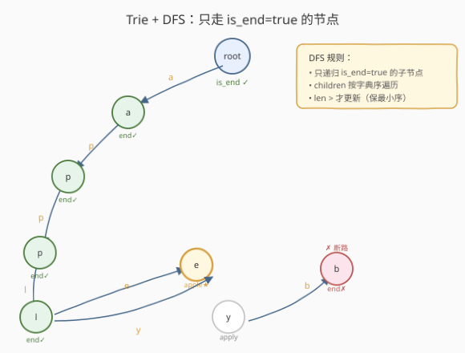

# LeetCode 词典中最长的单词 题解

## 1. 题目概述

- **标题 / 题号**：词典中最长的单词（#720，medium）
- **链接**：https://leetcode.cn/problems/longest-word-in-dictionary/
- **难度**：中等
- **标签**：字典树、数组、哈希表、排序、深度优先搜索

**题意**：给出一个字符串数组 `words` 作为英文词典，返回**最长**的单词——该单词能由词典中其他单词**每次加一个字符**逐步构建出来。若存在多个等长候选，返回**字典序最小**的那个；若无解，返回空字符串 `""`。

**示例 1**：

```text
输入：words = ["w","wo","wor","worl","world"]
输出："world"
解释：从 "w" 开始，依次加一个字符得到 "wo" → "wor" → "worl" → "world"，每一步的前缀都在词典中。
```

**示例 2**：

```text
输入：words = ["a","banana","app","appl","ap","apply","apple"]
输出："apple"
解释："apple" 和 "apply" 都能由词典中的单词逐步构建（a → ap → app → appl → apple/apply），二者等长，"apple" 字典序更小。
```

**约束**：

- $1 \le \text{words.length} \le 1000$
- $1 \le \text{words}[i].\text{length} \le 30$
- `words[i]` 仅由小写英文字母组成

## 2. 解题思路

### 2.1 暴力思路

对每个单词 `word`，检查它的**所有前缀** `word[:1], word[:2], …, word[:len-1]` 是否都在词典中。若全部存在，则 `word` 是合法候选。最后在所有合法候选中取最长（等长取字典序最小）者。

每次检查需 $O(L)$ 次前缀查询（$L$ 为单词长度），若用列表做线性查找则每次 $O(N)$，整体 $O(N^2 \cdot L)$；若用哈希集合则每次 $O(L)$（取子串 + 哈希），整体 $O(N \cdot L^2)$，可接受但不够优雅。

> 💡 **关键观察**：合法单词的前缀也一定合法——这天然构成一条「从空串出发的构建链」。如果能**按构建链的顺序**处理单词，就不必对每个单词重新验证全部前缀，只需验证「去掉最后一个字符后的前缀是否已构建」即可。

### 2.2 核心观察：排序 + 哈希集合


两条关键性质让本题可以极度简化：

1. **前缀必先于原词出现**：若字符串 $A$ 是 $B$ 的前缀，则 $A$ 的字典序严格小于 $B$（比较到 $A$ 的末尾时 $B$ 还有剩余字符）。因此**按字典序排序后**，任何单词的前缀（若存在于词典）一定排在它之前。

2. **传递性**：若 `word[:-1]` 已被标记为「可构建」，则 `word` 本身也可构建——因为 `word[:-1]` 可构建意味着它的所有前缀都在词典中，再加上 `word[:-1]` 自身也在词典中（它已被处理说明它在 `words` 里），`word` 的全部前缀就齐了。

于是只需**一次遍历**：维护一个 `built` 集合（初始含空串 `""`），对排序后的每个 `word` 检查 `word[:-1] ∈ built`，命中则把 `word` 加入 `built` 并更新答案。

> 💡 **等长取字典序最小**：排序已保证同长度单词按字典序排列，所以**首次**遇到某长度的合法单词时即为最小者。更新条件用**严格大于** `len(word) > len(result)`，等长不替换，自然保留先到（更小）的那个。

### 2.3 算法流程图



核心循环只有三步：取词 → 查前缀是否在 `built` → 命中则加入并可能更新 `result`。注意 `built` 初始含 `""`，这是长度为 1 的单词（如 `"a"`）能被接受的基础——`"a"[:-1] == ""` 必然命中。

### 2.4 示例演算



以 `words = ["a","banana","app","appl","ap","apply","apple"]` 为例。字典序排序后为 `["a","ap","app","appl","apple","apply","banana"]`：

- `"a"`：前缀 `""` ∈ built ✓ → 加入 `"a"`，`result = "a"`
- `"ap"`：前缀 `"a"` ∈ built ✓ → 加入 `"ap"`，`result = "ap"`（更长）
- `"app"`：前缀 `"ap"` ∈ built ✓ → 加入，`result = "app"`
- `"appl"`：前缀 `"app"` ∈ built ✓ → 加入，`result = "appl"`
- `"apple"`：前缀 `"appl"` ∈ built ✓ → 加入，`result = "apple"`
- `"apply"`：前缀 `"appl"` ∈ built ✓ → 加入，但 `len("apply") == len("apple")`，不严格大于，`result` 保持 `"apple"`
- `"banana"`：前缀 `"banan"` ∉ built ✗ → 跳过

最终返回 `"apple"`。

> ⚠️ **为什么 `"apply"` 不会覆盖 `"apple"`？** 排序保证 `"apple"` 在 `"apply"` 之前处理（`e < y`），而更新用严格 `>`，等长不替换。这是「排序 + 严格大于」配合解决等长取字典序最小的标准技巧。

## 3. 参考代码

### 方法一：排序 + 哈希集合（推荐）

### C++

```cpp
class Solution {
  public:
    string longestWord(vector<string>& words) {
        sort(words.begin(), words.end());
        unordered_set<string> built;
        built.insert("");
        string result;
        for (const string& word : words) {
            if (built.count(word.substr(0, word.size() - 1))) {
                built.insert(word);
                if (word.size() > result.size()) {
                    result = word;
                }
            }
        }
        return result;
    }
};
```

### Python

```python
class Solution:
    def longestWord(self, words: List[str]) -> str:
        words.sort()
        built = {""}
        result = ""
        for word in words:
            if word[:-1] in built:
                built.add(word)
                if len(word) > len(result):
                    result = word
        return result
```

> ⚠️ **三个易错点**：
> 1. **`built` 必须初始化含 `""`**：长度为 1 的单词前缀为空串，若 `built` 不含 `""` 则所有单字符单词都被误判为非法。
> 2. **更新条件用严格 `>`**：等长不替换才能保留字典序更小者（排序已让小者先到）。若误用 `>=` 会把后到的同长更大者覆盖上去，违反题意。
> 3. **排序是字典序排序，不是按长度排序**：字典序排序天然保证「前缀先于原词」（前缀更短的字符串字典序更小），同时保证同长度单词的相对顺序为字典序。若按长度排序则丢失同长度的字典序信息，需额外处理。

## 4. 复杂度分析

| 维度 | 复杂度 | 说明 |
|------|--------|------|
| 时间复杂度 | $O(N \log N \cdot L + N \cdot L)$ | 排序比较每次 $O(L)$ 共 $O(N \log N)$ 次 + 遍历中每词取前缀/哈希 $O(L)$ |
| 空间复杂度 | $O(N \cdot L)$ | `built` 集合存储所有可构建单词，最坏全部 $N$ 个单词每个长 $L$ |

其中 $N \le 1000$、$L \le 30$，总运算量约 $10^3 \times 30 \approx 3 \times 10^4$，远在时限内。

> 💡 本题数据规模小，排序 + 哈希集合已足够高效。即便 $N = 10^5$、$L = 100$，$O(N \cdot L)$ 的遍历也仅 $10^7$，仍可接受。

## 5. 扩展：Trie + DFS



另一种经典解法是**字典树（Trie）+ 深度优先搜索**：

1. 将所有单词插入 Trie，每个单词末字符节点标记 `is_end = true`。
2. 从根节点 DFS，**只递归进入 `is_end = true` 的子节点**——这保证路径上每一步都是一个完整单词，即「逐字符构建且每步前缀都在词典」。
3. `children` 按字符字典序遍历，配合 `len >` 严格更新，保证等长取字典序最小。

### C++（Trie 版）

```cpp
struct TrieNode {
    TrieNode* children[26] = {nullptr};
    bool is_end = false;
};

class Solution {
  public:
    string longestWord(vector<string>& words) {
        TrieNode* root = new TrieNode();
        root->is_end = true;            // 空串视为已构建
        for (const string& w : words) {
            TrieNode* cur = root;
            for (char c : w) {
                int idx = c - 'a';
                if (!cur->children[idx]) cur->children[idx] = new TrieNode();
                cur = cur->children[idx];
            }
            cur->is_end = true;
        }
        string result;
        dfs(root, "", result);
        return result;
    }

  private:
    void dfs(TrieNode* node, string path, string& result) {
        if (!node->is_end) return;      // 当前路径不是完整单词，断路
        if (path.size() > result.size()) result = path;
        for (int i = 0; i < 26; ++i) {  // 字典序遍历
            if (node->children[i]) {
                path.push_back('a' + i);
                dfs(node->children[i], path, result);
                path.pop_back();
            }
        }
    }
};
```

### Python（Trie 版）

```python
class TrieNode:
    def __init__(self):
        self.children = {}
        self.is_end = False

class Solution:
    def longestWord(self, words: List[str]) -> str:
        root = TrieNode()
        root.is_end = True
        for w in words:
            cur = root
            for c in w:
                if c not in cur.children:
                    cur.children[c] = TrieNode()
                cur = cur.children[c]
            cur.is_end = True

        result = ""
        def dfs(node, path):
            nonlocal result
            if not node.is_end:
                return
            if len(path) > len(result):
                result = path
            for c in sorted(node.children):
                dfs(node.children[c], path + c)

        dfs(root, "")
        return result
```

**两种方法对比**：

| 维度 | 排序 + 哈希集合 | Trie + DFS |
|------|----------------|------------|
| 时间 | $O(N \log N \cdot L + N \cdot L)$ | $O(N \cdot L)$（无排序） |
| 空间 | $O(N \cdot L)$（哈希集合） | $O(N \cdot L)$（Trie 节点） |
| 实现复杂度 | 低，几行核心代码 | 中，需实现 Trie + DFS |
| 面试推荐度 | 首选，简洁直观 | 进阶，展示 Trie 能力 |

> 💡 **面试策略**：先讲排序 + 哈希集合的解法（快且简洁），再主动提「也可用 Trie + DFS，避免排序」作为优化延伸。两种解法体现了同一核心思想——**沿构建链传递可构建性**，只是数据结构不同。

## 6. 面试要点

1. **为什么字典序排序能保证前缀先于原词处理？**

   - 若字符串 $A$ 是 $B$ 的前缀，则 $|A| < |B|$ 且前 $|A|$ 个字符相同。字典序比较到 $A$ 的末尾时 $B$ 还有剩余字符，因此 $A < B$。排序后 $A$ 必排在 $B$ 之前，保证处理 $B$ 时 $A$ 已在 `built` 中。

2. **等长候选为什么不用额外比较字典序？**

   - 排序已让同长度单词按字典序排列。用**严格大于** `len(word) > len(result)` 更新，等长不替换，第一个到达某长度的合法单词（即字典序最小者）被保留。若误用 `>=`，后到的同长更大者会覆盖，违反题意。

3. **`built` 为什么要初始化含空串 `""`？**

   - 单字符单词（如 `"a"`）的前缀是空串。若 `built` 不含 `""`，`"a"[:-1] == ""` 查不到，所有单字符单词都被判非法，整条构建链断裂。空串是「逐字符构建」的起点，逻辑上等价于「长度为 0 的单词天然可构建」。

4. **Trie + DFS 中 `is_end` 起什么作用？为什么只走 `is_end` 节点？**

   - `is_end` 标记「从根到当前节点的路径构成一个完整单词」。DFS 只递归 `is_end = true` 的子节点，保证路径上每一步都是一个词典中的完整单词——这正是「每次加一个字符且前缀在词典」的定义。遇到 `is_end = false` 的节点立即断路（如 `"banana"` 的 `"b"` 未标记），高效剪枝。

5. **如果题目改为「允许跳过中间前缀」（不要求逐步构建），解法会怎样变？**

   - 不再需要「构建链」传递性，退化为纯粹的「最长单词」，直接取 `max(words, key=lambda w: (len(w), [-ord(c) for c in w]))` 即可。本题的排序/ Trie 解法利用的是「逐步构建」约束带来的传递结构，约束一旦放松，哈希集合/Trie 的验证就无意义了。

## 同类练习题

| # | 题目 | 与本题的关联 |
|---|------|-------------|
| 208 | [实现 Trie（前缀树）](https://leetcode.cn/problems/implement-trie-prefix-tree/) | Trie 的基础模板，先掌握插入/查找/前缀搜索再回看本题 Trie 解法 |
| 648 | [单词替换](https://leetcode.cn/problems/replace-words/) | Trie 找最短前缀根词，与本题同为「Trie + is_end 标记」的词典型应用 |
| 692 | [前 K 个高频单词](https://leetcode.cn/problems/top-k-frequent-words/) | 同涉及「字典序排序 + 自定义比较」技巧，对照等长取最小序的处理方式 |
| 14 | [最长公共前缀](https://leetcode.cn/problems/longest-common-prefix/) | 前缀的基本操作，理解「前缀」概念可回看此题 |
| 212 | [单词搜索 II](https://leetcode.cn/problems/word-search-ii/) | Trie + DFS 回溯的进阶综合题，本题 Trie DFS 是其简化版 |
