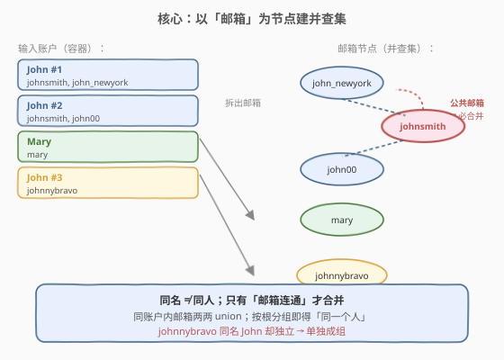
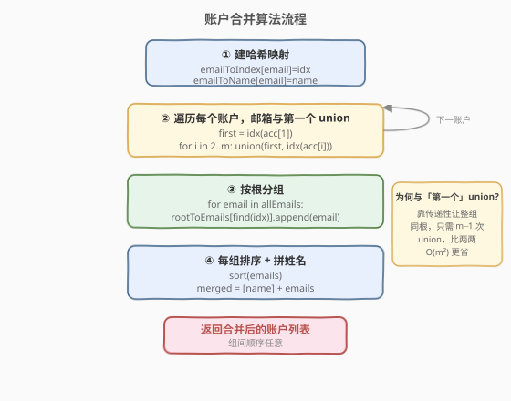
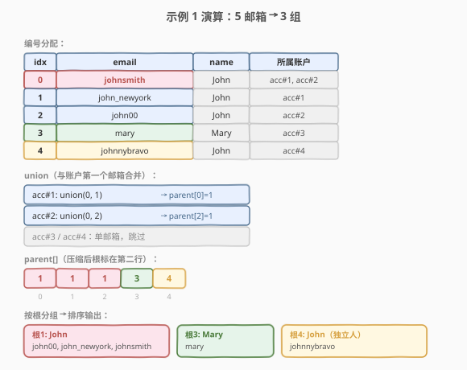

# LeetCode 账户合并 题解

## 1. 题目概述

- **标题 / 题号**：账户合并（#721，medium）
- **链接**：https://leetcode.cn/problems/accounts-merge/
- **难度**：中等
- **标签**：并查集、深度优先搜索、哈希表

**题意**：给定一个列表 `accounts`，其中每个元素 `accounts[i]` 是一个字符串列表，**第一个元素** `accounts[i][0]` 是**姓名**，其余元素是该账户下的**邮箱地址**。

现在需要合并这些账户。合并规则：

- **两个账户只要存在公共邮箱，就一定属于同一个人**，需要合并为一个账户（邮箱取并集）。
- 即使两个账户**姓名相同**也**未必是同一个人**（同名不同人），只有邮箱重叠才合并。
- 同一个人的所有账户姓名必然相同。

合并后，返回账户列表：每个账户的第一个元素是姓名，其余元素是该账户的邮箱**按字典序升序排列**。账户之间的顺序可以任意。

**示例 1**：

```text
输入：accounts = [
  ["John","johnsmith@mail.com","john_newyork@mail.com"],
  ["John","johnsmith@mail.com","john00@mail.com"],
  ["Mary","mary@mail.com"],
  ["John","johnnybravo@mail.com"]
]
输出：[
  ["John","john00@mail.com","john_newyork@mail.com","johnsmith@mail.com"],
  ["Mary","mary@mail.com"],
  ["John","johnnybravo@mail.com"]
]
解释：第 1、2 个账户共享 johnsmith@mail.com，属于同一人，合并；
第 3 个 Mary 独立；第 4 个 John 虽同名但无公共邮箱，是另一个人。
```

**示例 2**：

```text
输入：accounts = [["Gabe","Gabe0@m.co","Gabe3@m.co","Gabe1@m.co"],["Kevin","Kevin3@m.co","Kevin5@m.co","Kevin0@m.co"],["Ethan","Ethan0@m.co","Ethan3@m.co","Ethan1@m.co"]]
输出：解释同示例 1——三个账户互无公共邮箱，各自独立返回，邮箱内部排序即可。
```

**约束**：

- `1 <= accounts.length <= 1000`
- `2 <= accounts[i].length <= 10`
- `1 <= accounts[i][j].length <= 30`
- `accounts[i][0]` 仅由英文字母组成
- `accounts[i][j]`（`j > 0`）是合法邮箱

## 2. 解题思路

### 2.1 暴力思路

把每个账户看成一个邮箱集合，反复扫描：只要发现两个集合有公共邮箱就合并，直到没有可合并的集合为止。最坏情况下每轮只合并一对，共 $O(k)$ 轮（$k$ 为账户数），每轮比较所有账户对 $O(k^2 \cdot m)$（$m$ 为单账户邮箱数），总复杂度高达 $O(k^3 m)$，且写起来啰嗦。**关键问题在于「集合合并」天然契合并查集**——下面直接套模板。

### 2.2 核心观察：以邮箱为节点建并查集



本题最易踩的坑是**误把「账户」当节点**。正确做法是把**邮箱**作为并查集节点：

> 同名不一定是同一个人，**只有邮箱才能唯一标识一个人**。因此「同一个人」=「同一组连通的邮箱」。

具体地：

1. 用哈希表 `emailToIndex` 给每个**首次出现**的邮箱分配一个整数编号（`0, 1, 2, ...`），并查集就建在这些编号上。
2. 另用 `emailToName` 记录每个邮箱对应的姓名（同一邮箱在输入中姓名必然一致）。
3. **对每个账户**，把其下所有邮箱两两（或都与第一个邮箱）`union` 起来——因为同一账户的邮箱必然属于同一个人。
4. 合并完成后，按**根**分组：所有 `find(e) == root` 的邮箱归到 `root` 这一组。
5. 每组邮箱排序，前面拼上该组任一邮箱的姓名，即得一个合并后的账户。

> 💡 关键直觉：账户本身不是节点，**邮箱才是**。账户只是「一次性给出若干邮箱必然同属一人」的约束——等价于对这些邮箱做一次批量 `union`。这样同名不同人、不同名同人（理论上不会出现，但即便出现）都能被邮箱连通性正确处理。
>
> ⚠️ 注意「都与第一个邮箱 union」比「相邻两两 union」更简洁且等价：只要第一个邮箱把整串串起来，传递性自然让所有邮箱同根。

### 2.3 算法流程图



### 2.4 示例演算



以示例 1 为例（5 个邮箱分配编号 `0..4`）：

| 编号 | 邮箱 | 姓名 | 所属账户 |
|------|------|------|----------|
| 0 | johnsmith@mail.com | John | 1, 2 |
| 1 | john_newyork@mail.com | John | 1 |
| 2 | john00@mail.com | John | 2 |
| 3 | mary@mail.com | Mary | 3 |
| 4 | johnnybravo@mail.com | John | 4 |

`union` 过程（每个账户内所有邮箱都与第一个邮箱合并）：

- 账户 1（John）：`union(1, 0)` → `parent[0]=1`（假设按秩让 0 挂到 1 下，或反之，不影响连通性）。
- 账户 2（John）：`union(0, 2)` → `find(0)=1` 与 `find(2)=2` 不同 → `parent[2]=1`。
- 账户 3（Mary）：仅一个邮箱，无 `union`。
- 账户 4（John）：仅一个邮箱，无 `union`。

最终按根分组（路径压缩后根为 `1`、`3`、`4`）：

- 根 `1`：{`johnsmith`, `john_newyork`, `john00`} → 姓名 John，排序后输出。
- 根 `3`：{`mary`} → Mary。
- 根 `4`：{`johnnybravo`} → John（同名但独立的人）。

## 3. 参考代码

### C++（并查集 + 哈希映射 + 路径压缩/按秩合并）

```cpp
class UnionFind {
  public:
    vector<int> parent;
    vector<int> rank_;

    UnionFind(int n) {
        parent.resize(n);
        rank_.assign(n, 0);
        for (int i = 0; i < n; i++) parent[i] = i;
    }

    int find(int x) {
        if (parent[x] != x) parent[x] = find(parent[x]);   // 路径压缩
        return parent[x];
    }

    void unite(int x, int y) {
        int rx = find(x), ry = find(y);
        if (rx == ry) return;
        if (rank_[rx] < rank_[ry]) parent[rx] = ry;        // 按秩合并
        else if (rank_[rx] > rank_[ry]) parent[ry] = rx;
        else { parent[ry] = rx; rank_[rx]++; }
    }
};

class Solution {
  public:
    vector<vector<string>> accountsMerge(vector<vector<string>>& accounts) {
        unordered_map<string, int> emailToIndex;
        unordered_map<string, string> emailToName;
        int idx = 0;
        // 1. 给每个邮箱分配编号并记录姓名
        for (auto& acc : accounts) {
            string& name = acc[0];
            for (int i = 1; i < (int)acc.size(); i++) {
                if (!emailToIndex.count(acc[i])) {
                    emailToIndex[acc[i]] = idx++;
                    emailToName[acc[i]] = name;
                }
            }
        }
        // 2. 同一账户内的邮箱两两（都与第一个）合并
        UnionFind uf(idx);
        for (auto& acc : accounts) {
            int first = emailToIndex[acc[1]];
            for (int i = 2; i < (int)acc.size(); i++) {
                uf.unite(first, emailToIndex[acc[i]]);
            }
        }
        // 3. 按根分组
        unordered_map<int, vector<string>> rootToEmails;
        for (auto& [email, id] : emailToIndex) {
            rootToEmails[uf.find(id)].push_back(email);
        }
        // 4. 每组排序 + 拼姓名
        vector<vector<string>> ans;
        for (auto& [root, emails] : rootToEmails) {
            sort(emails.begin(), emails.end());
            vector<string> merged(1, emailToName[emails[0]]);
            merged.insert(merged.end(), emails.begin(), emails.end());
            ans.push_back(move(merged));
        }
        return ans;
    }
};
```

### Python（并查集 + 哈希映射）

```python
class Solution:
    def accountsMerge(self, accounts: List[List[str]]) -> List[List[str]]:
        email_to_index: Dict[str, int] = {}
        email_to_name: Dict[str, str] = {}
        parent: List[int] = []
        rank_ : List[int] = []

        def make(email: str, name: str) -> int:
            if email not in email_to_index:
                email_to_index[email] = len(parent)
                email_to_name[email] = name
                parent.append(len(parent))
                rank_.append(0)
            return email_to_index[email]

        def find(x: int) -> int:
            while parent[x] != x:
                parent[x] = parent[parent[x]]          # 隔代压缩
                x = parent[x]
            return x

        def union(x: int, y: int) -> None:
            rx, ry = find(x), find(y)
            if rx == ry:
                return
            if rank_[rx] < rank_[ry]:
                parent[rx] = ry
            elif rank_[rx] > rank_[ry]:
                parent[ry] = rx
            else:
                parent[ry] = rx
                rank_[rx] += 1

        # 1 + 2. 分配编号 + 同账户内邮箱都与第一个合并
        for acc in accounts:
            name = acc[0]
            first = make(acc[1], name)
            for i in range(2, len(acc)):
                union(first, make(acc[i], name))

        # 3. 按根分组
        root_to_emails: Dict[int, List[str]] = {}
        for email, idx in email_to_index.items():
            root_to_emails.setdefault(find(idx), []).append(email)

        # 4. 每组排序 + 拼姓名
        ans = []
        for emails in root_to_emails.values():
            emails.sort()
            ans.append([email_to_name[emails[0]]] + emails)
        return ans
```

## 4. 复杂度分析

| 维度 | 复杂度 | 说明 |
|------|--------|------|
| 时间复杂度 | $O(\sum L \cdot \alpha(\sum L) + \sum L \log L_{\max})$ | 建并查集与合并共 $O(\sum L \cdot \alpha)$；分组后每组排序，最坏 $O(\sum L \log L_{\max})$，其中 $\sum L$ 为邮箱总数、$L_{\max}$ 为最大组内邮箱数 |
| 空间复杂度 | $O(\sum L)$ | 两个哈希表、`parent`/`rank` 数组、分组结果均与邮箱总数同阶 |

> 💡 $\alpha(n) \le 5$，且 $L_{\max} \le \sum L$，整体可视为 $O(\sum L \log \sum L)$。本题 $\sum L \le 1000 \times 10 = 10^4$，规模很小。

## 5. 扩展：DFS 建图法与「合并同名」陷阱

1. **DFS / BFS 建图法**：不写并查集也能做——把邮箱当作图节点，**同一账户内的邮箱两两连边**（构成一个团），然后对每个未访问邮箱做 DFS/BFS 把整个连通分量收成一组。复杂度同并查集，但需显式建邻接表，空间常数更大。并查集版本更轻量、更通用。

2. **「按姓名合并」的陷阱**：直觉上容易按姓名 `groupby` 然后在同名组里查公共邮箱——这是**错的**。姓名相同不代表同一人（示例 1 第 4 个 John 就是独立的人）。正确的不变量是「**邮箱连通性**」，姓名只是合并后顺手取的展示字段。

3. **同一账户内邮箱一定同人**：这是题目给的硬约束（「all accounts definitely have the same name」可理解为同一账户邮箱属于同一真实人）。所以同一账户内邮箱直接 `union` 是安全的，不需要再判公共邮箱。

## 6. 面试要点

1. **为什么节点选邮箱而不是账户/人？**

   - 因为「同名不同人」存在，姓名不能作为身份标识；账户只是邮箱的容器，合并后账户边界会消失。唯有邮箱是**稳定唯一**的标识——同一邮箱必然指向同一人。把邮箱做成节点，「同账户内 union」自然表达了「这些邮箱属同人」的约束。

2. **同一账户内的邮箱怎么 union 最高效？**

   - 取账户第一个邮箱为锚点，其余邮箱都与其 `union` 一次即可。无需两两 `union`（那是 $O(m^2)$ 次），靠并查集的传递性自然让整组同根，只需 $O(m)$ 次。

3. **合并完怎么还原成题目要求的输出格式？**

   - 遍历所有邮箱，按 `find(email)` 的根分组到哈希表；每组邮箱 `sort` 后，在最前面拼上该组任一邮箱的姓名（同组姓名必然一致）。最后把所有组收集成列表返回，组间顺序无所谓。

4. **为什么用 `emailToIndex` 把字符串映射成整数？**

   - 并查集的 `parent` 数组用整数下标比直接用字符串键更省空间、更快（字符串哈希每次有开销）。映射是一次性的 $O(\sum L)$，换来后续 $O(1)$ 的数组访问。

5. **和 547 省份数量、684 冗余连接的并查集用法有何异同？**

   - 模板（`find` + `union` + 路径压缩 + 按秩合并）完全一致。区别在**节点类型**与**用法**：547 节点是整数城市、数连通分量；684 节点是整数、抓首次 `union` 失败判环；721 节点是字符串（经哈希映射成整数）、合并后按根分组重组数据。三者共享同一套底层结构，体现了并查集的通用性。

## 同类练习题

| # | 题目 | 与本题的关联 |
|---|------|-------------|
| 547 | [省份数量](https://leetcode.cn/problems/number-of-provinces/)（[题解](../0501-0600/547_省份数量.md)） | 并查集母题，统计连通分量个数，与本题「按根分组」用法对照 |
| 684 | [冗余连接](https://leetcode.cn/problems/redundant-connection/)（[题解](../0601-0700/684_冗余连接.md)） | 并查集判环，抓首次 `union` 失败，与本题「批量 union」对照 |
| 990 | [等式方程的可满足性](https://leetcode.cn/problems/satisfiability-of-equality-equations/) | 先 union 等式、再查不等式是否冲突，字符串键并查集 |
| 1202 | [交换字符串中的元素](https://leetcode.cn/problems/smallest-string-with-swaps/) | 可交换下标用并查集连通，同组字符排序后回填，与本题「按根分组+组内排序」同构 |
| 737 | [句子相似性 II](https://leetcode.cn/problems/sentence-similarity-ii/) | 相似关系具传递性，用并查集维护单词连通性，字符串键进阶 |
