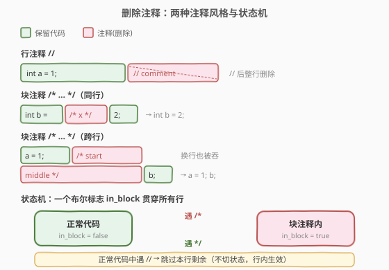
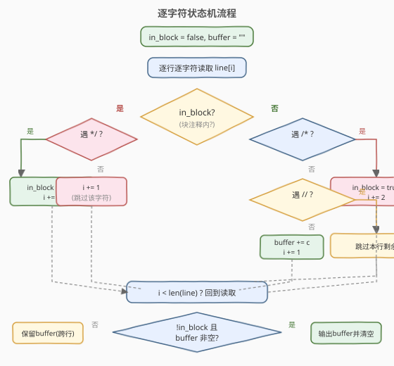
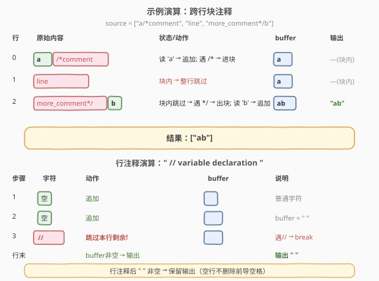

# 删除注释

- **题目名称**：删除注释
- **链接**：[722. 删除注释](https://leetcode.cn/problems/remove-comments/)
- **难度**：中等
- **标签**：字符串、模拟、状态机

## 1. 题目概述

给定一个 C++ 程序 `source`（字符串数组，`source[i]` 为第 `i` 行源码），要求删除其中所有注释，按相同格式返回源代码。

C++ 中有两种注释风格：

- **行注释** `//`：从 `//` 到行末的所有字符忽略。
- **块注释** `/* ... */`：从 `/*` 到下一个（非重叠）`*/` 之间的所有字符忽略，**可跨行**。

关键规则：

1. **第一个有效注释优先**：如果 `//` 出现在块注释中则被忽略；`/*` 出现在行注释或块注释中也被忽略。
2. **非重叠**：`/*/` 并没有结束块注释（结尾与开头重叠）。
3. **删除注释后若某行为空字符串，则不输出该行**。
4. 块注释可吞掉隐式换行符——跨行的块注释会让前后代码**合并到同一输出行**。
5. 每个块注释最终都会闭合。

**示例 1**：

```text
输入：source = ["/*Test program */", "int main()", "{ ", "  // variable declaration ", "int a, b, c;", "/* This is a test", "   multiline  ", "   comment for ", "   testing */", "a = b + c;", "}"]
输出：["int main()","{ ","  ","int a, b, c;","a = b + c;","}"]
解释：第 1 行和第 6-9 行为块注释，第 4 行为行注释。删注释后空行不输出。
```

**示例 2**：

```text
输入：source = ["a/*comment", "line", "more_comment*/b"]
输出：["ab"]
解释：原始串为 "a/*comment\nline\nmore_comment*/b"，块注释吞掉中间换行，剩下 "ab"。
```

**约束条件**：

- `1 <= source.length <= 100`
- `0 <= source[i].length <= 80`
- `source[i]` 由可打印 ASCII 字符组成。
- 每个块注释都会被闭合。
- 不会有单引号、双引号或其他控制字符干扰。

> 💡 本题保证无引号干扰——真实 C++ 中字符串字面量内的 `/*` 不算注释，但本题不需要处理字符串字面量，简化为**纯状态机扫描**即可。

---

## 2. 解题思路

### 2.1 暴力思路

逐行用正则或 `find` 替换注释。但块注释可跨行，单行处理无法判断当前是否已在块注释内——必须用一个**贯穿所有行的状态标志**来记录是否处于块注释中。

### 2.2 核心观察：单标志状态机 + 跨行 buffer



关键直觉：

- 只需**一个布尔标志** `in_block` 记录当前是否处于块注释中，它**贯穿所有行**——这是处理跨行块注释的关键。
- 维护一个 **`buffer`** 累积有效代码字符。当一行结束时：
  - 若 `in_block == false` 且 `buffer` 非空 → 输出 `buffer` 并清空。
  - 若 `in_block == true` → **保留 `buffer` 不清空**，因为块注释还在继续，下一行的代码会和当前 `buffer` 拼接到同一输出行。

> 💡 **为什么 buffer 要跨行保留？** 块注释吞掉了换行符。例如 `"a/*comment\nline\nmore_comment*/b"`：`a` 在块注释前，`b` 在块注释后，它们应合并为一行 `"ab"`。所以 `buffer` 在进入块注释时不清空，出块后继续追加，到行末才统一输出。

### 2.3 算法流程图



逐字符扫描，状态机四分支：

- **`in_block == true`**：找 `*/` → 出块（`in_block = false`, `i += 2`）；否则跳过字符（`i += 1`）。
- **`in_block == false`**：
  - 遇 `/*` → 进块（`in_block = true`, `i += 2`）。
  - 遇 `//` → 跳过本行剩余（`break`）。
  - 否则 → 追加字符到 `buffer`（`buffer += c`, `i += 1`）。

### 2.4 示例演算



以示例 2 `["a/*comment", "line", "more_comment*/b"]` 为例：

| 行 | 原始内容 | 状态/动作 | buffer | 输出 |
|----|----------|-----------|--------|------|
| 0 | `a` + `/*comment` | 读 `a` 追加；遇 `/*` 进块 | `a` | —（块内） |
| 1 | `line` | 块内 → 整行跳过 | `a` | —（块内） |
| 2 | `more_comment*/` + `b` | 块内跳过；遇 `*/` 出块；读 `b` 追加 | `ab` | `"ab"` |

结果：`["ab"]`。`a` 和 `b` 因块注释吞掉换行而合并。

再演示行注释场景 `"  // variable declaration "`：

| 步骤 | 字符 | 动作 | buffer | 说明 |
|------|------|------|--------|------|
| 1 | 空格 | 追加 | `" "` | 普通字符 |
| 2 | 空格 | 追加 | `"  "` | 普通字符 |
| 3 | `//` | 跳过本行剩余 | `"  "` | 遇 `//` → break |
| 行末 | — | buffer 非空 → 输出 | — | 输出 `"  "` |

行注释后 `"  "` 非空 → 保留输出（前导空格不删除）。

---

## 3. 参考代码

### C++

```cpp
class Solution {
  public:
    vector<string> removeComments(vector<string>& source) {
        vector<string> res;
        bool in_block = false;
        string buffer;
        for (const string& line : source) {
            int i = 0, n = line.size();
            while (i < n) {
                if (in_block) {
                    if (i + 1 < n && line[i] == '*' && line[i + 1] == '/') {
                        in_block = false;
                        i += 2;
                    } else {
                        i++;
                    }
                } else {
                    if (i + 1 < n && line[i] == '/' && line[i + 1] == '*') {
                        in_block = true;
                        i += 2;
                    } else if (i + 1 < n && line[i] == '/' && line[i + 1] == '/') {
                        break;
                    } else {
                        buffer += line[i];
                        i++;
                    }
                }
            }
            if (!in_block && !buffer.empty()) {
                res.push_back(buffer);
                buffer.clear();
            }
        }
        return res;
    }
};
```

### Python

```python
class Solution:
    def removeComments(self, source: List[str]) -> List[str]:
        res = []
        in_block = False
        buffer = ""
        for line in source:
            i, n = 0, len(line)
            while i < n:
                if in_block:
                    if i + 1 < n and line[i] == '*' and line[i + 1] == '/':
                        in_block = False
                        i += 2
                    else:
                        i += 1
                else:
                    if i + 1 < n and line[i] == '/' and line[i + 1] == '*':
                        in_block = True
                        i += 2
                    elif i + 1 < n and line[i] == '/' and line[i + 1] == '/':
                        break
                    else:
                        buffer += line[i]
                        i += 1
            if not in_block and buffer:
                res.append(buffer)
                buffer = ""
        return res
```

> ⚠️ **三个易错点**：
> 1. **buffer 跨行不清空**：进入块注释后，行末不输出也不清空 `buffer`，等出块后继续追加。若提前清空，`"ab"` 会变成 `["a", "b"]`。
> 2. **先判断 `/*` 再判断 `//`**：同一位置 `/` 后跟 `*` 还是 `/` 需区分，顺序无关但必须用 `elif` 互斥。
> 3. **`i + 1 < n` 边界检查**：判断双字符标记时必须保证 `i+1` 不越界，否则访问 `line[i+1]` 是未定义行为。

---

## 4. 复杂度分析

| 维度 | 复杂度 | 说明 |
|------|--------|------|
| 时间复杂度 | $O(N)$ | $N$ 为所有行字符总数，每个字符最多访问一次 |
| 空间复杂度 | $O(N)$ | `buffer` 和 `res` 存储输出，最坏情况全部为代码 |

---

## 5. 扩展：如果需要处理字符串字面量怎么办？

本题保证无引号干扰，但真实 C++ 中 `"/* */"` 在字符串字面量内不算注释。若要支持，需增加第三个状态 `in_string`（由 `"` 切换），在 `in_string` 状态下忽略所有注释标记。状态机变为三态：

- `normal` ↔ `in_block`（遇 `/*` / `*/`）
- `normal` ↔ `in_string`（遇 `"`）

此外还需处理转义字符 `\"` 不闭合字符串等边界，复杂度显著上升——这也是本题刻意排除引号的原因。

---

## 6. 面试要点

1. **为什么需要跨行的状态标志？**

   块注释 `/* ... */` 可以跨越多行，单行处理无法知道当前是否已在块注释中。用一个 `in_block` 布尔标志贯穿所有行，才能正确判断每行的字符是代码还是注释。

2. **buffer 为什么不在每行末清空？**

   跨行块注释会吞掉换行符。块注释前的代码（在 `buffer` 中）和块注释后的代码应合并到同一输出行。若在块注释中清空 `buffer`，就会错误地断成两行。只有 `in_block == false` 时才输出并清空。

3. **遇到 `//` 时为什么直接 `break` 而不继续扫描？**

   行注释 `//` 到行末全部忽略，没有结束标记，直接跳出本行循环即可。注意 `//` 不切换 `in_block` 状态——它是行内生效的。

4. **`/*/` 为什么不结束块注释？**

   题目规定注释结尾与开头**非重叠**。`/*/` 中 `*/` 的 `*` 与 `/*` 的 `*` 重叠，因此不算结束。算法中遇 `/*` 先 `i += 2` 跳过这两个字符，之后从下一个字符开始找 `*/`，天然避免了重叠。

5. **删除注释后空行如何处理？**

   行末时若 `buffer` 为空则不输出该行。注意"空行"指 `buffer` 为空——包括注释删完后无代码、或整行都是注释的情况。但前导空格（如 `"  // comment"` → `"  "`）不算空行，仍需输出。

---

## 7. 同类练习题

- [65. 有效数字](https://leetcode.cn/problems/valid-number/)（[站内题解](../0001-0100/65_有效数字.md)）：DFA 状态机驱动的字符串校验，状态更多但思路一致
- [8. 字符串转换整数 (atoi)](https://leetcode.cn/problems/string-to-integer-atoi/)（[站内题解](../0001-0100/8_字符串转换整数atoi.md)）：逐字符状态机模拟 + 边界处理
- [388. 文件的最长绝对路径](https://leetcode.cn/problems/longest-absolute-file-path/)：逐字符扫描 + 层级状态维护
- [1592. 重新排列单词间的空格](https://leetcode.cn/problems/rearrange-spaces-between-words/)：字符串扫描 + 模拟重组
