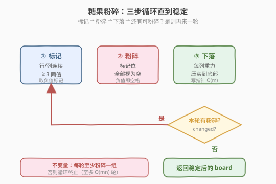
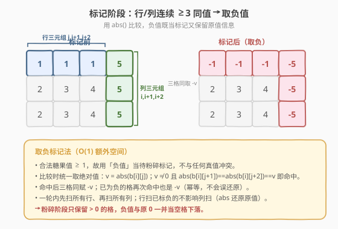
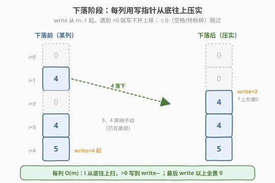
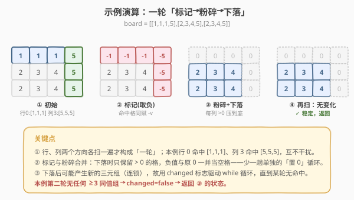

# 糖果粉碎

- **题目名称**：糖果粉碎
- **链接**：[723. 糖果粉碎](https://leetcode.cn/problems/candy-crush/)
- **难度**：中等
- **标签**：数组、矩阵、模拟、双指针

## 1. 题目概述

给定一个 `m × n` 的整数矩阵 `board` 表示糖果粉碎棋盘：

- `board[i][j] >= 1` 表示某种类型的糖果（用数值区分类型）；
- `board[i][j] == 0` 表示空格。

重复执行以下「一轮」操作，直到棋盘**稳定**（本轮没有任何糖果被粉碎）为止：

1. **找**：所有在**水平**或**垂直**方向上**连续 ≥ 3 个同值**（且非 0）的糖果组；
2. **粉碎**：把这些糖果全部置为 `0`（空格）；
3. **下落**：每列糖果在重力作用下**向下**压实，空格（`0`）被挤到列顶部。

返回稳定后的棋盘。注意：水平与垂直的命中会在**同一轮**内**同时**粉碎；下落后可能产生新的 ≥3 同值组（连锁反应），因此需要循环多轮。

**示例 1**：

```text
输入：board = [[1,1,1,5],[2,3,4,5],[2,3,4,5]]
输出：[[0,0,0,0],[2,3,4,0],[2,3,4,0]]
解释：第 0 行 [1,1,1] 水平成组、第 3 列 [5,5,5] 纵向成组，本轮同时粉碎；
      下落后第 1、2 行的 2,3,4 落到各列底部，其余置 0；
      再扫一遍无任何 ≥3 同值组，稳定，返回。
```

**示例 2**（连锁）：

```text
输入：board = [[5,1,1],[5,2,2],[5,3,1],[1,1,1]]
输出：[[0,0,0],[0,1,1],[0,2,2],[0,3,1]]
解释：第 1 轮粉碎第 0 列 [5,5,5]；下落后最底行变成 [1,1,1]；
      第 2 轮粉碎该行；再次下落后无新命中，稳定。
```

**约束条件**：

- `m == board.length`
- `n == board[i].length`
- `1 <= m, n <= 50`
- `1 <= board[i][j] <= 2000`

---

## 2. 解题思路

### 2.1 暴力思路

每轮重新枚举所有行、所有列，找出长度 ≥3 的同值连续段，标记后置 0，再模拟重力下落，循环到无变化。思路直接，难点不在算法而在**写干净、不漏方向、不重复置 0**。下面用两个技巧把它压成一段紧凑代码。

### 2.2 核心观察：三步循环 + 取负标记

整个流程是一个**「标记 → 粉碎 → 下落」的固定循环**，直到某轮无命中即终止：



两个关键观察让实现变得简洁：

> 💡 **观察一：用「负值」当待粉碎标记，省一个标记数组。**
>
> 合法糖果值恒 `≥ 1`，因此用**负值**表示「待粉碎」不会和任何真值冲突。比较时统一取绝对值 `abs()`，标记后还能反推出原值。粉碎阶段干脆**只保留 `> 0` 的格**，负值与原 `0` 一并当空格处理——这样「粉碎」与「下落」合二为一，少写一趟单独的置 0 循环。



> 💡 **观察二：三元组判定只需看「连续 3 格」。**
>
> 不必做复杂的区间/滑窗统计：对每个位置 `(i,j)`，检查它和**右两格**（水平）或**下两格**（垂直）是否同值，是则把这 3 格都标记。长度 >3 的段会被相邻三元组自然覆盖（每个格子至少被某个三元组判到），不会漏。

### 2.3 下落：每列一个写指针

下落本质是**每列做一次稳定分区**：把 `> 0` 的元素按原相对顺序压到底部，`0`（含负值）填到顶部。用「写指针」从列底往上扫一遍即可，**O(m)** 每列：



写指针 `write` 从 `m-1`（底部）出发，读指针 `i` 也从底往上：

- 若 `board[i][j] > 0`：写到 `board[write][j]`，`write--`；
- 否则（`0` 或负值）：跳过；
- 扫完后 `write` 以上全部填 `0`。

### 2.4 示例演算

以示例 1 走完一轮完整流程：



第二轮（步骤 ④）扫描：行方向 `[2,3,4,0]`、`[2,3,4,0]` 无三元组；列方向 `[0,2,2]`、`[0,3,3]`、`[0,4,4]`、`[0,0,0]` 均无（全 0 列被 `v != 0` 跳过）。`changed = false`，返回。

---

## 3. 参考代码

### C++

```cpp
class Solution {
  public:
    vector<vector<int>> candyCrush(vector<vector<int>>& board) {
        int m = board.size(), n = board[0].size();
        bool changed = true;
        while (changed) {
            changed = false;

            // ① 标记：水平方向，连续 3 格同值（取绝对值比较）
            for (int i = 0; i < m; i++) {
                for (int j = 0; j + 2 < n; j++) {
                    int v = abs(board[i][j]);
                    if (v != 0 && v == abs(board[i][j + 1]) && v == abs(board[i][j + 2])) {
                        board[i][j] = board[i][j + 1] = board[i][j + 2] = -v;
                        changed = true;
                    }
                }
            }
            // ① 标记：垂直方向
            for (int j = 0; j < n; j++) {
                for (int i = 0; i + 2 < m; i++) {
                    int v = abs(board[i][j]);
                    if (v != 0 && v == abs(board[i + 1][j]) && v == abs(board[i + 2][j])) {
                        board[i][j] = board[i + 1][j] = board[i + 2][j] = -v;
                        changed = true;
                    }
                }
            }

            // ② 粉碎 + ③ 下落：每列用写指针从底往上压实 > 0 的格
            for (int j = 0; j < n; j++) {
                int write = m - 1;
                for (int i = m - 1; i >= 0; i--) {
                    if (board[i][j] > 0) {
                        board[write][j] = board[i][j];
                        write--;
                    }
                }
                while (write >= 0) {
                    board[write][j] = 0;
                    write--;
                }
            }
        }
        return board;
    }
};
```

### Python

```python
class Solution:
    def candyCrush(self, board: List[List[int]]) -> List[List[int]]:
        m, n = len(board), len(board[0])
        changed = True
        while changed:
            changed = False

            # ① 标记：水平方向
            for i in range(m):
                for j in range(n - 2):
                    v = abs(board[i][j])
                    if v != 0 and v == abs(board[i][j + 1]) and v == abs(board[i][j + 2]):
                        board[i][j] = board[i][j + 1] = board[i][j + 2] = -v
                        changed = True
            # ① 标记：垂直方向
            for j in range(n):
                for i in range(m - 2):
                    v = abs(board[i][j])
                    if v != 0 and v == abs(board[i + 1][j]) and v == abs(board[i + 2][j]):
                        board[i][j] = board[i + 1][j] = board[i + 2][j] = -v
                        changed = True

            # ② 粉碎 + ③ 下落：每列写指针从底往上压实 > 0 的格
            for j in range(n):
                write = m - 1
                for i in range(m - 1, -1, -1):
                    if board[i][j] > 0:
                        board[write][j] = board[i][j]
                        write -= 1
                while write >= 0:
                    board[write][j] = 0
                    write -= 1

        return board
```

> 💡 **为什么 `abs` 比较是安全的？** 行扫把某格置为 `-v` 后，列扫再用 `abs` 仍得 `v`，不会因为已被标记而漏判它参与别的三元组；且再次命中也只是再赋 `-v`（幂等）。`v != 0` 保证空格不参与任何组。

---

## 4. 复杂度分析

| 维度 | 复杂度 | 说明 |
|------|--------|------|
| 时间复杂度 | $O((mn)^2)$ | 每轮标记 + 下落共 $O(mn)$；最坏每轮只粉碎一组，至多 $O(mn)$ 轮 |
| 空间复杂度 | $O(1)$ | 取负标记法，原地修改，仅常数额外变量 |

> ⚠️ 上界看起来偏高，但约束 `m, n <= 50`，且实际连锁轮数远小于 $mn$（每轮至少粉碎 3 格，总数有限），运行极快。若要更紧，可证总轮数不超过初始糖果数 $/3$，即 $O(mn)$ 轮，对应 $O((mn)^2)$ 仍是稳妥表述。

---

## 5. 扩展：用单独标记数组的写法

如果不想依赖「正值才合法」的隐式约定（比如题目后续允许负数糖果），可改用显式 `toCrush` 布尔数组：标记阶段往布尔数组里写 `true`，粉碎阶段把 `toCrush` 为 `true` 的格置 0，下落逻辑不变。代价是多 $O(mn)$ 空间，换来更强的鲁棒性与可读性。两种写法的循环结构与下落部分完全一致，只是「标记载体」不同。

---

## 6. 面试要点

1. **为什么水平扫完还要再扫垂直，且都在同一轮里？**
   - 一轮 = 行扫 + 列扫，两个方向各自找命中。题目要求水平、垂直的命中**同时**粉碎（不是粉碎一批再重新找），所以两趟扫描共用同一组标记、最后一起下落。

2. **取负标记法为什么不会出错？**
   - 合法值恒 `≥ 1`，负值不与真值冲突；`abs` 比较保证已标记格仍能参与判定；下落只留 `> 0`，负值与 `0` 一并当空格，逻辑自洽。

3. **长度 >3 的连续段怎么处理？**
   - 不用单独处理。三元组判定覆盖每个连续 3 格窗口，长度 4 的段会被两个相邻三元组分别判中，所有格子都被标记到。

4. **下落的写指针为什么从底部往上？**
   - 重力向下，所以从底往上「接住」下落的糖果最自然：读到一个 `> 0` 就放到当前最低的空写位，天然保序且 $O(m)$ 一遍完成，无需额外数组。

5. **循环什么时候终止？**
   - 用 `changed` 标志：某轮标记阶段一次都没命中即 `changed=false`，跳出 `while`。保证最终态一定稳定（无任何 ≥3 同值组）。

6. **如果允许负数糖果值，取负法还能用吗？**
   - 不能，负值会和真值冲突。改用显式布尔标记数组（见第 5 节），其余逻辑不变。

---

## 7. 同类练习题

- [73. 矩阵置零](https://leetcode.cn/problems/set-matrix-zeroes/)（[题解](../0001-0100/73_矩阵置零.md)）：同样用「标记位」技巧做矩阵原地操作，对比两种标记载体的取舍
- [48. 旋转图像](https://leetcode.cn/problems/rotate-image/)（[题解](../0001-0100/48_旋转图像.md)）：原地矩阵变换，训练二维坐标下标推演
- [54. 螺旋矩阵](https://leetcode.cn/problems/spiral-matrix/)（[题解](../0001-0100/54_螺旋矩阵.md)）：矩阵方向遍历模拟，同属二维数组模拟基本功
- [1284. 转化为零矩阵的最少翻转次数](https://leetcode.cn/problems/minimum-number-of-flips-to-convert-binary-matrix-to-zero-matrix/)：矩阵状态变化 + BFS，另一种「矩阵状态演化」视角
- [807. 保持城市天际线](https://leetcode.cn/problems/max-increase-to-keep-city-skyline/)：行/列方向分别聚合信息，与「行列各扫一遍」思想相通
