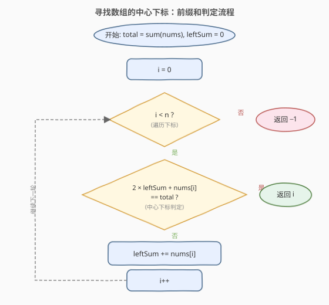

# LeetCode 寻找数组的中心下标 题解

## 1. 题目概述

- **标题 / 题号**：寻找数组的中心下标（#724，easy）
- **链接**：https://leetcode.cn/problems/find-pivot-index/
- **难度**：简单
- **标签**：数组、前缀和

**题意**：给定一个整数数组 `nums`，计算它的**中心下标**。中心下标是该数组中的一个下标 `i`，满足：`nums[i]` **左侧**所有元素相加的和等于**右侧**所有元素相加的和。

- 若 `i` 在数组**最左端**，左侧和记为 `0`（左边没有元素）。
- 若 `i` 在数组**最右端**，右侧和记为 `0`（右边没有元素）。
- 如果存在多个中心下标，返回**最左侧**的那个；若不存在，返回 `-1`。

> ⚠️ 注意：`nums[i]` **本身**既不计入左侧和，也不计入右侧和。

**示例 1**：

```text
输入：nums = [1, 7, 3, 6, 5, 6]
输出：3
解释：中心下标是 3。
     左侧和 = nums[0] + nums[1] + nums[2] = 1 + 7 + 3 = 11
     右侧和 = nums[4] + nums[5] = 5 + 6 = 11
     二者相等。
```

**示例 2**：

```text
输入：nums = [1, 2, 3]
输出：-1
解释：不存在满足条件的中心下标。
     i=0：左=0，右=2+3=5；
     i=1：左=1，右=3；
     i=2：左=1+2=3，右=0；均不相等。
```

**示例 3**：

```text
输入：nums = [2, 1, -1]
输出：0
解释：中心下标是 0。
     左侧和 = 0（最左端，无元素）
     右侧和 = nums[1] + nums[2] = 1 + (-1) = 0
     二者相等。
```

**约束**：

- `1 <= nums.length <= 10^4`
- `-1000 <= nums[i] <= 1000`

> 💡 注意 `nums[i]` 可正可负可为零，且数组长度较大——暴力 `O(n^2)` 会超时，需要 `O(n)` 的前缀和思路。

## 2. 解题思路

### 2.1 暴力思路

对每个下标 `i`，分别累加 `nums[0..i-1]` 得到左侧和，累加 `nums[i+1..n-1]` 得到右侧和，比较是否相等。共有 `n` 个候选下标，每次两侧求和 `O(n)`，总复杂度 `O(n^2)`。当 `n = 10^4` 时约 `10^8` 次运算，会超时。

### 2.2 核心观察：前缀和 + 总和消去右侧

![核心观察：左侧和等于右侧和等价于 2×左侧和 + nums[i] = 总和](../images/pivot_index_concept.svg)

关键直觉是把「右侧和」用**总和**与**左侧和**表达出来，避免每次重新累加右侧：

设 `total = sum(nums)`，`leftSum = nums[0] + ... + nums[i-1]`。则

$$
\text{rightSum} = \text{total} - \text{leftSum} - \text{nums[i]}
$$

因为整个数组的和等于「左侧和 + `nums[i]` + 右侧和」。中心下标的条件 `leftSum == rightSum` 代入即：

$$
\text{leftSum} = \text{total} - \text{leftSum} - \text{nums[i]}
$$

整理得判等条件为：

$$
2 \times \text{leftSum} + \text{nums[i]} = \text{total}
$$

于是只需**一次遍历**：维护一个滚动的 `leftSum`（初始为 `0`），每到下标 `i` 先判定上述等式是否成立，成立就返回 `i`；否则把 `nums[i]` 累加进 `leftSum`，继续向右。整个过程**不需要显式构造前缀和数组**，空间 `O(1)`。

> 💡 **为什么 `leftSum` 初始为 `0` 是对的？** 因为最左端下标 `i=0` 时左侧没有元素，左侧和按题意就是 `0`。此时判等条件变为 `2 \times 0 + nums[0] = total`，即「`nums[0]` 是否等于整个数组剩余部分的和」，与示例 3 完全一致。

### 2.3 算法流程图



整体只有一重 `for` 循环，`leftSum` 随 `i` 单调右移，每轮做一次 `O(1)` 的判等与累加，总复杂度 `O(n)`。

### 2.4 示例演算

![示例演算：nums = [1,7,3,6,5,6]，total = 28](../images/pivot_index_example_walkthrough.svg)

以 `nums = [1,7,3,6,5,6]`、`total = 28` 为例逐步演算：

- `i=0`：`leftSum=0`，判定 `2×0 + 1 = 1 ≠ 28`；累加 → `leftSum=1`。
- `i=1`：`leftSum=1`，判定 `2×1 + 7 = 9 ≠ 28`；累加 → `leftSum=8`。
- `i=2`：`leftSum=8`，判定 `2×8 + 3 = 19 ≠ 28`；累加 → `leftSum=11`。
- `i=3`：`leftSum=11`，判定 `2×11 + 6 = 28 == 28` ✅，**返回 `3`**。

最终答案为 `3`，与示例一致。

## 3. 参考代码

### C++

```cpp
class Solution {
  public:
    int pivotIndex(vector<int>& nums) {
        int total = 0;
        for (int x : nums) total += x;       // 数组总和
        int leftSum = 0;
        for (int i = 0; i < (int)nums.size(); i++) {
            if (2 * leftSum + nums[i] == total) return i;   // 命中中心下标
            leftSum += nums[i];              // 否则把 nums[i] 计入左侧和
        }
        return -1;                           // 遍历完仍无命中
    }
};
```

### Python

```python
class Solution:
    def pivotIndex(self, nums: List[int]) -> int:
        total = sum(nums)
        left_sum = 0
        for i, x in enumerate(nums):
            if 2 * left_sum + x == total:    # 命中中心下标
                return i
            left_sum += x                    # 否则把 nums[i] 计入左侧和
        return -1
```

> ⚠️ **两个易错点**：
> 1. **判定要在累加之前**。`leftSum` 表示的是 `nums[i]` **左侧**的和，必须先用当前 `leftSum` 判等，再把 `nums[i]` 累加进去；否则 `nums[i]` 会被错误地算进左侧和。
> 2. **`nums[i]` 不计入任一侧**。判等条件是 `2 * leftSum + nums[i] == total`，其中 `+ nums[i]` 这一项不可漏——它正是「中心元素本身」从总和中扣掉的那一份。若误写成 `2 * leftSum == total`，会在 `nums[i] != 0` 时给出错误答案。

## 4. 复杂度分析

| 维度 | 复杂度 | 说明 |
|------|--------|------|
| 时间复杂度 | O(n) | 一次遍历求 `total` + 一次遍历判定，共两次 `O(n)` 线性扫描 |
| 空间复杂度 | O(1) | 仅用 `total / leftSum / i` 等常数个变量，未开辟前缀和数组 |

## 5. 扩展：为什么不用前缀和数组

本题也可以先构造前缀和数组 `prefix[i] = nums[0] + ... + nums[i-1]`（约定 `prefix[0] = 0`），再对每个 `i` 判定 `prefix[i] == total - prefix[i] - nums[i]`，时间同为 `O(n)`，但空间升到 `O(n)`。

由于判等只依赖**当前** `leftSum`，历史前缀和无后续用途，滚动维护一个标量即可把空间压到 `O(1)`。这条「**能滚动就别开数组**」的原则也适用于 [303. 区域和检索](https://leetcode.cn/problems/range-sum-query-immutable/) 这类**多次查询**的场景——那里历史前缀和会被反复复用，才值得开数组缓存。

## 6. 面试要点

1. **为什么把右侧和用 `total - leftSum - nums[i]` 表达，而不是单独维护一个右侧和？**

   - 单独维护右侧和需要先对整个数组求一次「后缀和」或从 `total` 里逐步扣减，逻辑分支多、易错。用总和消去右侧后，判等条件化为只含 `leftSum` 与 `nums[i]` 的等式 `2 * leftSum + nums[i] == total`，**一次遍历、一个滚动变量**即可，代码最简、空间最优。

2. **`leftSum` 的初值为什么是 `0` 而不是 `nums[0]`？**

   - `leftSum` 表示 `nums[i]` **左侧**元素之和。当 `i = 0` 时左侧没有元素，按题意左侧和为 `0`，所以初值取 `0`。若误取 `nums[0]`，相当于把中心元素本身塞进了左侧和，判等条件就错了。

3. **如果数组元素全为正数，能否提前剪枝？**

   - 可以。元素全正时 `leftSum` 随 `i` 单调递增，一旦 `leftSum > total / 2` 且当前 `nums[i] > 0`，后续 `leftSum` 只会更大，右侧和只会更小，不可能再相等，可提前返回 `-1`。但本题元素可负，单调性不成立，所以**不能**剪枝，必须扫完。

4. **判等条件 `2 * leftSum + nums[i] == total` 中那一项 `+ nums[i]` 的物理含义是什么？**

   - 它表示「中心元素本身」要从总和中扣除。因为 `total = leftSum + nums[i] + rightSum`，当 `leftSum == rightSum` 时 `total = 2 * leftSum + nums[i]`。漏掉这一项就等于假设中心元素为 `0`，仅在 `nums[i] == 0` 时碰巧正确。

5. **如果要返回**所有**中心下标而非最左一个，如何改造？**

   - 把 `return i` 改为收集进结果列表 `ans.append(i)`，循环照常跑到末尾，最后返回 `ans`（可能为空）。判等条件与遍历逻辑完全不变，因为「最左」只是题目要求取首个命中，扫描顺序本身就是从左到右。

## 同类练习题

| # | 题目 | 与本题的关联 |
|---|------|-------------|
| 1991 | [找到数组的中间位置](https://leetcode.cn/problems/find-the-middle-index-in-array/) | 与本题完全同构，仅下标从 1 开始的表述差异，同一套前缀和判等 |
| 303 | [区域和检索 - 数组不可变](https://leetcode.cn/problems/range-sum-query-immutable/)（[题解](../0301-0400/303_区域和检索 - 数组不可变.md)） | 前缀和数组的经典应用，多次区间查询时才值得开数组 |
| 560 | [和为 K 的子数组](https://leetcode.cn/problems/subarray-sum-equals-k/)（[题解](../0501-0600/560_和为K的子数组.md)） | 前缀和 + 哈希求「恰好等于 K」的子数组个数，前缀和家族进阶 |
| 238 | [除自身以外数组的乘积](https://leetcode.cn/problems/product-of-array-except-self/)（[题解](../0201-0300/238_除自身以外数组的乘积.md)） | 把「前缀和」换成了「前缀积 + 后缀积」，左右各扫一遍的对称结构 |
| 974 | [和可被 K 整除的子数组](https://leetcode.cn/problems/subarray-sums-divisible-by-k/)（[题解](../0901-1000/974_和可被K整除的子数组.md)） | 前缀和 + 同余定理，前缀和思想的进一步延伸 |
