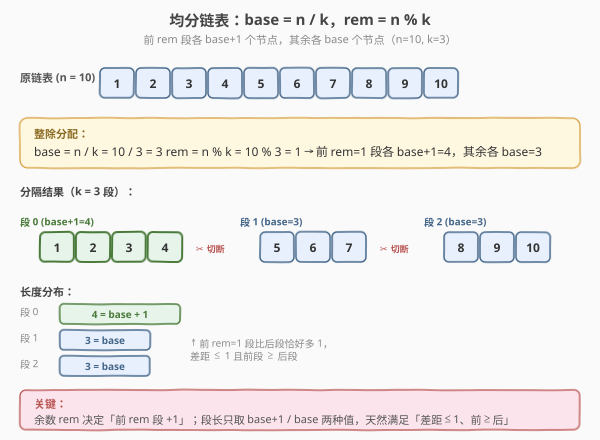
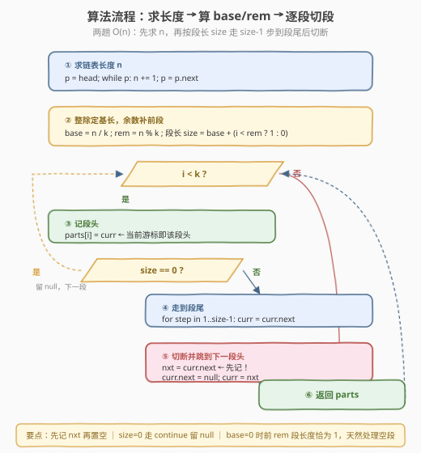

# 分隔链表

- **题目名称**：分隔链表
- **链接**：[725. 分隔链表](https://leetcode.cn/problems/split-linked-list-in-parts/)
- **难度**：中等
- **标签**：链表、数学

## 1. 题目概述

给定单链表的头节点 `head` 和一个整数 `k`，请设计算法将链表分隔为 **`k` 个连续的部分**，并返回由这 `k` 部分组成的数组。

**分隔要求**：

- 每部分的长度应**尽可能相等**：任意两部分的长度差距**不能超过 1**。
- 排在**前面**的部分长度应**大于或等于**排在后面的长度。
- 部分按在链表中**出现的顺序**排列；若节点数少于 `k`，某些部分为 `null`。

**示例 1**：

```text
输入：head = [1,2,3], k = 5
输出：[[1],[2],[3],[],[]]
解释：链表只有 3 个节点，分成 5 段——前三段各 1 个节点，后两段为空（null）。
```

**示例 2**：

```text
输入：head = [1,2,3,4,5,6,7,8,9,10], k = 3
输出：[[1,2,3,4],[5,6,7],[8,9,10]]
解释：10 个节点分 3 段，长度 4 / 3 / 3，相邻差不超过 1，前段长度 ≥ 后段。
```

**约束条件**：

- 链表中节点数目范围 `[0, 1000]`
- `0 <= Node.val <= 1000`
- `1 <= k <= 50`

> 💡 本题的难点不在链表操作，而在**如何把 `n` 个节点「尽可能均分」成 `k` 段**——这是一个整除与取余的分配问题。一旦确定每段长度，链表部分只是「走 `size-1` 步到段尾 → 切断 → 跳到下一段头」的机械操作。

---

## 2. 解题思路

### 2.1 暴力思路：按段轮询分配

逐节点遍历链表，用「轮询」方式把第 `i` 个节点挂到第 `i % k` 段。这样每段长度差距确实不超过 1，但**节点挂入顺序与「前段 ≥ 后段」的要求不符**——轮询会让各段交错增长，最终各段长度可能相同但前段不一定更长；而且当 `n` 不能被 `k` 整除时，多出来的节点会**均匀散布在前若干段**，需要额外标记哪些段该多分一个，逻辑绕且易错。

更本质的问题是：轮询需要不断在各段尾部追加节点，要么维护 `k` 个尾指针（`O(k)` 额外状态），要么每段重找尾（`O(nk)` 时间）。不如**先算清每段该多长，再一次性切段**。

### 2.2 核心观察：整除定基长，余数补前段



把 `n` 个节点分成 `k` 份、要求「任意两份差距不超过 1 且前份 ≥ 后份」，这是一个标准的**带余除法分配**：

$$
n = k \times \text{base} + \text{rem}, \quad 0 \le \text{rem} < k
$$

其中 `base = n / k`（整除），`rem = n % k`（余数）。分配方案唯一确定：

- **前 `rem` 段**每段 `base + 1` 个节点；
- **后 `k - rem` 段**每段 `base` 个节点。

**为什么这样分满足全部要求？**

1. **差距不超过 1**：所有段长度只有 `base + 1` 与 `base` 两种取值，相差恰好 1（`rem = 0` 时全部为 `base`，差为 0）。
2. **前段 ≥ 后段**：多出来的 `rem` 个节点（余数）全部补给**前 `rem` 段**，使前段比后段恰好多 1，绝不出现「后段比前段长」。
3. **尽可能均分**：`base` 是每段至少能拿到的「地板」，余数 `rem < k` 说明至多只有 `rem` 段能多拿 1 个，这是「差距 ≤ 1」约束下最均匀的分配（任何更均匀的方案都会违反差距约束或前 ≥ 后约束）。

> 💡 **直觉记忆**：`10` 个节点分 `3` 段 → `base = 3`，`rem = 1`。先每段发 `3` 个，剩 `1` 个给第 1 段 → `[4, 3, 3]`。余数从前往后依次「补 1」，补完即止。

**链表切段操作**：确定每段长度后，用一个游标 `curr` 从头扫描。对第 `i` 段：

1. 记 `parts[i] = curr`（该段头；若 `curr` 已为 `null` 则该段为空）。
2. 若该段长度 `size = 0`，直接跳过（`parts[i]` 已是 `null`）。
3. 否则 `curr` 向后走 `size - 1` 步到达**该段尾节点**。
4. **切断**：保存 `nxt = curr.next`，置 `curr.next = null`（与本段解耦），再把 `curr = nxt` 跳到下一段的头。

> ⚠️ **必须先存 `nxt` 再置空**。若先 `curr.next = null` 再取 `nxt`，就丢失了下一段的入口。这与 [86. 分隔链表](../0001-0100/86_分隔链表.md) 中「先挂后移」是同一类「改指针前先记引用」的纪律。

### 2.3 算法流程图



整体两趟扫描：第一趟求数量 `n`，第二趟按算好的段长逐段切断。每段只走 `size - 1` 步，所有段走的步数之和为 $\sum (\text{size}_i - 1) = n - \text{非空段数} \le n$，故第二趟仍是 `O(n)`。

### 2.4 示例演算

![示例演算：head = [1..10], k = 3 → [4,3,3]](../images/split_list_example_walkthrough.svg)

以 `head = [1,2,3,4,5,6,7,8,9,10]`、`k = 3`（示例 2）为例：

- 先求数量 `n = 10`，`base = 10 / 3 = 3`，`rem = 10 % 3 = 1`。
- 段长序列：第 0 段 `base + 1 = 4`，第 1、2 段 `base = 3`。

| 段号 `i` | 段长 `size` | 段头 `parts[i]` | 走 `size-1` 步到段尾 | 切断后 `curr` 落点 | 该段结果 |
|----------|-------------|------------------|----------------------|--------------------|----------|
| 0 | 4 | 1 | 1→2→3→4（尾=4） | 5 | `[1,2,3,4]` |
| 1 | 3 | 5 | 5→6→7（尾=7） | 8 | `[5,6,7]` |
| 2 | 3 | 8 | 8→9→10（尾=10） | `null` | `[8,9,10]` |

最终返回 `[[1,2,3,4],[5,6,7],[8,9,10]]`，与示例一致。

> 💡 **节点不足 `k` 的情形**（示例 1，`n=3, k=5`）：`base = 0`，`rem = 3`。前 3 段各 `0 + 1 = 1` 个节点，后 2 段各 `0` 个节点。循环到第 3、4 段时 `size = 0`，`parts[i] = curr`（此时 `curr` 已是 `null`），`continue` 跳过切断，留下 `null`，得 `[[1],[2],[3],[],[]]`。`base = 0` 分支天然处理了「空段」。

---

## 3. 参考代码

### C++

```cpp
/**
 * Definition for singly-linked list.
 * struct ListNode {
 *     int val;
 *     ListNode *next;
 *     ListNode() : val(0), next(nullptr) {}
 *     ListNode(int x) : val(x), next(nullptr) {}
 *     ListNode(int x, ListNode *next) : val(x), next(next) {}
 * };
 */
class Solution {
  public:
    vector<ListNode*> splitListToParts(ListNode* head, int k) {
        int n = 0;                                  // 1. 求链表长度
        for (ListNode* p = head; p; p = p->next) n++;

        int base = n / k;                           // 2. 整除定基长，余数补前 rem 段
        int rem  = n % k;

        vector<ListNode*> parts(k, nullptr);
        ListNode* curr = head;
        for (int i = 0; i < k; i++) {
            int size = base + (i < rem ? 1 : 0);    // 前 rem 段多分一个
            parts[i] = curr;                        // 该段头（可能为 null）
            if (size == 0) continue;                // 段长 0：留 null，跳过切断
            for (int step = 1; step < size; step++) // 走到该段尾节点
                curr = curr->next;
            ListNode* nxt = curr->next;             // 3. 先记下一段头，再切断
            curr->next = nullptr;
            curr = nxt;
        }
        return parts;
    }
};
```

### Python

```python
# Definition for singly-linked list.
# class ListNode:
#     def __init__(self, val=0, next=None):
#         self.val = val
#         self.next = next
class Solution:
    def splitListToParts(self, head: Optional[ListNode], k: int) -> List[Optional[ListNode]]:
        n = 0                                        # 1. 求链表长度
        p = head
        while p:
            n += 1
            p = p.next

        base, rem = divmod(n, k)                     # 2. 整除定基长，余数补前 rem 段

        parts: List[Optional[ListNode]] = [None] * k
        curr = head
        for i in range(k):
            size = base + (1 if i < rem else 0)      # 前 rem 段多分一个
            parts[i] = curr                          # 该段头（可能为 None）
            if size == 0:
                continue                             # 段长 0：留 None，跳过切断
            for _ in range(size - 1):                # 走到该段尾节点
                curr = curr.next
            nxt = curr.next                          # 3. 先记下一段头，再切断
            curr.next = None
            curr = nxt
        return parts
```

> ⚠️ **三个易错点**：
> 1. **`parts[i] = curr` 必须在切段之前**。`curr` 此时正是第 `i` 段的头节点；若先切断再赋值，`curr` 已跳到下一段，段头就记错了。
> 2. **`size == 0` 时不要访问 `curr.next`**。`n < k` 时后若干段长度为 0，此时 `curr` 已是 `null`，任何 `curr.next` 都会空指针。`continue` 直接保留 `parts[i] = null` 即可。
> 3. **`base = 0` 时仍要正常处理前 `rem = n` 段**。前 `n` 段每段 `0 + 1 = 1` 个节点，走 `size - 1 = 0` 步即段头也是段尾，切断逻辑照常成立——`for (step=1; step<1; ...)` 一次都不执行，直接记 `nxt` 并切断。

---

## 4. 复杂度分析

| 维度 | 复杂度 | 说明 |
|------|--------|------|
| 时间复杂度 | O(n) | 第一趟求长度 `O(n)`；第二趟逐段切段，所有段走的「`size-1` 步」之和 $\le n$，合计 `O(n)` |
| 空间复杂度 | O(k) | 输出数组 `parts` 占 `O(k)`；除输出外只用 `n / base / rem / curr / nxt` 等常数变量，即 `O(1)` 额外空间 |

> 💡 本题**不创建任何新节点**，仅靠重连原链表的 `next` 指针完成分隔，是真正的「原地」链表操作。`O(k)` 完全是题目要求返回的数组本身所必需，不计入额外开销。

---

## 5. 扩展：为何不轮询、为何前段多分

**为什么余数补给前段，而不是后段或均匀散布？**

题目明确「排在前面的部分长度应大于或等于排在后面的长度」。若把余数补给后段，后段会比前段长，违反「前 ≥ 后」；若均匀散布（如 `n=10,k=3` 给成 `[4,3,3]` 与 `[3,4,3]` 都满足差距≤1，但后者第 1 段比第 0 段长），虽差距合规却违反前 ≥ 后。**唯一同时满足两个约束**的方案就是把 `rem` 个「+1」连续地放在最前面的 `rem` 段。

**为什么不用轮询（round-robin）？**

轮询把第 `i` 个节点扔进第 `i % k` 段，最终各段长度差距确实 ≤ 1，但多出来的节点会**均匀散布**在前 `rem` 段（恰好等价于上面的方案）——可见轮询的长度分配其实与「前 `rem` 段 +1」殊途同归。区别在于**实现代价**：轮询要在线维护 `k` 个段尾指针并反复追加，而「先算长度再切段」只需一个游标 `curr` 顺序走一遍，状态更少、缓存更友好。结论：**分配方案相同，但「先算后切」的实现远比轮询简洁**。

---

## 6. 面试要点

1. **为什么先求链表长度，而不是边遍历边分配？**

   - 「尽可能均分」需要知道总数 `n` 才能算出 `base = n / k` 与 `rem = n % k`。若边遍历边分配，无法判断当前节点是否属于「该多分一个」的前 `rem` 段。先求 `n` 再算分配方案，是「先规划后执行」的典型——多花一趟 `O(n)` 扫描，换来分配逻辑的确定性与代码的简洁。

2. **`base = 0`（节点数少于 `k`）时代码为什么不用特判？**

   - `base = 0` 时前 `rem = n` 段长度为 `0 + 1 = 1`，走 `size - 1 = 0` 步，循环体不执行，直接进入切断逻辑——段头即段尾，记 `nxt` 后置空，完全正确。后 `k - n` 段长度为 `0`，由 `if (size == 0) continue` 跳过，留下 `null`。整条分支无需任何 `if (n < k)` 特判，这是把「空段」统一进 `size = 0` 分支的好处。

3. **切断时为什么必须先存 `nxt` 再 `curr.next = null`？**

   - `curr.next` 是下一段的入口。先置空再取，`nxt` 就拿到 `null`，下一段整段丢失。必须「先记后断」，与所有「改指针前先保存引用」的链表题纪律一致（如 [86. 分隔链表](../0001-0100/86_分隔链表.md) 的「先挂后移」、[19. 删除倒数第 N 个节点](../0001-0100/19_删除链表的倒数第N个节点.md) 的快慢指针前置）。

4. **如果允许「任意两段差距不超过 1」但不要求「前 ≥ 后」，分配方案有多少种？**

   - 仍要把 `rem` 个「+1」分给 `rem` 段，但可选任意 `rem` 段，共 $\binom{k}{\text{rem}}$ 种。题目加的「前 ≥ 后」约束把方案数压缩到**唯一**（前 `rem` 段），这正是题面要求该约束的用意——让答案确定。

5. **能否一趟扫描完成（不求长度）？**

   - 可以但更复杂：先用快慢指针或直接走 `k` 轮轮询，每轮从 `curr` 走到「当前段该有的长度」——但该长度仍依赖 `n`。一个变通是**两趟并一趟**地用「先走一遍用数组记下每 `k` 个抽样的段头」，本质上还是先确定分配。实践中「求长度 + 切段」两趟 `O(n)` 已是最优且最清晰，面试无需炫技成一趟。

> 💡 **一句话总结**：725 = 「整除分配」+「链表切段」。`base = n / k`、`rem = n % k`，前 `rem` 段各 `base+1`、其余各 `base`；游标从头按段长走 `size-1` 步到段尾，先记 `nxt` 再置 `curr.next = null` 切断，`curr = nxt` 进入下一段。两趟 `O(n)`、`O(1)` 额外空间，`base = 0` 与空段统一由 `size == 0` 分支处理。

---

## 7. 同类练习题

- [86. 分隔链表](https://leetcode.cn/problems/partition-list/)（[题解](../0001-0100/86_分隔链表.md)）：按**值**分组分隔链表（稳定分区），同属「分隔链表」家族，对比「按值分」与「按段数均分」的差异
- [61. 旋转链表](https://leetcode.cn/problems/rotate-list/)（[题解](../0001-0100/61_旋转链表.md)）：同样需要先求长度 `n` 再用 `k % n` 定位切断点，共享「先求长再切段」范式
- [328. 奇偶链表](https://leetcode.cn/problems/odd-even-linked-list/)：按**位置奇偶**拆成两条子链再拼接，另一类「按规则分隔链表」
- [876. 链表的中间结点](https://leetcode.cn/problems/middle-of-the-linked-list/)：快慢指针一次扫描定位中点，链表「先定位再切」的基础题
