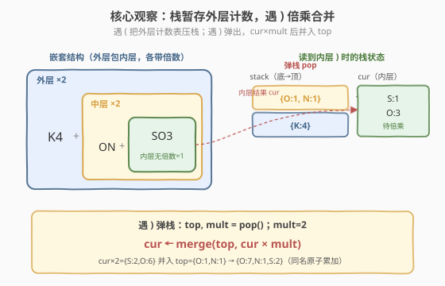
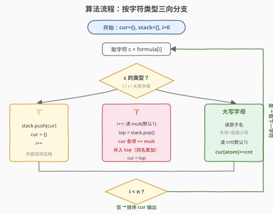
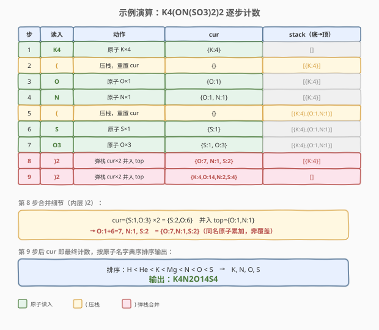

# 原子的数量

- **题目名称**：原子的数量
- **链接**：[726. 原子的数量](https://leetcode.cn/problems/number-of-atoms/)
- **难度**：困难
- **标签**：栈、哈希表、字符串、递归

## 1. 题目概述

给定一个字符串化学式 `formula`，返回**每种原子的数量**。

原子总是以一个**大写字母**开始，接着跟随 0 个或任意个**小写字母**，表示原子的名字（如 `H`、`Mg`、`He`）。如果数量大于 1，原子后会跟着数字表示数量；数量等于 1 则不跟数字（`H1O2` 是非法的）。

化学式有两种组合方式：

- **拼接**：两个化学式连在一起，如 `H2O2He3Mg4`。
- **括号 + 倍数**：由括号括起的化学式并佐以数字（可省略，省略即 1），如 `(H2O2)3`、`(H2O2)`。括号**可以嵌套**。

返回格式：所有原子**按字典序**排列，每个原子名后跟数量（数量大于 1 时才写）。

**示例 1**：

```text
输入：formula = "H2O"
输出："H2O"
解释：原子的数量是 {'H': 2, 'O': 1}。
```

**示例 2**：

```text
输入：formula = "Mg(OH)2"
输出："H2MgO2"
解释：原子的数量是 {'H': 2, 'Mg': 1, 'O': 2}。
```

**示例 3**：

```text
输入：formula = "K4(ON(SO3)2)2"
输出："K4N2O14S4"
解释：原子的数量是 {'K': 4, 'N': 2, 'O': 14, 'S': 4}。
```

**约束条件**：

- `1 <= formula.length <= 1000`
- `formula` 由英文字母、数字、`'('` 和 `')'` 组成
- `formula` 总是有效的化学式

> 💡 本题是**栈处理嵌套结构**的招牌题，难点在于括号可任意嵌套且带倍数——与 [394. 字符串解码](https://leetcode.cn/problems/decode-string/) 的 `k[encoded_string]` 同构，只是把「重复字符串」换成了「按原子计数累加」。掌握「外层暂存、内层先算」的栈模板即可一通百通。

---

## 2. 解题思路

### 2.1 暴力思路：递归向下解析

观察到括号内仍是合法化学式，是**自相似**结构。最直观的写法是递归：扫描到 `(` 进入下一层，扫描到 `)` 读取倍数、把内层计数倍乘后返回给上一层合并。

```text
def parse(i):
    cur = {}
    while i < n:
        if formula[i] == '(':
            sub, i = parse(i+1)      # 递归算内层
            merge cur <- sub
        elif formula[i] == ')':
            i, mult = 读数字
            for atom in cur: cur[atom] *= mult
            return cur, i            # 本层结束
        else:
            atom, i = 读原子名
            cnt, i = 读数字(默认1)
            cur[atom] += cnt
    return cur
```

逻辑清晰，但递归需手动传递下标 `i`，容易写错；嵌套深度受系统调用栈限制（本题 `formula.length <= 1000`，实际不会爆栈，但理解迭代版更能体现「栈模拟递归」的通用思想）。

### 2.2 核心观察：栈 + 哈希表——外层暂存，内层先算

递归的本质是「进入 `(` 时保存现场，遇到 `)` 时恢复现场」。这里的「现场」是**外层已累加的原子计数表**。我们用一个**计数表栈**把这个过程显式化：

- 维护一个当前计数表 `cur`（哈希表 `atom -> count`）。
- 遇到 `(`：把 `cur` 压栈暂存，再开一张空表 `cur = {}` 给内层用。
- 遇到 `)`：读取后面的倍数 `mult`（省略则 1），弹出外层表 `top`，把 `cur` 中每个计数乘以 `mult` 后**合并**进 `top`，令 `cur = top`。
- 遇到原子：解析原子名（大写 + 后续小写）和数量（默认 1），`cur[atom] += cnt`。



**为什么可行？** `(` 出现时外层的 `cur` 还没算完（后面可能还有兄弟片段），必须先存起来；等内层 `)` 结束后，内层结果 `cur` 应当被倍数 `mult` 放大，并合并回外层已存的表 `top`。这一「压栈存现场、弹栈合并结果」恰好模拟了递归的进入与返回，与 394 双栈法同源。

> 💡 **与 394 的对应**：394 遇 `[` 压栈 `(字符串, 倍数)`，遇 `]` 执行 `cur = prev + cur * k`；本题遇 `(` 压栈计数表，遇 `)` 执行 `cur = merge(top, cur × mult)`。差别仅在「字符串拼接」变成「计数表合并」，骨架完全一致。

### 2.3 算法流程图



**完整步骤**：

1. 初始化 `cur = {}`、空栈 `stack`、下标 `i = 0`。
2. 顺序遍历 `formula`：
   - **`(`**：`stack.append(cur)`；`cur = {}`；`i++`。
   - **`)`**：`i++`；读后续数字得 `mult`（无数字则 `mult = 1`）；`top = stack.pop()`；对 `cur` 每项 `cnt *= mult` 后并入 `top`；`cur = top`。
   - **大写字母**：解析原子名（首字母大写 + 后续连续小写）；读后续数字得 `cnt`（无数字则 `cnt = 1`）；`cur[atom] += cnt`。
3. 遍历结束，`cur` 即为最终计数表。按原子名**字典序**排序，拼接输出（数量为 1 时不写数字）。

> ⚠️ **字典序**：直接对原子名做字符串排序即可。如 `H < He < K < Mg < N < O < S`——大写字母在前、小写字母在后，且短串是长串前缀时短串靠前，自然符合化学惯例。

### 2.4 示例演算

以 `formula = "K4(ON(SO3)2)2"` 为例（嵌套两层，最能体现栈的价值）：



| 步骤 | 读入 | 动作 | cur | stack（底→顶） |
|------|------|------|-----|----------------|
| 1 | `K4` | 原子 K×4 | `{K:4}` | `[]` |
| 2 | `(` | 压栈，重置 | `{}` | `[{K:4}]` |
| 3 | `O` | 原子 O×1 | `{O:1}` | `[{K:4}]` |
| 4 | `N` | 原子 N×1 | `{O:1,N:1}` | `[{K:4}]` |
| 5 | `(` | 压栈，重置 | `{}` | `[{K:4},{O:1,N:1}]` |
| 6 | `S` | 原子 S×1 | `{S:1}` | `[{K:4},{O:1,N:1}]` |
| 7 | `O3` | 原子 O×3 | `{S:1,O:3}` | `[{K:4},{O:1,N:1}]` |
| 8 | `)2` | 弹栈，cur×2 并入 top | `{O:7,N:1,S:2}` | `[{K:4}]` |
| 9 | `)2` | 弹栈，cur×2 并入 top | `{K:4,O:14,N:2,S:4}` | `[]` |

关键观察：**内层 `)2` 先把 `{S:1,O:3}` 放大为 `{S:2,O:6}` 合并回 `{O:1,N:1}` 得 `{O:7,N:1,S:2}`，外层 `)2` 再把整个放大 2 倍合并回 `{K:4}`**。栈的 LIFO 特性保证「最内层先算」，与括号嵌套顺序天然吻合。

> 💡 第 8 步合并细节：`cur×2 = {S:2,O:6}`，与 `top={O:1,N:1}` 同名原子相加 → `O:1+6=7`、`N:1`、`S:2`，得到 `{O:7,N:1,S:2}`。注意 `O` 在内外层都出现，需**累加**而非覆盖。

---

## 3. 参考代码

### C++

```cpp
// 原子的数量.cpp —— 栈 + 哈希表模拟递归
#include <string>
#include <vector>
#include <unordered_map>
#include <algorithm>
using namespace std;

class Solution {
  public:
    string countOfAtoms(string formula) {
        vector<unordered_map<string, int>> stk;  // 计数表栈
        unordered_map<string, int> cur;          // 当前层计数
        int n = formula.size(), i = 0;
        while (i < n) {
            char c = formula[i];
            if (c == '(') {
                stk.push_back(move(cur));        // 外层现场压栈
                cur = {};
                i++;
            } else if (c == ')') {
                i++;
                int mult = 0;                    // 读倍数（可多位）
                while (i < n && isdigit(formula[i])) {
                    mult = mult * 10 + (formula[i] - '0');
                    i++;
                }
                if (mult == 0) mult = 1;         // 省略即 1
                auto top = move(stk.back()); stk.pop_back();
                for (auto& [atom, cnt] : cur) {  // 内层倍乘后并入外层
                    top[atom] += cnt * mult;
                }
                cur = move(top);
            } else {                             // 解析原子名 + 数量
                int start = i++;                 // 首字母大写
                while (i < n && islower(formula[i])) i++;
                string atom = formula.substr(start, i - start);
                int cnt = 0;                     // 读数量（可多位）
                while (i < n && isdigit(formula[i])) {
                    cnt = cnt * 10 + (formula[i] - '0');
                    i++;
                }
                if (cnt == 0) cnt = 1;
                cur[atom] += cnt;
            }
        }
        // 按原子名字典序输出
        vector<pair<string, int>> atoms(cur.begin(), cur.end());
        sort(atoms.begin(), atoms.end());
        string res;
        for (auto& [atom, cnt] : atoms) {
            res += atom;
            if (cnt > 1) res += to_string(cnt);
        }
        return res;
    }
};
```

### Python

```python
class Solution:
    def countOfAtoms(self, formula: str) -> str:
        stack = []          # 暂存外层计数表
        cur = {}            # 当前层原子计数
        i, n = 0, len(formula)
        while i < n:
            c = formula[i]
            if c == '(':
                stack.append(cur)          # 外层现场压栈
                cur = {}
                i += 1
            elif c == ')':
                i += 1
                mult = 0                   # 读倍数（可多位）
                while i < n and formula[i].isdigit():
                    mult = mult * 10 + int(formula[i])
                    i += 1
                mult = mult or 1           # 省略即 1
                top = stack.pop()
                for atom, cnt in cur.items():          # 内层倍乘后并入外层
                    top[atom] = top.get(atom, 0) + cnt * mult
                cur = top
            else:                          # 解析原子名 + 数量
                start = i                  # 首字母大写
                i += 1
                while i < n and formula[i].islower():
                    i += 1
                atom = formula[start:i]
                cnt = 0                    # 读数量（可多位）
                while i < n and formula[i].isdigit():
                    cnt = cnt * 10 + int(formula[i])
                    i += 1
                cnt = cnt or 1
                cur[atom] = cur.get(atom, 0) + cnt
        # 按原子名字典序输出
        parts = []
        for atom in sorted(cur):
            parts.append(atom)
            if cur[atom] > 1:
                parts.append(str(cur[atom]))
        return "".join(parts)
```

> 💡 两版逻辑同构：C++ 用 `unordered_map` 存计数，输出时 `sort` 排序；Python 用 `dict` 存计数，输出时 `sorted(cur)` 排序。`move` 语义避免 C++ 中大表的无谓拷贝。倍数与数量都需支持**多位数字**（如 `Mg12`），用 `* 10 + d` 累积。

---

## 4. 复杂度分析

| 维度 | 复杂度 | 说明 |
|------|--------|------|
| 时间复杂度 | $O(n \log n)$ | 扫描 $O(n)$；末尾对至多 $n$ 种原子排序 $O(n \log n)$；合并计数表均摊 $O(n)$ |
| 空间复杂度 | $O(n)$ | 栈深度等于最大嵌套层数 $O(n)$；计数表存原子种类数 $O(n)$ |

> ⚠️ 严格地说，原子种类数不超过 $n/2$（最短原子名为 1 字符 + 数量 1 字符），排序开销 $O(n \log n)$ 主导。若用 C++ 的 `std::map`（红黑树，插入即有序）则单次插入 $O(\log n)$，总体仍是 $O(n \log n)$，但省去末尾显式排序。本题 `n <= 1000`，两种写法性能差异可忽略。

---

## 5. 扩展：递归写法

当面试官要求递归实现时，用引用或闭包下标传递扫描位置：

```python
class Solution:
    def countOfAtoms(self, formula: str) -> str:
        self.i, self.s = 0, formula

        def parse() -> dict:
            cur = {}
            while self.i < len(self.s):
                c = self.s[self.i]
                if c == '(':
                    self.i += 1
                    sub = parse()                 # 递归算内层
                    for atom, cnt in sub.items():
                        cur[atom] = cur.get(atom, 0) + cnt
                elif c == ')':
                    self.i += 1
                    mult = 0
                    while self.i < len(self.s) and self.s[self.i].isdigit():
                        mult = mult * 10 + int(self.s[self.i])
                        self.i += 1
                    mult = mult or 1
                    for atom in cur:
                        cur[atom] *= mult
                    return cur                    # 本层结束
                else:
                    start = self.i
                    self.i += 1
                    while self.i < len(self.s) and self.s[self.i].islower():
                        self.i += 1
                    atom = self.s[start:self.i]
                    cnt = 0
                    while self.i < len(self.s) and self.s[self.i].isdigit():
                        cnt = cnt * 10 + int(self.s[self.i])
                        self.i += 1
                    cur[atom] = cur.get(atom, 0) + (cnt or 1)
            return cur

        counts = parse()
        parts = []
        for atom in sorted(counts):
            parts.append(atom)
            if counts[atom] > 1:
                parts.append(str(counts[atom]))
        return "".join(parts)
```

仍是 $O(n \log n)$ 时间、$O(n)$ 空间。递归版在 `(` 处递归调用、`)` 处返回，与迭代版（栈）本质同构，迭代版更便于调试且无栈溢出风险，面试中推荐先写迭代版。

---

## 6. 面试要点

1. **为什么用栈而不是递归？**

   - 括号嵌套是「后进先出」结构：最内层的 `(` 必须最先被对应的 `)` 闭合、最先倍乘合并。栈的 LIFO 特性天然匹配——遇 `(` 压栈，遇 `)` 弹栈，弹出的总是最近压入的内层现场。递归虽也能做，但需手动传递下标，迭代版（栈）更稳健、无爆栈风险。

2. **原子名怎么解析？为什么不能只读一个字母？**

   - 原子名以**大写字母**开头，后跟 0 个或多个**小写字母**（如 `Mg`、`He`）。只读一个字母会把 `Mg` 误读成 `M` 和 `g` 两个原子。必须先读大写字母，再用 `while islower` 吞掉后续小写字母。

3. **数字是多位时怎么处理？**

   - 数量与倍数都可能是多位（如 `Mg12`、`(H2O)10`）。必须用 `num = num * 10 + int(c)` 累积。常见 bug 是只读一位，遇到 `(H2O)12` 就只乘 1 而非 12。无数字时默认为 1（`cnt = cnt or 1`）。

4. **`)` 处理时为什么是「倍乘后合并」而不是「覆盖」？**

   - 内层结果 `cur` 倍乘 `mult` 后，要并入外层已累加的表 `top`，**同名原子累加**。因为同一原子可能在内外层都出现（如 `K4(ON(SO3)2)2` 中 `O` 既在内层 `SO3` 出现、又在外层 `ON` 出现），覆盖会丢失外层计数。

5. **字典序排序为什么直接对字符串排序就行？**

   - 原子名首字母大写、后续小写。字符串字典序中 `H < He`（短串是长串前缀时靠前）、`He < K`（`H` < `K`）、`K < Mg`（`K` < `M`），与化学惯例一致。无需特殊比较函数。

> 💡 **一句话总结**：原子的数量是栈处理嵌套计数的招牌题——遇 `(` 把外层计数表压栈，遇 `)` 弹出并把内层结果倍乘后合并。核心思想「外层暂存、内层先算」与 394 字符串解码同源，把「字符串拼接」换成「哈希表合并」即可。

---

## 7. 同类练习题

- [394. 字符串解码](https://leetcode.cn/problems/decode-string/)（[站内题解](../0301-0400/394_字符串解码.md)）：栈处理嵌套结构的同源母题，`k[...]` 重复字符串，骨架与本题完全一致
- [735. 行星碰撞](https://leetcode.cn/problems/asteroid-collision/)（[站内题解](../0701-0800/735_行星碰撞.md)）：栈模拟双向碰撞，与本题同属「栈维护层级状态」套路
- [224. 基本计算器](https://leetcode.cn/problems/basic-calculator/)：栈处理括号与一元符号，嵌套求值的经典栈题
- [227. 基本计算器 II](https://leetcode.cn/problems/basic-calculator-ii/)：栈处理运算符优先级，与本题「边扫描边累积」的解析思路相通
- [1087. 花括号展开](https://leetcode.cn/problems/brace-expansion/)：括号展开为字符串集合，本题的「枚举」变体，同样需要解析嵌套括号
