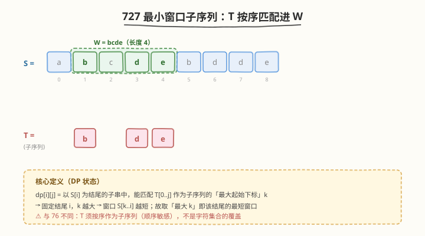
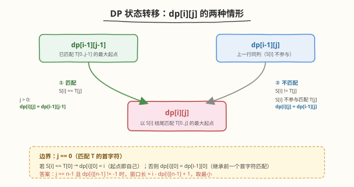
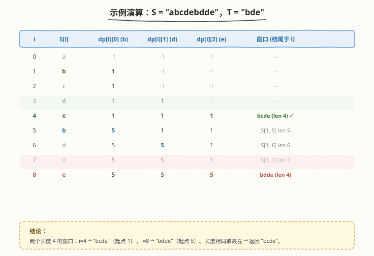

# 最小窗口子序列

- **题目名称**：最小窗口子序列
- **链接**：[727. Minimum Window Subsequence](https://leetcode.cn/problems/minimum-window-subsequence/)
- **难度**：困难
- **标签**：动态规划、字符串、双指针

## 1. 题目概述

给定字符串 `S` 和 `T`，在 `S` 中找出**最短的连续子串 `W`**，使得 `T` 是 `W` 的**子序列**（即 `T` 的字符按顺序出现在 `W` 中，不要求连续）。若不存在这样的子串，返回空字符串 `""`；若存在多个等长最短子串，返回**最左**的那个。

> ⚠️ **与 [76. 最小覆盖子串](../0001-0100/76_最小覆盖子串.md) 的关键区别**：76 要求窗口**涵盖** `T` 的字符集合（顺序无关、只看计数）；727 要求 `T` **按序**作为子序列（顺序敏感）。因此 76 的滑动窗口（扩张-收缩）在这里**不适用**——收缩左端可能破坏 `T` 的匹配顺序。

**示例 1**：

```text
输入：S = "abcdebdde", T = "bde"
输出："bcde"
解释：
  - "bcde" 中 b(0)→d(3)→e(4) 按序构成 "bde"，长度 4；
  - "bdde" 中 b(5)→d(6)→e(8) 也能构成 "bde"，长度 4；
  - 两者等长，取最左 → "bcde"。
```

**示例 2**：

```text
输入：S = "jmeqksfrsdcmsiwvaadz", T = "k"
输出："k"
解释：T 仅一个字符，找到即返回。
```

**约束条件**：

- `1 <= S.length, T.length <= 2 * 10^4`
- `S` 和 `T` 仅由小写英文字母组成

---

## 2. 解题思路

### 2.1 暴力思路

枚举 `S` 的所有子串 `O(m²)`，对每个子串判定 `T` 是否为其子序列 `O(m+n)`，总复杂度 `O(m³)`，对 `m=2*10^4` 显然超时。

> 💡 子序列判定本身是经典的「双指针贪心」：用指针 `j` 扫 `T`，遍历 `W`，匹配则 `j++`，最后 `j==n` 即为子序列。但这只能判定单个 `W`，无法直接求最短。

### 2.2 核心观察：动态规划（按「结尾位置 × 匹配进度」）



关键洞察：**固定子串的结尾位置 `i`**，则「以 `S[i]` 结尾、能匹配 `T[0..j]` 作为子序列」的所有可行起点中，**起点越大 → 窗口越短**。于是定义：

$$
\text{dp}[i][j] = \text{以 } S[i] \text{ 为结尾、能匹配 } T[0..j] \text{ 的「最大起始下标」 } k \quad (\text{无解记 } -1)
$$

当 `j == n-1`（`T` 全部匹配完）且 `dp[i][n-1] != -1` 时，以 `i` 结尾的最短窗口长度为 `i - dp[i][n-1] + 1`。遍历所有 `i` 取最小即可。

> 💡 为什么取「最大起始下标」而非最小？因为窗口长度 = `i - k + 1`，`k` 越大窗口越短。我们要的是「以 `i` 结尾的最短窗口」，故 `k` 取最大合法值。这与 76「以右端收缩求最短」是同一思想的不同载体。

### 2.3 状态转移



对每个 `(i, j)` 分两种情形：

- **匹配** `S[i] == T[j]`：`S[i]` 充当 `T[j]` 的匹配字符。
  - 若 `j == 0`：`T` 的首字符匹配，起点即自己 → `dp[i][0] = i`
  - 若 `j > 0`：`T[0..j-1]` 必须在 `S[i]` 之前完成匹配 → `dp[i][j] = dp[i-1][j-1]`
- **不匹配** `S[i] != T[j]`：`S[i]` 不参与匹配 `T[j]`，继承上一行同列 → `dp[i][j] = dp[i-1][j]`

**滚动数组优化**：`dp[i][j]` 只依赖 `dp[i-1][j-1]`（左上）和 `dp[i-1][j]`（正上）。用一维数组 `dp[j]`，**内层 `j` 从大到小**更新——这样 `dp[j-1]` 读取时仍是「上一行」的旧值，避免被本行覆盖。

**算法流程**：

1. 初始化 `dp[j] = -1`（`j = 0..n-1`），`minLen = ∞`，`minStart = 0`
2. 遍历 `i = 0..m-1`：
   - `for j = n-1 downto 0`：按上述两情形更新 `dp[j]`
   - 若 `dp[n-1] != -1`：计算 `len = i - dp[n-1] + 1`，严格更小则更新 `minLen / minStart`
3. 返回 `S.substr(minStart, minLen)`（无解则 `""`）

### 2.4 示例演算



以 `S="abcdebdde"`, `T="bde"` 为例，完整 DP 表如下（`-1` 表示无解）：

| i | S[i] | dp[i][0] (b) | dp[i][1] (d) | dp[i][2] (e) | 窗口（结尾于 i） |
|---|------|--------------|--------------|--------------|------------------|
| 0 | a    | -1           | -1           | -1           | —                |
| 1 | b    | **1**        | -1           | -1           | —                |
| 2 | c    | 1            | -1           | -1           | —                |
| 3 | d    | 1            | **1**        | -1           | —                |
| 4 | e    | 1            | 1            | **1**        | bcde (len 4) ✓   |
| 5 | b    | **5**        | 1            | 1            | S[1..5] len 5    |
| 6 | d    | 5            | **5**        | 1            | S[1..6] len 6    |
| 7 | d    | 5            | 5            | 1            | S[1..7] len 7    |
| 8 | e    | 5            | 5            | **5**        | bdde (len 4)     |

两个长度 4 的窗口：`i=4 → "bcde"`（起点 1）、`i=8 → "bdde"`（起点 5）。等长取最左 → 返回 `"bcde"`。

---

## 3. 参考代码

### C++

```cpp
class Solution {
  public:
    string minWindow(string S, string T) {
        int m = S.size(), n = T.size();
        // dp[j] = 以当前 S[i] 结尾、匹配 T[0..j] 的最大起始下标；-1 表示无解
        vector<int> dp(n, -1);
        int minLen = INT_MAX, minStart = 0;

        for (int i = 0; i < m; i++) {
            // j 从大到小：保证 dp[j-1] 仍是上一行的旧值
            for (int j = n - 1; j >= 0; j--) {
                if (S[i] == T[j]) {
                    dp[j] = (j == 0) ? i : dp[j - 1];
                }
                // 不匹配时 dp[j] 保持上一行原值（不动）
            }
            if (dp[n - 1] != -1) {
                int len = i - dp[n - 1] + 1;
                if (len < minLen) { // 严格小于：等长保留更左的
                    minLen = len;
                    minStart = dp[n - 1];
                }
            }
        }
        return minLen == INT_MAX ? "" : S.substr(minStart, minLen);
    }
};
```

### Python

```python
class Solution:
    def minWindow(self, S: str, T: str) -> str:
        m, n = len(S), len(T)
        dp = [-1] * n          # dp[j] = 以当前 S[i] 结尾匹配 T[0..j] 的最大起点
        min_len = float('inf')
        min_start = 0

        for i, ch in enumerate(S):
            for j in range(n - 1, -1, -1):
                if ch == T[j]:
                    dp[j] = i if j == 0 else dp[j - 1]
                # 不匹配：dp[j] 保持上一行原值
            if dp[n - 1] != -1:
                length = i - dp[n - 1] + 1
                if length < min_len:   # 严格小于：等长保留更左
                    min_len = length
                    min_start = dp[n - 1]

        return "" if min_len == float('inf') else S[min_start:min_start + min_len]
```

---

## 4. 复杂度分析

| 维度 | 复杂度 | 说明 |
|------|--------|------|
| 时间复杂度 | `O(mn)` | 外层遍历 `S`（`m` 次），内层遍历 `T`（`n` 次），每次 `O(1)` 转移 |
| 空间复杂度 | `O(n)` | 滚动为一维数组 `dp[j]`，长度为 `n` |

> ⚠️ `m, n ≤ 2*10^4` 时 `mn` 量级约 `4*10^8`，但内层仅一次比较与赋值、常数极小，且大量位置 `S[i] != T[j]` 直接跳过，实际运行远低于理论上界，LeetCode 可通过。若需更稳，可用第 5 节的前向后向双指针法。

---

## 5. 扩展：前向-后向双指针法

DP 之外还有一种更直观的「**前向匹配定尾、后向匹配定头**」双指针法，均摊效率更高：

1. 用 `i` 扫 `S`，`j` 扫 `T`：当 `S[i] == T[j]` 时 `j++`；`j == n` 时说明从某个起点到 `i` 完整匹配了 `T`，记录结尾 `end = i`。
2. 从 `end` **反向**重新匹配 `T`（倒序）：`j = n-1` 往前，当 `S[k] == T[j]` 时 `j--`；`j < 0` 时得到起点 `start = k`。
3. 窗口 `S[start..end]` 即为「以该 `end` 结尾的最短窗口」（后向贪心把起点尽量右推）。更新全局最小，并令 `i = start + 1` 继续寻找下一个候选。

> 💡 **为什么后向扫描能得到该结尾的最短窗口？** 前向扫描找到的是「最早的完整匹配」，其起点可能偏左；后向从同一结尾倒着匹配 `T`，会把每个 `T[j]` 尽量贴向右端，等价于「在固定结尾的前提下最大化起点」——与 DP 取「最大起始下标」完全同构。该方法最坏仍 `O(mn)`，但跳过无用区段后常数更优。

---

## 6. 面试要点

1. **这题和 76 最小覆盖子串有什么区别？为什么不能用滑动窗口？**

   - 76 是「字符集合覆盖」（顺序无关、只看计数），用扩张-收缩双指针 `O(m)`；
   - 727 是「子序列匹配」（顺序敏感），收缩左端可能断开 `T` 的匹配顺序，滑动窗口的「可收缩」不变式不成立；
   - 故改用 DP（或前向-后向双指针），按「结尾 × 匹配进度」组织状态。

2. **dp 状态为什么定义成「最大起始下标」而不是最小？**

   - 窗口长度 = `i - k + 1`，结尾 `i` 固定时，起点 `k` 越大窗口越短；
   - 要的是「以 `i` 结尾的最短窗口」，故 `k` 取最大合法值——与 76「右端固定后左端尽量右收」同构。

3. **滚动数组为什么 `j` 要从大到小？**

   - `dp[i][j]` 在匹配时依赖 `dp[i-1][j-1]`（上一行左列）；
   - 若 `j` 从小到大原地更新，`dp[j-1]` 已被本行覆盖，读到的是 `dp[i][j-1]` 而非 `dp[i-1][j-1]`，逻辑错误；
   - 从大到小更新时 `dp[j-1]` 尚未触本行，仍为上一行旧值，正确。

4. **等长时如何保证返回最左窗口？**

   - 更新条件用**严格小于** `len < minLen`：等长不覆盖，保留先出现（即更左）的窗口；
   - 由于 `i` 从左到右遍历，先出现的窗口起点更靠左。

5. **前向-后向双指针法和 DP 谁更好？**

   - 理论最坏都是 `O(mn)`；前向-后向法跳过无效区段、常数更小，且空间 `O(1)`；
   - DP 更易讲清状态结构与转移，面试讲思路首选 DP，写代码可任选；
   - 若 `T` 远短于 `S`，DP 的 `O(n)` 空间几乎可忽略。

---

## 7. 同类练习题

- [76. 最小覆盖子串](https://leetcode.cn/problems/minimum-window-substring/)（[题解](../0001-0100/76_最小覆盖子串.md)）：对照题——「字符集合覆盖」vs「子序列」，顺序敏感与否决定能否滑窗
- [392. 判断子序列](https://leetcode.cn/problems/is-subsequence/)：子序列判定的双指针贪心基础，727 的「匹配」即是它的扩展
- [718. 最长重复子数组](https://leetcode.cn/problems/maximum-length-of-repeated-subarray/)（[题解](718_最长重复子数组.md)）：同为「结尾位置 × 匹配进度」的二维 DP，不匹配归零 vs 继承的差异
- [1143. 最长公共子序列](https://leetcode.cn/problems/longest-common-subsequence/)：LCS 二维 DP 经典，727 把「求最长」换成「求最短窗口」并固定一端结尾
- [1055. 形成字符串的最短路径](https://leetcode.cn/problems/shortest-way-to-form-string/)：子序列覆盖的另一个变体——求用最多个 `S` 子序列拼出 `T`
