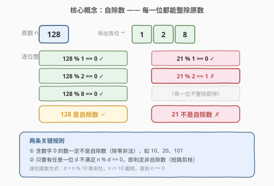
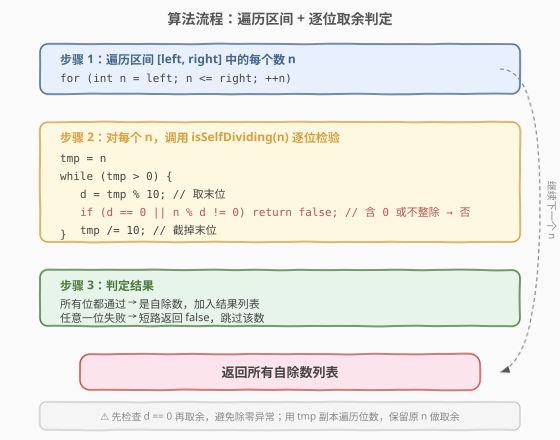
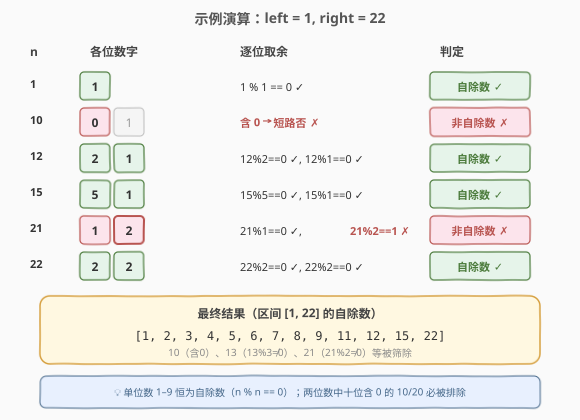

# LeetCode 自除数 题解

## 1. 题目概述

- **标题 / 题号**：自除数（#728，easy）
- **链接**：https://leetcode.cn/problems/self-dividing-numbers/
- **难度**：简单
- **标签**：数学、枚举

**自除数** 是指可以被它包含的**每一位数字**整除的数。

- 例如，`128` 是一个自除数，因为 `128 % 1 == 0`，`128 % 2 == 0`，`128 % 8 == 0`。
- 自除数**不允许包含数字 0**（因为不能除以 0）。

给定两个整数 `left` 和 `right`，返回区间 `[left, right]` 内所有自除数的列表。

**示例 1**：

```text
输入：left = 1, right = 22
输出：[1, 2, 3, 4, 5, 6, 7, 8, 9, 11, 12, 15, 22]
```

**示例 2**：

```text
输入：left = 47, right = 85
输出：[48, 55, 66, 77]
```

**约束**：

- $1 \le \text{left} \le \text{right} \le 10^4$

## 2. 解题思路

### 2.1 暴力思路

对区间 `[left, right]` 中的每个数 `n`，逐一检查它的每一位数字 `d` 是否满足 `n % d == 0`。若所有位都满足，则 `n` 是自除数，加入结果列表。

由于 $right \le 10^4$，区间规模至多 $10^4$ 个数，每个数至多 5 位，总运算量不超过 $5 \times 10^4$ 次取余——暴力枚举即为最优解，无需更复杂的优化。

### 2.2 核心观察：逐位取余 + 含零短路



判定一个数 `n` 是否为自除数，关键在于**逐位提取数字并检验整除性**：

1. **逐位提取**：用 `tmp % 10` 取末位数字 `d`，再用 `tmp /= 10` 截掉末位，循环直到 `tmp == 0`。注意必须用 `n` 的副本 `tmp` 遍历位数，保留原 `n` 用于取余判定。
2. **含零短路**：若某一位 `d == 0`，直接判定非自除数（除零非法），无需继续检查其余位。
3. **不整除短路**：若 `n % d != 0`，同样立即返回 `false`。

> 💡 **短路剪枝的意义**：大多数非自除数在前一两位就会被淘汰（如含 0 的数第一位即停），平均检查位数远小于数字总位数，实际运行远快于理论上界。

**两条关键规则**：

- 含数字 `0` 的数一定不是自除数（如 `10`、`20`、`101`）；
- 只要有任意一位 `d` 不满足 `n % d == 0`，即判定非自除数。

**时间复杂度**：$O((right - left + 1) \cdot \log_{10} right)$，每个数检查其全部位数；**空间复杂度**：$O(1)$ 额外空间（不含输出列表）。

### 2.3 算法流程图



流程分三步：

1. **外层遍历**：`for (int n = left; n <= right; ++n)` 枚举区间每个数。
2. **逐位检验**：对每个 `n`，用 `tmp = n` 的副本循环提取末位 `d = tmp % 10`，检查 `d == 0 || n % d != 0`，任一条件成立即返回 `false`。
3. **收集结果**：全部位通过则 `n` 是自除数，加入结果列表。

> ⚠️ **先检查 `d == 0` 再取余**：必须先判断 `d == 0`，否则 `n % d` 会触发除零异常。代码中用短路或 `||` 保证顺序——`d == 0` 为真时不会求值后半。

### 2.4 示例演算



以 `left = 1, right = 22` 为例，逐步推演关键数：

| $n$ | 各位数字 | 逐位取余 | 判定 |
|-----|---------|---------|------|
| 1 | 1 | $1 \% 1 = 0$ ✓ | 自除数 ✓ |
| 10 | 0, 1 | 含 0 → 短路否 ✗ | 非自除数 ✗ |
| 12 | 2, 1 | $12\%2=0$ ✓, $12\%1=0$ ✓ | 自除数 ✓ |
| 15 | 5, 1 | $15\%5=0$ ✓, $15\%1=0$ ✓ | 自除数 ✓ |
| 21 | 1, 2 | $21\%1=0$ ✓, $21\%2=1$ ✗ | 非自除数 ✗ |
| 22 | 2, 2 | $22\%2=0$ ✓, $22\%2=0$ ✓ | 自除数 ✓ |

最终结果：`[1, 2, 3, 4, 5, 6, 7, 8, 9, 11, 12, 15, 22]`。其中 `10`（含 0）、`13`（$13\%3 \ne 0$）、`21`（$21\%2 \ne 0$）等被筛除。

> 💡 **规律**：单位数 `1`–`9` 恒为自除数（$n \% n = 0$）；两位数中十位含 0 的 `10`、`20` 必被排除。

## 3. 参考代码

### C++

```cpp
class Solution {
  public:
    vector<int> selfDividingNumbers(int left, int right) {
        vector<int> res;
        for (int n = left; n <= right; ++n) {
            if (isSelfDividing(n)) {
                res.push_back(n);
            }
        }
        return res;
    }

  private:
    bool isSelfDividing(int n) {
        int tmp = n;
        while (tmp > 0) {
            int d = tmp % 10;
            if (d == 0 || n % d != 0) {
                return false;
            }
            tmp /= 10;
        }
        return true;
    }
};
```

### Python

```python
class Solution:
    def selfDividingNumbers(self, left: int, right: int) -> list[int]:
        def is_self_dividing(n: int) -> bool:
            tmp = n
            while tmp > 0:
                d = tmp % 10
                if d == 0 or n % d != 0:
                    return False
                tmp //= 10
            return True

        return [n for n in range(left, right + 1) if is_self_dividing(n)]
```

> ⚠️ Python 中整数除法务必用 `//`（地板除），用 `/` 会得到浮点数导致 `tmp` 无法正确截短。Python 版用列表推导式一行收集结果，逻辑与 C++ 完全一致。

## 4. 复杂度分析

| 维度 | 复杂度 | 说明 |
|------|--------|------|
| 时间复杂度 | $O((right - left) \cdot \log_{10} right)$ | 遍历 $right - left + 1$ 个数，每个数检查至多 $\lfloor\log_{10} right\rfloor + 1$ 位；$right \le 10^4$ 时上界约 $5 \times 10^4$ 次取余 |
| 空间复杂度 | $O(1)$ | 仅用 `tmp`、`d` 等常数个变量（不计返回列表）；返回列表大小取决于自除数个数 |

## 5. 扩展：预计算 + 二分（区间查询场景）

本题 $right \le 10^4$，暴力枚举已足够。但若题目升级为**多次查询不同区间** `[left, right]`，可预先计算 $[1, 10^4]$ 内全部自除数（共约 500 个），存入有序数组，每次查询用二分找到 `left` 和 `right` 的位置，截取子数组即可——单次查询 $O(\log M)$（$M$ 为自除数总数）。

```python
# 预计算（一次性）
SELF_DIVIDING = [n for n in range(1, 10001) if is_self_dividing(n)]

# 每次查询
import bisect
def query(left, right):
    lo = bisect.bisect_left(SELF_DIVIDING, left)
    hi = bisect.bisect_right(SELF_DIVIDING, right)
    return SELF_DIVIDING[lo:hi]
```

> 💡 此思路与 [204. 计数质数](https://leetcode.cn/problems/count-primes/)（埃氏筛预计算质数表）同属「预计算 + 区间查询」范式，适用于小值域高频查询场景。

## 6. 面试要点

1. **为什么用 `tmp` 副本遍历位数，而不直接用 `n`？**

   - 遍历位数需要不断 `tmp /= 10` 截短，若直接修改 `n`，后续 `n % d` 就失去了原数。必须保留原 `n` 用于取余判定，用副本 `tmp` 负责逐位提取。

2. **为什么要先检查 `d == 0` 再做 `n % d`？**

   - 若 `d == 0`，`n % 0` 会触发除零异常（C++ 中是未定义行为，Python 中抛 `ZeroDivisionError`）。利用短路求值 `d == 0 || n % d != 0`，当 `d == 0` 为真时不再求值后半，安全跳过。

3. **单位数 1–9 一定是自除数吗？**

   - 是。单位数只有一位且就是自身，$n \% n = 0$ 恒成立，且不含 0。代码中 `tmp = n`，取末位 `d = n`，检查 `n % n == 0` 通过，`tmp /= 10` 变为 0 循环结束，返回 `true`。

4. **能不能不用循环、直接转字符串逐字符检查？**

   - 可以。把 `n` 转成字符串，遍历每个字符转回数字 `d`，检查 `d == 0 || n % d != 0`。逻辑等价，但多了一次整数↔字符串转换开销，空间也从 $O(1)$ 升为 $O(\log n)$。面试中纯数学的取余法更受青睐。

5. **最坏情况下检查多少次取余？**

   - $right = 10^4$ 时区间最多 $10^4$ 个数，每个数至多 5 位，最坏 $5 \times 10^4$ 次取余。但由于短路剪枝，大多数非自除数在前 1–2 位即被淘汰（如所有含 0 的数第一位即停），实际运算量远小于上界。

## 同类练习题

| # | 题目 | 与本题的关联 |
|---|------|-------------|
| 204 | [计数质数](https://leetcode.cn/problems/count-primes/)（[题解](../0201-0300/204_计数质数.md)） | 小值域预计算 + 筛法，与本题扩展节的「预计算 + 区间查询」范式同源 |
| 9 | [回文数](https://leetcode.cn/problems/palindrome-number/)（[题解](../0001-0100/9_回文数.md)） | 逐位取余 + `n / 10` 截短的数字处理基本功，本题的位提取模板即源于此 |
| 507 | [完美数](https://leetcode.cn/problems/perfect-number/) | 枚举因数判定数论性质，与本题「逐位因数整除判定」思路相近 |
| 504 | [七进制数](https://leetcode.cn/problems/base-7/) | 逐位取余转换进制，同样考察 `n % base` + `n /= base` 的位提取技巧 |
| 231 | [2 的幂](https://leetcode.cn/problems/power-of-two/)（[题解](../0201-0300/231_2的幂.md)） | 数论性质判定，位运算替代取余的对照练习 |
