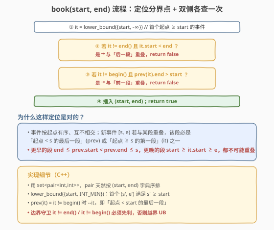
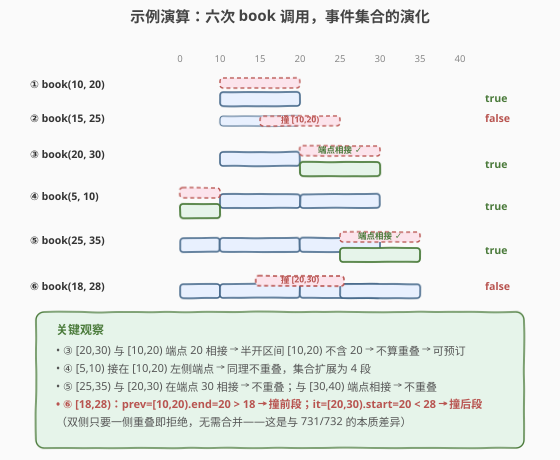

# LeetCode 我的日程安排表 I 题解

## 1. 题目概述

- **标题 / 题号**：我的日程安排表 I（#729，medium）
- **链接**：https://leetcode.cn/problems/my-calendar-i/
- **难度**：中等
- **标签**：设计、有序集合、二分查找

**题意**：实现一个 `MyCalendar` 类来存放你的日程安排。如果要添加的日程安排在**双重预订**（与已有某个安排有时间重叠）时，则无法添加，返回 `false`；否则添加成功并返回 `true`。

每个日程安排用**半开区间** `[start, end)` 表示：包含 `start`，不包含 `end`。两次安排 `[s₁, e₁)` 与 `[s₂, e₂)` **不重叠**的充要条件是 `e₁ <= s₂` 或 `e₂ <= s₁`（端点相接不算重叠）。

**示例 1**：

```text
输入：
["MyCalendar", "book", "book", "book"]
[[], [10, 20], [15, 25], [20, 30]]
输出：
[null, true, false, true]
解释：
MyCalendar myCalendar = new MyCalendar();
myCalendar.book(10, 20); // true
myCalendar.book(15, 25); // false，与 [10,20) 重叠
myCalendar.book(20, 30); // true，与 [10,20) 端点相接，不重叠
```

**约束**：

- $0 \leq \text{start} < \text{end} \leq 10^9$
- 每个测试用例最多调用 `book` $1000$ 次

> 💡 **题目本质**：维护一个「互不相交的半开区间」集合，每次 `book` 仅需判定新区间是否与已有区间**任意一段**相交——这是 [Range 模块](715_Range模块.md) 的「只增不删 + 只判不合并」简化版。由于值域高达 $10^9$ 而操作仅 $10^3$ 次，用一棵**有序集合**只存端点，把单次 `book` 压到 $O(\log n)$。

## 2. 解题思路

### 2.1 暴力思路：线性扫描全部事件

最直觉的做法是把所有已预订事件存成一个数组 `vector<pair<int,int>>`，每次 `book` 遍历所有已有事件检查是否重叠：

- 重叠判定：新事件 `[s, e)` 与已有事件 `[s', e')` 重叠 $\iff$ `s < e'` 且 `s' < e`。
- 若与任一已有事件重叠 → `false`；否则插入并返回 `true`。

单次 `book` 为 $O(n)$，$n$ 为已预订事件数，最坏 $O(1000)$；总 $O(n^2)$。对 $n \leq 1000$ 完全可以通过（约 $10^6$ 次比较），但若题目放宽到 $10^5$ 次调用则必超时。

> ⚠️ **瓶颈**：每次 `book` 都要扫描全部历史事件。事件按起点天然有序，应改用**有序关联容器**把定位降到 $O(\log n)$，只查「分界点前后各一段」。

### 2.2 核心观察：有序集合 + 双侧各查一次


用一个有序集合 `set<pair<int,int>>`（按 `(start, end)` 字典序排序），存所有已预订事件，维护两条**不变量**：

1. **互不相交**：任意相邻两段 $[s_i, e_i)$ 与 $[s_{i+1}, e_{i+1})$ 满足 $e_i \leq s_{i+1}$（端点相接允许，但无内部重叠）。
2. **按键有序**：按 `start` 升序，红黑树天然保证。

> 💡 **为什么只需查两段？** 设新事件为 $[s, e)$。在「互不相交 + 按起点有序」前提下，若它与某段重叠，该段只可能是：
> - **前一段** `prev`：起点 $< s$ 的最后一段——它若是重叠的唯一嫌疑来自「终点伸过 `s`」，即 `prev.end > s`；
> - **后一段** `it`：起点 $\geq s$ 的第一段——它若是重叠的唯一嫌疑来自「起点伸进 `e`」，即 `it.start < e`。
>
> 更早的段终点 $\leq \text{prev.start} < \text{prev.end} \leq s$，更晚的段起点 $\geq \text{it.start} \geq e$，都**不可能**与新事件重叠。因此 `lower_bound(start)` 一步定位分界点，前后各一次比较即可，无需扫描全部。

**重叠判定的等价形式**（半开区间的关键便利）：

$$[s_1, e_1) \cap [s_2, e_2) \neq \emptyset \iff s_1 < e_2 \;\wedge\; s_2 < e_1$$

- 端点相接（如 $[10,20)$ 与 $[20,30)$ 在 $20$ 处相接）：$s_2 = 20 \not< e_1 = 20$ → 不重叠 ✓
- 这正是半开区间 `[start, end)` 的便利：**端点可复用**，相邻安排无缝衔接。

### 2.3 算法流程图



**`book(start, end)`**：

1. `it = lower_bound({start, INT_MIN})` — 首个起点 $\geq \text{start}$ 的事件。
2. 若 `it != end()` 且 `it.start < end` → 与**后一段**重叠，返回 `false`。
3. 若 `it != begin()` 且 `prev(it).end > start` → 与**前一段**重叠，返回 `false`。
4. 插入 `(start, end)`，返回 `true`。

> ⚠️ **边界守卫必须先判**：`it != end()` 与 `it != begin()` 分别守卫「查后一段」与「查前一段」。`prev(begin())` 在 C++ 中是**未定义行为**（解引用越界迭代器）；`it == end()` 时解引用 `it.start` 同样 UB。两个守卫顺序无关，但缺一不可。

### 2.4 示例演算

以一条 `book` 序列演示事件集合的演化，重点看「端点相接可预订」与「双侧重叠拒绝」两种情形：



| 步骤 | 调用 | 集合变化 | 返回 | 判定依据 |
|------|------|----------|------|----------|
| ① | `book(10, 20)` | `∅` → `{[10,20)}` | `true` | 集合空，无前无后 |
| ② | `book(15, 25)` | 不变 | `false` | `prev=[10,20)`，`20 > 15` → 撞前段 |
| ③ | `book(20, 30)` | 添加 `[20,30)` → `{[10,20),[20,30)}` | `true` | `prev=[10,20)`，`20 > 20`? 否（端点相接） |
| ④ | `book(5, 10)` | 添加 `[5,10)` → `{[5,10),[10,20),[20,30)}` | `true` | 接在 `[10,20)` 左端点，`10 > 5`? 否 |
| ⑤ | `book(25, 35)` | 添加 `[25,35)` → 4 段 | `true` | 与 `[20,30)` 在 30 相接、无后续 |
| ⑥ | `book(18, 28)` | 不变 | `false` | `prev=[10,20).end=20 > 18` 撞前段；`it=[20,30).start=20 < 28` 撞后段 |

> 💡 **看第 ③ 与 ⑥ 步**：③ 中 `[20,30)` 与 `[10,20)` 在点 `20` 相接，因半开区间不含右端点，`prev.end = 20` 不满足 `> start = 20`，判定不重叠——这正是半开区间「端点可复用」的便利。⑥ 中新事件 `[18,28)` 同时撞到前段终点（`20 > 18`）和后段起点（`20 < 28`），双侧任一命中即拒绝；与 [715. Range 模块](715_Range模块.md) 的 `addRange` 不同，本题**不合并**重叠段，因为题目要求「双重预订即拒绝」。

## 3. 参考代码

### 方法一：有序集合（O(n log n)，推荐）

### C++

```cpp
class MyCalendar {
  public:
    MyCalendar() {}

    bool book(int start, int end) {
        auto it = cal.lower_bound({start, INT_MIN});   // 首个起点 ≥ start
        if (it != cal.end() && it->first < end)        // 后一段伸进来
            return false;
        if (it != cal.begin()) {                        // 前一段伸过来
            auto p = prev(it);
            if (p->second > start)
                return false;
        }
        cal.insert({start, end});
        return true;
    }

  private:
    set<pair<int, int>> cal;                            // 按 (start, end) 字典序有序、互不相交
};
```

### Python

```python
from sortedcontainers import SortedList


class MyCalendar:
    def __init__(self):
        # 每个元素存 (start, end)，按 (start, end) 字典序有序
        self.cal = SortedList()

    def book(self, start: int, end: int) -> bool:
        idx = self.cal.bisect_left((start, end))       # 首个 ≥ (start, end) 的下标
        if idx < len(self.cal) and self.cal[idx][0] < end:   # 后一段伸进来
            return False
        if idx > 0 and self.cal[idx - 1][1] > start:         # 前一段伸过来
            return False
        self.cal.add((start, end))
        return True
```

> ⚠️ **Python 实现细节**：用 `SortedList` 存 `(start, end)` 元组，`bisect_left((start, end))` 返回首个 $\geq (\text{start, end})$ 的下标。由于元组按字典序比较，`bisect_left((start, -1))` 与 `bisect_left((start, end))` 在「找首个起点 $\geq \text{start}$」上等价——但用 `(start, end)` 更直观，且不影响正确性（前一段判定只看 `idx-1`，与 `end` 取值无关）。若不想引入 `sortedcontainers`，可用 `list` + `bisect` 维护有序起点数组 + 平行数组存 `end`，单次 `book` 仍为 $O(n)$（插入需搬动），但 $n \leq 1000$ 足够。

### 方法二：暴力线性扫描（O(n²)，$n \leq 1000$ 可过）

### C++

```cpp
class MyCalendar {
  public:
    MyCalendar() {}

    bool book(int start, int end) {
        for (auto& [s, e] : cal) {
            if (start < e && s < end)                  // 半开区间相交判定
                return false;
        }
        cal.push_back({start, end});
        return true;
    }

  private:
    vector<pair<int, int>> cal;
};
```

### Python

```python
class MyCalendar:
    def __init__(self):
        self.cal = []

    def book(self, start: int, end: int) -> bool:
        for s, e in self.cal:
            if start < e and s < end:
                return False
        self.cal.append((start, end))
        return True
```

> 💡 暴力法虽 $O(n^2)$，但 $n \leq 1000$ 时仅需约 $5 \times 10^5$ 次比较，远低于时限。**面试中可作为引子**先讲暴力再优化到有序集合——展示「先正确后高效」的工程思维。

## 4. 复杂度分析

| 维度 | 方法 | 复杂度 | 说明 |
|------|------|--------|------|
| 时间复杂度 | 有序集合 | $O(\log n)$ 每次 | `lower_bound` + 两次比较 + 一次插入均 $O(\log n)$，总 $O(n \log n)$ |
| 空间复杂度 | 有序集合 | $O(n)$ | 红黑树存 $n$ 个事件，$n \leq 1000$ |
| 时间复杂度 | 暴力扫描 | $O(n)$ 每次 | 遍历全部事件，总 $O(n^2)$ |
| 空间复杂度 | 暴力扫描 | $O(n)$ | 数组存 $n$ 个事件 |

> 💡 本题值域 $10^9$、操作 $10^3$。若用值域数组需 $10^9$ 个标记位（约 125MB）且无法动态扩展；有序集合仅存 $O(10^3)$ 条端点记录（约几十 KB），**空间压缩 6 个数量级**——与 [Range 模块](715_Range模块.md) 同属「大值域稀疏区间」甜区，**不铺满值域，只记端点**。

> ⚠️ **`lower_bound` 而非 `upper_bound`**：本题要找「首个起点 $\geq \text{start}$」的事件作为后一段候选，是 `lower_bound`（找首个 $\geq$）。若误用 `upper_bound`（首个 $>$），会把「起点恰好 $= \text{start}$」的事件错归到前一段，导致 `prev` 判定时漏查该段——但实际上起点 $= \text{start}$ 的段必与新事件重叠（$s' = \text{start} < e$ 恒成立），应作为「后一段」被 `it.start < end` 判出。`lower_bound` 保证 `it` 恰好指向它。

## 5. 扩展：动态开点线段树解法

除有序集合外，**动态开点线段树**也是经典解法（值域 $[0, 10^9)$，节点维护该段是否已被预订）：

- 节点维护区间 $[l, r)$ 是否**整段**被预订（`booked` 布尔）。
- `book(start, end)`：先查询 $[\text{start, end})$ 内是否已有节点 `booked == true`；若无，则区间更新这些节点为 `booked = true` 并返回 `true`，否则返回 `false`。
- 动态开点：只在被访问时创建子节点，单次操作 $O(\log V)$，$V = 10^9$（约 30 层）。

| 维度 | 有序集合 | 动态线段树 |
|------|----------|------------|
| 单次 `book` | $O(\log n)$，$n \leq 1000$ | $O(\log V)$，$V = 10^9$（约 30 层） |
| 空间 | $O(n)$，约 $1000$ 条记录 | $O(Q \log V)$，约 $1000 \times 60$ 节点 |
| 实现复杂度 | 低（红黑树 `lower_bound` + 双侧比较） | 中（动态开点 + 查询/更新两趟） |
| 适合场景 | 只判不相交、无区间聚合 | 需要区间聚合（如最大重叠层数） |

> 💡 **何时选线段树？** 若题目再要求「查询最大重叠层数」（即 [732. 我的日程安排表 III](https://leetcode.cn/problems/my-calendar-iii/)），线段树节点可附带 `max_overlap` 字段做区间加法；有序集合则需借助差分扫描线。本题只需「是否双重预订」的布尔判定，有序集合最轻量。本题的线段树解法可参考 [715. Range 模块](715_Range模块.md) 的扩展节。

## 6. 面试要点

1. **为什么用半开区间 `[start, end)`？**

   - 半开区间满足 $|[a, b)| = b - a$，且相邻段 $[a, b)$ 与 $[b, c)$ **无交并无缝**，端点 `b` 可被两侧复用（如 `[10,20)` 与 `[20,30)` 不重叠）。闭区间 $[a, b]$ 与 $[b, c]$ 在 `b` 处共享端点，会引入「单点双重预订」的琐碎判定。LeetCode 区间题（[715](715_Range模块.md)、[57](../0001-0100/57_插入区间.md)、[56](../0001-0100/56_合并区间.md)）几乎统一用半开约定。

2. **为什么只需查分界点前后各一段？**

   - 事件按起点有序、互不相交。新事件 $[s, e)$ 若与某段重叠，该段只可能是「起点 $< s$ 的最后一段」(`prev`) 或「起点 $\geq s$ 的第一段」(`it`)。更早的段终点 $\leq \text{prev.end} \leq s$，更晚的段起点 $\geq \text{it.start} \geq e$，都不可能重叠。`lower_bound` 一步定位分界点，前后各一次比较即可。

3. **`lower_bound` 和 `upper_bound` 在这里有何区别？**

   - 本题要找「首个起点 $\geq \text{start}$」的事件，是 `lower_bound`。若误用 `upper_bound`（首个 $>$），会把「起点 $= \text{start}$」的事件错归到前一段——而该段必与新事件重叠（$s' = \text{start} < e$ 恒成立），应作为「后一段」被 `it.start < end` 判出。`lower_bound` 保证 `it` 恰好指向它，是正确性的关键。

4. **C++ 中 `prev(it)` 在 `it == begin()` 时会出什么问题？**

   - `prev(begin())` 是**未定义行为**（解引用越界迭代器）。故查前一段前必须 `if (it != cal.begin())` 守卫。Python 用下标 `idx - 1` 在 `idx == 0` 时会下溢，同理需判 `idx > 0`。

5. **与 [731. 我的日程安排表 II](https://leetcode.cn/problems/my-calendar-ii/)、[732. 我的日程安排表 III](https://leetcode.cn/problems/my-calendar-iii/) 的关系？**

   - 三者同属「日程安排」家族，区别在**允许的重叠层数**：
     - **729**（本题）：允许 1 层，双重预订即拒绝——只需判「是否与任一段重叠」，有序集合双侧比较即可。
     - **731**：允许 2 层，三重预订才拒绝——需追踪「已被双重预订的子区间」，可用两个有序集合（一个存全部预订，一个存双重预订段）。
     - **732**：允许任意层，查询最大重叠层数——需区间加法，线段树/差分扫描线是标准解法。
   - 三题的复杂度递进：729 只判布尔，731 追踪 2 层，732 做区间聚合。本题是家族的入门砖。

## 同类练习题

| # | 题目 | 与本题的关联 |
|---|------|-------------|
| 715 | [Range 模块](https://leetcode.cn/problems/range-module/)（[题解](715_Range模块.md)） | 动态区间维护并集/差集/包含判定，本题的「只增不删 + 只判不合并」超集，同属「有序 map + upper_bound 定位」家族 |
| 57 | [插入区间](https://leetcode.cn/problems/insert-interval/)（[题解](../0001-0100/57_插入区间.md)） | 静态版 `book`——把一个新区间插入有序无交区间集合，三阶段扫描合并，本题 `book` 的「只判不并」前身 |
| 56 | [合并区间](https://leetcode.cn/problems/merge-intervals/)（[题解](../0001-0100/56_合并区间.md)） | 一次性合并若干重叠区间，排序 + 线性扫描，区间并集的基础模板 |
| 731 | [我的日程安排表 II](https://leetcode.cn/problems/my-calendar-ii/) | 允许 2 层重叠，三重才拒绝——本题的「重叠层数升级版」，用两个有序集合追踪双重预订段 |
| 732 | [我的日程安排表 III](https://leetcode.cn/problems/my-calendar-iii/) | 允许任意层，查询最大重叠层数——本题的「区间聚合升级版」，线段树区间加法解法 |
