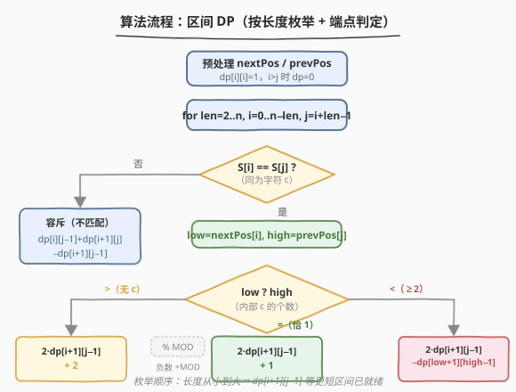
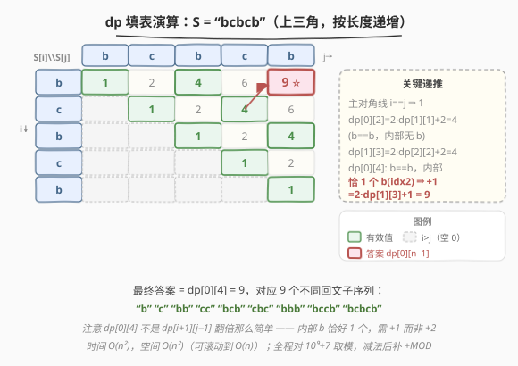

# LeetCode 统计不同回文子序列的数目 题解

## 1. 题目概述

- **标题 / 题号**：统计不同回文子序列的数目（#730，hard）
- **链接**：https://leetcode.cn/problems/count-different-palindromic-subsequences/
- **难度**：困难
- **标签**：动态规划、区间 DP、字符串、去重

**题意**：给定一个字符串 `s`，返回 `s` 中**不同的非空回文子序列**的数目。由于答案可能很大，对 $10^9 + 7$ 取模后返回。

> 💡 **子序列**：由原字符串中**不一定连续**的一段字符构成，但**相对顺序不变**。例如 `"bcb"` 是 `"bcbcb"` 的子序列（取第 0、1、2 个字符，或 0、3、4 等），但不是子串。本题统计的是**回文**的子序列，且要**去重**——同一字符串 `"bb"` 即使能由不同下标组合得到，也只算 1 个。

**示例 1**：

```text
输入：s = "bccb"
输出：6
解释：6 个不同的非空回文子序列为 "b","c","cc","bccb","bcb","bb"。
```

**示例 2**：

```text
输入：s = "abcdabcdabcdabcdabcdabcdabcdabcddcbadcbadcbadcbadcbadcbadcbadcba"
输出：104860361
解释：共有 3104860382 个不同的非空回文子序列，104860361 是对 10⁹ + 7 取余后的值。
```

> 💡 例 2 的串本身是个大回文（前半 `abcd`×8、后半 `dcba`×8），回文子序列种类爆炸式增长到 31 亿，正是「取模」与「去重」同时登场的甜区。

**约束**：

- $1 \leq \text{s.length} \leq 1000$
- `s[i]` 仅包含小写字母 `'a'`、`'b'`、`'c'`、`'d'`

> 💡 **题目本质**：区间 DP 计数 + **去重**。难点不在「计数」而在「不重不漏」——当两端字符相同时，内部回文可「外包」生成新回文，但「单字符」「双字符」是否已被内部计入，取决于该字符在内部出现了几次。字母表只有 4 种是关键甜区：既给了「按字符分类」的另一种解法（见第 5 节），又让 `nextPos/prevPos` 预处理极为轻量。

## 2. 解题思路

### 2.1 暴力思路：枚举所有子序列去重

最直觉的做法：枚举 `s` 的所有 $2^n$ 个子序列（$n \leq 1000$，不可行），判断每个是否回文，丢进哈希集合去重。即便只对 $n \leq 30$ 的规模，$2^{30} \approx 10^9$ 也已爆表。

> ⚠️ 暴力法有两个致命浪费：① 枚举了**所有**子序列而非只回文；② 用哈希去重把「同一回文的不同来源」重复存储。区间 DP 同时解决了这两点——**只在区间上递推「不同回文数」这个标量**，递推过程自带去重。

### 2.2 核心观察：区间 DP + 端点去重三分支

![核心：S[i]==S[j]==c 时的去重三分支](../images/palcount_concept.svg)

**状态定义**：

$$dp[i][j] = \text{子串 } s[i..j] \text{ 中不同非空回文子序列的数目}$$

**基础**：$dp[i][i] = 1$（单字符即一个回文）；$i > j$ 时 $dp[i][j] = 0$（空串）。

**转移分两大情况**：

#### 情况一：$s[i] \neq s[j]$

两端的字符不同，谁也做不了「外包」。直接容斥（类似求并集）：

$$dp[i][j] = dp[i][j-1] + dp[i+1][j] - dp[i+1][j-1]$$

> 减去 $dp[i+1][j-1]$ 是因为「不含 $s[j]$ 的回文」（$dp[i][j-1]$）与「不含 $s[i]$ 的回文」（$dp[i+1][j]$）交集恰为「两端都不含」$= dp[i+1][j-1]$，被加了两次。

#### 情况二：$s[i] == s[j] == c$

此时内部任意回文 $p$ 可「原样保留」或「外包成 $c + p + c$」，朴素翻倍 $2 \cdot dp[i+1][j-1]$。但要扣/补**单字符 `c` 与双字符 `cc`** 是否已被内部计入。设 `low` 为 $(i,j)$ 内第一个 $c$ 的下标、`high` 为 $(i,j)$ 内最后一个 $c$ 的下标：

| 内部 $c$ 的个数 | 判定 | 转移 | 理由 |
|----------------|------|------|------|
| 0 个（`low > high`） | `nextPos[i] >= j` | $2 \cdot dp[i+1][j-1] + \mathbf{2}$ | `c`、`cc` 全新，需补上 |
| 恰 1 个（`low == high`） | `nextPos[i] < j` 且 `== prevPos[j]` | $2 \cdot dp[i+1][j-1] + \mathbf{1}$ | `c` 已计，仅补 `cc` |
| ≥2 个（`low < high`） | | $2 \cdot dp[i+1][j-1] - dp[\text{low+1}][\text{high-1}]$ | `c`/`cc` 已计；但 $c+p+c$ 与内部 $c+q+c$ 重复，扣中间段 |

> ⚠️ **第三分支为何减 $dp[\text{low+1}][\text{high-1}]$？** 内部至少两个 $c$（首 `low`、末 `high`）时，形如 $c \cdots c$（首尾都是 $c$）的回文，既可作为「内部原样」出现，也可作为「外包 $c+p+c$」再次出现——重复的恰是「两端为 $c$ 的内部回文」，它们等于 $c$ 包住 $s[\text{low+1}..\text{high-1}]$ 的回文，数目即 $dp[\text{low+1}][\text{high-1}]$。注意此时 `c` 和 `cc` 都已在 $dp[i+1][j-1]$ 中（内部有 $c$），故不加只减。

> 💡 **`nextPos/prevPos` 预处理**：由于只 4 种字母，可对每个下标 $i$ 预存「下一个与 $s[i]$ 相同的字符位置 `nextPos[i]`」和「上一个相同字符位置 `prevPos[i]`」。于是 `low = nextPos[i]`、`high = prevPos[j]`，转移 $O(1)$，整体 $O(n^2)$。若不预处理而每次线性扫描，则退化为 $O(n^3)$，$n=1000$ 会超时。

### 2.3 算法流程图



**完整步骤**：

1. **预处理**：扫描两遍求 `nextPos[i]`（从右往左，每种字母记最近下标）与 `prevPos[i]`（从左往右）。
2. **初始化**：`dp` 为 $n \times n$ 全 0 矩阵，`dp[i][i] = 1`。
3. **按长度递增枚举**：`len` 从 2 到 $n$，对每个 $i$、$j = i + \text{len} - 1$：
   - $s[i] \neq s[j]$：容斥三段式。
   - $s[i] == s[j]$：求 `low`、`high`，按三分支选公式。
   - 每步结果 `% MOD`，若为负数 `+= MOD`。
4. **返回** `dp[0][n-1]`。

> 💡 **为何按长度递增？** $dp[i][j]$ 依赖 $dp[i+1][j-1]$、$dp[i][j-1]$、$dp[i+1][j]$ 等更短区间，必须先算短的。外层循环「长度」天然保证依赖已就绪——这是区间 DP 的标准枚举顺序。

### 2.4 示例演算

以 `s = "bcbcb"` 为例，演算 $5 \times 5$ 上三角 `dp` 表：



| 格子 | 子串 | 端点 | 转移 | 值 | 关键说明 |
|------|------|------|------|----|----------|
| `dp[0][0]` | `"b"` | — | 基础 | 1 | 单字符 |
| `dp[0][1]` | `"bc"` | b≠c | 容斥 | 2 | "b","c" |
| `dp[0][2]` | `"bcb"` | b==b | 无内部 b → +2 | 4 | $2 \cdot dp[1][1] + 2 = 2 \cdot 1 + 2$ |
| `dp[1][3]` | `"cbc"` | c==c | 无内部 c → +2 | 4 | 同上 |
| `dp[0][3]` | `"bcbc"` | b≠c | 容斥 | 6 | $dp[0][2]+dp[1][3]-dp[1][2]=4+4-2$ |
| `dp[0][4]` | `"bcbcb"` | b==b | **内部恰 1 个 b(idx2) → +1** | 9 ⭐ | $2 \cdot dp[1][3] + 1 = 2 \cdot 4 + 1$ |

> 💡 **看 `dp[0][4]` 的关键**：$s[0]=s[4]=b$，内部 `s[1..3]="cbc"` 含 `b` 恰 1 个（在 idx 2），故走「+1」分支而非「+2」——`"b"` 已被 `dp[1][3]` 计入（内部那个 b 贡献），只需补全新的 `"bb"`（用 $s[0]$ 与 $s[4]$）。最终 9 个回文：`"b","c","bb","cc","bcb","cbc","bbb","bccb","bcbcb"`。若误用 +2 会得到 10（多算一个 `"b"`），这就是去重分支的意义。

## 3. 参考代码

### C++

```cpp
class Solution {
    static constexpr int MOD = 1e9 + 7;
public:
    int countPalindromicSubsequences(string s) {
        int n = s.size();
        // 预处理：nextPos[i]=下一个与 s[i] 相同字符的下标(n 表无)，prev[i]=上一个(-1 表无)
        vector<int> nextPos(n, n), prevPos(n, -1);
        vector<int> last(26, -1);
        for (int i = 0; i < n; i++) {            // 从左到右求 prev
            int c = s[i] - 'a';
            if (last[c] != -1) prevPos[i] = last[c];
            last[c] = i;
        }
        fill(last.begin(), last.end(), n);
        for (int i = n - 1; i >= 0; i--) {       // 从右到左求 next
            int c = s[i] - 'a';
            if (last[c] != n) nextPos[i] = last[c];
            last[c] = i;
        }

        vector<vector<int>> dp(n, vector<int>(n, 0));
        for (int i = 0; i < n; i++) dp[i][i] = 1;

        for (int len = 2; len <= n; len++) {
            for (int i = 0; i + len - 1 < n; i++) {
                int j = i + len - 1;
                if (s[i] != s[j]) {
                    // 容斥：并 = 左 + 右 - 交
                    long long v = (long long)dp[i][j-1] + dp[i+1][j] - dp[i+1][j-1];
                    dp[i][j] = ((v % MOD) + MOD) % MOD;
                } else {
                    int low  = nextPos[i];        // (i,j) 内首个 c
                    int high = prevPos[j];        // (i,j) 内末个 c
                    if (low > high) {
                        // 无 c 在内部
                        dp[i][j] = (2LL * dp[i+1][j-1] + 2) % MOD;
                    } else if (low == high) {
                        // 恰 1 个 c
                        dp[i][j] = (2LL * dp[i+1][j-1] + 1) % MOD;
                    } else {
                        // ≥2 个 c，扣中间段
                        long long v = 2LL * dp[i+1][j-1] - dp[low+1][high-1];
                        dp[i][j] = ((v % MOD) + MOD) % MOD;
                    }
                }
            }
        }
        return dp[0][n-1];
    }
};
```

### Python

```python
class Solution:
    def countPalindromicSubsequences(self, s: str) -> int:
        MOD = 10**9 + 7
        n = len(s)

        # 预处理 nextPos / prevPos
        nextPos = [n] * n
        prevPos = [-1] * n
        last = {}
        for i, ch in enumerate(s):
            if ch in last:
                prevPos[i] = last[ch]
            last[ch] = i
        last.clear()
        for i in range(n - 1, -1, -1):
            ch = s[i]
            if ch in last:
                nextPos[i] = last[ch]
            last[ch] = i

        dp = [[0] * n for _ in range(n)]
        for i in range(n):
            dp[i][i] = 1

        for length in range(2, n + 1):
            for i in range(n - length + 1):
                j = i + length - 1
                if s[i] != s[j]:
                    dp[i][j] = (dp[i][j-1] + dp[i+1][j] - dp[i+1][j-1]) % MOD
                else:
                    low = nextPos[i]
                    high = prevPos[j]
                    if low > high:               # 内部无 c
                        dp[i][j] = (2 * dp[i+1][j-1] + 2) % MOD
                    elif low == high:            # 恰 1 个 c
                        dp[i][j] = (2 * dp[i+1][j-1] + 1) % MOD
                    else:                        # ≥2 个 c，去重
                        dp[i][j] = (2 * dp[i+1][j-1] - dp[low+1][high-1]) % MOD

        return dp[0][n-1] % MOD
```

> ⚠️ **三个高频踩坑点**：
> （1）**减法取模出负数**。C++ 中 `(a - b) % MOD` 可能为负，必须 `((v % MOD) + MOD) % MOD`；Python 的 `%` 对正模数总返回非负，但仍建议最终 `return ... % MOD` 兜底。
> （2）**`low > high` 的判定依赖 `nextPos` 取哨兵值**。当 $(i,j)$ 内无 $c$ 时，`nextPos[i]` 要么等于 $j$（$j$ 本身就是 $c$），要么是 $n$（右侧再无 $c$）；`prevPos[j]` 等于 $i$ 或 $-1$。此时 `low >= j > i >= high` 必然成立，`low > high` 自然触发「无内部 c」分支——前提是 `nextPos` 用 $n$、`prevPos` 用 $-1$ 作哨兵，切勿用 $0$ 或 $n-1$。
> （3）**混淆「子序列」与「子串」**。本题求子序列（可断），所以才有「外包 $c+p+c$」的转移；若是 [647. 回文子串](https://leetcode.cn/problems/palindromic-substrings/)（子串，须连续），转移完全不同（中心扩展/Manacher）。看到「子序列」就要想到「可跳过中间字符、可外包」。

## 4. 复杂度分析

| 维度 | 复杂度 | 说明 |
|------|--------|------|
| 时间 | $O(n^2)$ | 状态数 $O(n^2)$，每态 $O(1)$ 转移（依赖 `nextPos/prevPos` 预处理） |
| 预处理 | $O(n)$ | 两遍扫描求 `nextPos`、`prevPos`，字母表仅 4 种更轻量 |
| 空间 | $O(n^2)$ | `dp` 矩阵；`nextPos/prevPos` 各 $O(n)$ |
| 滚动优化 | $O(n)$ 空间 | 见第 5 节：按字符分类的 4 色 DP，或一维滚动 |

> 💡 $n \leq 1000$ 时 $n^2 = 10^6$ 状态、每态常数转移，约 $10^6$ 次运算，毫秒级通过。`dp` 矩阵 $10^6$ 个 `int` 约 4MB，内存充裕。

> ⚠️ **不能退化为 $O(n^3)$**：若不预处理 `nextPos/prevPos`，每态线性扫描内部找首末 $c$，整体 $O(n^3) = 10^9$ 会超时。预处理是本题从 $O(n^3)$ 到 $O(n^2)$ 的关键一步。

## 5. 扩展：按字符分类的 4 色 DP（利用字母表甜区）

本题约束字母仅 `a,b,c,d` 四种，给了另一种更直接的 DP：

**状态**：$dp[i][j][k]$ 表示子串 $s[i..j]$ 中**首尾字符均为 $k$**（$k \in \{a,b,c,d\}$）的不同回文子序列数目。

**转移**（对每个 $k$）：

- 若 $s[i] \neq k$：$dp[i][j][k] = dp[i+1][j][k]$（左端点不对，收缩）。
- 若 $s[j] \neq k$：$dp[i][j][k] = dp[i][j-1][k]$（右端点不对，收缩）。
- 若 $s[i] == s[j] == k$：$dp[i][j][k] = 2 + \sum_{c} dp[i+1][j-1][c]$（两端 $k$ 各贡献 `"k"`、`"kk"`，加内部所有回文外包 $k \cdots k$ 的数目 = 内部全部回文数）。

**答案**：$\sum_{k} dp[0][n-1][k]$。

| 维度 | 本题主解（区间去重） | 4 色 DP |
|------|----------------------|---------|
| 状态 | $O(n^2)$ | $O(4 n^2)$ |
| 转移 | $O(1)$（需 `nextPos`） | $O(1)$（求和 4 项） |
| 字母表 | 任意字符 | 仅适用固定小字母表 |
| 思路难点 | 去重三分支易写错 | 转移直观、无需去重 case |
| 空间优化 | 滚动到 $O(n)$ 较繁琐 | 滚动到 $O(4n)$ 自然 |

> 💡 **何时选哪种？** 若字母表固定且小（如本题 4 种），4 色 DP 更不易错——它把「去重」转嫁到「按首尾字符分类」上，每类天然互斥，求和即总数。若字母表大（推广到 26 种甚至任意字符），4 色 DP 退化为 $O(|\Sigma| n^2)$，主解的 $O(n^2)$ 去重法更优。**面试时两种都提一句，体现对甜区的敏感度**。

### 滚动数组空间优化

主解 $dp[i][j]$ 依赖 $dp[i+1][\cdots]$（下一行）与同行 $dp[i][j-1]$（左邻），可用一维数组 + `prev` 变量滚动到 $O(n)$ 空间。但区间 DP 的滚动方向不如 [718 最长重复子数组](../0701-0800/718_最长重复子数组.md) 那样只依赖左上角干净——本题依赖「下、左、左下」三个方向，滚动时需小心保存对角线旧值。$n=1000$ 时 $O(n^2)$ 空间已够用，滚动主要作为「数据范围放大时的思路储备」。

## 6. 面试要点

1. **为什么 $s[i]==s[j]$ 时朴素翻倍 $2 \cdot dp[i+1][j-1]$ 不够？要补/扣什么？**

   > 翻倍只覆盖了「内部回文 $p$ 原样保留」与「外包 $c+p+c$」两类。但单字符 `"c"` 和双字符 `"cc"` 不来自任何内部 $p$ 的外包（外包要求 $p$ 非空），它们是否已被 $dp[i+1][j-1]$ 计入，取决于内部是否含 $c$：不含则两者全新（+2），恰 1 个则 `"c"` 已计而 `"cc"` 全新（+1），≥2 个则两者都已计且外包会与内部 $c+q+c$ 重复（−中间段）。

2. **第三分支为什么减 $dp[\text{low+1}][\text{high-1}]$ 而非别的？**

   > 内部 ≥2 个 $c$ 时，设首为 `low`、末为 `high`。形如「两端是 $c$ 的回文」既可作为内部原样、也可作为 $c+p+c$ 外包，被算两次。这批重复回文 = 「以 `low`、`high` 为端点」的回文 = $c$ 包住 $s[\text{low+1}..\text{high-1}]$ 内任意回文，数目恰为 $dp[\text{low+1}][\text{high-1}]$。注意是「low+1 到 high-1」这最内层一段，不是整个 $s[i+1..j-1]$。

3. **`nextPos/prevPos` 为什么用 $n$ 和 $-1$ 作哨兵？**

   > 表示「不存在」。判定 `low > high` 依赖此：内部无 $c$ 时 `nextPos[i]` 取 $j$ 或 $n$，`prevPos[j]` 取 $i$ 或 $-1$，二者必然 `low > high`。若误用 $0$/$n-1$ 作哨兵，会与合法下标混淆，把「无内部 c」误判成「有内部 c」，算出错误结果。

4. **不匹配时为何用容斥 $dp[i][j-1]+dp[i+1][j]-dp[i+1][j-1]$？**

   > 「$s[i..j]$ 的回文」=「不含 $s[j]$ 的」（$dp[i][j-1]$）∪「不含 $s[i]$ 的」（$dp[i+1][j]$），两者并集即全集（$s[i] \neq s[j]$ 时一个回文不可能同时以这两端为边界）。交集 = 「两端都不含」= $dp[i+1][j-1]$，被加了两次需减去。这与 [198 打家劫舍](../0101-0200/198_打家劫舍.md) 之类的一维 DP 不同，是「集合并」的标准容斥。

5. **与 [647. 回文子串](https://leetcode.cn/problems/palindromic-substrings/)、[1312. 让字符串成为回文串的最少插入次数](https://leetcode.cn/problems/minimum-insertion-steps-to-make-a-string-palindrome/) 的区别？**

   > 三者都是「区间 DP + 回文」，但目标不同：647 求**子串**（连续）回文数，转移看 $s[i]==s[j]$ 则 $dp[i+1][j-1]$ 为真即可，无需去重；1312 求**最少插入**使整个串成回文，转移是 $\min$ 而非计数；730 求**子序列**（可断）且**去重**，最难在去重三分支。看到「子序列 + 去重 + 计数」就要想到本题的三分支套路。

> 💡 **一句话总结**：730 是区间 DP 计数的「去重巅峰」——$s[i]==s[j]$ 时按内部该字符出现 0/1/≥2 次分别 +2/+1/−中间段，配 `nextPos/prevPos` 预处理做到 $O(n^2)$。记住「**端点同字符，外包翻倍；内部 c 的个数决定加 2 / 加 1 / 减去重**」，全程取模注意减法补正。

## 同类练习题

| # | 题目 | 与本题的关联 |
|---|------|-------------|
| 647 | [回文子串](https://leetcode.cn/problems/palindromic-substrings/) | 区间 DP 求回文**子串**数（连续），转移只判 $s[i]==s[j]$ 无需去重，对比「子串 vs 子序列」的差异 |
| 1312 | [让字符串成为回文串的最少插入次数](https://leetcode.cn/problems/minimum-insertion-steps-to-make-a-string-palindrome/) | 区间 DP 求 $\min$ 插入次数，同样按 $s[i]==s[j]$ 分支但目标是优化而非计数 |
| 718 | [最长重复子数组](../0701-0800/718_最长重复子数组.md)（[题解](../0701-0800/718_最长重复子数组.md)） | 二维/区间 DP 的「连续 vs 可断」分野对照，本题是其「去重计数」进阶 |
| 5 | [最长回文子串](https://leetcode.cn/problems/longest-palindromic-substring/)（[题解](../0001-0100/5_最长回文子串.md)） | 回文基础题，中心扩展/Manacher，与本题的区间 DP 互为补充视角 |
| 375 | [猜数字大小 II](https://leetcode.cn/problems/guess-number-higher-or-lower-ii/) | 区间 DP 求「最坏代价最小」，同样按端点枚举 + 区间递推，巩固区间 DP 模板 |
