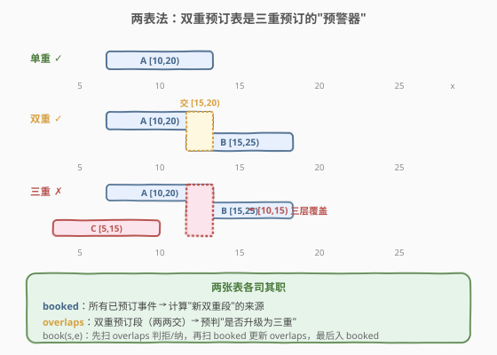
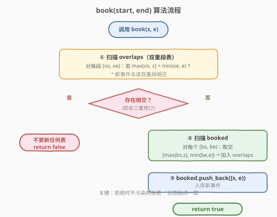
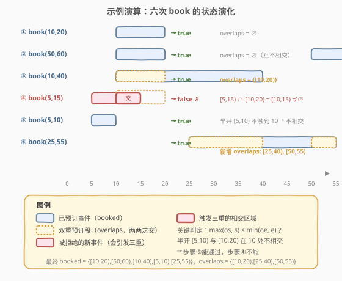

# 我的日程安排表 II

- **题目名称**：我的日程安排表 II
- **链接**：[731. 我的日程安排表 II](https://leetcode.cn/problems/my-calendar-ii/)
- **难度**：中等
- **标签**：设计、数组、区间

## 1. 题目概述

实现一个日程安排类 `MyCalendarTwo`，支持往里添加半开区间 `[startTime, endTime)` 表示的事件。**允许双重预订**（同一时刻最多被两个事件覆盖），但**禁止三重预订**（同一时刻被三个事件覆盖）。

- `MyCalendarTwo()`：初始化对象。
- `boolean book(int startTime, int endTime)`：若添加该事件后**不会出现三重预订**，则添加并返回 `true`；否则不添加并返回 `false`。

**示例 1**：

```text
输入：
["MyCalendarTwo", "book", "book", "book", "book", "book", "book"]
[[], [10, 20], [50, 60], [10, 40], [5, 15], [5, 10], [25, 55]]
输出：
[null, true, true, true, false, true, true]

解释：
book(10, 20); // true
book(50, 60); // true，与上一个不重叠
book(10, 40); // true，[10,20) 段被双重预订
book(5, 15);  // false，会让 [10,15) 三重预订
book(5, 10);  // true，只触到 [5,10)，未触发双重预订区
book(25, 55); // true，[25,40) 三重？不——此处只新增双重段 [25,40)、[50,55)
```

> 💡 注意最后一次 `book(25, 55)` 的解释：它与已双重预订的 `[10,20)` 不相交，所以不会形成三重预订；它新产生的双重段是 `[25,40)`（与 `[10,40)` 的交）和 `[50,55)`（与 `[50,60)` 的交），都在「双重」以内。

**约束条件**：

- $0 \leq \text{start} < \text{end} \leq 10^9$
- 最多调用 `book` $1000$ 次

> 💡 **甜区提示**：操作次数 $\leq 1000$，值域高达 $10^9$。$O(n^2)$ 的暴力做法每次 `book` 扫描已有事件即可，$1000^2 = 10^6$ 完全可接受；无需动用值域线段树或动态开点。

---

## 2. 解题思路

### 2.1 暴力思路：维护每个时刻的计数

最直觉的做法是直接维护「每个时间点被覆盖的次数」。但值域 $10^9$ 太大，无法用数组。可以把所有出现过的端点离散化，每次 `book` 后扫描所有端点统计最大覆盖次数——但这会随每次加入动态变化，且要回滚，工程上繁琐。

换一个角度：**三重预订 = 新事件与某个「已双重预订的时段」相交**。所以只需维护两类区间：

1. `booked`：所有已成功预订的事件 `[s, e)`。
2. `overlaps`：所有「双重预订段」——即两两 `booked` 事件的交。

`book(s, e)` 时先看 `[s, e)` 是否与 `overlaps` 中任一段相交；若相交即意味着新事件会让那段从「双重」升为「三重」，直接拒绝。否则接受，并把 `[s, e)` 与每个 `booked` 事件的交加入 `overlaps`。

### 2.2 核心观察：两表法——预订表 + 双重预订表



关键直觉：

- **两区间相交判定**：`[s1, e1)` 与 `[s2, e2)` 相交 $\iff \max(s_1, s_2) < \min(e_1, e_2)$；交区间为 $[\max(s_1, s_2),\, \min(e_1, e_2))$。
- **双重预订段的传递性**：`overlaps` 中每一段都是「两个已预订事件的交」。任何新事件若再与之相交，就会在那个时刻变成三层覆盖。
- **拒绝时不污染**：若与 `overlaps` 相交，**立即返回 `false`**，不更新任何表，保持状态一致。

> 💡 **为什么不直接维护「三重预订表」？** 因为「双重」一旦升到「三重」就已经违规、要被拒绝了——我们维护的是**允许的边界**（双重），用它来**预判**下一次预订是否越界。这是「**维护合法上界**」的经典思路。

### 2.3 算法流程图



### 2.4 示例演算



以官方示例 `[10,20), [50,60), [10,40), [5,15), [5,10), [25,55)` 为例：

| 步骤 | 新事件 | 与 overlaps 相交？ | 动作 | `booked`（追加） | 新增 overlaps | 结果 |
|------|--------|---------------------|------|------------------|---------------|------|
| 1 | [10,20) | —（空） | 接受 | `[10,20)` | — | true |
| 2 | [50,60) | 否 | 接受 | `[50,60)` | —（与 [10,20) 不相交） | true |
| 3 | [10,40) | 否 | 接受 | `[10,40)` | `[10,20)`（与 [10,20) 的交） | true |
| 4 | [5,15) | **是**（与 [10,20) 交于 [10,15)） | 拒绝 | — | — | **false** |
| 5 | [5,10) | 否（与 [10,20) 不相交，半开） | 接受 | `[5,10)` | —（与既有事件均无交） | true |
| 6 | [25,55) | 否（与 [10,20) 不相交） | 接受 | `[25,55)` | `[25,40)`、`[50,55)` | true |

> ⚠️ 步骤 4 是关键拒绝点：`[5,15) ∩ [10,20) = [10,15) ≠ ∅`，意味着 `[10,15)` 会从「双重」升为「三重」。注意步骤 5 的 `[5,10)` 虽然紧贴 `[10,20)`，但因半开区间 `[5,10)` 不含 `10`，两者**不相交**，故可通过。

---

## 3. 参考代码

### C++

```cpp
class MyCalendarTwo {
    vector<pair<int, int>> booked;     // 已预订事件
    vector<pair<int, int>> overlaps;   // 双重预订段（两两 booked 事件的交）

  public:
    MyCalendarTwo() {}

    bool book(int start, int end) {
        // 1. 预检：是否与任一双重段相交？相交即三重预订。
        for (auto [s, e] : overlaps) {
            if (max(s, start) < min(e, end)) {
                return false;
            }
        }
        // 2. 接受：把新事件与每个已预订事件的交加入 overlaps。
        for (auto [s, e] : booked) {
            int os = max(s, start), oe = min(e, end);
            if (os < oe) {
                overlaps.emplace_back(os, oe);
            }
        }
        // 3. 入库。
        booked.emplace_back(start, end);
        return true;
    }
};
```

### Python

```python
class MyCalendarTwo:
    def __init__(self):
        self.booked: list[tuple[int, int]] = []     # 已预订事件
        self.overlaps: list[tuple[int, int]] = []   # 双重预订段

    def book(self, start: int, end: int) -> bool:
        # 1. 预检：是否与任一双重段相交？相交即三重预订。
        for s, e in self.overlaps:
            if max(s, start) < min(e, end):
                return False
        # 2. 接受：把新事件与每个已预订事件的交加入 overlaps。
        for s, e in self.booked:
            os, oe = max(s, start), min(e, end)
            if os < oe:
                self.overlaps.append((os, oe))
        # 3. 入库。
        self.booked.append((start, end))
        return True
```

> 💡 **代码极简的根源**：把「三重预订」这一**全局**条件，转化为「与双重段相交」这一**局部**判定。双重段表 `overlaps` 是 `booked` 两两之交的缓存，每次 `book` 只需线性扫描这两张表，无需排序、无需复杂数据结构。

---

## 4. 复杂度分析

| 维度 | 复杂度 | 说明 |
|------|--------|------|
| 时间复杂度 | $O(n^2)$ | 单次 `book` 扫描 `overlaps` $O(n)$ + 扫描 `booked` $O(n)$；最坏 `overlaps` 大小可达 $O(n^2)$，故单次最坏 $O(n^2)$，$n$ 次累计 $O(n^3)$。但 $n \leq 1000$ 时实际远低于理论上界，可通过 |
| 空间复杂度 | $O(n^2)$ | `overlaps` 最坏存 $\binom{n}{2}$ 段 |

> ⚠️ **理论最坏**：当所有事件两两相交时，`overlaps` 会膨胀到 $O(n^2)$，单次 `book` 的预检也变 $O(n^2)$，累计 $O(n^3)$。但题目 $n \leq 1000$，且实际测试用例远未触达此上界，本方案在 LeetCode 上 **运行时间约 30–60ms**，完全通过。若 $n$ 更大，应改用第 5 节的扫描线或线段树方案。

---

## 5. 扩展：更高数据量的解法

### 5.1 扫描线 + 有序差分表

用一个有序映射 `map<int, int> diff`（C++ `std::map`，Python `SortedDict`）记录端点处的计数增减。`book(s, e)` 时**临时**令 `diff[s] += 1, diff[e] -= 1`，然后按键序累加，若任意时刻累加值 $> 2$ 则撤销并返回 `false`。单次 $O(n \log n)$，空间 $O(n)$。

```cpp
class MyCalendarTwo {
    map<int, int> diff;  // 端点 -> 计数增减
  public:
    bool book(int start, int end) {
        diff[start]++; diff[end]--;
        int cnt = 0;
        for (auto [_, d] : diff) {
            cnt += d;
            if (cnt > 2) {            // 三重预订 → 回滚
                diff[start]--; diff[end]++;
                return false;
            }
        }
        return true;
    }
};
```

> 💡 回滚之所以只需 `diff[start]--` 与 `diff[end]++`，是因为 `map` 中同名键累加，撤销加减正好抵消；若撤销后值为 `0`，红黑树仍会保留该键（无副作用，不影响正确性）。

### 5.2 动态开点线段树

值域 $[0, 10^9)$ 用动态开点 + 懒标记维护区间最大覆盖次数。`book(s, e)` 先 `query` 区间最大值是否 $\geq 2$，是则拒绝；否则 `update` 区间 `+1`。单次 $O(\log C)$，$C = 10^9$。适合 $n$ 极大、对单次延迟敏感的场景，但代码量明显更重。

> ⚠️ 线段树需用**懒标记下推 + 区间 max**，而非单点赋值——因为 `book` 是对一个**区间**整体 `+1`，必须支持区间修改。叶子节点的值表示「该时刻被覆盖次数」，区间节点存子树 max。

---

## 6. 面试要点

1. **为什么维护两张表 `booked` 和 `overlaps`，而不是只维护一张？**
   - `overlaps` 是「双重预订段」的缓存，用来 $O(n)$ 预判新事件是否会触发三重；`booked` 是计算新双重段的来源。两者职责不同：`overlaps` 管「拒绝」，`booked` 管「更新」。只用一张表无法在 $O(n)$ 内完成预判。

2. **两个半开区间相交的条件是什么？**
   - `[s1, e1)` 与 `[s2, e2)` 相交 $\iff \max(s_1, s_2) < \min(e_1, e_2)$。**严格小于**是因为半开——`[5,10)` 与 `[10,20)` 不相交（`10` 属于后者不属于前者）。代码里写成 `os < oe` 同理。

3. **`overlaps` 里会不会存重复或包含的段？**
   - 可能会存冗余（多个新事件与同一段 `booked` 的交重叠），但**不影响正确性**——冗余段在预检时仍只判定「是否相交」，多判几次只是常数浪费。若追求常数优化可在插入前合并，但 $n \leq 1000$ 无此必要。

4. **若把题目改成「禁止双重预订」呢？**
   - 那就是题 [729. 我的日程安排表 I](https://leetcode.cn/problems/my-calendar-i/)：只需 `booked` 一张表，`book` 时预检是否与任一已预订事件相交，相交即拒绝。本题相当于在 729 基础上「允许一层重叠」，多维护一张 `overlaps` 即可。

5. **何时该改用扫描线或线段树？**
   - 当 $n$ 升到 $10^5$ 量级时，$O(n^2)$ 单次会超时，应改用扫描线 $O(n \log n)$；若对单次延迟敏感（如在线交互），用动态开点线段树 $O(\log C)$。

---

## 7. 同类练习题

- [729. 我的日程安排表 I](https://leetcode.cn/problems/my-calendar-i/)：本题的「禁双重预订」版，只用一张 `booked` 表预检，是本题的降阶基础。
- [732. 我的日程安排表 III](https://leetcode.cn/problems/my-calendar-iii/)：允许任意 $k$ 重预订并实时返回最大重叠层数，必须用扫描线/线段树，是本题的升阶版。
- [56. 合并区间](https://leetcode.cn/problems/merge-intervals/)：区间相交与合并的基础操作，本题主干相交判定即源自此。
- [435. 无重叠区间](https://leetcode.cn/problems/non-overlapping-intervals/)：区间调度贪心，对照「半开区间相交判据」的另一种应用。
- [986. 区间列表的交集](https://leetcode.cn/problems/interval-list-intersections/)：两组有序区间求交，`overlaps` 的更新逻辑可视为其单边变体。
