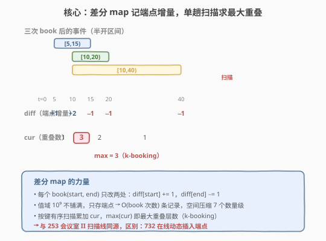
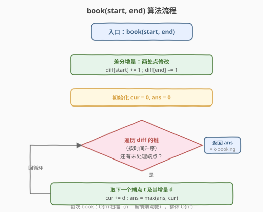
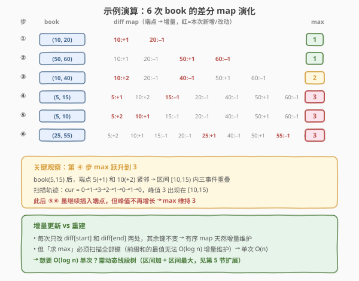

# LeetCode 我的日程安排表 III 题解

## 1. 题目概述

- **标题 / 题号**：我的日程安排表 III（#732，hard）
- **链接**：https://leetcode.cn/problems/my-calendar-iii/
- **难度**：困难
- **标签**：设计、线段树、差分数组、扫描线、有序集合

**题意**：实现一个 `MyCalendarThree` 类，支持**动态**预订日程区间 `[start, end)`（**半开区间**），每次预订后返回当前所有日程中**任意时刻的最大重叠层数**（即 **k-booking**：存在某个时刻被恰好 $k$ 个日程覆盖，求最大的 $k$）。

```cpp
MyCalendarThree();
int book(int start, int end);
```

**示例 1**：

```text
输入：
["MyCalendarThree", "book", "book", "book", "book", "book", "book"]
[[], [10, 20], [50, 60], [10, 40], [5, 15], [5, 10], [25, 55]]
输出：
[null, 1, 1, 2, 3, 3, 3]
解释：
  book(10, 20) → 最大重叠 1（仅 [10,20) 一段）
  book(50, 60) → 最大重叠 1（[50,60) 与前者不相交）
  book(10, 40) → 最大重叠 2（[10,20) 与 [10,40) 在 [10,20) 重叠）
  book(5, 15)  → 最大重叠 3（[5,15)、[10,20)、[10,40) 在 [10,15) 三重重叠）
  book(5, 10)  → 最大重叠 3（峰值仍出现在 [10,15)）
  book(25, 55) → 最大重叠 3（新区间不增加峰值）
```

**约束**：

- $0 \leq \text{start} < \text{end} \leq 10^9$
- `book` 的总调用次数最多 $400$ 次

> 💡 **题目本质**：这是 [253. 会议室 II](../0201-0300/253_会议室II.md) 的**在线动态版**——253 一次性给出所有区间求最大并发数，732 则要求每次插入一个新区间后**实时**回答全局最大重叠数。值域高达 $10^9$ 但操作仅 $400$ 次，是典型的「**大值域稀疏端点**」甜区：用有序映射只存端点增量，把 $10^9$ 压缩成 $O(\text{book 次数})$ 条记录。

## 2. 解题思路

### 2.1 暴力思路：值域数组 + 区间加

最直觉的做法是开一个长度 $10^9$ 的数组 `cnt[x]` 记录时刻 $x$ 的重叠数，每次 `book(start, end)` 对 `[start, end)` 逐点 `cnt[x]++`，再扫一遍全局取 `max`。

> ⚠️ **瓶颈**：值域 $10^9$ 的数组需要约 $4\text{GB}$ 内存，完全不现实。而且真正影响答案的只有**端点**——区间内部的重叠数只在端点处发生变化。逐点铺满值域是极大的浪费。

### 2.2 核心观察：有序差分 map + 单趟扫描



把 [253. 会议室 II](../0201-0300/253_会议室II.md) 的**扫描线**思路搬到在线场景：用一个有序映射 `diff: map<int,int>` 作为**差分数组**，只在端点处记录增量。

- **`book(start, end)`**：`diff[start] += 1`（进入一个区间，重叠数 +1），`diff[end] -= 1`（离开一个区间，重叠数 −1）。
- **求最大重叠**：按 key 升序扫描 `diff`，维护累加和 `cur`（当前重叠数），`max(cur)` 即答案。

> 💡 **为什么扫描就能得到最大重叠？** 差分数组的前缀和就是原数组的逐点值。`diff` 的 key 是所有「重叠数发生变化」的时刻，按序累加增量得到的 `cur` 就是相邻两个端点之间那段区间内的重叠数。最大重叠必定出现在某个端点处刚进入之后，故扫描一遍取 `max(cur)` 完整覆盖。

**三条关键观察**：

1. **稀疏性**：值域 $10^9$ 但 `book` 仅 $400$ 次 → 端点至多 $800$ 个。有序 map 只存端点，空间 $O(n)$ 而非 $O(10^9)$，**压缩 7 个数量级**。
2. **增量更新**：每次 `book` 只改 `diff` 中两个 key（`start` 和 `end`），其余不变。有序 map 的 `[]` 操作天然 $O(\log n)$ 增量维护。
3. **半开区间免特判**：`[start, end)` 使得 `end` 时刻的增量 $-1$ 恰好在 `start` 增量 $+1$ 之后生效——相邻区间 $[5,10)$ 与 $[10,15)$ 在 $t=10$ 处先减后增，`cur` 不误增，无需任何边界特判。

> ⚠️ **为何「求 max」不能像更新一样 $O(\log n)$？** 差分数组的前缀和是**不可逆**的——改一个端点会影响其后所有前缀和。要增量维护全局最大前缀和，需用**线段树**（区间加 + 区间最大），见第 5 节扩展。但 $n \leq 400$ 时 $O(n)$ 扫描已经足够快，差分 map 凭代码极简成为面试首选。

### 2.3 算法流程图



**`book(start, end)` 完整步骤**：

1. **差分增量**：`diff[start] += 1`，`diff[end] -= 1`（两处点修改，各 $O(\log n)$）。
2. **初始化**：`cur = 0, ans = 0`。
3. **扫描**：按 key 升序遍历 `diff` 的所有条目，对每个增量 `d` 执行 `cur += d; ans = max(ans, cur)`。
4. **返回** `ans`。

### 2.4 示例演算

以题目示例的 6 次 `book` 为例，追踪 `diff` map 的演化与 `max` 的变化：



| 步 | book | diff map 变化 | 扫描 cur 轨迹 | max |
|----|------|---------------|---------------|-----|
| ① | `(10,20)` | `10:+1, 20:−1` | `0→1→0` | **1** |
| ② | `(50,60)` | 新增 `50:+1, 60:−1` | `0→1→0→1→0` | **1** |
| ③ | `(10,40)` | `10`→`+2`，新增 `40:−1` | `0→2→1→0→1→0` | **2** |
| ④ | `(5,15)` | 新增 `5:+1, 15:−1` | `0→1→3→2→1→0→1→0` | **3** |
| ⑤ | `(5,10)` | `5`→`+2`，`10`→`+1` | `0→2→3→2→1→0→1→0` | **3** |
| ⑥ | `(25,55)` | 新增 `25:+1, 55:−1` | `0→2→3→2→1→2→1→2→1→0` | **3** |

> 💡 **看第 ④ 步 max 跃升到 3**：`book(5,15)` 后端点 `5(+1)` 与 `10(+2)` 紧邻，区间 $[10,15)$ 内三个事件 $[5,15)$、$[10,20)$、$[10,40)$ 同时重叠，`cur` 在 $t=10$ 处跳到 $1+2=3$。此后 ⑤⑥ 虽继续插入端点，但峰值不再增长，`max` 维持 3。

## 3. 参考代码

### C++

```cpp
class MyCalendarThree {
  public:
    MyCalendarThree() {}

    int book(int start, int end) {
        diff[start]++;          // 进入区间，重叠数 +1
        diff[end]--;            // 离开区间，重叠数 −1
        int cur = 0, ans = 0;
        for (auto& [t, d] : diff) {   // 按 key 升序扫描
            cur += d;
            ans = max(ans, cur);
        }
        return ans;
    }

  private:
    map<int, int> diff;         // 有序差分 map：端点 → 增量
};
```

### Python

```python
from sortedcontainers import SortedDict


class MyCalendarThree:
    def __init__(self):
        self.diff = SortedDict()          # 有序差分 map：端点 → 增量

    def book(self, start: int, end: int) -> int:
        self.diff[start] = self.diff.get(start, 0) + 1
        self.diff[end] = self.diff.get(end, 0) - 1
        cur = ans = 0
        for d in self.diff.values():      # 按 key 升序扫描
            cur += d
            if cur > ans:
                ans = cur
        return ans
```

> ⚠️ **两个高频踩坑点**：
> （1）**半开区间的 `end` 用 $-1$ 而非 $+1$**。`diff[end] -= 1` 表示在 `end` 时刻离开一个区间。若误写成 `+1`，重叠数会只增不减，结果恒等于 `book` 次数。
> （2）**Python 无 `sortedcontainers` 时的替代**。LeetCode 在线评测支持 `sortedcontainers`；若环境不支持，可改用普通 `dict` 存储，扫描前 `sorted(diff.keys())` 排序。单次扫描仍是 $O(n)$，排序额外 $O(n \log n)$，对 $n \leq 400$ 无影响。

## 4. 复杂度分析

| 维度 | 复杂度 | 说明 |
|------|--------|------|
| 单次 `book` 时间 | $O(n)$ | 两处 `map` 更新各 $O(\log n)$；扫描全部端点 $O(n)$，其中 $n$ 为当前端点数（$\leq 2 \times \text{book 次数}$） |
| 总时间 | $O(Q^2)$ | $Q$ 次 `book`，第 $i$ 次扫描 $O(i)$ 个端点，合计 $\sum_{i=1}^{Q} O(i) = O(Q^2)$，$Q \leq 400$ 时约 $1.6 \times 10^5$ |
| 空间复杂度 | $O(Q)$ | `diff` map 至多 $2Q$ 条端点记录，与值域 $10^9$ 无关 |

> 💡 $Q = 400$ 时 $Q^2 = 1.6 \times 10^5$，远在毫秒级内。差分 map 的优势在于**代码极简**（核心逻辑仅 5 行）且空间与值域无关。当 $Q$ 升到 $10^5$ 级别时，$O(Q^2)$ 不再可行，需切换到动态线段树（见下节）。

> ⚠️ **为何总时间是 $O(Q^2)$ 而非 $O(Q \log Q)$？** 差分 map 的更新是 $O(\log n)$，但「求全局最大前缀和」必须扫描所有端点——前缀和的任意一处改变会传播到其后所有位置，无法用 $O(\log n)$ 增量维护最值。这正是差分 map 的理论瓶颈，也是线段树存在的意义。

## 5. 扩展：动态开点线段树

当 `book` 次数很大（如 $10^5$）时，$O(Q^2)$ 的扫描不再可行。利用「值域 $10^9$ 但实际只触及 $O(Q \log V)$ 个节点」的稀疏性，可用**动态开点线段树**把每次 `book` 压到 $O(\log V)$（$V = 10^9$，约 30 层）。

**线段树语义**：

- 每个节点维护区间 $[l, r)$ 内的**最大重叠数** `mx` 与**待下放懒标记** `add`。
- `book(start, end)`：对 $[\text{start}, \text{end})$ 做**区间加 1**（`add += 1; mx += 1`）。
- **答案**：根节点 `root.mx` 即全局最大重叠数——根覆盖 $[0, 10^9)$，其 `mx` 天然是全局最值，**无需额外查询函数**。

> 💡 **为什么根的 `mx` 就是答案？** 线段树根节点管辖整个值域 $[0, V)$。`mx` 维护的是该范围内所有时刻的最大重叠数，正是题目所求的 k-booking。每次 `book` 后只需读 `root.mx`，省去了单独的 `query` 调用。这是「全局最值查询」在线段树中的常见简化——当查询范围固定为全集时，根节点即答案。

**节点动态创建**：初始只有根节点，递归更新时按需 `new Node()` 创建子节点。每次 `book` 仅触及 $O(\log V)$ 个节点，总节点数 $O(Q \log V) \approx 400 \times 30 = 12000$。

```python
class Node:
    __slots__ = ('lc', 'rc', 'add', 'mx')
    def __init__(self):
        self.lc = None
        self.rc = None
        self.add = 0          # 懒标记：整段待下放的加值
        self.mx = 0           # 该段最大重叠数


class MyCalendarThree:
    def __init__(self):
        self.root = Node()

    def _update(self, node, l, r, ql, qr):
        if qr <= l or r <= ql:             # 无交集
            return
        if ql <= l and r <= qr:            # 完全覆盖
            node.add += 1
            node.mx += 1
            return
        mid = (l + r) // 2
        if not node.lc:
            node.lc = Node()
        if not node.rc:
            node.rc = Node()
        if node.add:                       # 下放懒标记
            node.lc.add += node.add; node.lc.mx += node.add
            node.rc.add += node.add; node.rc.mx += node.add
            node.add = 0
        self._update(node.lc, l, mid, ql, qr)
        self._update(node.rc, mid, r, ql, qr)
        node.mx = max(node.lc.mx, node.rc.mx)

    def book(self, start: int, end: int) -> int:
        self._update(self.root, 0, 10**9, start, end)
        return self.root.mx               # 根节点即全局最大重叠数
```

| 维度 | 差分 map | 动态开点线段树 |
|------|----------|----------------|
| 单次 `book` | $O(n)$ 扫描，$n \leq 2Q$ | $O(\log V)$，$V = 10^9$（约 30 层） |
| 总时间 | $O(Q^2)$ | $O(Q \log V)$ |
| 空间 | $O(Q)$ 端点记录 | $O(Q \log V)$ 节点 |
| 代码量 | ~5 行核心 | ~20 行，含懒标记下放 |
| 适合场景 | $Q \leq 10^3$，面试白板首选 | $Q \geq 10^4$，大规模数据 |

> 💡 **与 [699. 掉落的方块](../0601-0700/699_掉落的方块.md) 线段树的对照**：699 用「区间**赋值** + 区间最大」（`lazy` 存覆盖值，利用新高严格更大省去取 max）；732 用「区间**加** + 区间最大」（`lazy` 存累加增量，每次 +1）。两者的差别正是「赋值覆盖」与「增量累加」——699 的新方块顶面替换旧高度，732 的新事件叠加在旧事件之上。线段树的 `lazy` 语义随题意而变，是区间类问题的通用利器。

## 6. 面试要点

1. **732 与 253 会议室 II 的关系是什么？**

   - 253 是**离线**版：一次性给出所有区间，求最大并发数（排序 + 最小堆 / 扫描线，$O(n \log n)$）。732 是**在线**版：每次插入一个新区间后实时回答全局最大重叠数。253 的扫描线拆事件思路正是 732 差分 map 的前身——把每个区间拆成 `start:+1` 与 `end:−1` 两个端点事件，按时间排序累加取 max。

2. **为什么用有序 map 而非数组做差分？**

   - 值域高达 $10^9$，数组需要 $O(10^9)$ 空间，完全不现实。`book` 仅 $400$ 次，端点至多 $800$ 个。有序 map 只存「重叠数发生变化」的端点，空间 $O(Q)$，**压缩 7 个数量级**。且 `map` 按键有序，扫描时天然按时间升序，无需额外排序。

3. **半开区间 `[start, end)` 为什么能免特判？**

   - 相邻区间 $[5,10)$ 与 $[10,15)$ 在 $t=10$ 处：先执行 `diff[10]` 中来自 $[5,10)$ 的 $-1$，再执行来自 $[10,15)$ 的 $+1$（若同一 key 有多个增量，`map` 聚合后净值正确）。`cur` 在 $t=10$ 先减后增，不会把「刚好接续」误判为重叠。这与 [253. 会议室 II](../0201-0300/253_会议室II.md) 扫描线中「结束事件 $-1$ 排在开始事件 $+1$ 前面」同源。

4. **差分 map 的 $O(Q^2)$ 何时不够？如何优化？**

   - $Q \leq 400$ 时 $Q^2 \approx 1.6 \times 10^5$，毫秒级通过。若 $Q$ 升到 $10^5$，需改用**动态开点线段树**：区间加 1 + 区间最大值，单次 $O(\log V) \approx 30$，总体 $O(Q \log V)$。根节点的 `mx` 直接是全局最大重叠数，无需额外查询。

5. **动态线段树为什么不需要 `query` 函数？**

   - 题目每次只问「全局最大重叠数」，而根节点管辖整个值域 $[0, 10^9)$，其 `mx` 就是全局最值。`book` 做完区间加 1 后直接读 `root.mx` 返回即可。若题目改为「查询任意子区间的最大重叠数」，则需补上标准的 `query(l, r)` 递归。

> 💡 **一句话总结**：732 的精髓在「**在线扫描线**」——把 253 的离线差分搬进有序 map，每次 `book` 只改两端点再单趟扫描取 max。$Q \leq 400$ 时差分 map 凭 5 行核心代码胜出；大规模数据切动态线段树，根节点 `mx` 直接作答，省去 `query`。这套「端点增量 + 前缀和最值」范式覆盖所有「区间动态叠加求最大并发」类问题。

## 同类练习题

| # | 题目 | 与本题的关联 |
|---|------|-------------|
| 253 | [会议室 II](https://leetcode.cn/problems/meeting-rooms-ii/)（[题解](../0201-0300/253_会议室II.md)） | 离线版最大重叠数，排序 + 最小堆 / 扫描线，732 的静态前身，对照「离线排序 vs 在线有序 map」 |
| 715 | [Range 模块](https://leetcode.cn/problems/range-module/)（[题解](../0701-0800/715_Range模块.md)） | 动态区间维护（并集 / 差集 / 包含判定），同样用有序 map 压缩 $10^9$ 值域，对照「区间集合维护 vs 端点增量扫描」 |
| 699 | [掉落的方块](https://leetcode.cn/problems/falling-squares/)（[题解](../0601-0700/699_掉落的方块.md)） | 坐标压缩 + 线段树（区间赋值 + 区间最大），与 732 的动态线段树（区间加 + 区间最大）对照「赋值覆盖 vs 增量累加」 |
| 731 | [我的日程安排表 II](https://leetcode.cn/problems/my-calendar-ii/) | Calendar 家族的中间档——判定是否存在三重预订，同样可用差分 map 扫描 `cur` 是否超过 2 |
| 1109 | [航班预订统计](https://leetcode.cn/problems/corporate-flight-bookings/)（[题解](../1101-1200/1109_航班预订统计.md)） | 差分数组模板（离线区间加 + 最后前缀和还原），732 差分 map 的一维数组基础版 |
